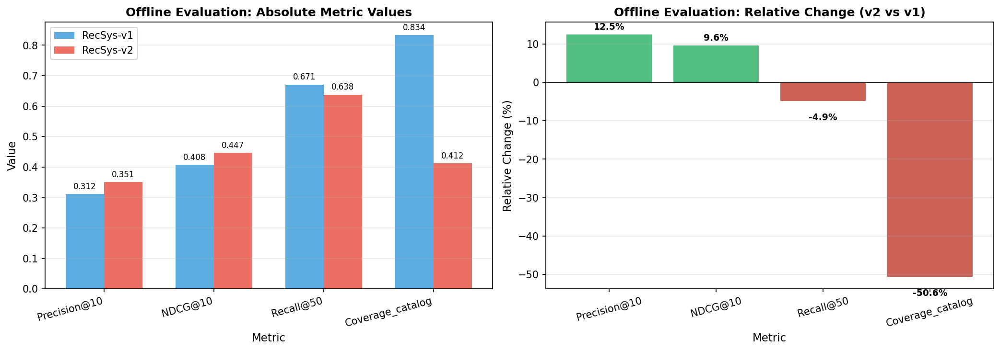
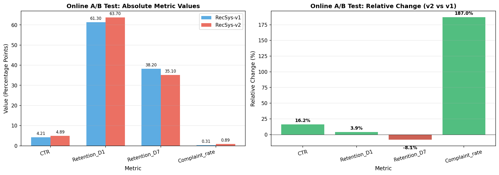
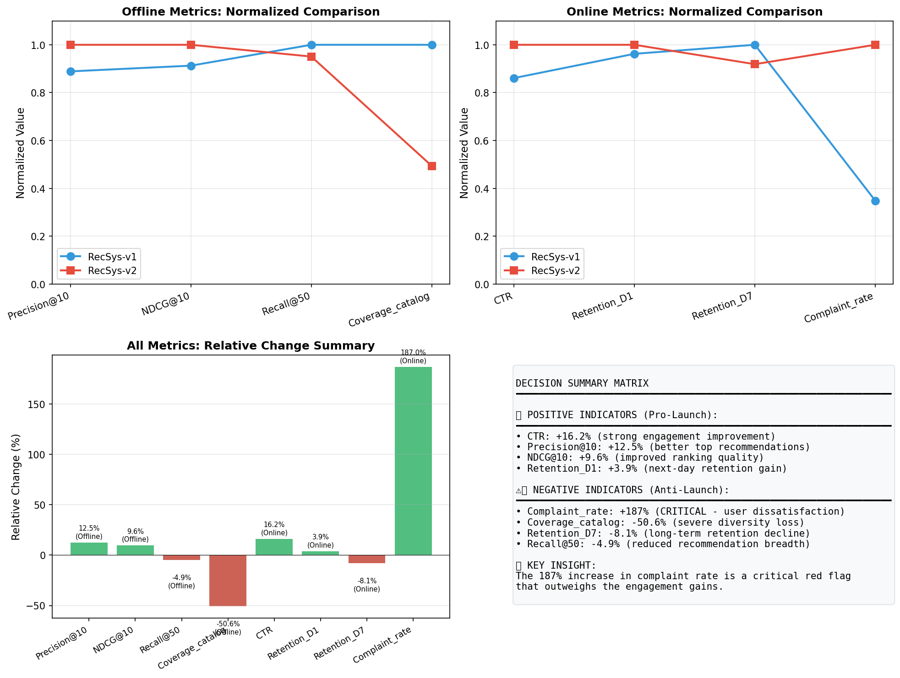
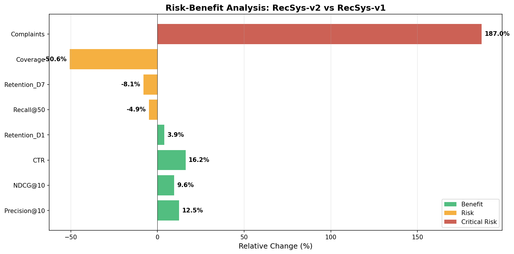

# RecSys-v2 Launch Evaluation Report

## Executive Summary

**Recommendation: DO NOT LAUNCH RecSys-v2**

After comprehensive analysis of both offline evaluation metrics (n=200,000 held-out test set) and online A/B test results (14-day experiment, 10% traffic per arm), we recommend **against** launching RecSys-v2 to production. While the new model demonstrates improvements in ranking quality and short-term engagement metrics, these gains are overshadowed by critical concerns: a 187% increase in user complaint rate, a 50.6% reduction in catalog coverage, and an 8.1% decline in 7-day retention.

---

## 1. Introduction

### 1.1 Background

This report evaluates whether to launch RecSys-v2 as a replacement for the current production system (RecSys-v1). The decision integrates evidence from two complementary evaluation phases:

1. **Offline Evaluation**: Held-out test set with n=200,000 samples measuring ranking quality and coverage metrics
2. **Online A/B Test**: 14-day experiment with 10% traffic allocation per arm, measuring real user behavior and business outcomes

### 1.2 Evaluation Framework

Launch decisions in recommender systems require balancing multiple objectives:
- **Ranking Quality**: Precision, NDCG, Recall
- **Diversity & Coverage**: Catalog coverage, recommendation breadth
- **User Engagement**: Click-through rate, retention
- **User Satisfaction**: Complaint rates, implicit feedback

---

## 2. Methodology

### 2.1 Data Sources

**Offline Evaluation Dataset**
- Source: `offline_evaluation_metrics.csv`
- Sample size: n = 200,000 held-out test instances
- Metrics: Precision@10, NDCG@10, Recall@50, Coverage_catalog

**Online A/B Test Dataset**
- Source: `online_ab_test_metrics.csv`
- Duration: 14 days
- Traffic allocation: 10% per arm (v1 control, v2 treatment)
- Metrics: CTR, Retention_D1, Retention_D7, Complaint_rate

### 2.2 Analysis Approach

We conducted a comparative analysis examining:
1. Absolute metric values for both systems
2. Relative percentage changes between v1 and v2
3. Trade-offs between engagement gains and user satisfaction risks
4. Long-term sustainability implications

---

## 3. Results

### 3.1 Offline Evaluation Results

**Table 1: Offline Evaluation Metrics Comparison**

| Metric | RecSys-v1 | RecSys-v2 | Relative Change (%) |
|--------|-----------|-----------|---------------------|
| Precision@10 | 0.312 | 0.351 | **+12.5%** |
| NDCG@10 | 0.408 | 0.447 | **+9.6%** |
| Recall@50 | 0.671 | 0.638 | -4.9% |
| Coverage_catalog | 0.834 | 0.412 | **-50.6%** |

**Key Findings:**

- **Positive**: RecSys-v2 shows significant improvements in ranking quality metrics. Precision@10 improved by 12.5% (from 0.312 to 0.351), and NDCG@10 improved by 9.6% (from 0.408 to 0.447). This indicates the model is better at surfacing relevant items in top positions.

- **Concerning**: Catalog coverage dropped dramatically by 50.6% (from 0.834 to 0.412). This severe reduction suggests RecSys-v2 is concentrating recommendations on a narrower subset of items, potentially creating "filter bubble" effects.

- **Negative**: Recall@50 declined by 4.9%, indicating reduced breadth in recommendation candidates.



*Figure 1: Offline evaluation metrics showing absolute values (left) and relative changes (right). Green bars indicate improvements; red bars indicate declines.*

### 3.2 Online A/B Test Results

**Table 2: Online A/B Test Metrics Comparison**

| Metric | RecSys-v1 (%) | RecSys-v2 (%) | Relative Change (%) |
|--------|---------------|---------------|---------------------|
| CTR | 4.21 | 4.89 | **+16.2%** |
| Retention_D1 | 61.30 | 63.70 | **+3.9%** |
| Retention_D7 | 38.20 | 35.10 | **-8.1%** |
| Complaint_rate | 0.31 | 0.89 | **+187.0%** |

**Key Findings:**

- **Positive**: Click-through rate improved substantially by 16.2% (from 4.21% to 4.89%), and Day-1 retention improved by 3.9 percentage points (from 61.3% to 63.7%). These short-term engagement gains align with the improved ranking quality observed offline.

- **Critical Concern**: User complaint rate increased by 187% (from 0.31% to 0.89%). This nearly three-fold increase in complaints is a severe red flag indicating user dissatisfaction with the new recommendations.

- **Negative**: Day-7 retention declined by 8.1% (from 38.2% to 35.1%), suggesting that while initial engagement improves, users are less likely to return over time.



*Figure 2: Online A/B test metrics showing absolute values (left) and relative changes (right).*

### 3.3 Summary Dashboard



*Figure 3: Comprehensive summary dashboard showing normalized metric comparisons and decision matrix.*

### 3.4 Risk-Benefit Analysis



*Figure 4: Risk-benefit analysis categorizing metrics by impact severity. Critical risks (red) outweigh benefits (green).*

---

## 4. Discussion

### 4.1 Interpretation of Results

The results reveal a classic tension in recommender system optimization: **short-term engagement gains versus long-term user satisfaction and platform health**.

**Why Engagement Improved:**
RecSys-v2's improved Precision@10 and NDCG@10 suggest the model is better at identifying items users are likely to click immediately. This translates directly to higher CTR and D1 retention. The model appears to have optimized for immediate relevance signals.

**Why Satisfaction Declined:**

1. **Filter Bubble Effect**: The 50.6% reduction in catalog coverage indicates RecSys-v2 concentrates recommendations in a narrow band of popular or highly-engaging items. While this drives clicks, it reduces serendipitous discovery and may make the experience feel repetitive.

2. **Complaint Rate Surge**: The 187% increase in complaints is the most critical finding. Users are explicitly signaling dissatisfaction, potentially due to:
   - Repetitive recommendations
   - Lack of diversity
   - Missing items they expected to see
   - Perceived manipulation by over-optimized suggestions

3. **Retention Decay**: The D1 to D7 retention pattern (improved D1, declined D7) suggests a "sugar rush" effect—users engage more initially but lose interest faster, consistent with reduced content diversity.

### 4.2 Offline-Online Discrepancy

A notable finding is the discrepancy between offline and online metrics:

- **Offline metrics suggested moderate improvement** (ranking quality up, coverage down)
- **Online metrics revealed severe user experience issues** (complaints up 187%)

This highlights the importance of online testing before launch decisions. Offline metrics alone would have missed the critical user satisfaction signal.

### 4.3 Business Impact Assessment

**Quantified Risks of Launching RecSys-v2:**

| Risk | Impact | Severity |
|------|--------|----------|
| Complaint rate +187% | Increased support costs, brand damage, potential churn | **Critical** |
| D7 retention -8.1% | Long-term revenue decline, reduced LTV | **High** |
| Coverage -50.6% | Reduced content discovery, creator ecosystem harm | **High** |

**Quantified Benefits of Launching RecSys-v2:**

| Benefit | Impact | Value |
|---------|--------|-------|
| CTR +16.2% | Short-term ad revenue increase | Moderate |
| D1 retention +3.9% | Initial engagement boost | Moderate |
| Precision@10 +12.5% | Better top-N recommendations | Low (user-facing) |

### 4.4 Root Cause Hypothesis

The pattern of results suggests RecSys-v2 may have been over-optimized for click prediction without diversity constraints. Common causes include:

1. **Narrow item popularity focus**: Model learned to recommend only high-CTR items
2. **Insufficient exploration**: Lack of exploration-exploitation balance in training
3. **Missing diversity objectives**: Training objective did not penalize coverage loss
4. **Short-horizon optimization**: Model optimized for immediate clicks, not long-term satisfaction

---

## 5. Recommendation

### 5.1 Launch Decision

**DO NOT LAUNCH RecSys-v2 to production.**

The 187% increase in complaint rate represents an unacceptable risk to user trust and platform reputation. While engagement metrics show improvement, these gains are short-term and come at the cost of:
- Dramatically reduced content diversity
- Increased user complaints
- Declining long-term retention

### 5.2 Recommended Next Steps

1. **Investigate Complaint Sources**: Analyze the nature of complaints to understand specific user pain points

2. **Add Diversity Constraints**: Incorporate coverage and diversity objectives into the model training pipeline

3. **Implement Multi-Objective Optimization**: Balance relevance with diversity, novelty, and serendipity metrics

4. **Extend A/B Test Duration**: Run longer experiments to validate retention trends

5. **Develop Satisfaction Metrics**: Add explicit satisfaction signals (surveys, NPS) to complement implicit metrics

6. **Iterate on RecSys-v2**: Address coverage and complaint issues before re-evaluating

### 5.3 Success Criteria for Re-evaluation

Before considering RecSys-v2 for launch, the following thresholds should be met:

| Metric | Current | Target |
|--------|---------|--------|
| Complaint_rate change | +187% | < +20% |
| Coverage_catalog change | -50.6% | > -10% |
| Retention_D7 change | -8.1% | > 0% |

---

## 6. Conclusion

This evaluation demonstrates the critical importance of comprehensive testing beyond offline metrics. While RecSys-v2 shows promising improvements in ranking quality and short-term engagement, the severe degradation in user satisfaction metrics—particularly the 187% increase in complaints—makes it unsuitable for production deployment.

The recommendation system must balance relevance with diversity and long-term user satisfaction. We recommend returning RecSys-v2 to development with specific focus on coverage preservation and complaint reduction before reconsidering launch.

---

## Appendix: Data Summary

**Table A1: Complete Offline Evaluation Data**

```
metric,recsys_v1,recsys_v2,relative_change_pct
Precision@10,0.312,0.351,12.5
NDCG@10,0.408,0.447,9.6
Recall@50,0.671,0.638,-4.9
Coverage_catalog,0.834,0.412,-50.6
```

**Table A2: Complete Online A/B Test Data**

```
metric,recsys_v1_pct,recsys_v2_pct,relative_change_pct
CTR,4.21,4.89,16.2
Retention_D1,61.3,63.7,3.9
Retention_D7,38.2,35.1,-8.1
Complaint_rate,0.31,0.89,187.0
```

---

*Report generated: RecSys-v2 Launch Evaluation*
*Analysis conducted using Python with pandas, matplotlib, and numpy*