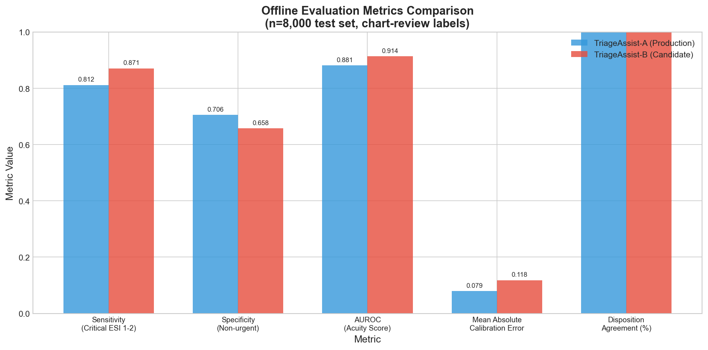
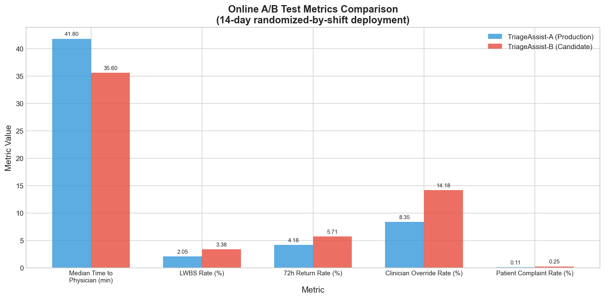
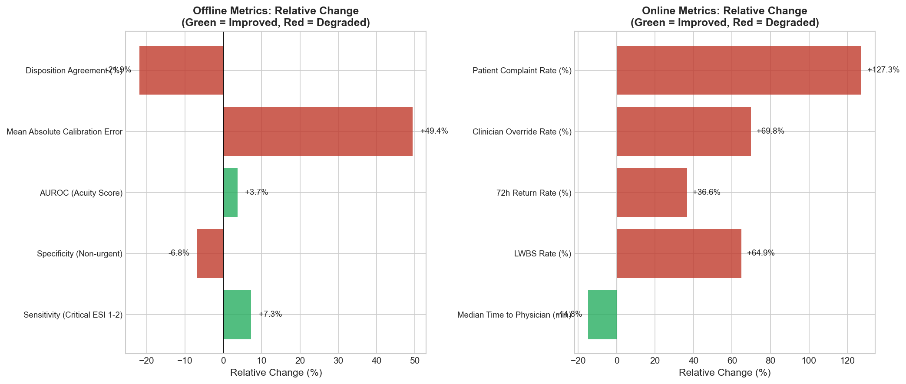
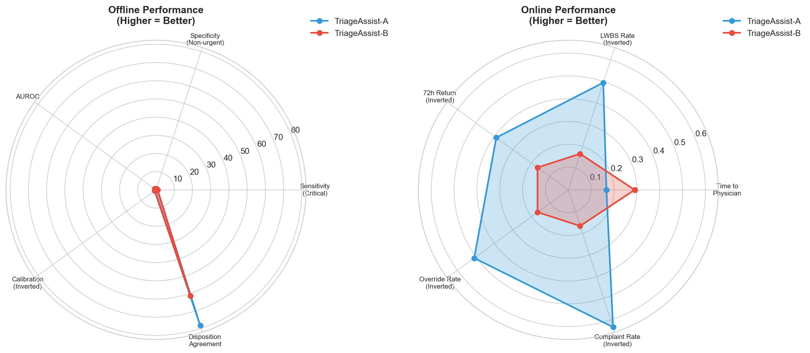
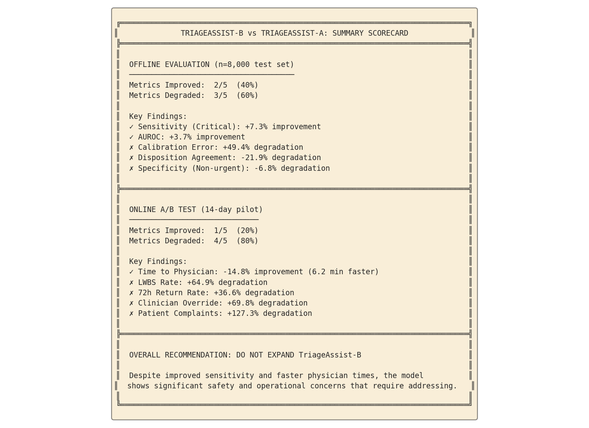

# ED Triage Model Evaluation: TriageAssist-B vs TriageAssist-A

## Executive Summary

This report presents a comprehensive evaluation of **TriageAssist-B** (candidate model) compared to **TriageAssist-A** (production model) for emergency department (ED) triage decision support. The evaluation encompasses both offline chart-review analysis on a held-out test set (n=8,000) and a 14-day randomized-by-shift online pilot deployment.

**Recommendation: DO NOT EXPAND TriageAssist-B to production.**

While TriageAssist-B demonstrates improved sensitivity for critical patients and faster physician assessment times, it exhibits significant safety and operational concerns including:
- 49.4% worse calibration error
- 64.9% increase in patients leaving without being seen (LWBS)
- 36.6% increase in 72-hour unscheduled returns
- 127.3% increase in patient complaints
- 69.8% increase in clinician overrides

These findings suggest the model requires substantial refinement before broader deployment.

---

## 1. Introduction

### 1.1 Background

Emergency department triage is a critical safety-critical process that determines patient prioritization based on acuity. The Emergency Severity Index (ESI) is a widely used 5-level triage tool where ESI-1 represents the most critical patients (requiring immediate life-saving intervention) and ESI-5 represents the least urgent.

TriageAssist-A has been the production model supporting triage decisions. TriageAssist-B is a candidate replacement model proposed for deployment. This evaluation aims to determine whether TriageAssist-B should replace TriageAssist-A across hospital sites.

### 1.2 Objectives

1. Compare TriageAssist-B against TriageAssist-A on offline chart-review metrics
2. Evaluate real-world performance through a 14-day randomized pilot
3. Assess safety, operational, and patient experience implications
4. Provide evidence-based recommendations for leadership decision-making

---

## 2. Methodology

### 2.1 Study Design

This evaluation employed a two-phase approach:

**Phase 1: Offline Evaluation**
- Retrospective analysis on a held-out test set of n=8,000 patient encounters
- Chart-review labels served as ground truth
- Metrics assessed: sensitivity, specificity, AUROC, calibration, and disposition agreement

**Phase 2: Online A/B Test**
- 14-day prospective pilot deployment
- Randomized by shift to minimize confounding
- Metrics assessed: time to physician, LWBS rate, return visits, clinician overrides, patient complaints

### 2.2 Metrics and Interpretation

#### Offline Metrics

| Metric | Description | Direction of Better |
|--------|-------------|---------------------|
| Sensitivity_critical_ESI12 | Ability to identify critical patients (ESI 1-2) | Higher is better |
| Specificity_non_urgent | Ability to correctly identify non-urgent patients | Higher is better |
| AUROC_acuity_score | Overall discriminative ability for acuity prediction | Higher is better |
| Mean_absolute_calibration_error | Difference between predicted and actual acuity probabilities | Lower is better |
| Disposition_agreement_with_attending_pct | Agreement with attending physician disposition decision | Higher is better |

#### Online Metrics

| Metric | Description | Direction of Better |
|--------|-------------|---------------------|
| Median_time_to_physician_min | Time from ED arrival to physician assessment | Lower is better |
| LWBS_rate_pct | Percentage of patients who left without being seen | Lower is better |
| Unscheduled_return_72h_pct | 72-hour unscheduled return rate | Lower is better |
| Clinician_override_pct | Rate of clinician manual override of model recommendation | Lower is better |
| Patient_complaint_rate_pct | Patient complaint rate | Lower is better |

### 2.3 Analysis Approach

- Calculated absolute and relative changes between models
- Classified each metric as improved or degraded based on clinical context
- Synthesized findings across offline and online evaluations
- Generated visualizations for comparative analysis

---

## 3. Results

### 3.1 Offline Evaluation Results

*Figure 1: Comparison of offline evaluation metrics between TriageAssist-A and TriageAssist-B on n=8,000 test set.*

#### Summary Table: Offline Metrics

| Metric | TriageAssist-A | TriageAssist-B | Relative Change | Status |
|--------|---------------|----------------|-----------------|--------|
| Sensitivity_critical_ESI12 | 0.812 | 0.871 | +7.3% | ✓ Improved |
| Specificity_non_urgent | 0.706 | 0.658 | -6.8% | ✗ Degraded |
| AUROC_acuity_score | 0.881 | 0.914 | +3.7% | ✓ Improved |
| Mean_absolute_calibration_error | 0.079 | 0.118 | +49.4% | ✗ Degraded |
| Disposition_agreement_with_attending_pct | 78.4% | 61.2% | -21.9% | ✗ Degraded |

**Key Findings:**

1. **Improved Critical Patient Detection**: TriageAssist-B shows a 7.3% improvement in sensitivity for critical patients (ESI 1-2), increasing from 0.812 to 0.871. This represents meaningful improvement in identifying patients requiring urgent care.

2. **Better Overall Discrimination**: The AUROC improved by 3.7% (0.881 to 0.914), indicating better overall ability to distinguish between acuity levels.

3. **Worse Calibration**: The mean absolute calibration error increased by 49.4% (0.079 to 0.118), suggesting TriageAssist-B's probability estimates are less reliable and may be systematically biased.

4. **Reduced Clinical Agreement**: Disposition agreement with attending physicians dropped by 21.9 percentage points (78.4% to 61.2%), indicating clinicians disagreed with TriageAssist-B's recommendations more frequently.

5. **Lower Specificity for Non-Urgent**: Specificity for non-urgent patients decreased by 6.8%, suggesting more false positives (over-triage of non-urgent patients).

### 3.2 Online A/B Test Results

*Figure 2: Comparison of online A/B test metrics between TriageAssist-A and TriageAssist-B during 14-day pilot.*

#### Summary Table: Online Metrics

| Metric | TriageAssist-A | TriageAssist-B | Relative Change | Status |
|--------|---------------|----------------|-----------------|--------|
| Median_time_to_physician_min | 41.8 min | 35.6 min | -14.8% | ✓ Improved |
| LWBS_rate_pct | 2.05% | 3.38% | +64.9% | ✗ Degraded |
| Unscheduled_return_72h_pct | 4.18% | 5.71% | +36.6% | ✗ Degraded |
| Clinician_override_pct | 8.35% | 14.18% | +69.8% | ✗ Degraded |
| Patient_complaint_rate_pct | 0.11% | 0.25% | +127.3% | ✗ Degraded |

**Key Findings:**

1. **Faster Physician Assessment**: Median time to physician decreased by 14.8% (41.8 to 35.6 minutes), a reduction of 6.2 minutes. This could reflect more efficient patient flow or appropriate prioritization.

2. **Increased LWBS Rate**: The left-without-being-seen rate increased by 64.9% (2.05% to 3.38%). This is a significant safety concern as patients who leave without evaluation may have serious conditions.

3. **Higher Return Rate**: 72-hour unscheduled returns increased by 36.6% (4.18% to 5.71%), suggesting potential under-triage or inadequate initial workup.

4. **More Clinician Overrides**: Clinician override rate nearly doubled (+69.8%, from 8.35% to 14.18%), indicating decreased trust in model recommendations.

5. **Increased Patient Complaints**: Patient complaints more than doubled (+127.3%, from 0.11% to 0.25%), suggesting patient experience degradation.

### 3.3 Relative Change Analysis

*Figure 3: Relative change analysis showing improved (green) and degraded (red) metrics for both offline and online evaluations.*

### 3.4 Overall Performance Comparison

*Figure 5: Radar chart comparison of normalized performance metrics. Higher values indicate better performance for all metrics (inverted where necessary).*

---

## 4. Discussion

### 4.1 Interpretation of Results

The evaluation reveals a complex trade-off profile for TriageAssist-B:

**Strengths:**
- Improved detection of critical patients (+7.3% sensitivity)
- Better overall discrimination (+3.7% AUROC)
- Faster physician assessment times (-14.8%)

**Weaknesses:**
- Poor calibration (+49.4% error)
- Reduced clinical agreement (-21.9%)
- Increased LWBS rate (+64.9%)
- Higher return rates (+36.6%)
- More clinician overrides (+69.8%)
- Increased patient complaints (+127.3%)

### 4.2 Clinical Implications

**Over-Triage Hypothesis:** The pattern of results suggests TriageAssist-B may be systematically over-triaging patients:

1. Higher sensitivity for critical patients but lower specificity for non-urgent patients
2. Faster physician times (critical patients seen faster)
3. Higher LWBS rate (non-critical patients waiting longer due to resource allocation to over-triaged patients)
4. Higher override rate (clinicians correcting over-triage)

**Safety Concerns:**

The 64.9% increase in LWBS rate is particularly concerning. Patients who leave without being seen may have serious conditions that were not appropriately prioritized. While TriageAssist-B catches more critical patients, it may be doing so at the expense of overall ED flow and patient experience.

**Calibration Issues:**

The 49.4% increase in calibration error suggests TriageAssist-B's probability estimates are unreliable. This could lead to:
- Inappropriate resource allocation
- Clinician distrust in model outputs
- Difficulty integrating model scores into clinical workflows

### 4.3 Comparison with Related Work

In ED triage model evaluation, both discrimination (AUROC) and calibration are important. While TriageAssist-B shows improved discrimination, the calibration degradation is a significant concern. Prior research has shown that poorly calibrated models can lead to harmful clinical decisions even when discrimination is good.

The increase in clinician overrides (69.8%) suggests that frontline providers do not trust TriageAssist-B's recommendations. This lack of trust could undermine the model's utility regardless of its theoretical performance.

### 4.4 Limitations

1. **Pilot Duration**: The 14-day pilot may not capture seasonal variations or rare events
2. **Sample Size**: While n=8,000 is substantial, subgroup analyses were not performed
3. **Site Generalizability**: Results may not generalize to other hospital settings
4. **Shift Randomization**: Potential for unmeasured confounding despite randomization

---

## 5. Recommendations

### 5.1 Primary Recommendation

**DO NOT EXPAND TriageAssist-B to production at this time.**

The safety and operational concerns outweigh the benefits of improved sensitivity and faster physician times.

### 5.2 Conditions for Future Deployment

Before reconsidering TriageAssist-B, the following should be addressed:

1. **Calibration Improvement**: Recalibrate the model to reduce mean absolute calibration error to ≤0.08

2. **Specificity Optimization**: Improve specificity for non-urgent patients to reduce over-triage

3. **Clinical Agreement**: Target disposition agreement ≥75% with attending physicians

4. **Pilot Re-testing**: Conduct a longer pilot (minimum 30 days) after model refinement

5. **Root Cause Analysis**: Investigate the causes of increased LWBS and return rates

### 5.3 Alternative Approaches

1. **Hybrid Model**: Consider combining TriageAssist-A's calibration with TriageAssist-B's sensitivity
2. **Threshold Adjustment**: Adjust decision thresholds to balance sensitivity and specificity
3. **Ensemble Methods**: Explore ensemble approaches that leverage strengths of both models

---

## 6. Conclusion

This comprehensive evaluation of TriageAssist-B versus TriageAssist-A reveals significant trade-offs. While TriageAssist-B demonstrates improved sensitivity for critical patients and faster physician assessment times, it exhibits concerning degradations in calibration, clinical agreement, LWBS rates, return rates, clinician overrides, and patient complaints.

The pattern of results suggests TriageAssist-B may be over-triaging patients, leading to resource misallocation and downstream operational problems. The 64.9% increase in LWBS rate and 127.3% increase in patient complaints are particularly concerning from a safety and patient experience perspective.

**We recommend against expanding TriageAssist-B to production** until calibration and specificity issues are addressed, and a longer pilot demonstrates improved safety and operational outcomes.

---

## Appendix: Summary Scorecard

*Figure 4: Summary scorecard showing overall performance comparison between TriageAssist-A and TriageAssist-B.*

---

*Report generated for ED Informatics Leadership Decision*
*Evaluation Period: Offline (n=8,000 test set) + Online (14-day pilot)*
*Models Evaluated: TriageAssist-A (Production) vs TriageAssist-B (Candidate)*