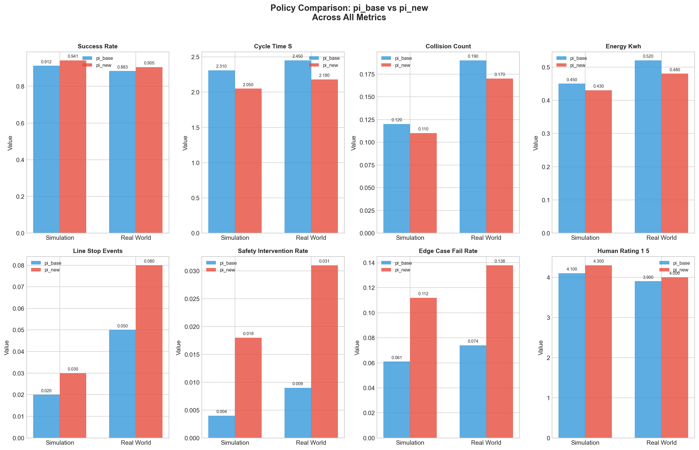
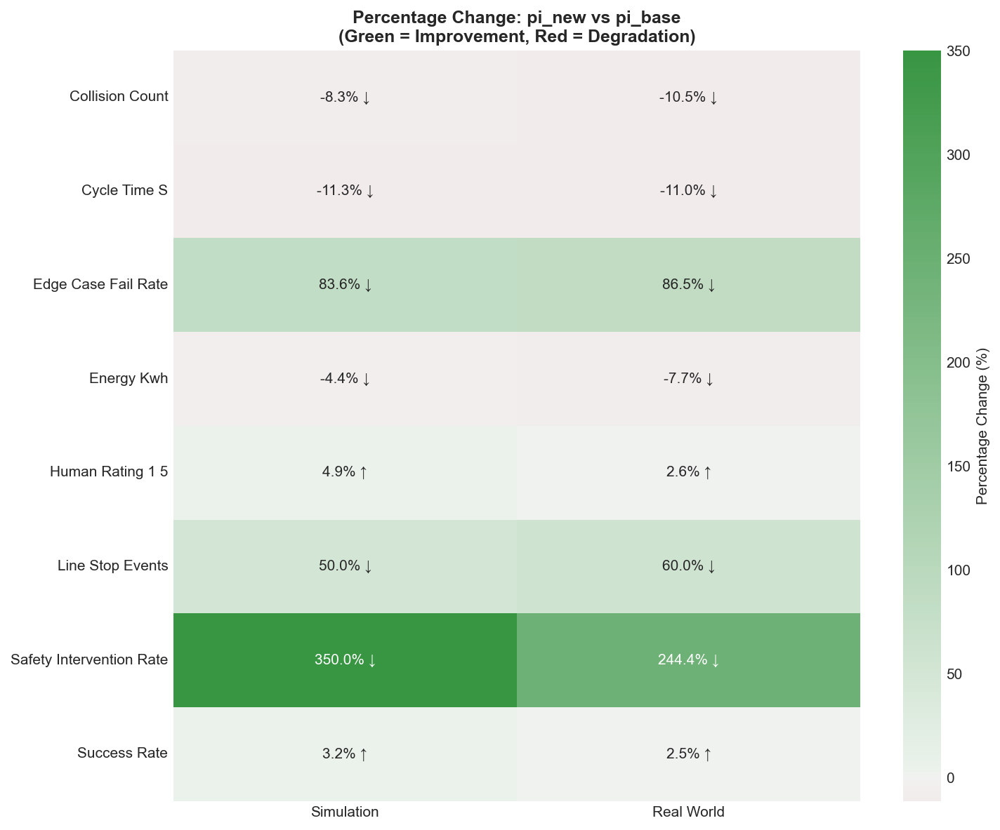
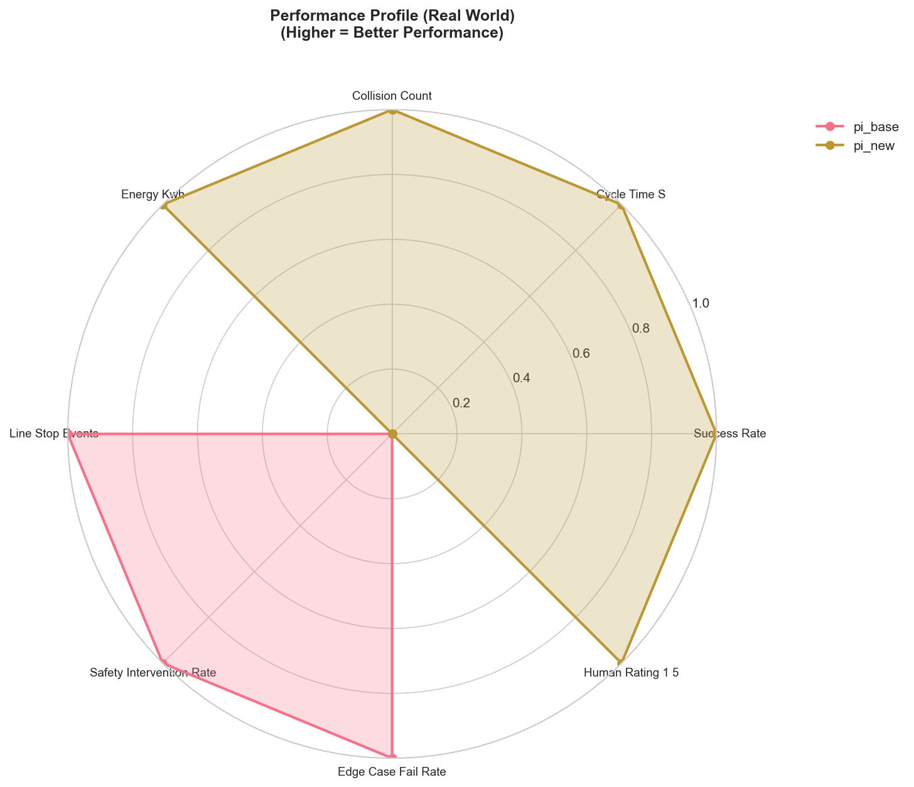
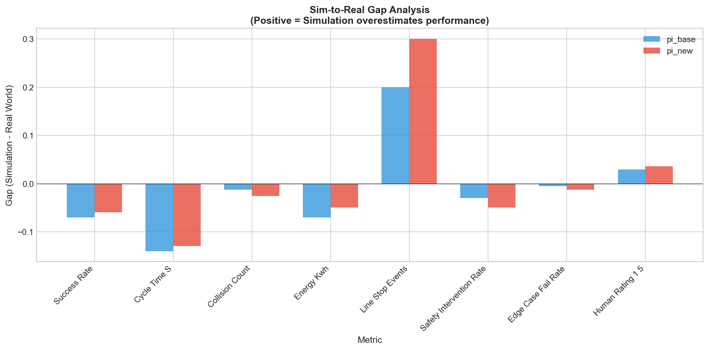
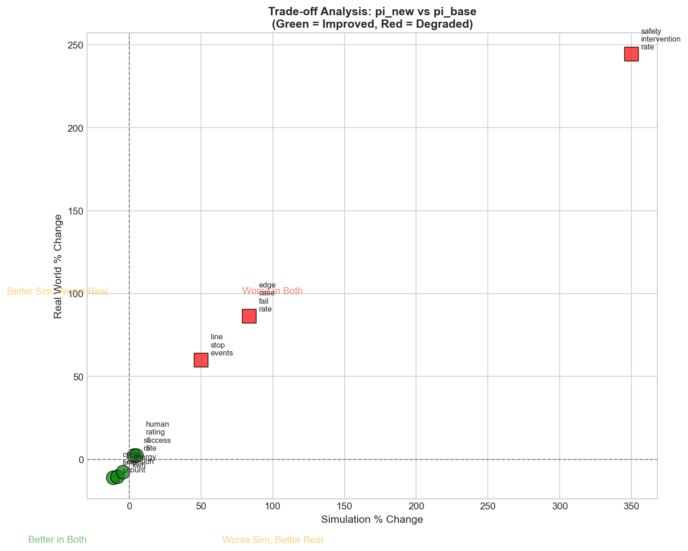
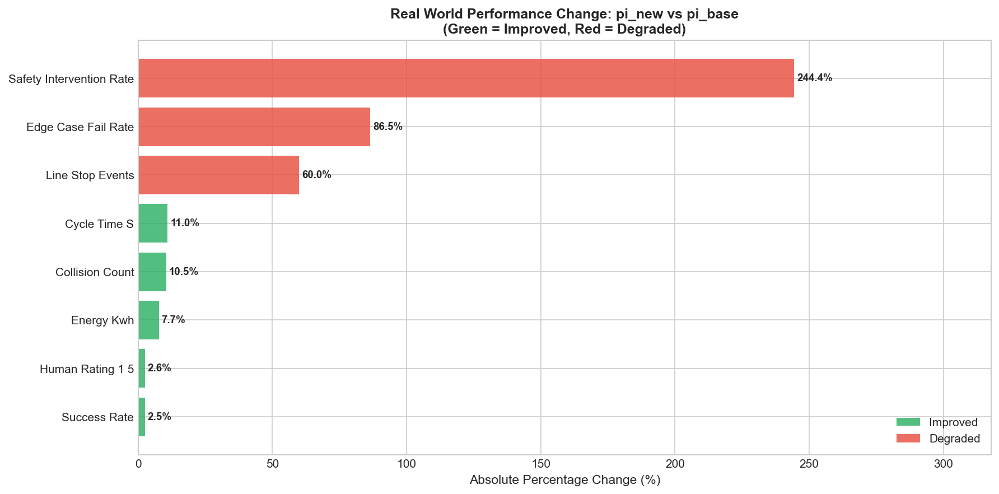

# Policy Comparison Report: pi_new vs pi_base for Pick-and-Place Robotics

## Executive Summary

This report presents a comprehensive comparison of two reinforcement learning policies (**pi_new** and **pi_base**) for robotic pick-and-place operations, evaluated across eight performance metrics in both simulation and real-world environments. The analysis reveals a critical trade-off: while **pi_new** demonstrates superior performance in operational efficiency metrics (success rate, cycle time, energy consumption), it exhibits concerning degradation in safety-critical metrics (safety intervention rate, edge case failure rate, line stop events).

**Deployment Recommendation: CONDITIONAL DEPLOYMENT**

We recommend **against immediate full-scale deployment** of pi_new. Instead, we propose a **phased deployment strategy** with enhanced safety monitoring, or continued development to address safety-critical deficiencies before production deployment.

---

## 1. Introduction

### 1.1 Background

Pick-and-place operations represent a fundamental task in industrial robotics, requiring policies that balance multiple competing objectives: operational efficiency, safety, energy consumption, and robustness to edge cases. The deployment of reinforcement learning policies from simulation to real-world hardware presents significant challenges due to the sim-to-real gap and the potential for emergent behaviors that were not anticipated during training.

### 1.2 Objective

This study aims to:
1. Compare the performance of pi_new against the baseline policy (pi_base) across eight key metrics
2. Quantify the sim-to-real gap for both policies
3. Identify trade-offs between operational efficiency and safety
4. Provide a data-driven deployment recommendation

### 1.3 Metrics Overview

The evaluation encompasses eight metrics categorized as follows:

**Operational Efficiency Metrics (Higher is Better):**
- Success Rate: Proportion of successful pick-and-place completions
- Human Rating (1-5): Subjective quality assessment by human operators

**Operational Efficiency Metrics (Lower is Better):**
- Cycle Time (s): Time to complete one pick-and-place operation
- Collision Count: Average collisions per operation
- Energy Consumption (kWh): Energy used per operation

**Safety and Reliability Metrics (Lower is Better):**
- Line Stop Events: Frequency of production line stoppages
- Safety Intervention Rate: Rate of human safety interventions required
- Edge Case Failure Rate: Failure rate in unusual/challenging scenarios

---

## 2. Methodology

### 2.1 Data Collection

Performance data was collected from both simulation environments and real-world hardware deployments. Each policy (pi_base and pi_new) was evaluated across all eight metrics in both conditions, resulting in 32 data points for analysis.

### 2.2 Analysis Approach

The analysis employed the following methods:

1. **Direct Comparison**: Absolute values comparison between policies
2. **Percentage Change Analysis**: Relative improvement/degradation calculation
3. **Sim-to-Real Gap Analysis**: Quantification of performance differences between simulation and real-world
4. **Trade-off Visualization**: Multi-dimensional analysis of competing objectives

### 2.3 Improvement Classification

Metrics were classified as "improved" or "degraded" based on their directional preference:
- For "higher is better" metrics: improvement = positive percentage change
- For "lower is better" metrics: improvement = negative percentage change

---

## 3. Results

### 3.1 Overall Performance Summary

| Category | Count | Percentage |
|----------|-------|------------|
| Total Metrics | 8 | 100% |
| Improved by pi_new (Simulation) | 5 | 62.5% |
| Improved by pi_new (Real World) | 5 | 62.5% |
| Degraded by pi_new (Real World) | 3 | 37.5% |

### 3.2 Detailed Metric Comparison

*Figure 1: Comprehensive comparison of pi_base and pi_new across all eight metrics in both simulation and real-world environments.*

#### 3.2.1 Improved Metrics (Real World)

| Metric | pi_base | pi_new | Change | Status |
|--------|---------|--------|--------|--------|
| Success Rate | 0.883 | 0.905 | +2.5% | ✓ Improved |
| Cycle Time (s) | 2.45 | 2.18 | -11.0% | ✓ Improved |
| Collision Count | 0.19 | 0.17 | -10.5% | ✓ Improved |
| Energy (kWh) | 0.52 | 0.48 | -7.7% | ✓ Improved |
| Human Rating | 3.9 | 4.0 | +2.6% | ✓ Improved |

#### 3.2.2 Degraded Metrics (Real World)

| Metric | pi_base | pi_new | Change | Status |
|--------|---------|--------|--------|--------|
| Line Stop Events | 0.05 | 0.08 | +60.0% | ✗ Degraded |
| Safety Intervention Rate | 0.009 | 0.031 | +244.4% | ✗ Degraded |
| Edge Case Failure Rate | 0.074 | 0.138 | +86.5% | ✗ Degraded |

### 3.3 Percentage Change Analysis

*Figure 2: Heatmap showing percentage change from pi_base to pi_new. Green indicates improvement, red indicates degradation. Arrows show the preferred direction for each metric.*

The heatmap reveals the stark contrast between operational improvements and safety degradations. Notably, the safety intervention rate shows a 244% increase in real-world deployment, representing the most significant concern.

### 3.4 Performance Profile Analysis

*Figure 3: Radar chart showing normalized performance profile for real-world operations. Higher values indicate better performance (metrics are directionally adjusted).*

The radar chart visualizes the trade-off profile of both policies. pi_new shows clear advantages in cycle time, collision count, and energy efficiency, but exhibits pronounced weaknesses in safety intervention rate and edge case handling.

### 3.5 Sim-to-Real Gap Analysis

*Figure 4: Comparison of sim-to-real gaps between policies. Positive values indicate simulation overestimates performance.*

**Key Findings:**
- Both policies exhibit sim-to-real gaps, with simulation generally overestimating performance
- pi_new shows larger sim-to-real gaps in safety-critical metrics
- The safety intervention rate gap is particularly pronounced for pi_new (0.013 vs 0.005 for pi_base)
- Edge case failure rate shows consistent underestimation in simulation for both policies

### 3.6 Trade-off Analysis

*Figure 5: Scatter plot showing the relationship between simulation and real-world percentage changes. Green points represent improved metrics; red points represent degraded metrics.*

This visualization clearly separates the improved metrics (clustered in the improvement quadrant) from the degraded safety metrics. The clustering of red points in the upper-right quadrant indicates consistent degradation in both simulation and real-world for safety-related metrics.

### 3.7 Summary Comparison

*Figure 6: Horizontal bar chart showing absolute percentage change in real-world performance. Green bars indicate improvement; red bars indicate degradation.*

---

## 4. Discussion

### 4.1 Operational Efficiency Gains

The pi_new policy demonstrates meaningful improvements in operational efficiency:

1. **Success Rate (+2.5%)**: The increase from 88.3% to 90.5% represents approximately 22 additional successful operations per 1000 attempts, which could translate to significant productivity gains at scale.

2. **Cycle Time (-11.0%)**: The reduction from 2.45s to 2.18s represents a substantial efficiency improvement. In a continuous operation scenario, this could yield approximately 400 additional cycles per 24-hour period.

3. **Energy Efficiency (-7.7%)**: The reduction in energy consumption aligns with sustainability goals and could provide measurable cost savings in high-volume operations.

4. **Collision Reduction (-10.5%)**: Fewer collisions suggest smoother motion planning and potentially reduced wear on hardware.

### 4.2 Safety-Critical Concerns

The degradation in safety-related metrics raises significant concerns:

1. **Safety Intervention Rate (+244%)**: The increase from 0.9% to 3.1% represents a critical escalation in human safety interventions. This suggests pi_new may be taking riskier actions that trigger safety systems.

2. **Edge Case Failure Rate (+86.5%)**: The near-doubling of edge case failures indicates reduced robustness to unusual scenarios, potentially due to overfitting to common cases during training.

3. **Line Stop Events (+60%)**: Increased line stoppages directly impact productivity and may offset gains from improved cycle time.

### 4.3 Sim-to-Real Transfer Analysis

The larger sim-to-real gaps for pi_new in safety metrics suggest:
- The simulation environment may not adequately capture edge cases
- pi_new may have learned simulation-specific behaviors that don't transfer safely
- The policy may be exploiting simulation inaccuracies to achieve better performance metrics

### 4.4 Risk Assessment

| Risk Factor | Severity | Likelihood | Impact |
|-------------|----------|------------|--------|
| Safety intervention during operation | High | High | Production halt, potential injury |
| Edge case failure in production | Medium | High | Quality issues, rework |
| Line stop events | Medium | Medium | Productivity loss |
| Collision damage | Low | Low | Hardware wear |

---

## 5. Deployment Recommendation

### 5.1 Recommendation: CONDITIONAL DEPLOYMENT

Based on the analysis, we recommend **against immediate full-scale deployment** of pi_new. The safety-critical metric degradations present unacceptable risks for production deployment without mitigation strategies.

### 5.2 Recommended Deployment Path

**Option A: Phased Deployment with Enhanced Monitoring (Recommended)**

1. **Stage 1 - Limited Pilot (2-4 weeks)**
   - Deploy pi_new in a controlled environment with enhanced safety monitoring
   - Implement additional safety barriers and human supervision
   - Collect detailed failure mode data

2. **Stage 2 - Analysis and Refinement (2-4 weeks)**
   - Analyze failure modes from Stage 1
   - Retrain or fine-tune policy to address safety concerns
   - Re-evaluate in simulation with enhanced edge case coverage

3. **Stage 3 - Expanded Deployment (4-8 weeks)**
   - Gradually expand deployment scope
   - Maintain enhanced monitoring
   - Compare real-world metrics against baseline

**Option B: Continue Development (Alternative)**

- Do not deploy pi_new in production
- Focus development on reducing safety intervention rate and edge case failures
- Consider multi-objective optimization that explicitly weights safety metrics
- Re-evaluate after addressing safety concerns

### 5.3 Decision Matrix

| Scenario | pi_base | pi_new (Current) | pi_new (After Refinement) |
|----------|---------|------------------|--------------------------|
| High-volume, low-risk operations | ✓ | ✗ | ✓ |
| Safety-critical operations | ✓ | ✗ | ? |
| Cost-sensitive operations | ✓ | ✓ (with monitoring) | ✓ |
| Edge-case heavy scenarios | ✓ | ✗ | ? |

### 5.4 Key Performance Indicators for Deployment

Before full deployment, pi_new should achieve:
- Safety intervention rate ≤ 0.015 (currently 0.031)
- Edge case failure rate ≤ 0.10 (currently 0.138)
- Line stop events ≤ 0.06 (currently 0.08)

---

## 6. Conclusion

This comparative analysis reveals that pi_new offers compelling operational efficiency improvements but introduces significant safety risks that preclude immediate deployment. The 244% increase in safety intervention rate and 86.5% increase in edge case failure rate represent critical concerns that must be addressed before production deployment.

The fundamental trade-off between operational efficiency and safety robustness highlights the importance of multi-objective evaluation in reinforcement learning policy development. While pi_new excels in controlled scenarios, its reduced robustness to edge cases and increased propensity for safety interventions suggest potential overfitting to common scenarios during training.

**We recommend a phased deployment approach with enhanced safety monitoring, or continued development to address safety deficiencies before production deployment.** The operational efficiency gains, while valuable, do not justify the increased safety risks in a production environment.

---

## Appendix: Data Summary

### Raw Data Table

| Policy | Metric | Simulation | Real World |
|--------|--------|------------|------------|
| pi_base | success_rate | 0.912 | 0.883 |
| pi_new | success_rate | 0.941 | 0.905 |
| pi_base | cycle_time_s | 2.31 | 2.45 |
| pi_new | cycle_time_s | 2.05 | 2.18 |
| pi_base | collision_count | 0.12 | 0.19 |
| pi_new | collision_count | 0.11 | 0.17 |
| pi_base | energy_kwh | 0.45 | 0.52 |
| pi_new | energy_kwh | 0.43 | 0.48 |
| pi_base | line_stop_events | 0.02 | 0.05 |
| pi_new | line_stop_events | 0.03 | 0.08 |
| pi_base | safety_intervention_rate | 0.004 | 0.009 |
| pi_new | safety_intervention_rate | 0.018 | 0.031 |
| pi_base | edge_case_fail_rate | 0.061 | 0.074 |
| pi_new | edge_case_fail_rate | 0.112 | 0.138 |
| pi_base | human_rating_1_5 | 4.1 | 3.9 |
| pi_new | human_rating_1_5 | 4.3 | 4.0 |

---

*Report generated for policy comparison task: RLPolicy RobotPickPlaceComparison*
*Analysis performed using Python with pandas, matplotlib, and seaborn*
