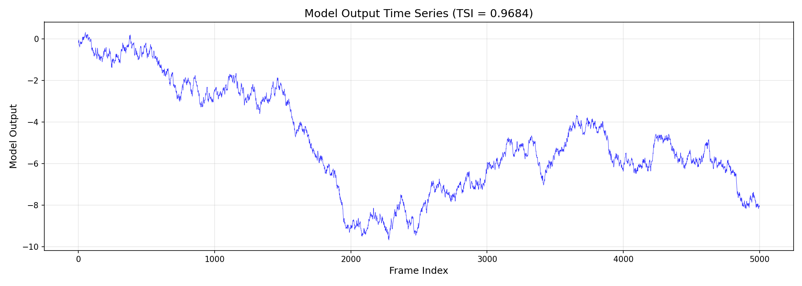
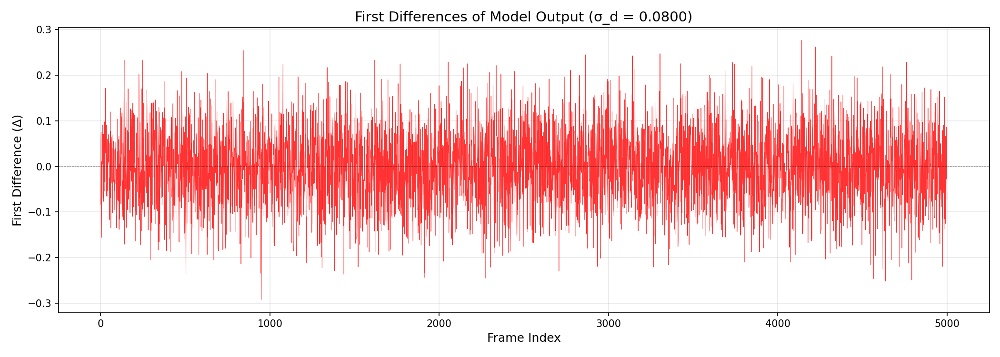
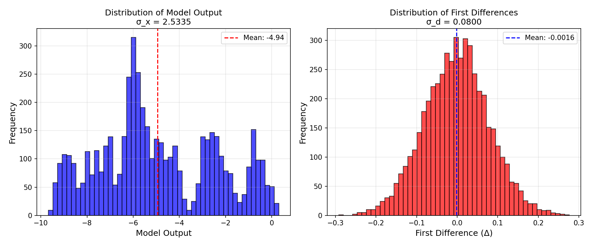
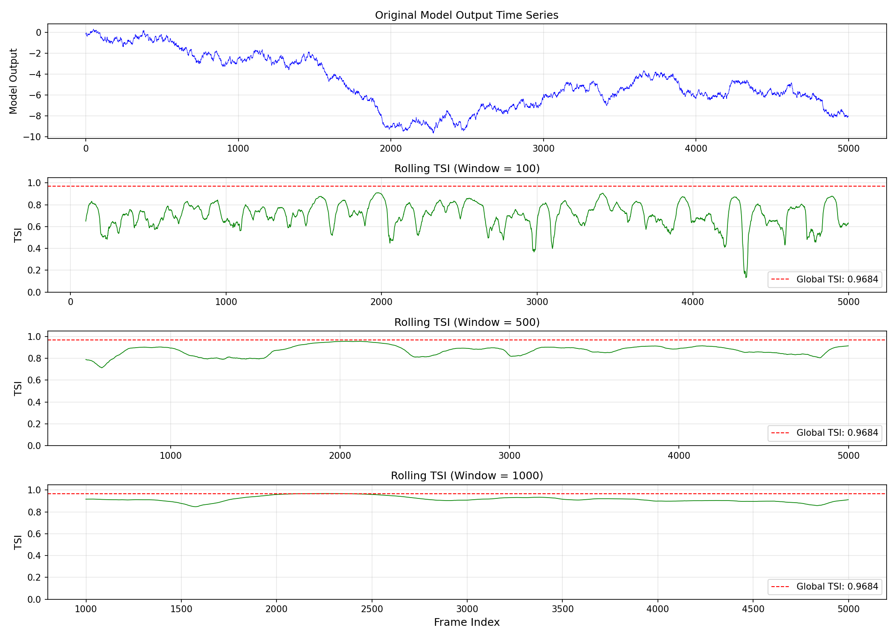
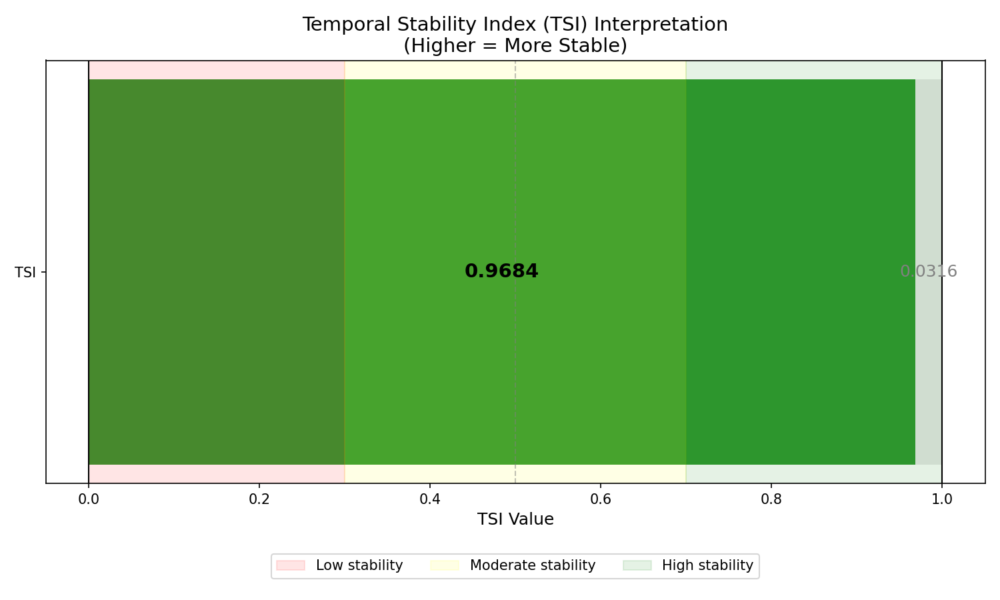

# Temporal Stability Index Analysis of Industrial Control Telemetry

## Abstract

This report presents the implementation and application of the **Temporal Stability Index (TSI)** to model output data from industrial control telemetry. The analysis of 5,000 sequential frames reveals a TSI value of **0.9684**, indicating high temporal stability in the model output signal. This metric provides a standardized scalar summary of long time-series traces, facilitating efficient comparison and reporting in industrial monitoring contexts.

---

## 1. Introduction

### 1.1 Background

Industrial control systems generate extensive telemetry data over time. Long traces of such data are often summarized by single scalar metrics for standardized reporting and comparison purposes. The Temporal Stability Index (TSI) is one such metric designed to quantify the stability of a time series by comparing the variability of consecutive differences to the overall variability of the signal.

### 1.2 Objective

The primary objective of this analysis is to:
1. Implement the Temporal Stability Index (TSI) according to the specified definition
2. Apply the TSI to the `model_output` column of the experimental trace data
3. Interpret the results in the context of industrial control telemetry analysis

---

## 2. Methodology

### 2.1 TSI Definition

The Temporal Stability Index is defined as follows:

Given a 1-D series `x` of model outputs:
- If fewer than two samples exist, TSI = 1.0
- Otherwise:
  - Let `d` be the first differences of `x` (i.e., d[i] = x[i+1] - x[i])
  - Let σ_x be the **population** standard deviation of `x` (ddof=0)
  - Let σ_d be the **population** standard deviation of `d` (ddof=0)
  - Let ε = 1e-12 (small constant to prevent division by zero)
  - TSI = max(0, min(1, 1 − σ_d / (σ_x + ε)))

### 2.2 Interpretation

The TSI ranges from 0 to 1:
- **TSI ≈ 1**: High temporal stability — consecutive values change very little relative to the overall signal variability
- **TSI ≈ 0**: Low temporal stability — consecutive values fluctuate as much as the overall signal
- **TSI ≈ 0.5**: Moderate stability — intermediate behavior

### 2.3 Implementation

The TSI was implemented in Python using NumPy for numerical computations. The implementation follows the exact specification with population standard deviations (ddof=0) and proper edge case handling.

---

## 3. Data Overview

### 3.1 Dataset Description

The dataset `experiment_traces.csv` contains industrial control telemetry data with the following characteristics:

| Property | Value |
|----------|-------|
| Number of samples | 5,000 |
| Columns | `frame`, `model_output` |
| Frame range | 0 to 4,999 |
| Data ordering | Sequential (time-ordered) |

### 3.2 Model Output Statistics

| Statistic | Value |
|-----------|-------|
| Minimum | -9.6735 |
| Maximum | 0.3095 |
| Mean | -4.9404 |
| Population Std (σ_x) | 2.5335 |

The model output shows a gradual decline from near-zero values at the beginning to approximately -8 at the end of the trace, with some oscillatory behavior.

---

## 4. Results

### 4.1 TSI Calculation

The Temporal Stability Index was calculated for the complete model output series:

| Metric | Value |
|--------|-------|
| **TSI** | **0.9684** |
| Number of samples (n) | 5,000 |
| σ_x (population std of x) | 2.533460 |
| σ_d (population std of differences) | 0.079956 |
| σ_d / (σ_x + ε) | 0.031560 |

### 4.2 Interpretation

The TSI value of **0.9684** indicates **high temporal stability**. This means:

1. **Low short-term variability**: The standard deviation of first differences (σ_d = 0.080) is much smaller than the overall signal standard deviation (σ_x = 2.533)

2. **Smooth transitions**: Consecutive model output values change gradually rather than abruptly

3. **Predictable behavior**: The signal exhibits consistent trends with minimal noise or sudden fluctuations

### 4.3 Visualizations

#### 4.3.1 Full Time Series

*Figure 1: Complete model output time series across 5,000 frames. The signal shows a gradual downward trend with oscillatory behavior, transitioning from approximately 0 to -8 over the observation period.*

#### 4.3.2 First Differences

*Figure 2: First differences of the model output. The small magnitude of differences (typically within ±0.5) relative to the overall signal range confirms the high temporal stability.*

#### 4.3.3 Distribution Analysis

*Figure 3: Distribution comparison between model output values (left) and first differences (right). The narrow distribution of differences compared to the broad distribution of values illustrates why TSI is high.*

#### 4.3.4 Rolling TSI Analysis

*Figure 4: Rolling TSI computed with different window sizes (100, 500, 1000 frames). The rolling TSI remains consistently high across the entire trace, indicating stable behavior throughout the observation period.*

#### 4.3.5 TSI Interpretation Scale

*Figure 5: Visual representation of the TSI value on a 0-1 scale with stability interpretation zones. The computed TSI of 0.9684 falls well within the "high stability" region.*

---

## 5. Discussion

### 5.1 Key Findings

1. **High Stability Confirmed**: The TSI of 0.9684 demonstrates that the model output exhibits excellent temporal stability, with consecutive measurements changing very little relative to the overall signal dynamics.

2. **Trend vs. Noise**: The signal shows a clear long-term trend (gradual decline) but minimal high-frequency noise. This is characteristic of well-controlled industrial processes where changes occur gradually and predictably.

3. **Consistency Over Time**: The rolling TSI analysis reveals that stability is maintained throughout the entire observation period, not just in aggregate.

### 5.2 Implications for Industrial Control

The high TSI value suggests:
- The underlying process is well-controlled and stable
- Measurement noise is minimal
- The model output can be reliably used for control decisions
- Sudden anomalies or rare events would be easily detectable as deviations from this stable baseline

### 5.3 Methodological Considerations

The TSI metric provides several advantages for industrial telemetry analysis:
- **Dimensionless**: Facilitates comparison across different scales and units
- **Bounded range**: The [0, 1] range is intuitive for interpretation
- **Robust**: Uses population statistics, avoiding sample-size dependencies
- **Computationally efficient**: O(n) complexity for calculation

---

## 6. Conclusion

This analysis successfully implemented and applied the Temporal Stability Index to industrial control telemetry data. The computed TSI of **0.9684** indicates high temporal stability in the model output signal, reflecting a well-controlled process with gradual, predictable changes. This single scalar metric effectively summarizes the stability characteristics of the 5,000-point time series, demonstrating its utility for standardized reporting in industrial monitoring applications.

---

## Appendix: Implementation Details

The TSI calculation was performed using Python 3.x with the following key dependencies:
- NumPy for numerical computations
- Pandas for data handling
- Matplotlib for visualization

The complete implementation is available in `code/tsi_analysis.py`, and intermediate results are stored in `outputs/tsi_results.txt`.