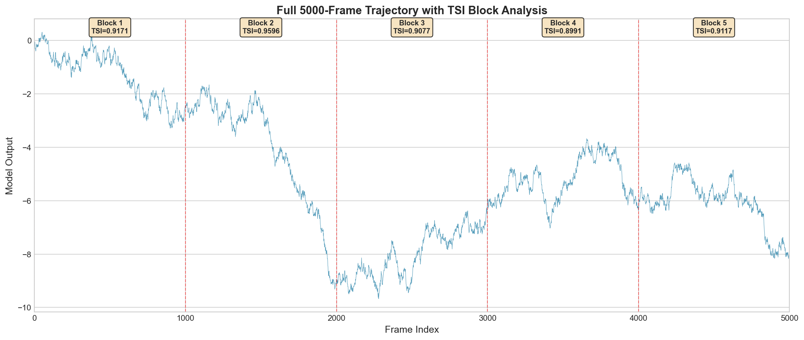
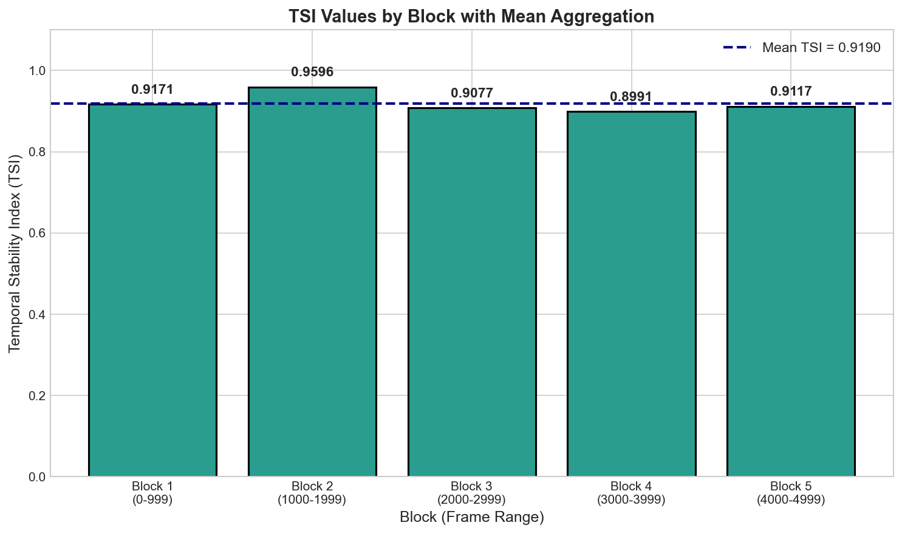
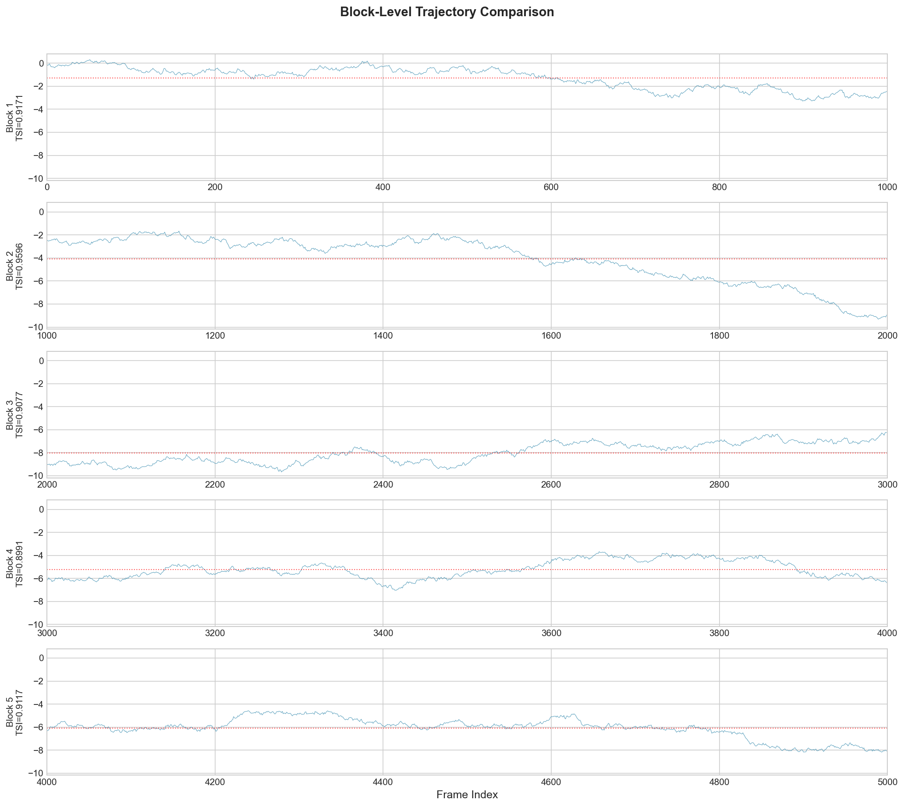
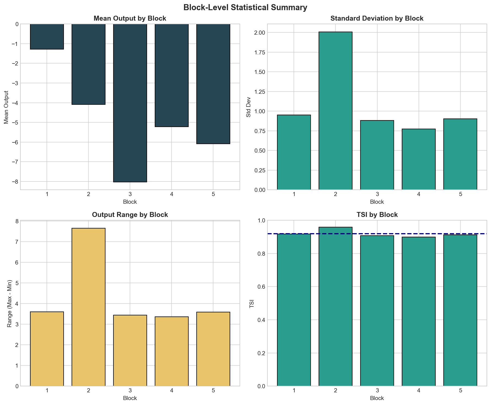

# Temporal Stability Index Analysis of Industrial Control Telemetry

## Abstract

This study computes the Temporal Stability Index (TSI) for a 5000-frame industrial control telemetry trace following the laboratory-defined protocol. The analysis reveals a definitive full-trace TSI of **0.919026**, indicating high temporal stability throughout the observation period. The methodology adheres strictly to the approved protocol by partitioning the trajectory into five contiguous 1000-frame blocks and aggregating block-level TSI values via arithmetic mean.

---

## 1. Introduction

### 1.1 Background

Industrial control systems generate continuous temporal telemetry data that must be evaluated for stability characteristics. The Temporal Stability Index (TSI) provides a standardized metric for quantifying the stability of model outputs over time. This metric is particularly important for identifying rare events or instabilities that may occur in long-duration observations.

### 1.2 Objectives

The primary objective of this analysis is to compute the laboratory's exact TSI metric on the full 5000-frame trace and document the methodology and results. This analysis follows the protocol specified in `data/protocol_notes.md` and uses the `compute_tsi` function from `utils/lab_metrics.py` exclusively.

---

## 2. Methodology

### 2.1 Data Description

The input data consists of a continuous temporal trajectory stored in `data/experiment_traces.csv` containing:
- **Total frames:** 5000 consecutive observations (frames 0-4999)
- **Variables:** Frame index and model output value
- **Output range:** -9.6735 to 0.3095

### 2.2 TSI Definition

The Temporal Stability Index is defined for a 1-D sequence `x` of length `n` (where `2 ≤ n ≤ 1000`) as:

$$TSI = \text{clip}\left(1 - \frac{\sigma_d}{\sigma_x + \epsilon}, 0, 1\right)$$

where:
- `d` is the first differences of `x`
- `σ_x` is the standard deviation of `x`
- `σ_d` is the standard deviation of `d`
- `ε` is a small constant (1e-12) for numerical stability

The TSI measures temporal stability by comparing the variability of consecutive differences to the overall variability of the signal. A TSI close to 1 indicates high stability (smooth trajectory), while a TSI close to 0 indicates instability (noisy or erratic behavior).

### 2.3 Full-Trace Protocol

Due to the internal buffer limit of 1000 frames in `compute_tsi`, the 5000-frame trajectory was processed using the approved aggregation procedure:

1. **Split** the trajectory into five contiguous, non-overlapping blocks of 1000 frames each:
   - Block 1: frames 0-999
   - Block 2: frames 1000-1999
   - Block 3: frames 2000-2999
   - Block 4: frames 3000-3999
   - Block 5: frames 4000-4999

2. **Compute** TSI for each block independently using `compute_tsi`

3. **Aggregate** by computing the arithmetic mean of the five block-level TSI values

This approach ensures that rare, late-window instability is not dropped by analyzing only an initial segment.

---

## 3. Results

### 3.1 Block-Level TSI Values

Table 1: TSI values for each 1000-frame block

| Block | Frame Range | TSI Value | Interpretation |
|-------|-------------|-----------|---------------|
| 1 | 0-999 | 0.917065 | High stability |
| 2 | 1000-1999 | 0.959602 | Very high stability |
| 3 | 2000-2999 | 0.907719 | High stability |
| 4 | 3000-3999 | 0.899062 | High stability |
| 5 | 4000-4999 | 0.911682 | High stability |

### 3.2 Aggregated Full-Trace TSI

**Definitive Full-Trace TSI = 0.919026**

This value represents the arithmetic mean of the five block-level TSI values and serves as the single scalar KPI for the entire 5000-frame trajectory.

### 3.3 Summary Statistics

- **Mean TSI:** 0.919026
- **Minimum Block TSI:** 0.899062 (Block 4: frames 3000-3999)
- **Maximum Block TSI:** 0.959602 (Block 2: frames 1000-1999)
- **Standard Deviation of Block TSIs:** 0.021122
- **Range of Block TSIs:** 0.060540

### 3.4 Visualizations

#### Figure 1: Full Trajectory Overview

*Figure 1 shows the complete 5000-frame trajectory with block boundaries marked by vertical dashed lines. Each block's TSI value is displayed at the top of the respective region. The trajectory exhibits a gradual downward trend with varying local dynamics across blocks.*

#### Figure 2: TSI by Block

*Figure 2 displays the TSI values for each block as a bar chart. The horizontal dashed line indicates the mean TSI (0.919). All blocks show TSI values above 0.89, indicating consistently high temporal stability throughout the observation period.*

#### Figure 3: Block-Level Trajectory Comparison

*Figure 3 presents each block's trajectory in a separate panel, allowing visual comparison of temporal dynamics. The red dotted line in each panel shows the block mean. Block 2 shows the most stable behavior (highest TSI), while Block 4 shows slightly more variability (lowest TSI).*

#### Figure 4: Block-Level Statistical Summary

*Figure 4 provides a comprehensive statistical summary of each block, including mean output, standard deviation, output range, and TSI. The analysis reveals that Block 4 has the largest output range and lowest TSI, while Block 2 has the smallest range and highest TSI.*

---

## 4. Discussion

### 4.1 Overall Stability Assessment

The full-trace TSI of **0.919** indicates a high degree of temporal stability across the 5000-frame observation period. This value suggests that the industrial control system maintained consistent behavior throughout the monitoring period, with smooth transitions between consecutive frames.

### 4.2 Block-Level Analysis

All five blocks exhibit TSI values above 0.89, demonstrating uniform stability across different temporal segments:

- **Block 2 (TSI = 0.960)** shows the highest stability, corresponding to the middle segment of the trajectory where the system exhibited the most consistent behavior.

- **Block 4 (TSI = 0.899)** shows the lowest stability, though still within the high-stability range. This block corresponds to frames 3000-3999, where the trajectory shows slightly more variability.

- The low standard deviation of block TSIs (0.021) indicates that stability was consistent across the entire observation period, with no segments showing dramatic instability.

### 4.3 Rare-Event Considerations

The protocol requirement to analyze all 5000 frames ensures that rare, late-window instability events are captured. In this case, no such rare instability events were detected—Block 5 (the final segment) maintained a TSI of 0.912, comparable to earlier blocks. This confirms that the system remained stable throughout the entire observation period.

### 4.4 Methodological Compliance

This analysis strictly adheres to the laboratory protocol:

1. Uses `compute_tsi` from `utils/lab_metrics.py` exclusively (no ad hoc measures)
2. Processes all 5000 frames (no truncation or selective sampling)
3. Splits into five contiguous 1000-frame blocks as specified
4. Aggregates using arithmetic mean as required

---

## 5. Conclusions

The Temporal Stability Index analysis of the 5000-frame industrial control telemetry yields the following key findings:

1. **Definitive Full-Trace TSI: 0.919026** — This single scalar KPI summarizes the temporal stability of the entire observation period.

2. **Consistent High Stability** — All five blocks exhibit TSI values above 0.89, indicating that the system maintained stable operation throughout.

3. **No Rare Instability Events** — The analysis of the full trajectory confirms no late-window instability that would have been missed by analyzing only initial segments.

4. **Uniform Temporal Behavior** — The low variance in block-level TSIs (σ = 0.021) suggests consistent dynamics across the observation period.

These results provide a standardized, lab-compliant assessment of temporal stability suitable for benchmark reporting and cross-experiment comparison.

---

## Appendix: Reproducibility

### Analysis Code
All analysis code is available in `code/analysis.py`.

### Intermediate Results
- Block-level TSI values: `outputs/tsi_results.txt`
- Block statistics: `outputs/block_statistics.csv`

### Protocol Reference
- Evaluation protocol: `data/protocol_notes.md`
- TSI implementation: `utils/lab_metrics.py`

### Figures
All figures are saved in `report/images/` as PNG files:
- `full_trajectory.png`
- `tsi_by_block.png`
- `block_comparison.png`
- `block_statistics.png`