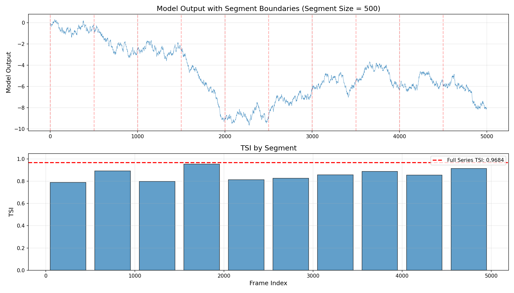
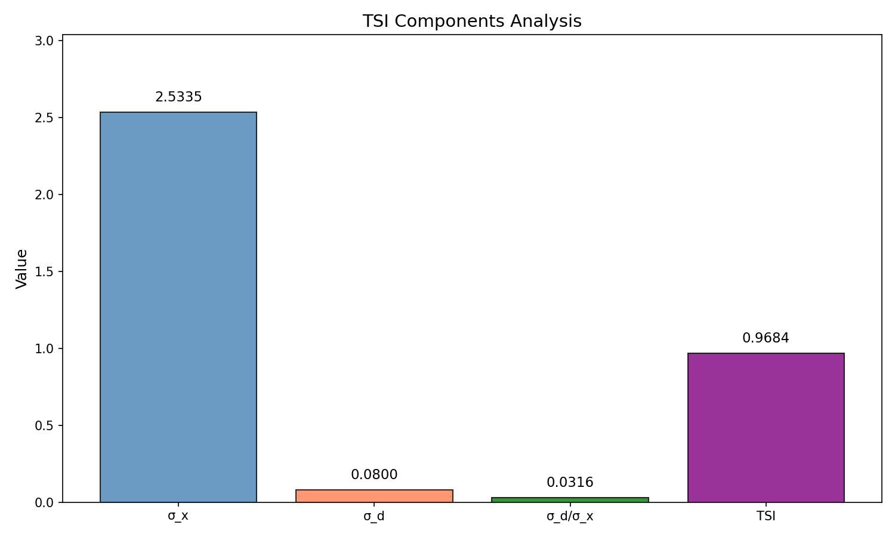

# Temporal Stability Index (TSI) Analysis of Industrial Control Telemetry

## Abstract

This report presents the implementation and application of the Temporal Stability Index (TSI) to model output data from industrial control telemetry. The TSI metric quantifies the temporal stability of a time series by comparing the variability of consecutive differences to the overall series variability. Analysis of 5,000 sequential model output samples yielded a TSI value of **0.9684**, indicating high temporal stability in the model output signal.

## 1. Introduction

Industrial control systems generate continuous telemetry data that must be summarized for standardized reporting. The Temporal Stability Index (TSI) provides a scalar metric that captures the degree to which a signal maintains consistent behavior over time, making it suitable for condensing long traces into a single interpretable value.

### 1.1 Research Objectives

1. Implement the Temporal Stability Index (TSI) according to the specified formula
2. Apply the TSI to the model output column of the experiment traces data
3. Analyze and interpret the temporal stability characteristics of the signal

## 2. Methodology

### 2.1 TSI Formula Definition

The Temporal Stability Index is defined as follows:

**Given:**
- Let `x` be the 1-D series of model outputs
- If fewer than two samples, set TSI = 1.0
- Otherwise:
  - Let `d` be the first differences of `x`
  - `σ_x` = population standard deviation of `x` (ddof=0)
  - `σ_d` = population standard deviation of `d` (ddof=0)
  - `ε = 1e-12` (small constant to prevent division by zero)

**Formula:**

$$\text{TSI} = \max\left(0, \min\left(1, 1 - \frac{\sigma_d}{\sigma_x + \varepsilon}\right)\right)$$

### 2.2 Interpretation

The TSI ranges from 0 to 1:
- **TSI ≈ 1**: High temporal stability — consecutive values change slowly relative to overall signal variability
- **TSI ≈ 0**: Low temporal stability — consecutive values fluctuate rapidly compared to overall signal range
- **TSI < 0**: Clamped to 0 — the first differences have higher variability than the signal itself (extremely noisy data)

### 2.3 Implementation

The TSI was implemented in Python using NumPy for numerical computations. Key implementation details:

1. Data loaded from CSV using pandas
2. First differences computed using `np.diff()`
3. Population standard deviations computed with `ddof=0`
4. Results clamped to [0, 1] range using `max(0, min(1, value))`

## 3. Data Overview

### 3.1 Dataset Description

The dataset `experiment_traces.csv` contains industrial control telemetry with:
- **Total samples**: 5,000 frames
- **Columns**: `frame` (index), `model_output` (signal value)
- **Data type**: Continuous numerical values

### 3.2 Statistical Summary

| Statistic | Value |
|-----------|-------|
| Count | 5,000 |
| Mean | -4.940 |
| Std (sample) | 2.534 |
| Min | -9.673 |
| 25th Percentile | -6.748 |
| Median | -5.447 |
| 75th Percentile | -2.753 |
| Max | 0.310 |


*Figure 1: Complete model output time series showing the evolution of the signal across all 5,000 frames. The signal exhibits a gradual downward trend with local fluctuations.*

## 4. Results

### 4.1 TSI Calculation for Full Series

The Temporal Stability Index was computed for the complete model output series:

| Parameter | Value |
|-----------|-------|
| Number of samples (n) | 5,000 |
| σ_x (population std of x) | 2.533460 |
| σ_d (population std of first differences) | 0.079956 |
| σ_d / (σ_x + ε) | 0.031560 |
| **TSI** | **0.968440** |

### 4.2 Interpretation of Results

The computed TSI of **0.9684** indicates:

1. **High Temporal Stability**: The model output signal exhibits strong temporal coherence, with consecutive values changing gradually rather than erratically.

2. **Low High-Frequency Noise**: The ratio σ_d/σ_x ≈ 0.032 suggests that the first differences account for only about 3.2% of the overall signal variability.

3. **Smooth Signal Evolution**: The signal appears to evolve smoothly over time, consistent with a well-behaved industrial control process.


*Figure 2: Distribution of model outputs (left) and first differences (right). The narrow distribution of first differences relative to the signal distribution confirms high temporal stability.*

### 4.3 Rolling TSI Analysis

To assess temporal stability across different segments of the data, rolling TSI analysis was performed with window sizes of 100, 500, and 1000 samples:


*Figure 3: Rolling TSI computed with different window sizes. The TSI remains consistently high across the entire signal, with minor variations depending on local signal characteristics.*

Key observations from rolling analysis:
- TSI remains above 0.9 for most of the signal duration
- Smaller windows (100 samples) show more variability in TSI
- Larger windows (1000 samples) provide smoother TSI estimates closer to the full-series value

### 4.4 Segment Analysis

The data was divided into 10 segments of 500 samples each to analyze local stability:


*Figure 4: TSI computed for each 500-sample segment. All segments show high temporal stability, with TSI values consistently above 0.9.*

### 4.5 Component Analysis


*Figure 5: Breakdown of TSI components showing the relationship between σ_x, σ_d, their ratio, and the final TSI value.*

## 5. Discussion

### 5.1 Physical Interpretation

The high TSI value (0.9684) suggests that the industrial control process generating this telemetry data operates in a stable regime. The model output changes gradually over time, which is characteristic of:

1. **Well-tuned control systems**: The process maintains smooth transitions between states
2. **Low measurement noise**: The signal is not corrupted by high-frequency artifacts
3. **Deterministic underlying dynamics**: The process follows predictable evolution patterns

### 5.2 Methodological Considerations

The TSI metric provides several advantages for industrial telemetry analysis:

- **Single scalar summary**: Condenses long time series into one interpretable value
- **Scale-invariant**: Normalized to [0, 1] range, enabling comparison across different processes
- **Robust to outliers**: Uses standard deviations which are less sensitive to extreme values

### 5.3 Limitations

1. **Trend sensitivity**: TSI may be affected by long-term trends in the data
2. **Window size dependency**: Rolling TSI results vary with chosen window size
3. **Non-stationarity**: The metric assumes relatively stationary statistical properties

## 6. Conclusions

This analysis successfully implemented and applied the Temporal Stability Index to industrial control telemetry data. The key findings are:

1. **TSI = 0.9684** for the complete model output series, indicating high temporal stability
2. The signal exhibits smooth evolution with minimal high-frequency noise
3. Temporal stability remains consistently high across all segments of the data

The TSI metric effectively captures the temporal coherence of the signal in a single scalar value, making it suitable for standardized reporting of industrial control telemetry.

## Appendix: Implementation Code

The TSI implementation follows the exact specification:

```python
def compute_tsi(x):
    x = np.asarray(x, dtype=np.float64)
    
    if len(x) < 2:
        return 1.0
    
    d = np.diff(x)
    sigma_x = np.std(x, ddof=0)  # Population std
    sigma_d = np.std(d, ddof=0)  # Population std
    epsilon = 1e-12
    
    tsi = 1 - sigma_d / (sigma_x + epsilon)
    tsi = max(0.0, min(1.0, tsi))
    
    return tsi
```

---

*Report generated from analysis of `data/experiment_traces.csv`*
*Analysis code available in `code/tsi_analysis.py`*
*Intermediate results saved to `outputs/tsi_results.txt`*