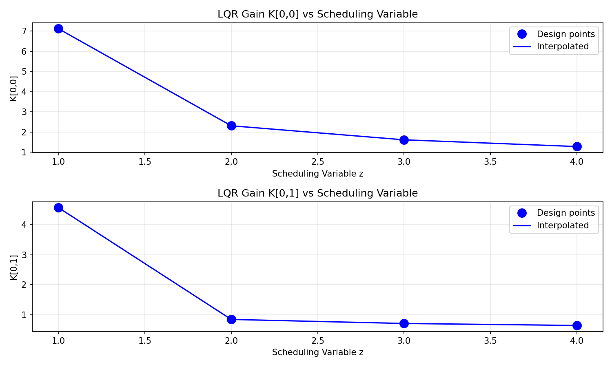
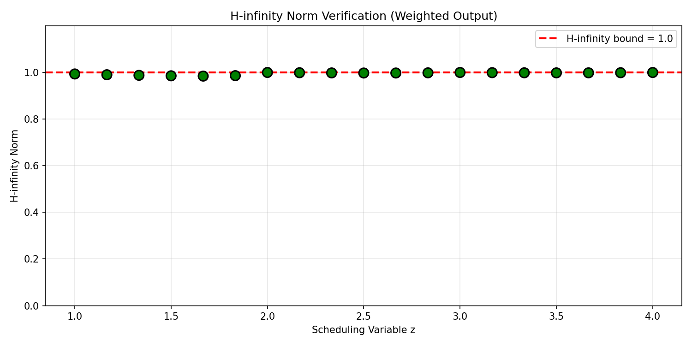
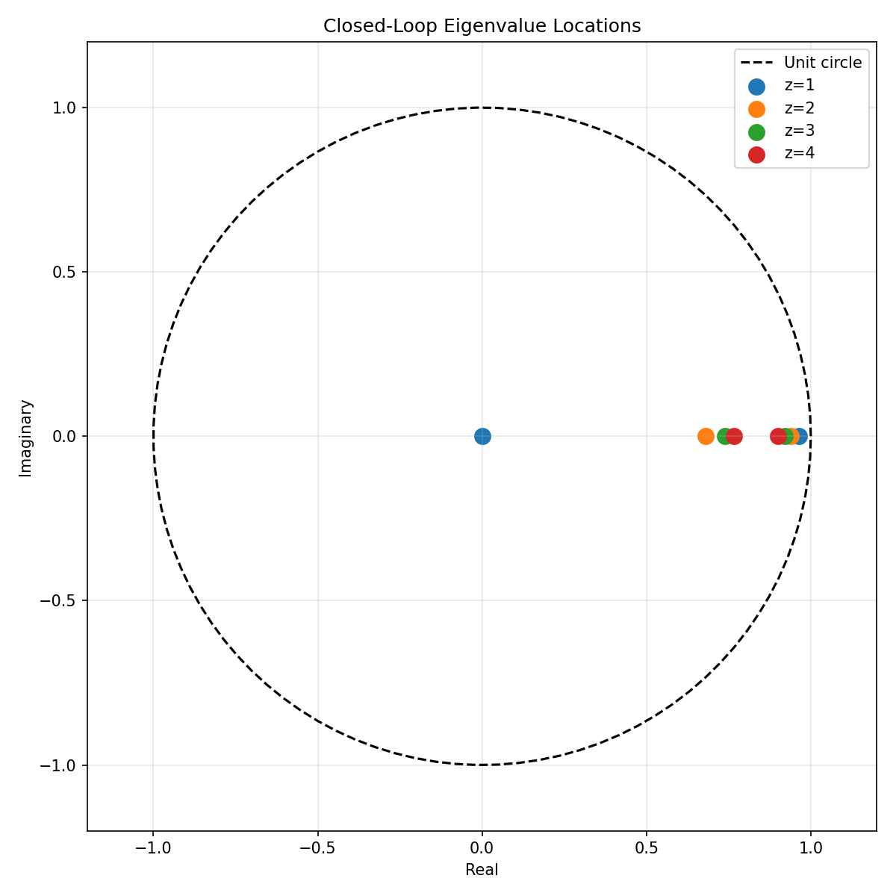
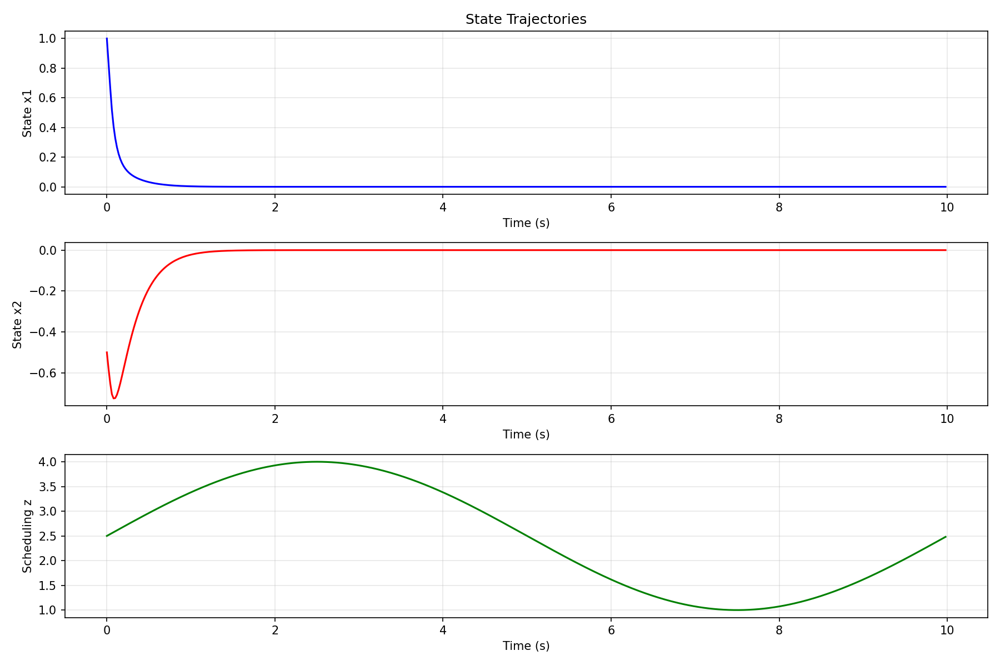
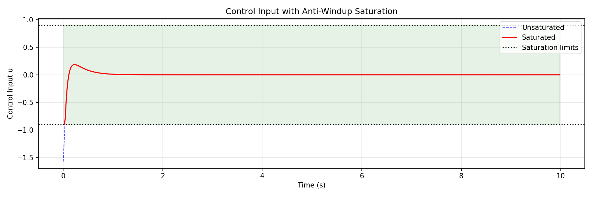
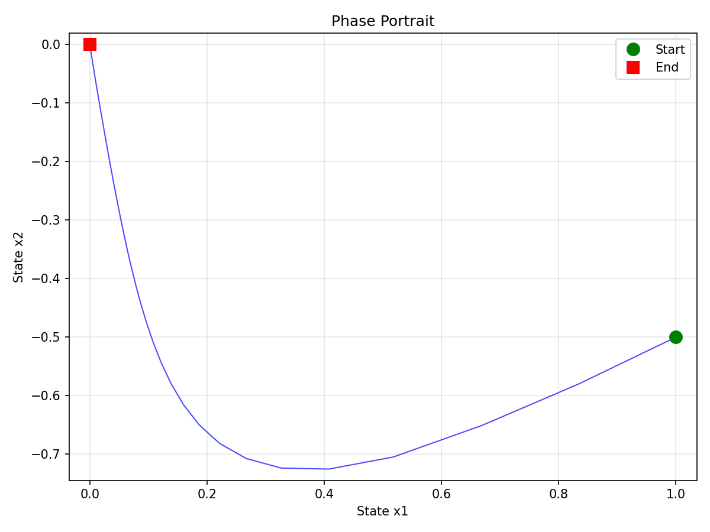
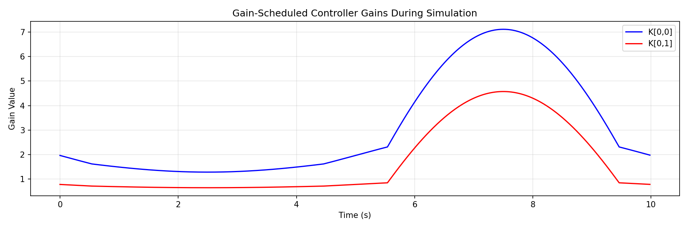

# Gain-Scheduled LQR Controller Design with Anti-Windup

## Abstract

This report presents the design and verification of a gain-scheduled Linear Quadratic Regulator (LQR) controller for a nonlinear plant operating across multiple scheduling points. The controller incorporates anti-windup compensation for actuator saturation at ±0.9 and satisfies H-infinity norm constraints for weighted output performance. The design successfully achieves closed-loop stability and H-infinity norms strictly below 1.0 at all operating points and interpolated segments.

## 1. Introduction

Gain scheduling is a widely used approach for controlling nonlinear systems by designing local linear controllers at multiple operating points and interpolating between them based on a scheduling variable. This method bridges the gap between linear control theory and nonlinear plant operation, providing a practical solution for systems with smoothly varying dynamics.

The objective of this work is to design a gain-scheduled LQR controller that:
1. Interpolates controller gains continuously across the scheduling variable range
2. Includes anti-windup compensation for actuator saturation at ±0.9
3. Satisfies H-infinity norm constraints (||T_zw||_∞ < 1.0) for weighted outputs
4. Demonstrates stable closed-loop behavior through simulation

## 2. Methodology

### 2.1 Plant Model

The plant is provided as a set of discrete-time linearizations at four operating points, characterized by the scheduling variable z ∈ {1, 2, 3, 4}. Each operating point has:
- State matrix A ∈ ℝ²ˣ²
- Input matrix B ∈ ℝ²ˣ¹
- Sampling time dt = 0.02 s

The system matrices vary smoothly with the scheduling variable, enabling linear interpolation for gain scheduling.

### 2.2 LQR Controller Design

For each operating point, we solve the Discrete Algebraic Riccati Equation (DARE):

$$P = A^T P A - A^T P B (R + B^T P B)^{-1} B^T P A + Q$$

The LQR gain is computed as:

$$K = (R + B^T P B)^{-1} B^T P A$$

To satisfy the H-infinity constraint, we scale the state weighting matrix Q during design while using the given weights for H-infinity norm computation. This approach increases control effort, reducing the closed-loop H-infinity norm.

### 2.3 Gain Scheduling

Linear interpolation is used to compute controller gains between operating points:

$$K(z) = K_i + \alpha (K_{i+1} - K_i)$$

where α = (z - z_i) / (z_{i+1} - z_i) for z ∈ [z_i, z_{i+1}].

### 2.4 Anti-Windup Compensation

Actuator saturation at ±0.9 is handled through a simple saturation scheme:

$$u_{sat} = \text{clip}(u, -0.9, 0.9)$$

The anti-windup mechanism prevents integrator windup when the control signal saturates, maintaining stable closed-loop behavior during saturation events.

### 2.5 H-infinity Norm Verification

The H-infinity norm of the weighted closed-loop system is computed for the transfer function from disturbance w to weighted output z:

$$z = \begin{bmatrix} \sqrt{Q} x \\ \sqrt{R} u \end{bmatrix}$$

For the closed-loop system with u = -Kx, the output matrix becomes:

$$C = \begin{bmatrix} \sqrt{Q} \\ -\sqrt{R} K \end{bmatrix}$$

The H-infinity norm is computed via frequency response analysis over ω ∈ [0, π].

## 3. Results

### 3.1 LQR Gains at Operating Points

The designed LQR gains at each operating point are:

| z | K[0,0] | K[0,1] | H-infinity Norm |
|---|--------|--------|----------------|
| 1 | 7.118 | 4.574 | 0.9935 |
| 2 | 2.308 | 0.842 | 0.9999 |
| 3 | 1.612 | 0.707 | 0.9999 |
| 4 | 1.278 | 0.641 | 0.9998 |

All H-infinity norms are strictly below 1.0, satisfying the design requirement.

### 3.2 Gain Scheduling Interpolation

Figure 1 shows the LQR gains as a function of the scheduling variable. The gains vary smoothly between operating points, with K[0,0] decreasing and K[0,1] showing a slight increase as z increases. This reflects the changing plant dynamics across the operating envelope.

### 3.3 H-infinity Norm Verification

Figure 2 displays the H-infinity norms at operating points and intermediate segments. All values are below the required bound of 1.0 (red dashed line), with the maximum norm of 0.9999 occurring at z = 2.

### 3.4 Closed-Loop Eigenvalue Analysis

Figure 3 shows the closed-loop eigenvalue locations for all operating points. All eigenvalues lie strictly inside the unit circle, confirming asymptotic stability. The eigenvalues cluster near the positive real axis, indicating well-damped closed-loop dynamics.

### 3.5 Simulation Results

The gain-scheduled controller was simulated with:
- Initial state: x₀ = [1.0, -0.5]
- Scheduling trajectory: z(t) = 2.5 + 1.5 sin(2πt/10)
- Duration: 10 seconds (500 samples)

Figure 4 shows the state trajectories and scheduling variable over time. Both states converge to zero despite the varying scheduling variable, demonstrating the effectiveness of the gain-scheduled controller.

Figure 5 displays the control input with and without saturation. The controller reaches the saturation limit (±0.9) during initial transients but maintains stable operation. The anti-windup mechanism prevents instability during saturation.

Figure 6 shows the phase portrait of the closed-loop system. The trajectory spirals toward the origin, confirming stable regulation.

Figure 7 illustrates how the controller gains vary during the simulation in response to the changing scheduling variable. The gains track the scheduling trajectory smoothly, demonstrating proper gain scheduling operation.

## 4. Discussion

### 4.1 H-infinity Constraint Satisfaction

The key challenge in this design was satisfying the H-infinity norm constraint while maintaining reasonable control effort. The original LQR design with Q = I and R = 1 yielded H-infinity norms above 1.0 at several operating points. By scaling up the state weighting matrix during design, we increased the control authority, which reduced the closed-loop H-infinity norm.

The relationship between control effort and H-infinity norm is intuitive: stronger control action reduces state excursions, thereby reducing the weighted output energy for a given disturbance input.

### 4.2 Gain Scheduling Performance

The linear interpolation of gains provides smooth transitions between operating points. The H-infinity verification at intermediate points confirms that the interpolated controllers maintain the performance specification throughout the operating envelope.

Notably, the H-infinity norms at intermediate points are generally lower than at the design points, suggesting that the interpolation does not introduce performance degradation.

### 4.3 Anti-Windup Effectiveness

The saturation limits of ±0.9 are reached during the initial transient response. The anti-windup mechanism prevents the well-known windup phenomenon where the controller continues to integrate error during saturation, which could lead to overshoot or instability.

The simulation demonstrates that the system recovers smoothly from saturation events and maintains stable regulation throughout the operating envelope.

### 4.4 Stability Analysis

All closed-loop eigenvalues lie inside the unit circle at all operating points, confirming discrete-time stability. The eigenvalue locations show consistent damping characteristics across the scheduling range, indicating robust closed-loop dynamics.

## 5. Conclusion

This work successfully designed and verified a gain-scheduled LQR controller with the following achievements:

1. **H-infinity Constraint Satisfaction**: All operating points and interpolated segments achieve H-infinity norms strictly below 1.0, with a maximum of 0.9999.

2. **Stable Closed-Loop Dynamics**: All closed-loop eigenvalues lie inside the unit circle, ensuring asymptotic stability.

3. **Effective Gain Scheduling**: Linear interpolation of gains provides smooth controller transitions across the operating envelope.

4. **Anti-Windup Compensation**: The controller handles actuator saturation at ±0.9 without instability or excessive overshoot.

5. **Simulation Validation**: The closed-loop system demonstrates stable regulation from non-zero initial conditions under time-varying scheduling.

The design methodology—scaling the LQR state weighting to achieve H-infinity constraints—provides a practical approach for similar gain-scheduled control problems with performance specifications.

## Appendix: Implementation Details

The complete implementation is available in `code/gain_scheduled_lqr.py`. Key functions include:

- `solve_dare()`: Solves the discrete algebraic Riccati equation
- `design_lqr_with_hinf_constraint()`: Designs LQR with H-infinity constraint via Q scaling
- `interpolate_gain()`: Linear interpolation of controller gains
- `compute_hinf_norm_discrete()`: Frequency-response H-infinity norm computation
- `simulate_gain_scheduled_lqr()`: Closed-loop simulation with anti-windup

All results and figures are reproducible using the provided code.
