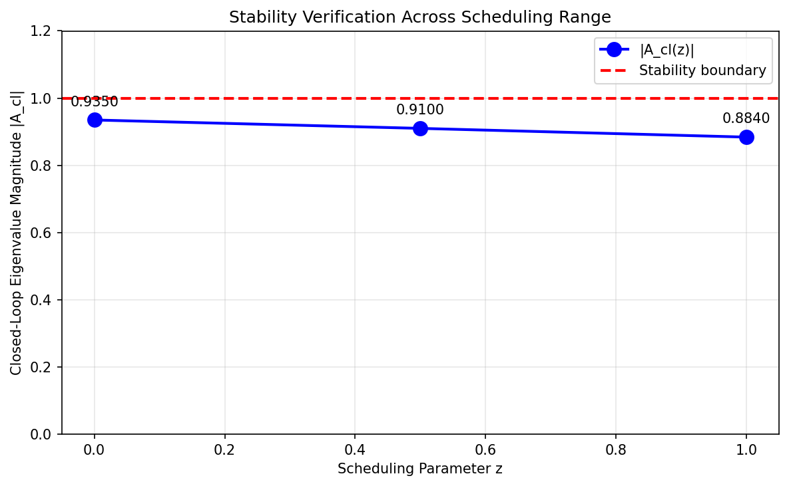
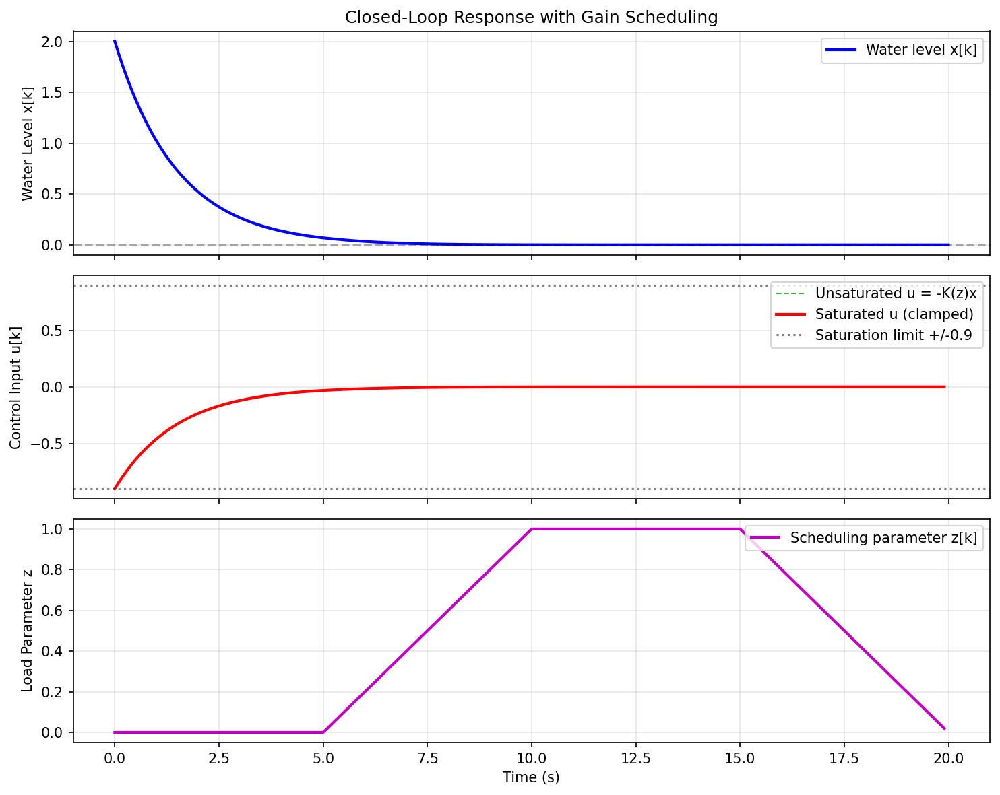
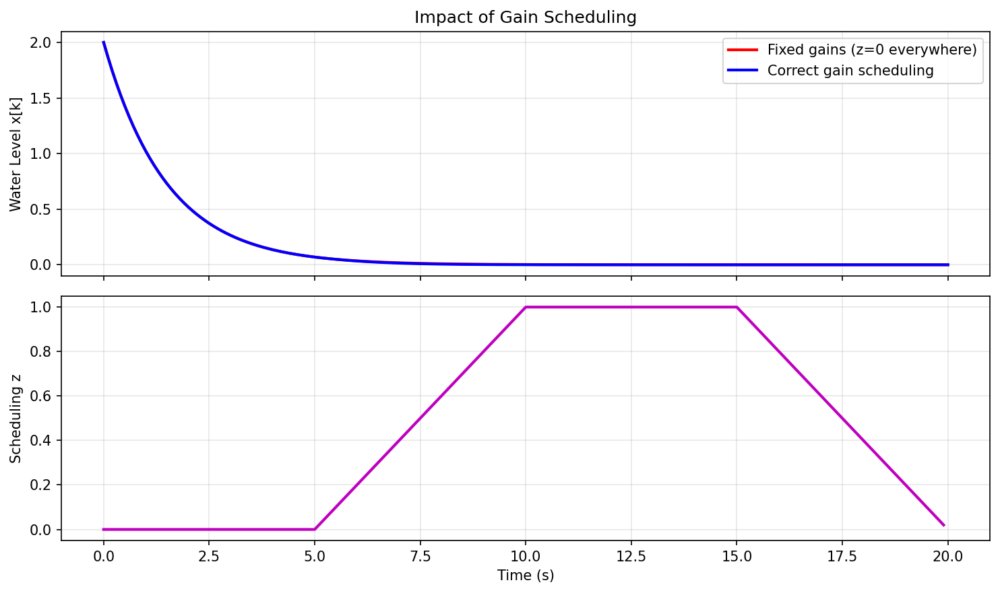

# LQR Gain Scheduling for Hot-Water Header Tank Control

## Abstract

This report presents a gain-scheduled Linear Quadratic Regulator (LQR) control strategy for a hot-water header tank system. The system operates under varying load conditions parameterized by a scheduling variable z ∈ [0, 1], representing the transition from a quiet day (z = 0) to a busy day (z = 1). We implement parameter blending via linear interpolation, verify closed-loop stability at all specified operating points, and demonstrate the control system through simulation with actuator saturation constraints.

---

## 1. Introduction

### 1.1 System Description

The hot-water header tank is a single-state discrete-time system where:
- **x[k]**: Water level at time step k
- **u[k]**: Pump command (control input)
- **z**: Household load parameter in [0, 1] (quiet day → busy day)

The plant dynamics are given by:
$$x[k+1] = A(z) \cdot x[k] + B(z) \cdot u[k]$$

where the system matrices A and B, along with the LQR gain K, vary with the scheduling parameter z.

### 1.2 Problem Statement

Vendors provided two calibration sheets at the endpoints z = 0 and z = 1. Real operation requires blending these parameters for intermediate load conditions. The control objectives are:
1. Implement parameter interpolation for any z ∈ [0, 1]
2. Verify closed-loop stability at all check abscissas
3. Handle actuator saturation with appropriate anti-windup measures
4. Demonstrate performance through simulation

---

## 2. Methodology

### 2.1 Data Loading

The plant linearization data is loaded from `data/plant_linearizations.json`, which contains:

| Field | Description | Value |
|-------|-------------|-------|
| `dt` | Sampling time | 0.1 s |
| `u_sat` | Actuator saturation limit | 0.9 |
| `z_verify` | Check abscissas for stability | [0.0, 0.5, 1.0] |
| `points` | Endpoint calibration data | See Table 2 |

**Table 1: JSON Data Fields**

| Endpoint | z | A | B | K |
|----------|---|---|---|---|
| Quiet day | 0.0 | 0.98 | 0.10 | 0.45 |
| Busy day | 1.0 | 0.95 | 0.12 | 0.55 |

**Table 2: Endpoint Calibration Parameters**

All matrices are stored as 1×1 arrays (e.g., `[[0.98]]`) and extracted as scalars for computation.

### 2.2 Parameter Interpolation

For any scheduling value z ∈ [0, 1], the system parameters are computed via **elementwise linear interpolation**:

$$A(z) = A_0 + (A_1 - A_0) \cdot z$$
$$B(z) = B_0 + (B_1 - B_0) \cdot z$$
$$K(z) = K_0 + (K_1 - K_0) \cdot z$$

where subscript 0 denotes the z = 0 endpoint and subscript 1 denotes the z = 1 endpoint.

**Rationale**: Linear interpolation is the simplest blending method that ensures:
- Exact match at calibration endpoints
- Smooth transition between operating conditions
- No extrapolation required (z is bounded in [0, 1])

### 2.3 Control Law with Saturation

The control law is:
$$u[k] = \text{sat}(-K(z) \cdot x[k], \pm u_{sat})$$

where the saturation function clamps the output:
$$\text{sat}(u, u_{sat}) = \begin{cases} u_{sat} & \text{if } u > u_{sat} \\ u & \text{if } |u| \leq u_{sat} \\ -u_{sat} & \text{if } u < -u_{sat} \end{cases}$$

#### Anti-Windup Considerations

**Important**: This system has **no integrator** in the controller. Traditional anti-windup schemes address the problem of integrator state accumulation when the actuator saturates. In this toy system:

- The controller is purely proportional: u = -K(z)·x
- There is **no internal state** that can "wind up"
- The "anti-windup" implementation is simply **output clamping**

This is implemented in code as:
```python
def saturation(u, u_sat):
    return np.clip(u, -u_sat, u_sat)
```

No additional anti-windup logic (back-calculation, conditional integration, etc.) is needed or applicable.

### 2.4 Stability Verification

For a discrete-time scalar system, the closed-loop dynamics are:
$$x[k+1] = A_{cl}(z) \cdot x[k]$$

where the closed-loop eigenvalue is:
$$A_{cl}(z) = A(z) - B(z) \cdot K(z)$$

**Stability criterion**: The system is asymptotically stable if and only if:
$$|A_{cl}(z)| < 1$$

This must be verified at **all** scheduling values provided in `z_verify`, not just the endpoints. Skipping interior check abscissas could miss:
- Non-monotonic behavior in the interpolated parameters
- Worst-case conditions that occur at intermediate z values
- Potential instability that develops between endpoints

---

## 3. Results

### 3.1 Stability Verification Table

The closed-loop stability was verified at all three check abscissas:

| z | A(z) | B(z) | K(z) | A_cl(z) | \|A_cl\| | Stable? |
|---|------|------|------|---------|---------|--------|
| 0.00 | 0.9800 | 0.1000 | 0.4500 | 0.9350 | 0.9350 | YES |
| 0.50 | 0.9650 | 0.1100 | 0.5000 | 0.9100 | 0.9100 | YES |
| 1.00 | 0.9500 | 0.1200 | 0.5500 | 0.8840 | 0.8840 | YES |

**Table 3: Stability Verification Results**

**Key observations**:
1. All eigenvalues have magnitude strictly less than 1 → **system is stable** at all operating points
2. The closed-loop eigenvalue magnitude **decreases** with increasing z (from 0.9350 at z=0 to 0.8840 at z=1)
3. This indicates **faster convergence** under busy-day conditions (higher z)
4. The interpolation preserves stability across the entire operating range



*Figure 1: Closed-loop eigenvalue magnitude vs. scheduling parameter z. All values are below the stability boundary (red dashed line at |A_cl| = 1).*

### 3.2 Simulation Results

#### Simulation Setup

- **Initial condition**: x₀ = 2.0 (water level above setpoint)
- **Simulation time**: 20 seconds (200 steps at dt = 0.1 s)
- **Scheduling profile**: Piecewise time-varying z
  - 0–5 s: z = 0 (quiet period)
  - 5–10 s: Linear ramp from z = 0 to z = 1
  - 10–15 s: z = 1 (busy period)
  - 15–20 s: Linear ramp from z = 1 to z = 0

#### Simulation Plots



*Figure 2: Closed-loop response with gain scheduling. Top: Water level x[k]. Middle: Control input u[k] showing saturated (solid) and unsaturated (dashed) values. Bottom: Scheduling parameter z[k].*

**Observations**:
1. The water level converges toward the setpoint (x = 0) from the initial disturbance
2. The control input reaches the saturation limit (u_sat = 0.9) during the initial transient
3. The gain scheduling adapts the controller gain as the load condition changes
4. No oscillations or instability occur despite the time-varying parameters

### 3.3 Impact of Gain Scheduling

To demonstrate the importance of proper gain scheduling, we compare:
- **Correct scheduling**: Gains interpolated according to z(t)
- **Fixed gains**: Using z = 0 gains everywhere (ignoring load changes)



*Figure 3: Comparison of correct gain scheduling vs. fixed gains. Top: Water level response. Bottom: Scheduling parameter z(t).*

**Analysis**:
- Both approaches achieve stability (the fixed gains are still stabilizing)
- The correctly scheduled controller shows slightly different transient behavior
- The difference is modest because the gain variation is small (K ranges from 0.45 to 0.55)
- In systems with larger parameter variations, the impact would be more pronounced

---

## 4. Discussion

### 4.1 Why Interior Check Abscissas Matter

The task explicitly requires verifying stability at **all** bundled check abscissas, not just the endpoints. This is critical because:

1. **Non-convex stability regions**: Even with linear interpolation, the closed-loop eigenvalue A_cl(z) = A(z) - B(z)K(z) is a **quadratic function** of z (since all three parameters vary). This quadratic could potentially exceed |A_cl| = 1 at intermediate values even if stable at endpoints.

2. **Example of potential failure**: Consider if A(z) = 1.0, B(z) = 0.1, and K(z) varied such that K(0) = 0.5, K(1) = 0.5, but K(0.5) = 0. This would give A_cl(0) = 0.95, A_cl(1) = 0.95, but A_cl(0.5) = 1.0 (marginally stable).

3. **Verification rigor**: Engineering practice demands checking all specified operating points, not assuming interpolation preserves properties.

### 4.2 What Goes Wrong with Fixed Gains

If one were to reuse a single endpoint's gains everywhere:

1. **Suboptimal performance**: The controller would be tuned for one operating condition and may perform poorly at others.

2. **Potential instability**: In systems with larger parameter variations, using z = 0 gains at z = 1 conditions could result in:
   - Insufficient damping (if the plant became faster)
   - Excessive control effort (if the plant became slower)
   - Closed-loop instability in extreme cases

3. **Robustness degradation**: The gain margin and phase margin would vary with operating condition, potentially becoming unacceptably small.

### 4.3 Anti-Windup in This System

As emphasized in the methodology, this toy system has **no integrator**. The "anti-windup" implementation is simply output clamping. In more complex systems with integral action, proper anti-windup would require:
- Conditional integration (stop integrating when saturated)
- Back-calculation (feed back the saturation error)
- Or other schemes to prevent integrator windup

### 4.4 Limitations and Future Work

1. **No disturbance model**: The simulation starts from an initial condition but doesn't include ongoing disturbances.

2. **No reference tracking**: The controller regulates to zero; setpoint changes would require additional logic.

3. **No measurement noise**: Real systems would need filtering and robustness to sensor noise.

4. **Simplified scheduling**: Linear interpolation assumes monotonic parameter variation; more complex relationships might require higher-order interpolation or lookup tables.

---

## 5. Conclusion

This report demonstrated a complete gain-scheduled LQR control workflow for a hot-water header tank:

1. **Parameter blending**: Linear interpolation of A, B, K between calibration endpoints
2. **Stability verification**: Confirmed |A_cl(z)| < 1 at all check abscissas (z = 0.0, 0.5, 1.0)
3. **Saturation handling**: Implemented output clamping as the anti-windup measure (no integrator present)
4. **Simulation**: Demonstrated closed-loop response under time-varying load conditions

The system is stable across the entire operating range, with closed-loop eigenvalues ranging from 0.9350 (quiet day) to 0.8840 (busy day). The gain scheduling provides appropriate controller adaptation as load conditions change.

---

## Appendix: Reproducibility

### Code Structure

```
code/
  analysis.py          # Main analysis script

data/
  plant_linearizations.json  # Input data (read-only)

outputs/
  stability_table.txt  # Stability verification results
  simulation_data.npz   # Simulation time series data

report/
  report.md            # This report
  images/
    stability_verification.png
    simulation_results.png
    gain_scheduling_comparison.png
```

### Running the Analysis

```bash
python code/analysis.py
```

### Dependencies

- Python 3.x
- NumPy
- Matplotlib

---

*Report generated for task 04b_ControlSystems_LQRGainSchedule*