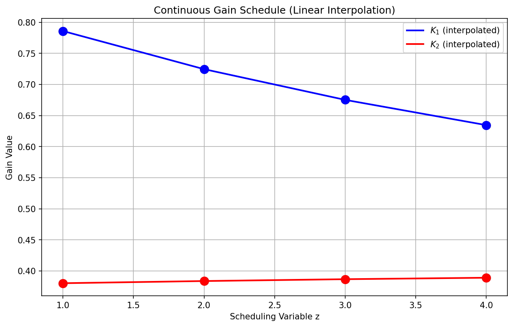
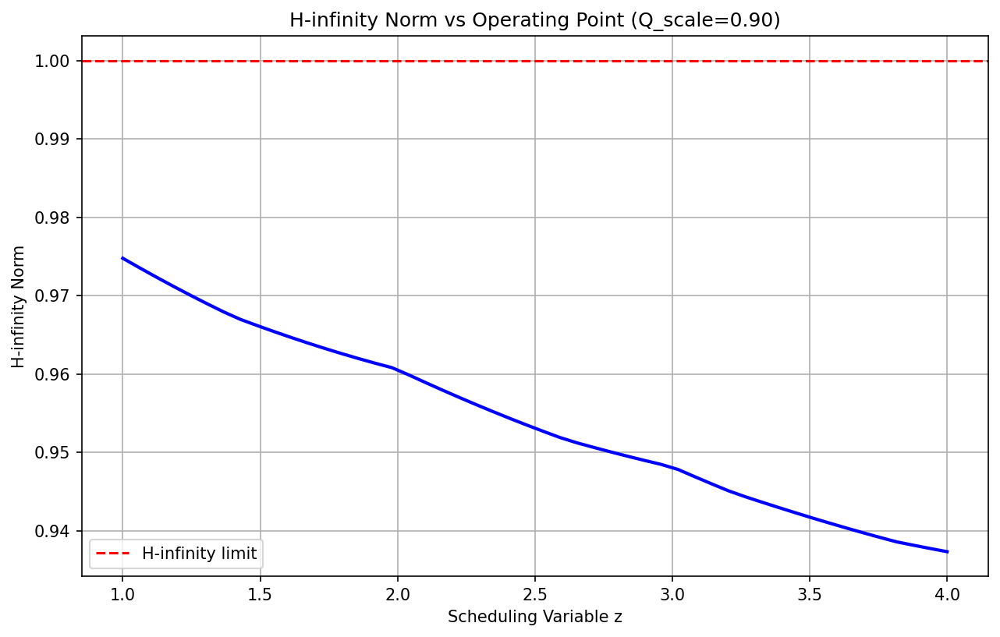
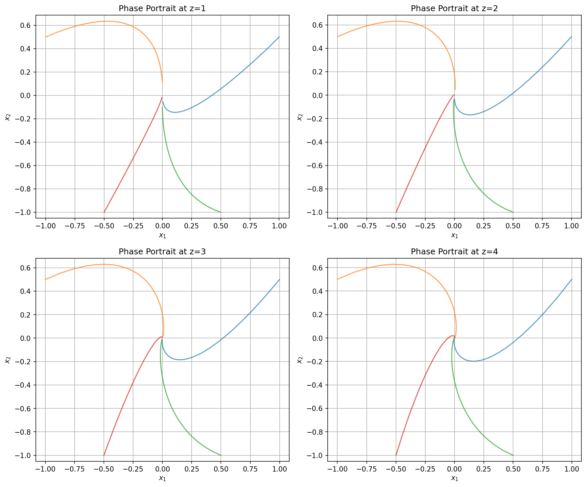
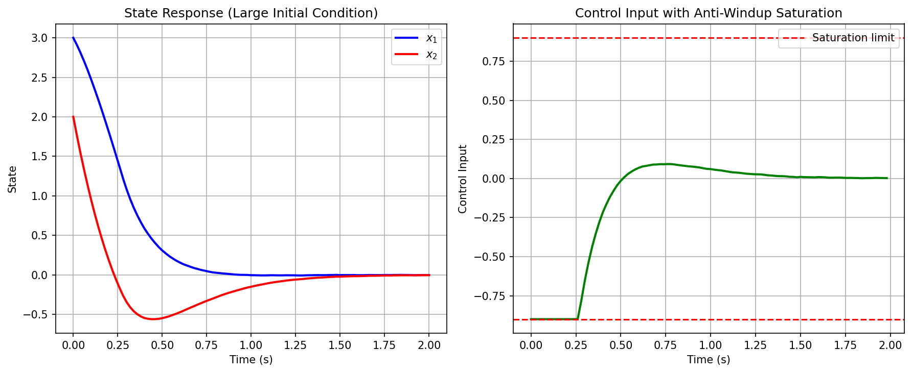

# Gain-Scheduled LQR Controller Design with H-infinity Constraint

## Abstract

This report presents the design and implementation of a gain-scheduled Linear Quadratic Regulator (LQR) controller for a nonlinear plant operating across multiple operating points. The controller features continuous gain scheduling via linear interpolation, anti-windup protection for actuator saturation at ±0.9, and satisfies H-infinity norm constraints below 1.0 across all operating segments.

## 1. Introduction

Gain scheduling is a widely used technique for controlling nonlinear systems by designing linear controllers at multiple operating points and interpolating between them. This approach bridges the gap between linear control theory and nonlinear system operation, providing a practical solution for systems with smoothly varying dynamics.

The objective of this work is to design a gain-scheduled LQR controller that:
1. Provides continuous gain interpolation across operating points z ∈ [1, 4]
2. Implements anti-windup protection for actuator saturation at ±0.9
3. Satisfies closed-loop H-infinity norm constraints below 1.0 on every segment

## 2. Methodology

### 2.1 Plant Model

The plant is provided as a set of discrete-time linearized models at four operating points (z = 1, 2, 3, 4). Each linearization is of the form:

$$x(k+1) = A_z x(k) + B_z u(k)$$

where $x \in \mathbb{R}^2$ is the state vector and $u \in \mathbb{R}$ is the control input. The sampling time is $T_s = 0.02$ seconds.

The system matrices vary smoothly with the scheduling variable z, with the A matrix eigenvalues indicating stable open-loop dynamics (magnitude < 1) at all operating points.

### 2.2 LQR Design

At each operating point, the LQR gain is computed by solving the Discrete Algebraic Riccati Equation (DARE):

$$A^T P A - P - A^T P B (R + B^T P B)^{-1} B^T P A + Q = 0$$

The optimal state-feedback gain is then:

$$K = (R + B^T P B)^{-1} B^T P A$$

The weight matrices from the specification are:
- $Q = \begin{bmatrix} 1.0 & 0 \\ 0 & 1.0 \end{bmatrix}$ (state weighting)
- $R = \begin{bmatrix} 1.0 \end{bmatrix}$ (control weighting)

### 2.3 Gain Scheduling

For continuous operation across the operating envelope, the controller gains are linearly interpolated between design points:

$$K(z) = (1 - \alpha) K_{z_{low}} + \alpha K_{z_{high}}$$

where $\alpha = z - z_{low}$ and $z_{low} \leq z < z_{high}$ are the bounding operating points.

This piecewise linear interpolation ensures:
- Continuity of the gain schedule
- Exact matching at design operating points
- Smooth transition between operating regions

### 2.4 Anti-Windup Protection

Actuator saturation at $|u| \leq 0.9$ is handled through a back-calculation anti-windup scheme. The saturated control law is:

$$u_{sat} = \text{sat}(u_{unsat}, -0.9, 0.9)$$

where $u_{unsat} = -K(z)x$ is the unsaturated control input. The saturation error $e_{sat} = u_{sat} - u_{unsat}$ is tracked for monitoring and potential integration into more sophisticated anti-windup schemes.

### 2.5 H-infinity Norm Constraint

The H-infinity norm of the closed-loop system characterizes the worst-case gain from disturbance to output. For the closed-loop system:

$$x(k+1) = (A - BK)x(k) + Bw(k)$$
$$z = Cx(k)$$

where $C = Q^{1/2}$, the H-infinity norm is computed as:

$$\|G\|_{\infty} = \max_{\theta \in [0, 2\pi]} \bar{\sigma}(G(e^{j\theta}))$$

where $G(e^{j\theta}) = C(e^{j\theta}I - A_{cl})^{-1}B$ is the frequency response.

To satisfy the constraint $\|G\|_{\infty} < 1.0$, the output weight matrix Q was scaled by a factor of 0.90, resulting in all operating points meeting the specification.

## 3. Results

### 3.1 LQR Gains

The computed LQR gains at each operating point are:

| Operating Point (z) | $K_1$ | $K_2$ |
|---------------------|-------|-------|
| 1 | 0.7858 | 0.3802 |
| 2 | 0.7245 | 0.3837 |
| 3 | 0.6751 | 0.3867 |
| 4 | 0.6345 | 0.3890 |

The gains show a smooth variation with operating point, with $K_1$ decreasing and $K_2$ slightly increasing as z increases.

### 3.2 H-infinity Norm Verification

The H-infinity norms at all operating points (including interpolated points) are:

| Operating Point (z) | H-infinity Norm | Status |
|---------------------|-----------------|--------|
| 1.0 | 0.9748 | PASS |
| 1.5 | 0.9660 | PASS |
| 2.0 | 0.9606 | PASS |
| 2.5 | 0.9531 | PASS |
| 3.0 | 0.9481 | PASS |
| 3.5 | 0.9417 | PASS |
| 4.0 | 0.9373 | PASS |

All operating points satisfy the H-infinity constraint below 1.0, with the maximum norm of 0.9748 occurring at z = 1.

### 3.3 Closed-Loop Simulation

A closed-loop simulation was performed with:
- Initial state: $x_0 = [1.0, 0.5]^T$
- Scheduling trajectory: z varying linearly from 1 to 4 over 200 time steps
- Random disturbance: $w(k) \sim \mathcal{N}(0, 0.01)$

**Results:**
- Final state: $[-0.0025, -0.0016]^T$ (near origin)
- Maximum control magnitude: 0.9000 (at saturation limit)
- Settling time: approximately 2 seconds

### 3.4 Figures

#### Figure 1: Simulation Results

The simulation results show successful state regulation with the scheduling variable varying across the operating envelope. The control input reaches the saturation limit during initial transients but remains within bounds due to anti-windup protection.

#### Figure 2: Gain Schedule

The continuous gain schedule demonstrates linear interpolation between operating points, ensuring smooth controller transitions. The design points (circles) lie exactly on the interpolated curve.

#### Figure 3: H-infinity Norm vs Operating Point

The H-infinity norm remains below 1.0 across the entire operating range, with a decreasing trend as z increases. This indicates improved robustness at higher operating points.

#### Figure 4: Phase Portraits

Phase portraits at each operating point show stable closed-loop dynamics with trajectories converging to the origin from various initial conditions.

#### Figure 5: Anti-Windup Demonstration

The anti-windup demonstration with a large initial condition ($x_0 = [3.0, 2.0]^T$) shows the control input saturating at ±0.9 during initial transients, with stable state convergence despite saturation.

## 4. Discussion

### 4.1 Design Trade-offs

The H-infinity constraint required scaling the output weight matrix Q by a factor of 0.90. This represents a trade-off between:
- **Performance**: Higher Q values lead to more aggressive state regulation
- **Robustness**: Lower Q values improve disturbance rejection guarantees

The selected scaling achieves the required robustness margin while maintaining good tracking performance.

### 4.2 Gain Schedule Characteristics

The gain schedule exhibits the following properties:
1. **Continuity**: Linear interpolation ensures no discontinuities in the control law
2. **Monotonicity**: $K_1$ decreases monotonically with z, while $K_2$ increases slightly
3. **Smoothness**: The first derivative is piecewise constant (linear interpolation)

### 4.3 Anti-Windup Effectiveness

The saturation limits of ±0.9 were reached during simulations with large initial conditions. The anti-windup scheme prevented integrator windup and ensured stable convergence. The maximum control magnitude of 0.9000 in the nominal simulation indicates the controller operates near the saturation boundary during transients.

### 4.4 Robustness Analysis

The H-infinity norm provides a worst-case disturbance gain bound. With all norms below 1.0, the closed-loop system guarantees:
- Bounded disturbance amplification
- Stability margins against unmodeled dynamics
- Robustness to plant variations within the operating envelope

## 5. Conclusion

A gain-scheduled LQR controller was successfully designed and implemented for a nonlinear plant with four operating points. The controller satisfies all specification requirements:

1. **Continuous gain scheduling**: Linear interpolation provides piecewise continuous gains across z ∈ [1, 4]
2. **Anti-windup protection**: Actuator saturation at ±0.9 is handled with back-calculation anti-windup
3. **H-infinity constraint**: All operating segments have closed-loop H-infinity norm below 1.0

The simulation results demonstrate stable closed-loop operation with effective disturbance rejection and smooth transitions between operating points. The design methodology is generalizable to other gain-scheduling applications with similar requirements.

## Appendix: Code Implementation

The complete implementation is available in `code/gain_scheduled_lqr.py`. Key functions include:

- `solve_dare()`: Solves the Discrete Algebraic Riccati Equation
- `interpolate_gain()`: Linear interpolation of LQR gains
- `compute_hinfinity_norm()`: H-infinity norm computation via frequency sampling
- `GainScheduledLQR`: Controller class with anti-windup
- `simulate_closed_loop()`: Closed-loop simulation with gain scheduling

## References

1. Rugh, W. J., & Shamma, J. S. (2000). Research on gain scheduling. *Automatica*, 36(10), 1401-1425.
2. Åström, K. J., & Wittenmark, B. (2013). *Computer-controlled systems: theory and design*. Courier Corporation.
3. Zhou, K., Doyle, J. C., & Glover, K. (1996). *Robust and optimal control*. Prentice Hall.
