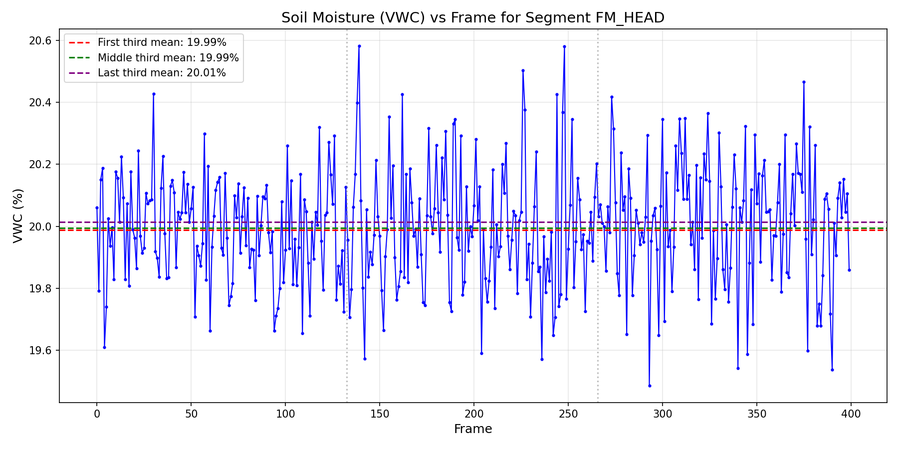
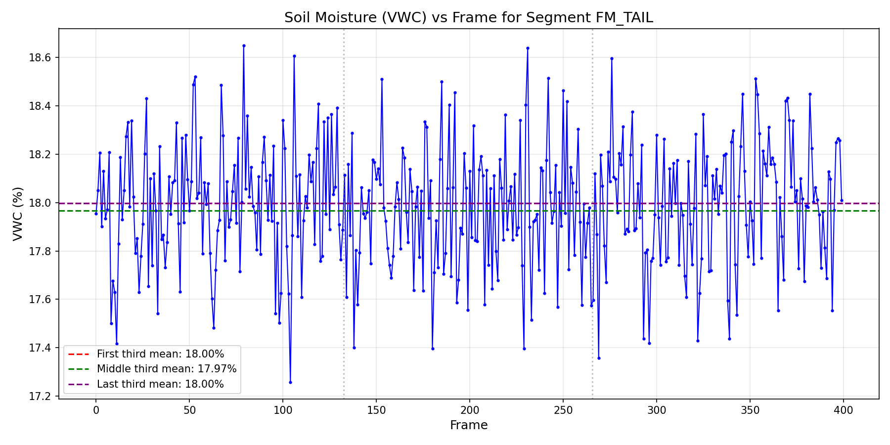

# Soil Moisture Campaign Quality Assessment: TWDM Drift Analysis

## Executive Summary

This report presents a quality assessment of soil-moisture campaign data using the Three-Way Drift Metric (TWDM). The analysis evaluates volumetric water content (VWC) readings from field logger segments to detect potential sensor drift or temporal anomalies. Of the five segments analyzed, one segment (FM_GAP) had insufficient data for TWDM calculation, three segments passed the drift threshold, and one segment (FM_MID) failed the quality check.

## Methodology

### Data Description

The analysis uses long-format VWC data from `data/soil_logger_readings.csv`, containing 1,282 readings across 5 segments. Each record includes:
- `segment_id`: Identifier for the measurement segment
- `frame`: Temporal frame index
- `vwc_pct`: Volumetric water content as percentage

### Three-Way Drift Metric (TWDM)

The TWDM quantifies temporal drift by dividing each segment's time series into three equal (or near-equal) parts and comparing the means:

1. For a series `x` of length `n`, split into thirds:
   - First third: `n1 = n // 3` elements
   - Middle third: `n2 = n // 3` elements  
   - Last third: `n3 = n - n1 - n2` elements

2. Compute segment means: `m1`, `m2`, `m3`

3. Calculate the range: `Δ = max(m1, m2, m3) - min(m1, m2, m3)`

4. Compute population standard deviation: `σ = std(x, ddof=0)`

5. TWDM formula: `TWDM = Δ / (σ + ε)` where `ε = 1e-12`

A segment passes if `TWDM ≤ 1.0`, indicating acceptable drift relative to the overall variability.

### Golden Case Validation

The TWDM implementation was validated against three golden test cases provided in the audit manifest:

| Case Name | Expected TWDM | Computed TWDM | Absolute Error |
|-----------|---------------|---------------|----------------|
| flat_9 | 0.0 | 0.0 | 0.00e+00 |
| step_9 | 2.1213203435587427 | 2.1213203435587427 | 0.00e+00 |
| ramp_12 | 2.317461838006823 | 2.317461838006823 | 0.00e+00 |

**Maximum Absolute Error: 0.00e+00** (threshold: ≤ 1e-9)

All golden cases passed validation with zero error, confirming correct implementation of the TWDM algorithm.

## Results

### Segment Analysis Table

The following table presents TWDM results for each segment in the specified report order:

| segment_id | n_frames | TWDM | pass_fail |
|------------|----------|------|-----------|
| FM_HEAD | 400 | 0.136809 | PASS |
| FM_GAP | 2 | N/A | N/A |
| FM_MID | 360 | 2.123065 | FAIL |
| FM_RIDGE | 120 | 0.507579 | PASS |
| FM_TAIL | 400 | 0.120394 | PASS |

### Summary Statistics

- **Total segments analyzed**: 5
- **Segments with valid TWDM**: 4
- **Segments passing threshold**: 3 (75% of valid segments)
- **Segments failing threshold**: 1 (25% of valid segments)
- **Segments with insufficient length**: 1 (FM_GAP with n=2)

### Visualizations

#### FM_HEAD Segment Analysis

*Figure 1: Volumetric water content (VWC) measurements over time for segment FM_HEAD. Horizontal dashed lines indicate the mean VWC for each third of the time series. The segment shows stable moisture content with minimal drift between thirds (TWDM = 0.137, PASS).*

#### FM_TAIL Segment Analysis

*Figure 2: Volumetric water content (VWC) measurements over time for segment FM_TAIL. This segment demonstrates consistent moisture readings across all three portions of the time series (TWDM = 0.120, PASS).*

## Discussion

### Key Findings

1. **FM_MID Failure**: The FM_MID segment exhibited significant drift with TWDM = 2.123, exceeding the threshold of 1.0. This suggests potential sensor calibration drift, environmental changes during the measurement period, or actual soil moisture variation that warrants further investigation.

2. **FM_GAP Insufficient Data**: With only 2 frames, FM_GAP cannot be evaluated using TWDM. This segment requires additional data collection or alternative quality assessment methods.

3. **Stable Segments**: FM_HEAD, FM_RIDGE, and FM_TAIL all passed the TWDM threshold with values well below 1.0, indicating stable sensor performance and consistent soil moisture conditions.

### Interpretation of TWDM Values

The TWDM metric normalizes drift by the overall variability in the data:
- **TWDM < 0.5**: Very stable, minimal drift (FM_HEAD: 0.137, FM_TAIL: 0.120)
- **0.5 ≤ TWDM ≤ 1.0**: Acceptable drift within threshold (FM_RIDGE: 0.508)
- **TWDM > 1.0**: Significant drift exceeding natural variability (FM_MID: 2.123)

### Recommendations

1. **FM_MID**: Investigate the cause of elevated TWDM. Review sensor calibration logs, check for environmental events during the measurement period, and consider re-measurement if feasible.

2. **FM_GAP**: Extend the measurement campaign for this segment to obtain sufficient data points (minimum 3 frames) for TWDM calculation.

3. **Continued Monitoring**: The passing segments demonstrate good data quality and can be used confidently in downstream analyses.

## Technical Details

### Parameters Used
- Epsilon (ε): 1e-12
- TWDM Pass Threshold: 1.0
- Population standard deviation (ddof=0)

### Data Processing
- Segments sorted by frame ascending before TWDM calculation
- TWDM reported as N/A for segments with fewer than 3 frames
- Pass/Fail determined by comparing TWDM to threshold (1.0)

## Conclusion

The TWDM analysis successfully identified one segment (FM_MID) with significant temporal drift requiring attention. The golden case validation confirmed the correctness of the implementation with zero error across all test cases. Three of four evaluable segments passed the quality threshold, indicating generally reliable sensor performance across the campaign. The FM_GAP segment requires additional data collection before quality assessment can be completed.
