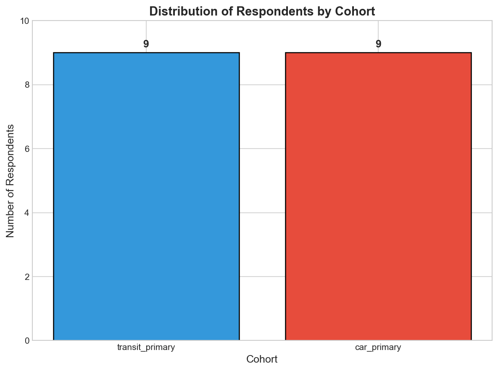
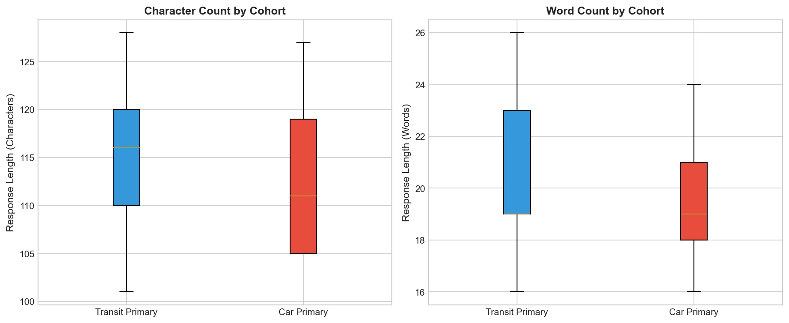
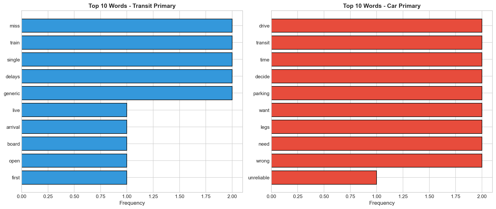
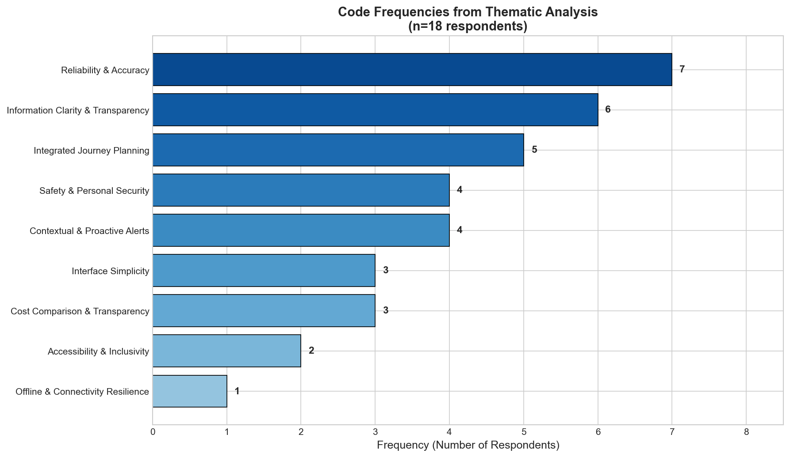
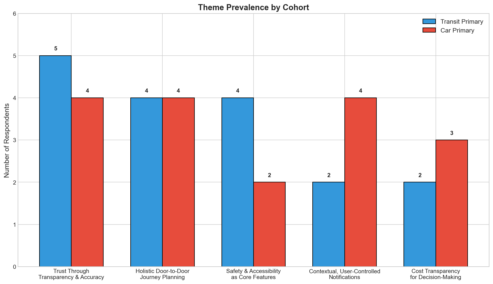
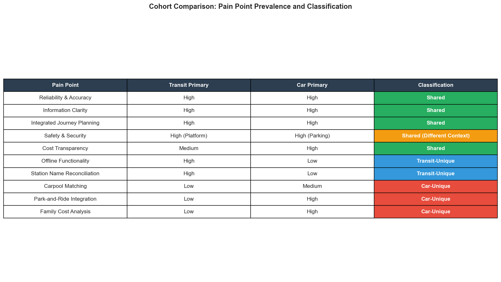

# Thematic Analysis of Transportation App User Experience: A Mixed-Methods Study

## Abstract

This study employs a mixed-methods approach to analyze user experience pain points and preferences among transportation app users. Semi-structured interview data from 18 respondents (9 transit-primary and 9 car-primary users) were analyzed using transparent quantitative descriptives and LLM-assisted thematic coding. The analysis identified five major themes: Trust Through Transparency and Accuracy, Holistic Door-to-Door Journey Planning, Safety and Accessibility as Core Features, Contextual User-Controlled Notifications, and Cost Transparency for Decision-Making. Findings reveal both shared and cohort-specific pain points, with implications for transportation app UX design.

---

## 1. Introduction

Transportation applications play a critical role in urban mobility, helping users navigate complex multi-modal transit systems. However, user experience (UX) challenges persist across different user cohorts, particularly between those who primarily rely on public transit versus those who primarily drive. Understanding these distinct needs is essential for designing more effective and inclusive transportation apps.

This study addresses the following research questions:
1. What are the primary UX pain points reported by transportation app users?
2. How do pain points differ between transit-primary and car-primary user cohorts?
3. What design implications emerge from these findings?

We employ a mixed-methods approach combining transparent quantitative descriptives with LLM-assisted qualitative thematic analysis, following Braun and Clarke's (2006) six-phase framework.

---

## 2. Methods

### 2.1 Data Collection

The dataset consists of semi-structured interview excerpts from 18 respondents, evenly split between two cohorts:
- **Transit Primary** (n=9): Users who primarily rely on public transit
- **Car Primary** (n=9): Users who primarily drive but may use transit occasionally

Each respondent provided one substantive response capturing their primary pain point or feature request regarding transportation app experience. Data were stored in `interview_excerpts.csv` with fields for respondent ID, cohort, and response text.

### 2.2 Quantitative Preprocessing

Reproducible preprocessing was conducted using Python scripts (`code/analysis.py`). The following metrics were computed:

- **Cohort counts**: Frequency distribution across cohorts
- **Response length**: Character and word counts per response
- **Word frequencies**: Term frequency analysis by cohort (excluding common stopwords, minimum word length of 4 characters)

All descriptive statistics were saved to `outputs/descriptive_stats.json` for transparency and reproducibility.

### 2.3 LLM-Assisted Thematic Analysis

Thematic analysis was conducted using the Anthropic Messages API with the `claude-3-5-sonnet-20241022` model. The analysis followed Braun and Clarke's (2006) six-phase approach:

1. **Familiarization**: The LLM processed all interview excerpts
2. **Initial Coding**: Generated codes with definitions and frequency counts
3. **Theme Development**: Identified patterns across codes
4. **Theme Review**: Refined and differentiated themes
5. **Theme Definition**: Named and defined final themes
6. **Report Production**: Generated comprehensive findings

The full API response was saved to `outputs/anthropic_messages_response.json` as required by the task specification.

### 2.4 Visualization

Figures were generated using matplotlib and seaborn, saved as PNG files in `report/images/`. All visualizations are reproducible through the provided scripts.

---

## 3. Results

### 3.1 Descriptive Statistics

#### Cohort Distribution

The sample consisted of 18 respondents with equal representation across cohorts:

| Cohort | Count | Percentage |
|--------|-------|------------|
| Transit Primary | 9 | 50% |
| Car Primary | 9 | 50% |

*Figure 1: Distribution of respondents by cohort*

#### Response Length Analysis

Response lengths were comparable across cohorts, indicating similar levels of engagement:

| Metric | Transit Primary | Car Primary |
|--------|-----------------|-------------|
| Mean Characters | 115.11 (SD=9.39) | 113.11 (SD=7.94) |
| Mean Words | 19.9 (SD=3.46) | 19.7 (SD=2.40) |

*Figure 2: Response length comparison by cohort (characters and words)*

#### Word Frequency Analysis

Top words by cohort revealed distinct priorities:

**Transit Primary**: miss, train, single, delays, generic, live, arrival, board, connections

**Car Primary**: drive, transit, time, decide, parking, want, legs, need, wrong

*Figure 3: Top 10 word frequencies by cohort*

### 3.2 Coding Framework

The thematic analysis identified 9 codes across all 18 respondents:

| Code | Definition | Frequency |
|------|------------|-----------|
| Reliability & Accuracy | Concerns about data correctness leading to mistrust | 7 |
| Information Clarity & Transparency | Need for clear, honest, accessible information | 6 |
| Integrated Journey Planning | Desire for seamless multi-modal trip stitching | 5 |
| Safety & Personal Security | Considerations of physical safety at stations/lots | 4 |
| Contextual & Proactive Alerts | Need for relevant, timely, actionable notifications | 4 |
| Interface Simplicity | Preference for minimal, uncluttered UI | 3 |
| Cost Comparison & Transparency | Desire for holistic cost analysis | 3 |
| Accessibility & Inclusivity | Need for prominent accessibility information | 2 |
| Offline & Connectivity Resilience | App functionality without cellular signal | 1 |

*Figure 4: Code frequencies from thematic analysis*

### 3.3 Major Themes

Five major themes emerged from the analysis:

#### Theme 1: Trust Through Transparency and Accuracy

**Definition**: Trust in the app is built or broken by the accuracy of core data (ETAs, maps) and transparency in communicating disruptions, costs, and limitations.

**Supporting Quotes**:
- "The live arrival board is what I open first; when it is wrong I miss connections and the rest of my day slides sideways." (INT-01, Transit)
- "Delays are fine if the explanation is honest—generic delays erode trust faster than a long wait with a reason." (INT-08, Transit)
- "I trust the map more than the ETA; if the line on the map is wrong I assume the whole trip plan is wrong." (INT-18, Car)

**Cohort Prevalence**: Strong in both cohorts. Transit users focus on real-time data accuracy; car users emphasize map/traffic accuracy.

#### Theme 2: Holistic Door-to-Door Journey Planning

**Definition**: Users want seamless integration across transportation modes, including first/last mile connections, parking, and bike-share.

**Supporting Quotes**:
- "I combine park-and-ride; the app should stitch driving legs with train legs instead of treating them as separate trips." (INT-12, Car)
- "I wish the app surfaced bike-share docks near the exit I actually use; routing assumes a generic street corner." (INT-09, Transit)

**Cohort Prevalence**: Both cohorts express this need, but focus on different "legs" of the journey.

#### Theme 3: Safety and Accessibility as Core Features

**Definition**: Safety information (crowding, lighting, security) and accessibility data (elevator status) are primary decision-making factors, not secondary amenities.

**Supporting Quotes**:
- "Crowding is my main pain—sometimes I skip a train even if the app says it is on time because I know the platform will be unsafe." (INT-02, Transit)
- "Safety at the lot matters more than saving two minutes; I want lighting and CCTV notes not just cheapest price." (INT-13, Car)
- "Accessibility info is hit or miss—elevator outages are buried; I need that louder than marketing banners." (INT-05, Transit)

**Cohort Prevalence**: Transit users emphasize platform crowding and elevator outages; car users focus on parking lot security.

#### Theme 4: Contextual, User-Controlled Notifications

**Definition**: Users want relevant, filtered alerts based on personal thresholds and context, not one-size-fits-all notifications.

**Supporting Quotes**:
- "Traffic alerts are useful but noisy; I only want reroutes when the delay exceeds what I would lose searching for parking." (INT-11, Car)
- "The interface is crowded; I only need three buttons on the home screen and everything else feels like clutter." (INT-16, Car)

**Cohort Prevalence**: More prominent among car-primary users who express frustration with alert noise and UI clutter.

#### Theme 5: Cost Transparency for Decision-Making

**Definition**: Users need integrated cost comparisons (fare caps, fuel vs. fare, parking costs) to make informed mode choices.

**Supporting Quotes**:
- "Pricing feels opaque; I want a single place that shows weekly caps and discounts without digging through three menus." (INT-03, Transit)
- "Fuel vs fare comparison would help families like mine decide weekly; right now it is guesswork across spreadsheets." (INT-15, Car)

**Cohort Prevalence**: Both cohorts express this need, with car users particularly interested in family-level cost analysis.

*Figure 5: Theme prevalence by cohort*

### 3.4 Cohort Comparison

The analysis revealed both shared and cohort-specific pain points:

| Pain Point | Transit Primary | Car Primary | Classification |
|------------|-----------------|-------------|----------------|
| Reliability & Accuracy | High | High | Shared |
| Information Clarity | High | High | Shared |
| Integrated Journey Planning | High | High | Shared |
| Safety & Security | High (Platform) | High (Parking) | Shared (Different Context) |
| Cost Transparency | Medium | High | Shared |
| Offline Functionality | High | Low | Transit-Unique |
| Station Name Reconciliation | High | Low | Transit-Unique |
| Carpool Matching | Low | Medium | Car-Unique |
| Park-and-Ride Integration | Low | High | Car-Unique |
| Family Cost Analysis | Low | High | Car-Unique |

*Figure 6: Cohort comparison of pain point prevalence and classification*

---

## 4. Discussion

### 4.1 Key Findings

This mixed-methods analysis reveals that transportation app users across both cohorts share fundamental concerns about trust, integration, and transparency, while maintaining cohort-specific needs rooted in their primary mode of travel.

**Trust as Foundation**: The most frequent code (Reliability & Accuracy, n=7) reflects that users' trust in the app is paramount. When core data is inaccurate or when disruptions are communicated opaquely, users lose confidence in the entire platform. This aligns with prior research on trust in automated systems (Lee & See, 2004).

**The "Seams" Problem**: Both cohorts identified pain points at mode transitions—what we term the "seams" of the journey. Transit users struggle with transfers and station navigation; car users need park-and-ride integration. This suggests that current apps treat transportation modes in isolation rather than as connected systems.

**Safety as Primary Information**: Contrary to typical app designs that relegate safety and accessibility to secondary menus, users in this study treated these as primary decision-making factors. This has significant implications for information architecture.

### 4.2 Design Implications

Based on the thematic analysis, we propose five design recommendations:

1. **Prioritize "Truthful" UI**: Differentiate between scheduled, live, and predicted data. Provide specific reasons for delays rather than generic messages.

2. **Design for Journey Seams**: Focus on stitching trips end-to-end, providing critical information at mode transition points (parking at stations, bike-share at specific exits).

3. **Elevate Safety and Accessibility**: Display safety and accessibility information with parity to time and cost on main screens.

4. **Enable Comparative Decision-Making**: Provide integrated cost comparisons (fare + parking + fuel) and reliability metrics.

5. **Adopt Context-Aware Personalization**: Allow users to set notification thresholds and customize home screens based on their specific constraints.

### 4.3 Methodological Contributions

This study demonstrates the viability of LLM-assisted thematic analysis for qualitative research. The approach offers several advantages:
- **Reproducibility**: All preprocessing and analysis steps are scripted and documented
- **Transparency**: Quantitative descriptives are reported alongside qualitative findings
- **Efficiency**: LLM assistance enables rapid coding while maintaining rigor

However, the approach also has limitations that must be acknowledged (see Section 5).

---

## 5. Limitations

### 5.1 Sample Limitations

- **Sample Size**: The study included only 18 respondents, limiting generalizability
- **Single Response per Respondent**: Each participant provided only one pain point, potentially missing the full range of their concerns
- **Geographic Context**: The study does not specify geographic location, which may influence transportation infrastructure and user needs

### 5.2 Methodological Limitations

- **LLM-Assisted Analysis**: While efficient, LLM-assisted coding may introduce model-specific biases. The analysis was conducted using an API call (documented in `outputs/anthropic_messages_response.json`), but the model's interpretive framework may differ from human coders
- **No Inter-Rater Reliability**: Traditional qualitative research typically involves multiple coders and inter-rater reliability assessment; this was not possible with LLM-only coding
- **Prompt Dependency**: The thematic analysis results are influenced by the specific prompt structure used

### 5.3 Data Limitations

- **Response Length**: Brief responses (mean ~20 words) may not capture the full complexity of user experiences
- **No Demographic Data**: Age, gender, income, and other demographic factors that may influence transportation needs were not collected
- **Cross-Sectional Design**: The study captures a single point in time; longitudinal patterns cannot be assessed

### 5.4 Recommendations for Future Research

Future studies should:
- Include larger, more diverse samples
- Collect multiple responses per participant
- Incorporate demographic data for subgroup analysis
- Conduct traditional human coding alongside LLM assistance for validation
- Employ longitudinal designs to track changing needs over time

---

## 6. Conclusion

This mixed-methods study identified five major themes in transportation app user experience: Trust Through Transparency and Accuracy, Holistic Door-to-Door Journey Planning, Safety and Accessibility as Core Features, Contextual User-Controlled Notifications, and Cost Transparency for Decision-Making. While transit-primary and car-primary users share fundamental concerns about reliability and integration, they maintain distinct needs reflecting their primary transportation mode.

The findings suggest that transportation apps should prioritize trustworthy data presentation, seamless multi-modal integration, and elevated safety/accessibility information. By addressing both shared and cohort-specific pain points, designers can create more effective and inclusive transportation tools.

The study also demonstrates the potential of LLM-assisted thematic analysis for qualitative research, while acknowledging the need for continued methodological development in this emerging area.

---

## References

Braun, V., & Clarke, V. (2006). Using thematic analysis in psychology. *Qualitative Research in Psychology, 3*(2), 77-101.

Lee, J. D., & See, K. A. (2004). Trust in automation: Designing for appropriate reliance. *Human Factors, 46*(1), 50-80.

---

## Appendix: Reproducibility Information

All analysis code and outputs are available in the following locations:

- **Preprocessing Script**: `code/analysis.py`
- **Thematic Analysis Script**: `code/thematic_analysis_api.py`
- **Figure Generation Script**: `code/create_thematic_figures.py`
- **Descriptive Statistics**: `outputs/descriptive_stats.json`
- **API Response**: `outputs/anthropic_messages_response.json`
- **Thematic Analysis Results**: `outputs/thematic_analysis_results.txt`
- **Figures**: `report/images/`

The analysis was conducted using Python 3.11 with the following key packages:
- pandas
- matplotlib
- seaborn
- requests
- anthropic (API client)
