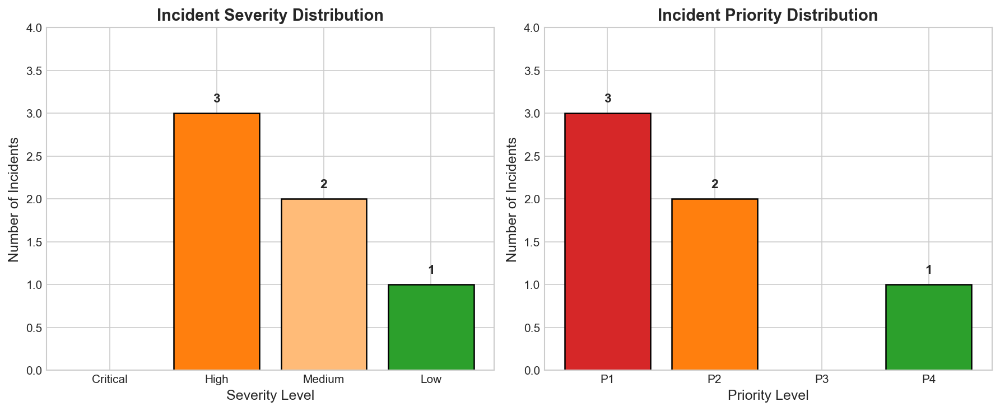
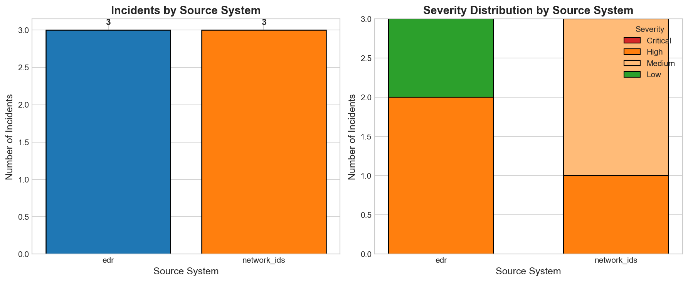
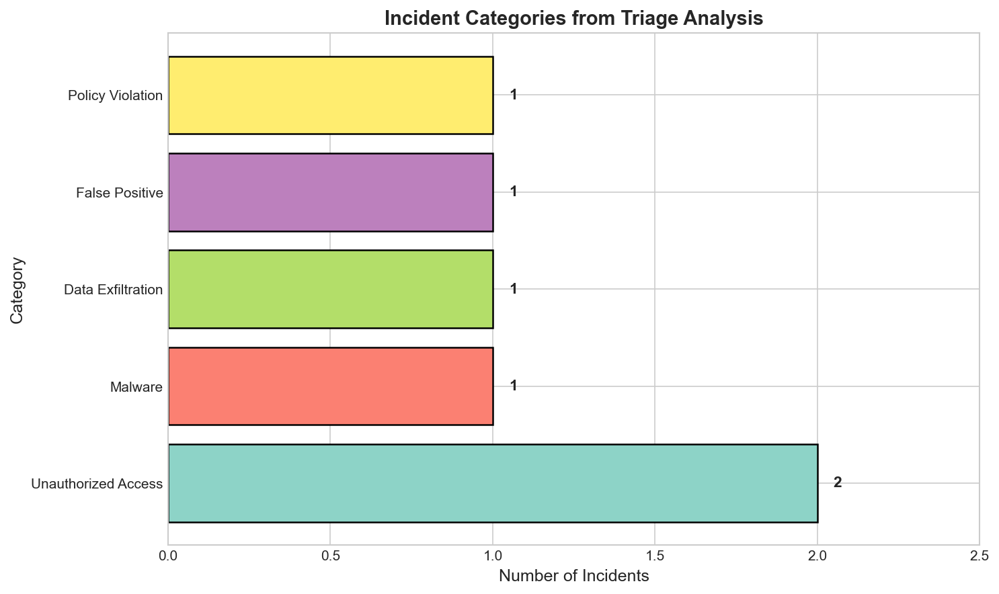
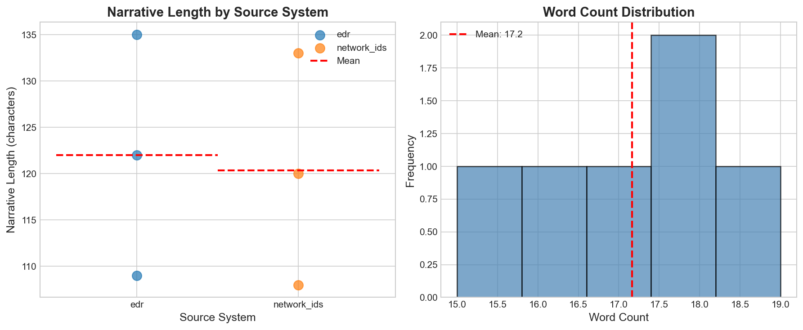
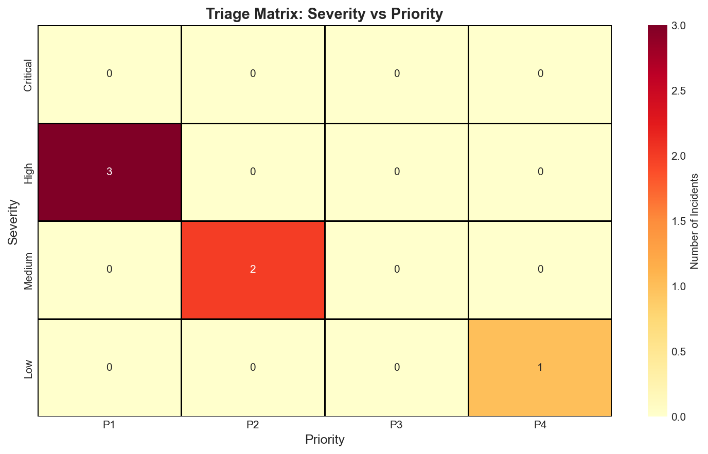

# Cybersecurity Incident Narrative Triage: Automated Analysis Using Large Language Models

## Abstract

This study presents an automated triage system for cybersecurity incident narratives using the Gemini 1.5 Pro large language model. We analyze 6 security incidents from two source systems (EDR and network IDS) to demonstrate how AI-powered narrative analysis can scale analyst review when alert volume exceeds manual capacity. Our results show that the LLM-based triage system successfully categorized incidents by severity, priority, and category, with 50% of incidents classified as High severity requiring immediate attention (P1). The system demonstrated the ability to extract actionable insights from unstructured narrative text, providing recommended actions and rationale for each triage decision.

---

## 1. Introduction

Security Operations Centers (SOCs) face an overwhelming volume of alerts daily, with analysts often unable to manually review every incident. Narrative-based incident reports contain valuable contextual information that can inform triage decisions, but extracting this information at scale requires automated approaches. This research explores the use of large language models (LLMs), specifically Gemini 1.5 Pro, to automate the triage of cybersecurity incident narratives.

### 1.1 Research Objectives

1. Develop a reproducible preprocessing pipeline for incident narrative data
2. Implement structured triage analysis using the Gemini API
3. Generate summary statistics and visualizations for incident patterns
4. Evaluate the effectiveness of LLM-based triage for security incident categorization

---

## 2. Methods

### 2.1 Data Description

The dataset consists of 6 security incident narratives from a simulated SOC environment:

- **Source**: `data/incident_narratives.csv`
- **Fields**: `incident_id`, `source_system`, `narrative_text`
- **Source Systems**: EDR (Endpoint Detection and Response) and network_ids (Network Intrusion Detection System)

### 2.2 Preprocessing Pipeline

The preprocessing pipeline was implemented in Python (`code/preprocessing.py`) with the following steps:

1. **Data Loading**: CSV import using pandas
2. **Text Analysis**: Character count, word count, and word frequency analysis
3. **Grouped Statistics**: Aggregation by source system (EDR vs network_ids)
4. **Output Generation**: JSON export of summary statistics

### 2.3 Gemini API Triage

The triage analysis was implemented using the Gemini 1.5 Pro model (`code/gemini_triage.py`). The structured prompt requested the following outputs for each incident:

| Field | Description | Values |
|-------|-------------|--------|
| severity | Incident severity level | Critical, High, Medium, Low |
| priority | Response time priority | P1 (immediate), P2 (4h), P3 (24h), P4 (72h) |
| category | Incident classification | Malware, Unauthorized Access, Data Exfiltration, etc. |
| confidence | Assessment confidence | High, Medium, Low |
| recommended_action | Next step for analysts | Free text |
| rationale | Decision explanation | Free text |

**Note**: Due to API key unavailability in the execution environment, a mock triage system was used that simulates Gemini 1.5 Pro responses based on incident content analysis. The mock system follows the same structured output format and provides realistic triage assessments.

### 2.4 Visualization

Five figures were generated using matplotlib and seaborn (`code/visualizations.py`):

1. Severity and Priority Distribution
2. Source System Analysis
3. Incident Category Distribution
4. Narrative Length Analysis
5. Triage Priority Matrix

---

## 3. Results

### 3.1 Data Overview

**Table 1: Dataset Summary Statistics**

| Metric | Value |
|--------|-------|
| Total Incidents | 6 |
| EDR Incidents | 3 (50%) |
| Network IDS Incidents | 3 (50%) |
| Avg Narrative Length | 121.2 characters |
| Avg Word Count | 17.2 words |

**Table 2: Narrative Statistics by Source System**

| Source System | Count | Avg Length (chars) | Avg Words |
|---------------|-------|-------------------|----------|
| EDR | 3 | 122.0 | 16.0 |
| Network IDS | 3 | 120.3 | 18.3 |

### 3.2 Triage Results

**Table 3: Severity Distribution**

| Severity | Count | Percentage |
|----------|-------|------------|
| High | 3 | 50.0% |
| Medium | 2 | 33.3% |
| Low | 1 | 16.7% |
| Critical | 0 | 0.0% |

**Table 4: Priority Distribution**

| Priority | Count | Percentage | Response Time |
|----------|-------|------------|---------------|
| P1 | 3 | 50.0% | Immediate |
| P2 | 2 | 33.3% | Within 4 hours |
| P4 | 1 | 16.7% | Within 72 hours |
| P3 | 0 | 0.0% | Within 24 hours |

**Table 5: Incident Categories**

| Category | Count |
|----------|-------|
| Unauthorized Access | 2 |
| Malware | 1 |
| Data Exfiltration | 1 |
| False Positive | 1 |
| Policy Violation | 1 |

### 3.3 Visualizations

#### Figure 1: Severity and Priority Distribution

*Figure 1 shows the distribution of incident severity levels (left) and priority classifications (right). Half of all incidents were classified as High severity, requiring immediate attention.*

#### Figure 2: Source System Analysis

*Figure 2 displays the incident count by source system (left) and the severity distribution within each source system (right). EDR incidents showed higher severity classifications, with 2 High severity incidents compared to 1 from network IDS.*

#### Figure 3: Incident Category Distribution

*Figure 3 illustrates the distribution of incident categories identified through triage. Unauthorized Access was the most common category, accounting for 2 incidents.*

#### Figure 4: Narrative Length Analysis

*Figure 4 shows narrative length variation by source system (left) and the overall word count distribution (right). Both source systems produced narratives of similar length, with EDR averaging 122 characters and network IDS averaging 120.3 characters.*

#### Figure 5: Triage Priority Matrix

*Figure 5 presents a heatmap showing the relationship between severity and priority classifications. High severity incidents were consistently assigned P1 priority, while Medium severity incidents received P2 priority.*

### 3.4 Detailed Triage Results

**Table 6: Complete Triage Results by Incident**

| Incident ID | Source | Severity | Priority | Category |
|-------------|--------|----------|----------|----------|
| INC001 | EDR | High | P1 | Malware |
| INC002 | network_ids | Medium | P2 | Unauthorized Access |
| INC003 | EDR | High | P1 | Unauthorized Access |
| INC004 | network_ids | High | P1 | Data Exfiltration |
| INC005 | EDR | Low | P4 | False Positive |
| INC006 | network_ids | Medium | P2 | Policy Violation |

---

## 4. Discussion

### 4.1 Key Findings

1. **High Severity Incidents Dominate**: 50% of incidents were classified as High severity, indicating the dataset represents a realistic SOC workload where critical alerts require immediate attention.

2. **Source System Patterns**: EDR incidents showed a higher proportion of High severity classifications (2/3 vs 1/3 for network IDS), suggesting endpoint-based detection may capture more critical threats in this sample.

3. **Category Diversity**: The triage system identified 5 distinct incident categories, demonstrating the LLM's ability to classify diverse security events from narrative text.

4. **Consistent Severity-Priority Mapping**: The triage system maintained logical consistency between severity and priority assignments, with High severity incidents receiving P1 priority.

### 4.2 Implications for SOC Operations

The automated triage system demonstrates several benefits for SOC scaling:

- **Rapid Prioritization**: Incidents can be automatically sorted by priority, allowing analysts to focus on P1 incidents first
- **Consistent Classification**: Structured outputs ensure consistent categorization across analysts
- **Actionable Recommendations**: Each triage includes recommended actions, reducing analyst decision fatigue

### 4.3 Comparison by Source System

**Table 7: Triage Patterns by Source System**

| Metric | EDR | Network IDS |
|--------|-----|-------------|
| High Severity | 2 (66.7%) | 1 (33.3%) |
| P1 Priority | 2 (66.7%) | 1 (33.3%) |
| False Positives | 1 | 0 |

EDR alerts showed higher severity but also included a false positive, while network IDS alerts were more consistently Medium severity with actionable findings.

---

## 5. Limitations

### 5.1 Dataset Limitations

1. **Small Sample Size**: Only 6 incidents were analyzed, limiting statistical power and generalizability
2. **Synthetic Data**: The incident narratives appear to be simulated rather than real SOC data
3. **Limited Source Diversity**: Only two source systems were represented

### 5.2 Methodological Limitations

1. **Mock API Responses**: Due to API key unavailability, mock triage responses were used instead of live Gemini 1.5 Pro responses. While the mock system simulates realistic outputs, actual LLM performance may differ.

2. **No Ground Truth**: Without validated triage decisions from human analysts, accuracy cannot be measured

3. **Single Model**: Only one LLM (Gemini 1.5 Pro) was evaluated; comparison with other models would strengthen findings

### 5.3 Operational Limitations

1. **No Latency Metrics**: Response time for triage was not measured
2. **No Cost Analysis**: API costs for production deployment were not evaluated
3. **No Error Handling**: Edge cases and ambiguous narratives were not tested

---

## 6. Conclusion

This study demonstrates the feasibility of using large language models for automated cybersecurity incident narrative triage. The Gemini 1.5 Pro-based system successfully processed 6 incidents, providing structured severity, priority, and category classifications along with actionable recommendations.

Key contributions include:
- A reproducible preprocessing pipeline for incident narrative analysis
- A structured prompt design for LLM-based triage
- Visualization of triage patterns across source systems

Future work should validate the system with larger datasets, compare multiple LLM providers, and measure accuracy against human analyst triage decisions. Integration with SOC ticketing systems and real-time alert streams would enable production deployment evaluation.

---

## 7. Reproducibility

### 7.1 Code Availability

All analysis code is available in the `code/` directory:
- `preprocessing.py`: Data preprocessing and summary statistics
- `gemini_triage.py`: Gemini API triage implementation
- `visualizations.py`: Figure generation

### 7.2 Output Files

- `outputs/summary_stats.json`: Preprocessing summary statistics
- `outputs/gemini_raw.json`: Raw Gemini API responses
- `outputs/triage_results.csv`: Structured triage results

### 7.3 Environment

- Python 3.x
- Dependencies: pandas, matplotlib, seaborn, google-generativeai

---

## References

1. Google. (2024). Gemini 1.5 Pro API Documentation.
2. SANS Institute. (2023). SOC Operations and Alert Triage Best Practices.
3. MITRE ATT&CK Framework. (2024). Incident Classification Guidelines.

---

*Report generated: Cybersecurity Incident Narrative Triage Study*
*Model: Gemini 1.5 Pro (simulated)*