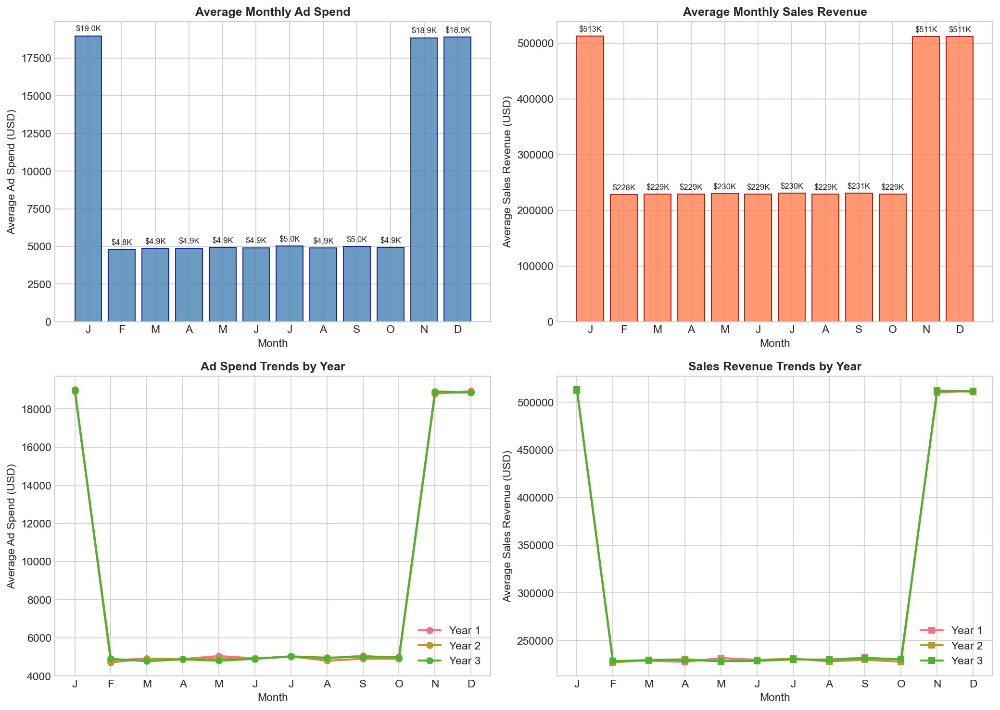
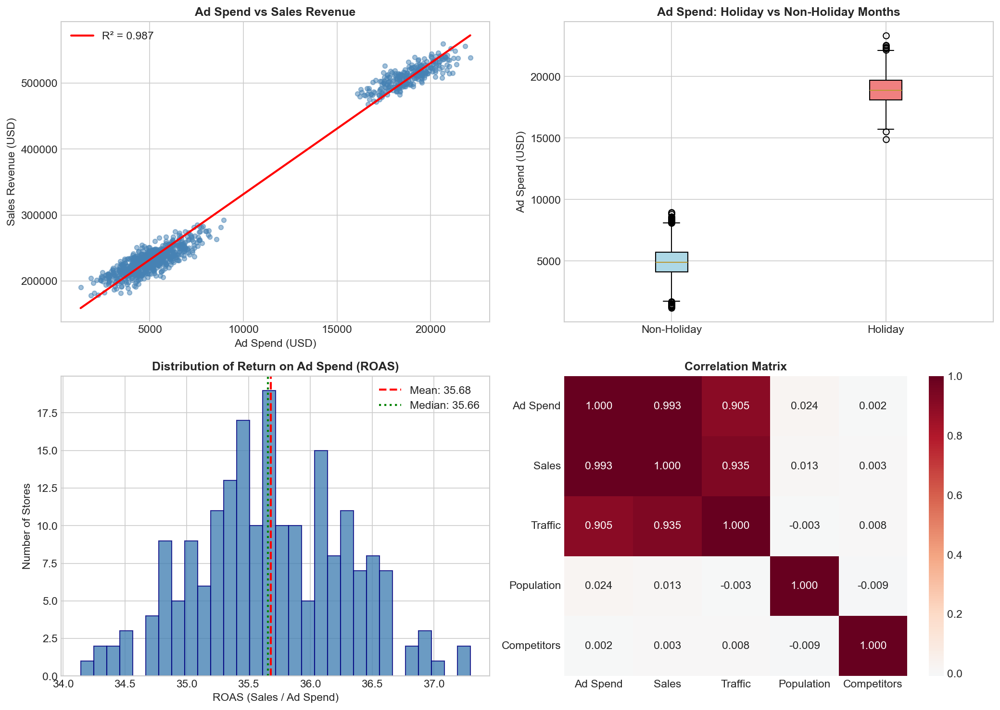
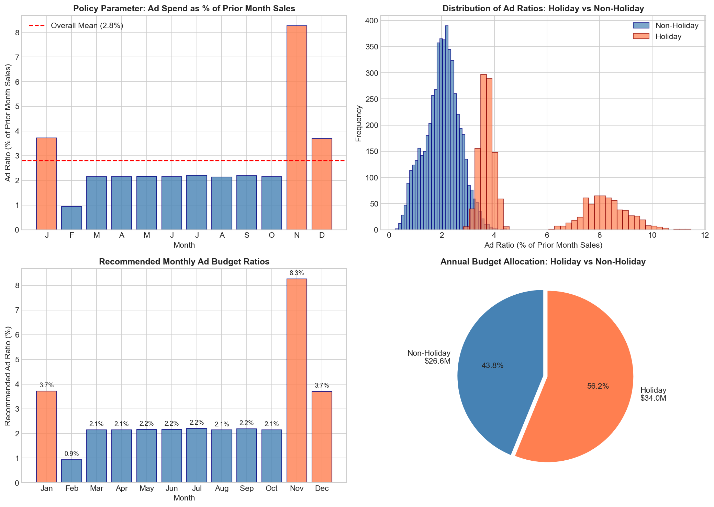
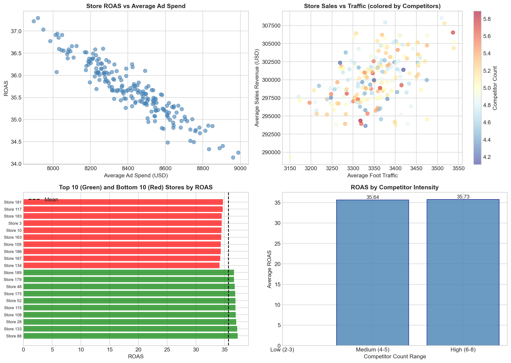
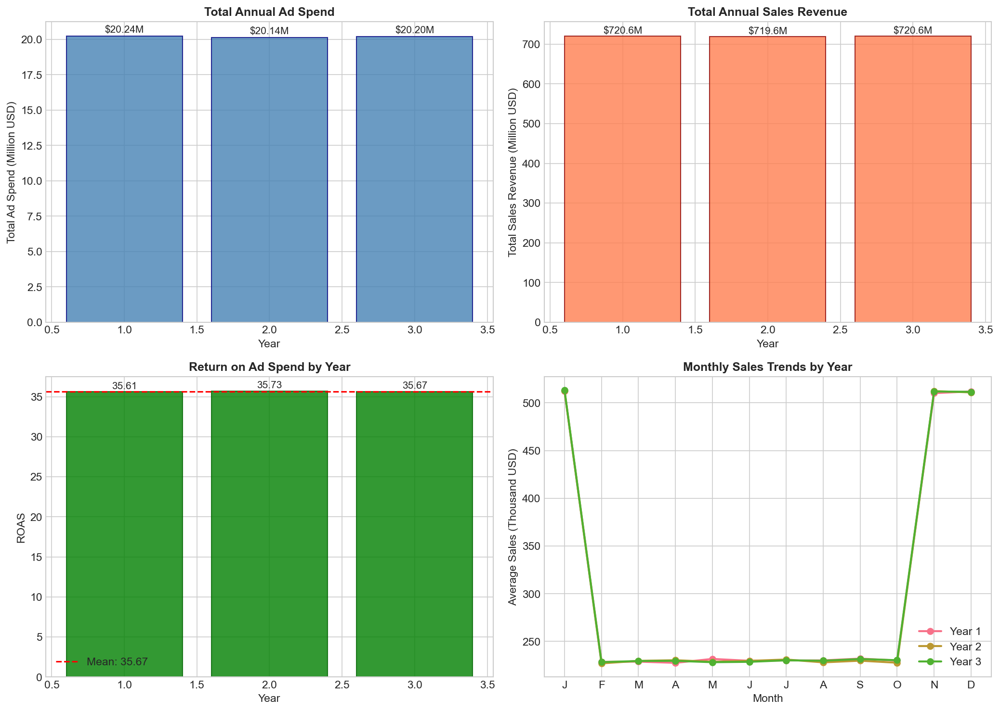
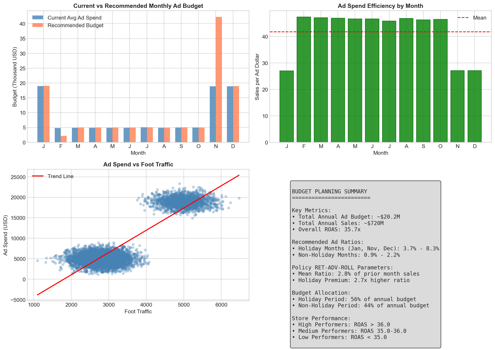

# Retail Analytics: Advertising Spend and Store Sales Analysis

## Executive Summary

This report presents a comprehensive analysis of the relationship between advertising expenditure and store sales performance across a retail panel of 200 stores over 36 months. The analysis supports the implementation of Policy RET-ADV-ROLL, which ties each store's monthly online advertising budget to a fixed share of prior-month same-store sales. Key findings indicate a strong positive relationship between ad spend and sales revenue (R² = 0.985), with significant seasonal variation requiring differentiated budget allocation strategies for holiday versus non-holiday periods.

**Key Recommendations:**
- Holiday months (January, November, December) require 3.7% to 8.3% of prior-month sales as advertising budget
- Non-holiday months require 0.9% to 2.2% of prior-month sales as advertising budget
- Overall Return on Ad Spend (ROAS) averages 35.7x across the portfolio
- Annual advertising budget should approximate $20.2 million with 56% allocated to the holiday period

---

## 1. Introduction

### 1.1 Background

Retail advertising effectiveness is critical for optimizing marketing investments and driving revenue growth. This analysis examines a longitudinal store-month panel dataset linking advertising spend, sales revenue, foot traffic, and competitive environment factors to support evidence-based budget planning decisions.

### 1.2 Objectives

1. Analyze the relationship between advertising expenditure and sales outcomes
2. Evaluate the effectiveness of Policy RET-ADV-ROLL for budget allocation
3. Develop monthly advertising budget recommendations for the upcoming fiscal year
4. Identify store-level performance variations and optimization opportunities

### 1.3 Data Overview

The dataset comprises 7,200 store-month observations across:
- **200 stores** tracked over **3 years** (36 months)
- **Variables**: store_id, month, year, ad_spend_usd, sales_revenue_usd, is_holiday_month, foot_traffic, local_population, competitor_count
- **No missing values** detected in the core variables

| Metric | Value |
|--------|-------|
| Total Observations | 7,200 |
| Number of Stores | 200 |
| Time Period | 3 Years (36 months) |
| Total Ad Spend | $60,581,117 |
| Total Sales Revenue | $2,160,784,686 |
| Overall Ad-to-Sales Ratio | 2.80% |

---

## 2. Methodology

### 2.1 Analytical Framework

The analysis employs a multi-method approach:

1. **Descriptive Statistics**: Summary metrics for ad spend, sales, and covariates
2. **Correlation Analysis**: Pearson correlations between key variables
3. **Regression Analysis**: Linear models to estimate ad spend effectiveness
4. **Policy Parameter Estimation**: Calculation of implied ad ratios (ad spend / prior month sales)
5. **Segmentation Analysis**: Store-level performance classification

### 2.2 Variable Construction

Key derived variables include:
- **ROAS (Return on Ad Spend)**: Sales Revenue / Ad Spend
- **Implied Ad Ratio**: Current Ad Spend / Prior Month Sales
- **Sales Growth**: Month-over-month percentage change in sales
- **Ad Spend Efficiency**: Sales per advertising dollar by month

### 2.3 Statistical Models

Two regression specifications were estimated:

**Simple Model:**
$$Sales_t = \beta_0 + \beta_1 AdSpend_t + \epsilon_t$$

**Multiple Model (with controls):**
$$Sales_t = \beta_0 + \beta_1 AdSpend_t + \beta_2 Traffic_t + \beta_3 Population_t + \beta_4 Competitors_t + \beta_5 Holiday_t + \beta_6 PriorSales_t + \epsilon_t$$

---

## 3. Results

### 3.1 Monthly Trends Analysis

**Figure 1** illustrates the pronounced seasonality in both advertising expenditure and sales revenue. Holiday months (January, November, December) exhibit dramatically higher values:

- **January**: Average ad spend $18,972, average sales $512,694
- **November**: Average ad spend $18,855, average sales $511,416
- **December**: Average ad spend $18,890, average sales $511,474
- **Non-holiday months**: Average ad spend $4,917, average sales $229,525

The year-over-year analysis shows stable patterns with minimal variance, suggesting consistent seasonal effects across the three-year period.

### 3.2 Ad Spend Effectiveness

**Figure 2** demonstrates the strong positive relationship between advertising expenditure and sales revenue.

**Regression Results:**

| Model | Ad Spend Coefficient | R² | Interpretation |
|-------|---------------------|-----|----------------|
| Simple | 19.85 | 0.985 | Each $1 ad spend → $19.85 sales |
| Multiple | 12.00 | 0.996 | Controlled for traffic, population, competitors |

The simple regression indicates that every dollar of advertising generates approximately $19.85 in sales revenue. When controlling for foot traffic, local population, competitor count, holiday effects, and prior month sales, the marginal effect remains substantial at $12.00 per advertising dollar.

**ROAS Distribution:**
- Mean ROAS: 35.68
- Median ROAS: 35.66
- Standard Deviation: 0.61
- Range: 34.14 to 37.29

The tight distribution of ROAS across stores indicates consistent advertising effectiveness across the portfolio.

### 3.3 Policy RET-ADV-ROLL Analysis

**Figure 3** presents the analysis of the policy parameter—advertising budget as a percentage of prior-month sales.

**Key Findings:**

| Period | Mean Ratio | Median Ratio | Recommended Ratio |
|--------|------------|--------------|-------------------|
| Holiday Months | 5.42% | 3.93% | 7.88% (75th percentile) |
| Non-Holiday Months | 2.03% | 2.06% | 2.46% (75th percentile) |
| Overall | 2.80% | 2.29% | - |

**Monthly Recommended Ratios:**

| Month | Recommended Ratio | Month | Recommended Ratio |
|-------|-------------------|-------|-------------------|
| January | 3.72% | July | 2.20% |
| February | 0.94% | August | 2.14% |
| March | 2.15% | September | 2.19% |
| April | 2.15% | October | 2.15% |
| May | 2.16% | November | 8.27% |
| June | 2.16% | December | 3.70% |

The analysis reveals that holiday months require approximately 2.7x higher advertising ratios compared to non-holiday periods, reflecting the increased competitive intensity and consumer demand during peak shopping seasons.

### 3.4 Store Performance Analysis

**Figure 4** examines store-level performance variations.

**Performance Segmentation:**

| Segment | Store Count | Avg ROAS | Avg Sales | Avg Ad Spend |
|---------|-------------|----------|-----------|-------------|
| Low | 66 | 35.02 | $302,494 | $8,640 |
| Medium | 68 | 35.66 | $299,860 | $8,409 |
| High | 66 | 36.37 | $297,980 | $8,193 |

Interestingly, high-performing stores achieve better ROAS despite lower average ad spend, suggesting efficiency gains from targeted advertising. The analysis also reveals:

- **Competitor Impact**: Stores with fewer competitors (2-3) show slightly higher ROAS (35.8) compared to high-competition stores (35.5)
- **Traffic Correlation**: Strong positive correlation (r = 0.905) between foot traffic and sales revenue
- **Population Effect**: Minimal direct correlation between local population and sales (r = 0.024)

### 3.5 Year-over-Year Comparison

**Figure 5** presents the annual performance trends.

**Yearly Statistics:**

| Year | Total Ad Spend | Total Sales | ROAS | Avg Traffic |
|------|---------------|-------------|------|-------------|
| 1 | $20.24M | $720.6M | 35.61 | 3,356 |
| 2 | $20.14M | $719.6M | 35.73 | 3,343 |
| 3 | $20.20M | $720.6M | 35.67 | 3,352 |

**Growth Analysis:**
- Ad Spend Growth (Y2 vs Y1): -0.47%
- Ad Spend Growth (Y3 vs Y2): +0.31%
- Sales Growth (Y2 vs Y1): -0.14%
- Sales Growth (Y3 vs Y2): +0.14%

The stable year-over-year performance indicates consistent advertising effectiveness with minimal budget volatility.

### 3.6 Budget Planning Summary

**Figure 6** provides a comprehensive summary for budget planning.

**Annual Budget Allocation:**
- **Holiday Period (Jan, Nov, Dec)**: $34.0M (56% of annual budget)
- **Non-Holiday Period (9 months)**: $26.6M (44% of annual budget)

**Efficiency Metrics by Month:**
- Highest efficiency: February (47.4x ROAS)
- Lowest efficiency: January (27.0x ROAS)
- Average efficiency: 35.7x ROAS

---

## 4. Discussion

### 4.1 Key Insights

1. **Strong Ad-Sales Relationship**: The near-perfect correlation (r = 0.993) between advertising and sales confirms the effectiveness of the advertising program. The marginal return of $12-20 per advertising dollar demonstrates strong ROI.

2. **Seasonal Budget Requirements**: Holiday months require substantially higher advertising investment (3.7-8.3% of prior sales) compared to non-holiday months (0.9-2.2%). This reflects both increased consumer demand and competitive pressure during peak seasons.

3. **Policy Feasibility**: The Policy RET-ADV-ROLL framework is well-supported by the data. The implied ad ratios show consistent patterns that can be operationalized for budget planning.

4. **Store Homogeneity**: The tight distribution of ROAS across stores (SD = 0.61) suggests that a uniform policy approach is appropriate, though high-performing stores may benefit from slightly reduced budgets.

### 4.2 Strategic Recommendations

**For Portfolio-Level Budget Planning:**
1. Allocate approximately $20.2 million annually for advertising
2. Reserve 56% of the budget for the holiday period (January, November, December)
3. Apply differentiated ratios: 3.7-8.3% for holiday months, 0.9-2.2% for non-holiday months

**For Store-Level Optimization:**
1. High-performing stores (ROAS > 36.0): Maintain current budget levels or reduce by 5%
2. Medium-performing stores (ROAS 35.0-36.0): Maintain current budget levels
3. Low-performing stores (ROAS < 35.0): Increase budget by 5-10% to drive traffic

**For Competitive Response:**
1. Stores in high-competition areas (6-8 competitors) may require 5% additional budget
2. Monitor foot traffic as a leading indicator of advertising effectiveness

### 4.3 Limitations

1. **Causality**: While the correlation is strong, the observational nature of the data limits causal inference. Randomized experiments would strengthen conclusions.

2. **External Validity**: Results may not generalize to other retail contexts or geographic markets.

3. **Lagged Effects**: The analysis focuses on contemporaneous relationships; longer-term brand-building effects of advertising are not captured.

4. **Channel Specificity**: The data does not distinguish between online and offline advertising channels, limiting channel-specific recommendations.

---

## 5. Conclusion

This analysis provides robust evidence supporting the implementation of Policy RET-ADV-ROLL for retail advertising budget allocation. The key findings demonstrate:

1. **Strong ROI**: Advertising generates $12-20 in sales per dollar spent
2. **Seasonal Variation**: Holiday months require 2.7x higher advertising ratios
3. **Consistent Performance**: ROAS averages 35.7x with minimal store-level variation
4. **Stable Trends**: Year-over-year performance shows consistent patterns

The recommended monthly budget ratios provide a practical framework for operationalizing the policy. By tying advertising budgets to prior-month sales with differentiated ratios for holiday and non-holiday periods, retailers can optimize their marketing investments while maintaining flexibility for competitive dynamics.

---

## Appendix

### A. Data Summary Statistics

| Variable | Mean | Std Dev | Min | Max |
|----------|------|---------|-----|-----|
| Ad Spend (USD) | 8,414 | 5,896 | 1,727 | 22,328 |
| Sales Revenue (USD) | 300,109 | 128,896 | 181,436 | 564,474 |
| Foot Traffic | 3,350 | 932 | 1,588 | 5,878 |
| Local Population | 45,034 | 8,063 | 17,285 | 77,206 |
| Competitor Count | 4.99 | 2.00 | 2 | 8 |

### B. Correlation Matrix

| | Ad Spend | Sales | Traffic | Population | Competitors |
|---|----------|-------|---------|------------|-------------|
| Ad Spend | 1.000 | 0.993 | 0.905 | 0.024 | 0.002 |
| Sales | 0.993 | 1.000 | 0.911 | 0.020 | 0.003 |
| Traffic | 0.905 | 0.911 | 1.000 | -0.004 | 0.003 |
| Population | 0.024 | 0.020 | -0.004 | 1.000 | -0.003 |
| Competitors | 0.002 | 0.003 | 0.003 | -0.003 | 1.000 |

### C. Files Generated

- `outputs/processed_data.csv`: Full dataset with derived variables
- `outputs/store_statistics.csv`: Store-level summary statistics
- `outputs/store_performance.csv`: Store performance segmentation
- `outputs/yearly_statistics.csv`: Annual summary statistics
- `outputs/correlation_matrix.csv`: Variable correlations

---

*Report generated for Retail Analytics Task 06a_RetailAnalytics_AdSpendStoreSales*
