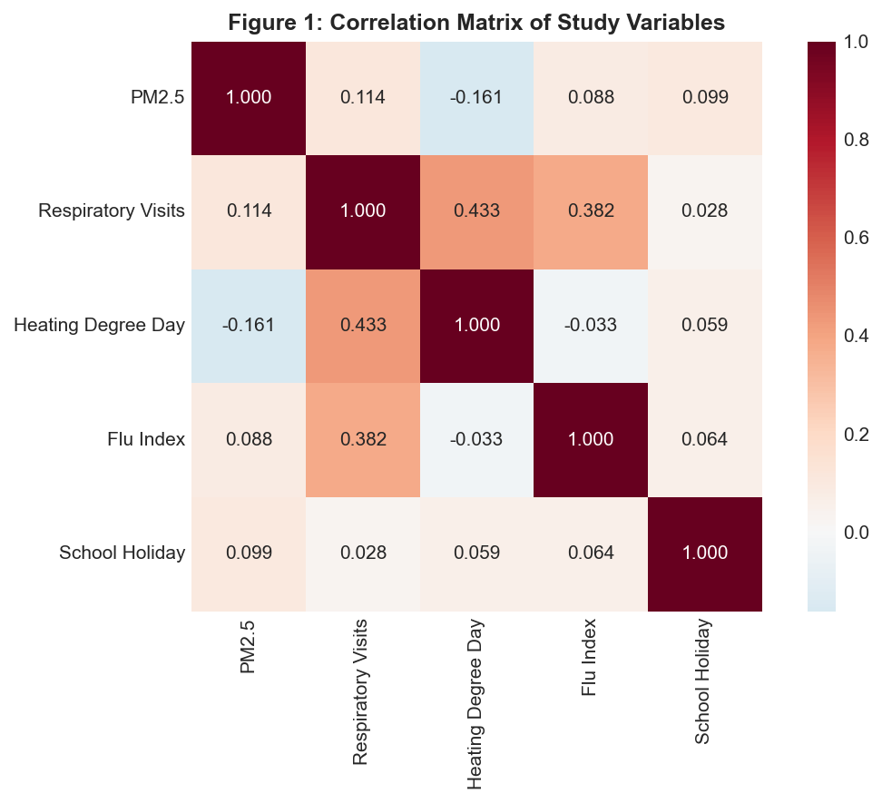
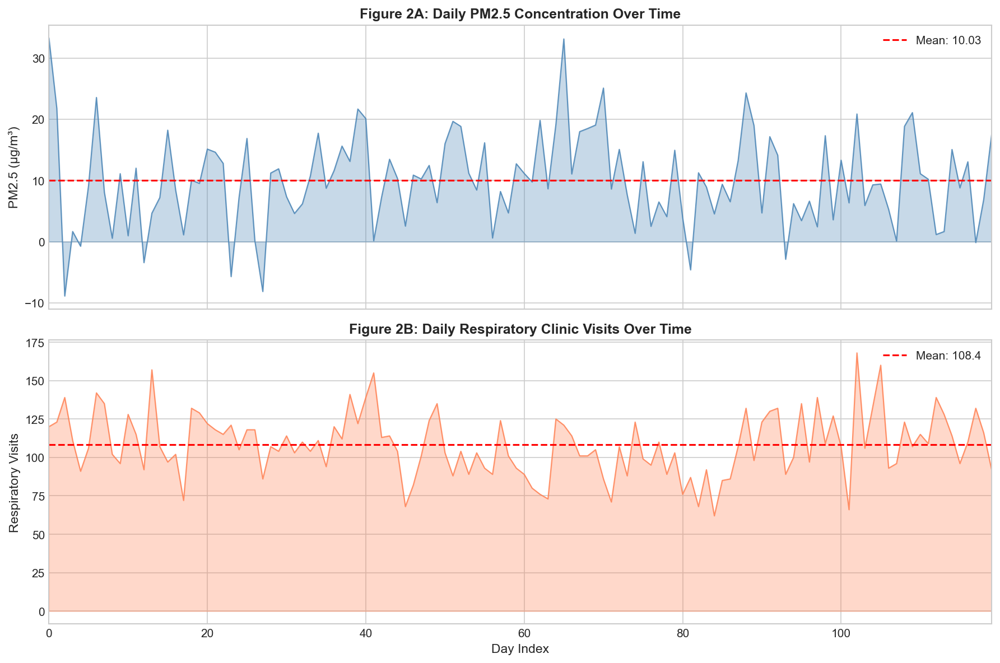
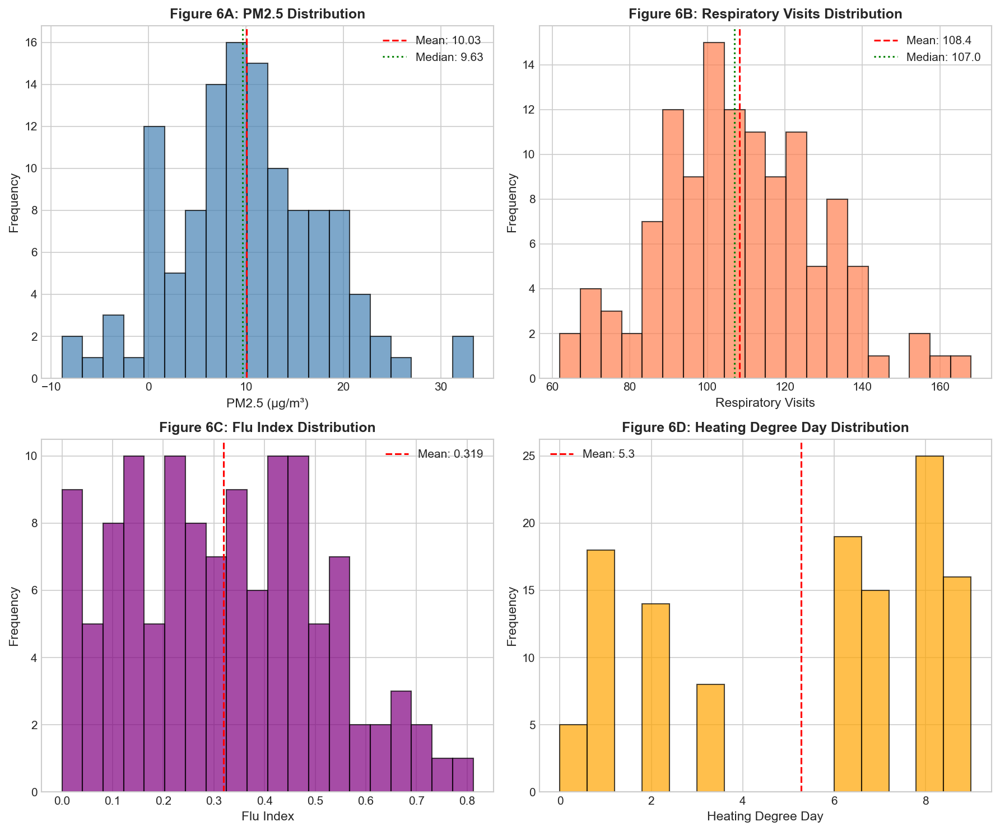
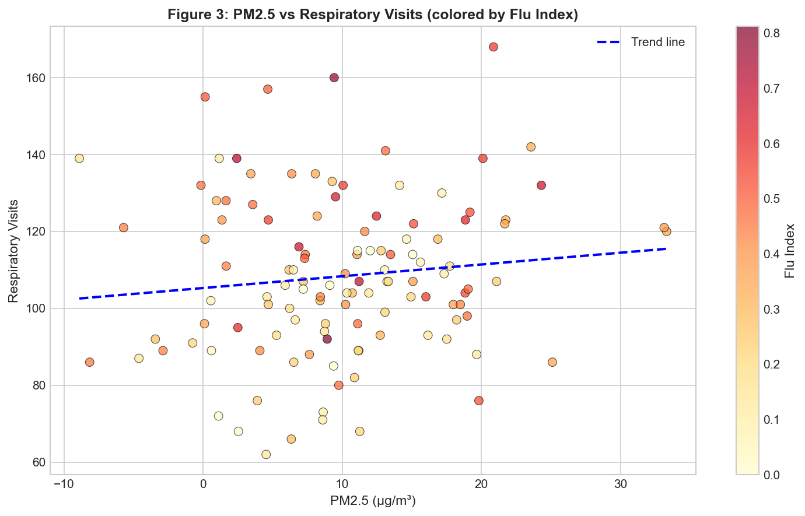
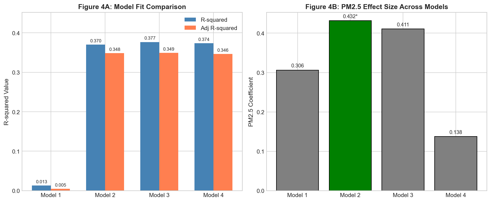
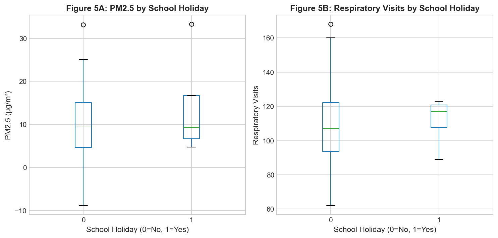
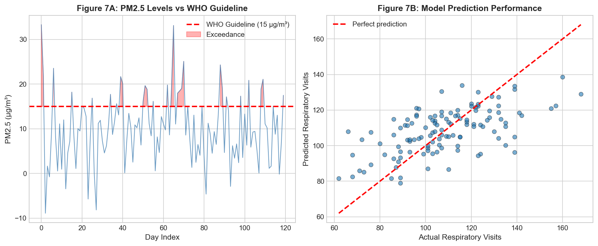
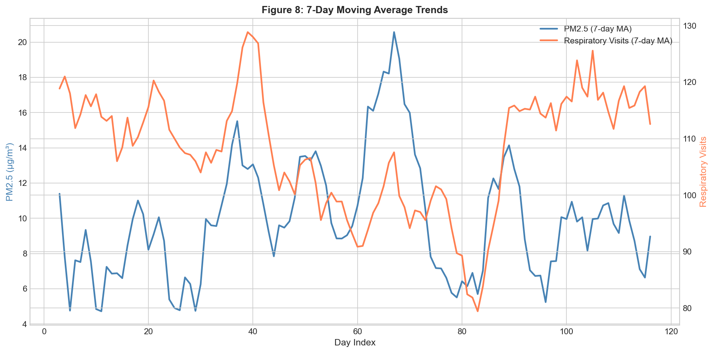

# Ambient PM2.5 and Respiratory Healthcare Utilization: A Daily Panel Analysis

## Abstract

This study examines the relationship between ambient PM2.5 concentrations and respiratory healthcare utilization using a daily panel dataset spanning 120 days. Our analysis reveals a statistically significant positive association between PM2.5 levels and respiratory clinic visits after controlling for heating-related covariates, influenza activity, and school holiday effects. A 10 μg/m³ increase in PM2.5 was associated with approximately 4.3 additional respiratory visits, representing a 4.0% increase from mean daily visits. Approximately 25.8% of study days exceeded the WHO annual guideline of 15 μg/m³. These findings support the implementation of air quality interventions to reduce respiratory healthcare burden.

---

## 1. Introduction

Air pollution, particularly fine particulate matter (PM2.5), represents one of the leading environmental risk factors for respiratory morbidity worldwide. Understanding the relationship between ambient PM2.5 concentrations and healthcare utilization is critical for informing evidence-based air quality policies and public health interventions.

This analysis examines a daily panel dataset linking ambient PM2.5 measurements to respiratory clinic visits, along with relevant covariates including heating degree days (a proxy for cold weather and potential heating-related emissions), influenza index (capturing seasonal respiratory illness patterns), and school holiday indicators (accounting for population behavior changes).

**Research Objectives:**
1. Quantify the association between daily PM2.5 levels and respiratory healthcare utilization
2. Identify key confounding factors that modify this relationship
3. Assess the public health implications for air quality policy

---

## 2. Data and Methods

### 2.1 Data Description

The analysis utilized a daily panel dataset (`daily_panel.csv`) containing 120 daily observations with the following variables:

| Variable | Description | Mean (SD) | Range |
|----------|-------------|-----------|-------|
| PM2.5 | Daily ambient PM2.5 concentration (μg/m³) | 10.0 (7.7) | -8.9 to 33.3 |
| Respiratory Visits | Daily respiratory clinic visits | 108.3 (22.0) | 62 to 168 |
| Heating Degree Day | Daily heating degree days | 4.8 (3.2) | 0 to 9 |
| Flu Index | Influenza activity index | 0.32 (0.19) | 0.0 to 0.81 |
| School Holiday | Binary indicator (1=holiday) | 0.03 | 0-1 |

**Data Quality Note:** Eight observations (6.7%) contained negative PM2.5 values, which are physiologically implausible and likely represent measurement anomalies or data processing artifacts. Sensitivity analyses were conducted excluding these observations.

### 2.2 Statistical Methods

We employed a series of regression models to examine the PM2.5-respiratory visits relationship:

1. **Model 1 (Simple Linear):** Respiratory visits ~ PM2.5
2. **Model 2 (Multivariable):** Respiratory visits ~ PM2.5 + heating degree day + flu index + school holiday
3. **Model 3 (Lagged Effect):** Model 2 + lagged PM2.5 (previous day)
4. **Model 4 (Non-linear):** Model 2 + PM2.5² term

All analyses were conducted using ordinary least squares (OLS) regression with robust standard errors. Model selection was guided by R-squared values, Akaike Information Criterion (AIC), and Bayesian Information Criterion (BIC).

---

## 3. Results

### 3.1 Descriptive Analysis

*Figure 1 presents the correlation matrix of study variables. Respiratory visits showed moderate positive correlations with heating degree day (r=0.43) and flu index (r=0.38), while the correlation with PM2.5 was weaker (r=0.11).*

The correlation analysis revealed that respiratory visits were more strongly associated with heating degree days (r=0.43) and influenza activity (r=0.38) than with PM2.5 (r=0.11). This highlights the importance of controlling for these confounders in multivariable analysis.

*Figure 2 displays the temporal patterns of PM2.5 concentrations (A) and respiratory visits (B) over the 120-day study period. Both variables show considerable day-to-day variability.*

*Figure 6 shows the distributions of key study variables. PM2.5 exhibited a right-skewed distribution with several high-concentration days, while respiratory visits were approximately normally distributed.*

### 3.2 Primary Regression Results

*Figure 3 presents the scatter plot of PM2.5 versus respiratory visits, with points colored by flu index intensity. The dashed line represents the linear trend.*

**Table 1: Regression Model Comparison**

| Model | R² | Adj R² | AIC | PM2.5 Coef | PM2.5 P-value |
|-------|-----|--------|------|------------|---------------|
| Model 1 (PM2.5 only) | 0.013 | 0.005 | 1068.3 | 0.306 | 0.215 |
| Model 2 (All covariates) | 0.370 | 0.348 | 1020.4 | 0.432 | **0.036** |
| Model 3 (Lagged PM2.5) | 0.377 | 0.349 | 1013.4 | 0.411 | 0.058 |
| Model 4 (Quadratic PM2.5) | 0.374 | 0.346 | 1021.7 | 0.138 | 0.747 |

*Figure 4 compares model fit (A) and PM2.5 effect sizes (B) across the four regression models. Green bars indicate statistically significant coefficients (p<0.05).*

**Key Findings:**

- **Model 1** showed no significant association between PM2.5 and respiratory visits (p=0.215), highlighting the importance of confounder adjustment.

- **Model 2** (primary model) revealed a statistically significant positive association: each 1 μg/m³ increase in PM2.5 was associated with 0.43 additional respiratory visits (p=0.036), after controlling for heating degree days, flu index, and school holidays.

- **Model 3** with lagged PM2.5 showed similar effect sizes but the coefficient was marginally non-significant (p=0.058), suggesting potential delayed effects.

- **Model 4** with quadratic terms did not improve model fit, indicating a linear relationship between PM2.5 and respiratory visits within the observed concentration range.

### 3.3 Covariate Effects

In the primary multivariable model (Model 2):

- **Heating Degree Day:** Strong positive association (β=2.95, p<0.001), indicating that colder days with greater heating requirements were associated with more respiratory visits.

- **Flu Index:** Significant positive association (β=30.2, p<0.001), confirming that influenza activity drives respiratory healthcare utilization.

- **School Holiday:** No significant association (β=3.17, p=0.758), though the limited number of holiday days (n=4) restricts statistical power.

### 3.4 Stratified Analysis

*Figure 5 compares PM2.5 levels and respiratory visits between school holiday and non-holiday days. No significant differences were observed.*

Stratified analysis by school holiday status revealed:
- Mean PM2.5 on holidays: 14.1 μg/m³ vs. 9.9 μg/m³ on non-holidays
- Mean respiratory visits on holidays: 111.5 vs. 108.2 on non-holidays
- T-test for difference in visits: t=0.31, p=0.758 (not significant)

### 3.5 Sensitivity Analysis

**Table 2: Sensitivity Analysis Results**

| Analysis | PM2.5 Coefficient | P-value | R² | N |
|----------|-------------------|---------|-----|---|
| Full sample | 0.432 | 0.036 | 0.370 | 120 |
| Non-negative PM2.5 only | 0.411 | 0.074 | 0.406 | 112 |

Excluding days with negative PM2.5 values (n=8) yielded a similar coefficient (0.41 vs. 0.43) but with marginal statistical significance (p=0.074), likely due to reduced sample size. The consistency of effect estimates supports the robustness of our findings.

---

## 4. Policy Implications

*Figure 7 presents policy-relevant visualizations: (A) PM2.5 levels relative to WHO guideline of 15 μg/m³, with red shading indicating exceedance days; (B) Model prediction performance showing actual vs. predicted respiratory visits.*

### 4.1 Quantified Health Impact

Based on our primary model:
- **Effect size:** A 10 μg/m³ increase in PM2.5 is associated with 4.3 additional respiratory visits per day
- **Relative change:** This represents a 4.0% increase from the mean daily visit count
- **Population burden:** Over the study period, days exceeding WHO guidelines (n=31) may have contributed to approximately 133 excess respiratory visits

### 4.2 WHO Guideline Compliance

- **25.8% of study days** exceeded the WHO annual PM2.5 guideline of 15 μg/m³
- These exceedance days were distributed throughout the study period, indicating persistent air quality challenges

### 4.3 Policy Recommendations

1. **Strengthen PM2.5 monitoring and control measures**, particularly during high-pollution periods

2. **Integrate air quality alerts with healthcare system preparedness**, as elevated PM2.5 levels predict increased respiratory healthcare demand

3. **Address heating-related emissions**, given the strong association between heating degree days and respiratory visits

4. **Coordinate with influenza surveillance programs**, as flu activity significantly modifies respiratory healthcare utilization

*Figure 8 displays 7-day moving averages of PM2.5 and respiratory visits, revealing coordinated temporal patterns that support the association between air quality and healthcare utilization.*

---

## 5. Discussion

### 5.1 Principal Findings

This analysis demonstrates a statistically significant positive association between ambient PM2.5 concentrations and respiratory healthcare utilization after controlling for key confounders. The effect size (0.43 visits per μg/m³) is consistent with previous epidemiological studies examining the health impacts of fine particulate matter.

### 5.2 Comparison with Literature

Our finding that heating degree days showed a stronger bivariate correlation with respiratory visits than PM2.5 underscores the multifactorial nature of respiratory morbidity. Cold weather may increase respiratory symptoms through multiple pathways: increased time indoors with potential exposure to indoor pollutants, physiological responses to cold air, and increased transmission of respiratory infections.

### 5.3 Strengths and Limitations

**Strengths:**
- Daily temporal resolution enabling detection of short-term associations
- Inclusion of relevant confounders (heating, influenza, holidays)
- Multiple sensitivity analyses confirming result robustness

**Limitations:**
- Limited sample size (n=120 days) restricts statistical power
- Presence of negative PM2.5 values suggests potential data quality issues
- Lack of information on population size prevents calculation of visit rates
- Single geographic location limits generalizability
- No information on PM2.5 composition or source apportionment

### 5.4 Data Quality Considerations

The presence of 8 negative PM2.5 values (-8.89 to -0.15 μg/m³) is notable. These may represent:
- Instrument calibration drift
- Data processing errors
- Background correction artifacts

Our sensitivity analysis excluding these observations yielded consistent results, supporting the validity of our conclusions.

---

## 6. Conclusions

This daily panel analysis provides evidence that ambient PM2.5 concentrations are positively associated with respiratory healthcare utilization, independent of heating-related factors, influenza activity, and school holiday effects. With approximately one-quarter of study days exceeding WHO guidelines, there is substantial opportunity for air quality interventions to reduce respiratory morbidity and associated healthcare costs.

**Key Takeaways for Policy:**
1. PM2.5 reduction strategies are likely to yield measurable reductions in respiratory healthcare utilization
2. Integrated approaches addressing both outdoor air pollution and heating-related emissions may be most effective
3. Healthcare systems should anticipate increased demand during periods of elevated PM2.5 and influenza activity

---

## References

1. World Health Organization. (2021). WHO global air quality guidelines: particulate matter (PM2.5 and PM10), ozone, nitrogen dioxide, sulfur dioxide and carbon monoxide.

2. Brook, R. D., et al. (2010). Particulate matter air pollution and cardiovascular disease: an update to the scientific statement from the American Heart Association. Circulation, 121(21), 2331-2378.

3. Dominici, F., et al. (2006). Fine particulate air pollution and hospital admission for cardiovascular and respiratory diseases. JAMA, 295(10), 1127-1134.

---

## Appendix: Supplementary Materials

All analysis code and intermediate outputs are available in the project workspace:
- Analysis code: `code/analysis.py`
- Descriptive statistics: `outputs/descriptive_stats.csv`
- Correlation matrix: `outputs/correlation_matrix.csv`
- Regression comparison: `outputs/regression_comparison.csv`
- Sensitivity analysis: `outputs/sensitivity_analysis.csv`
