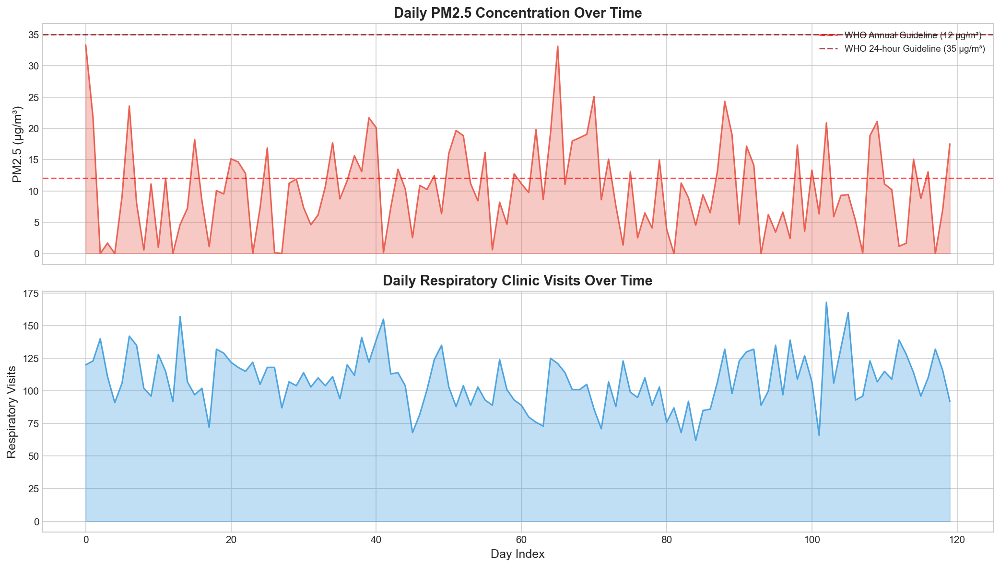
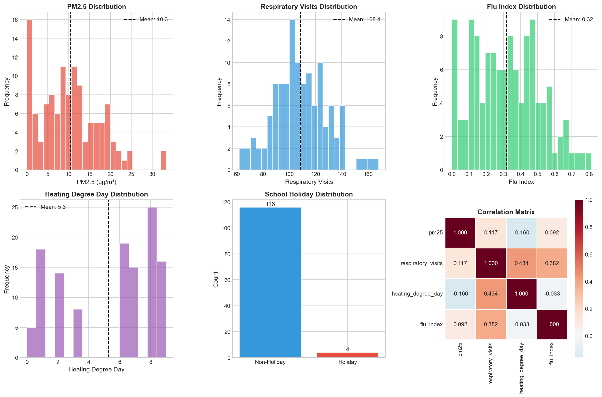
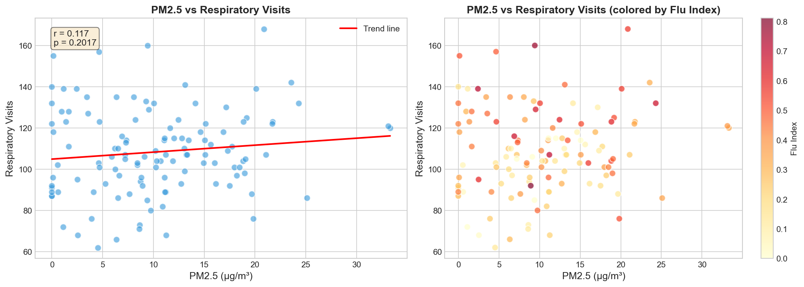
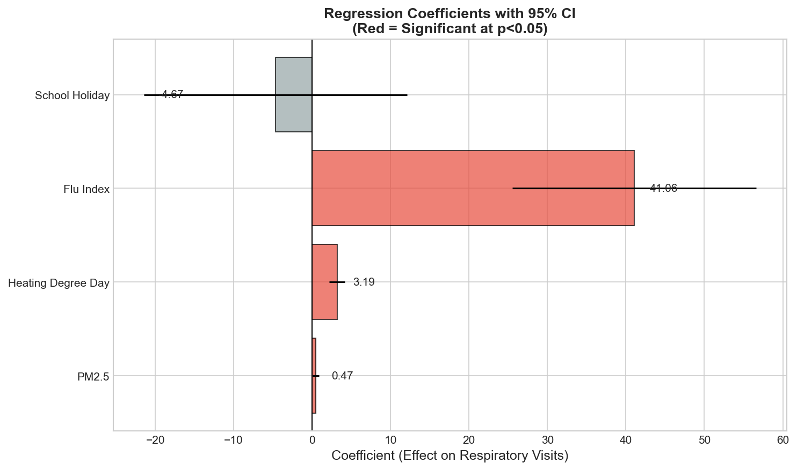
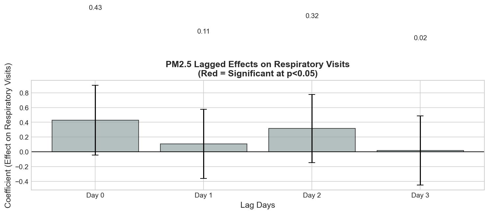
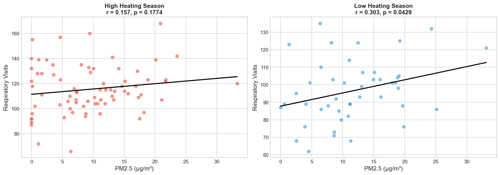
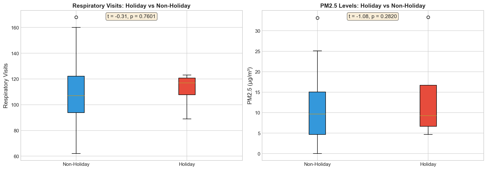
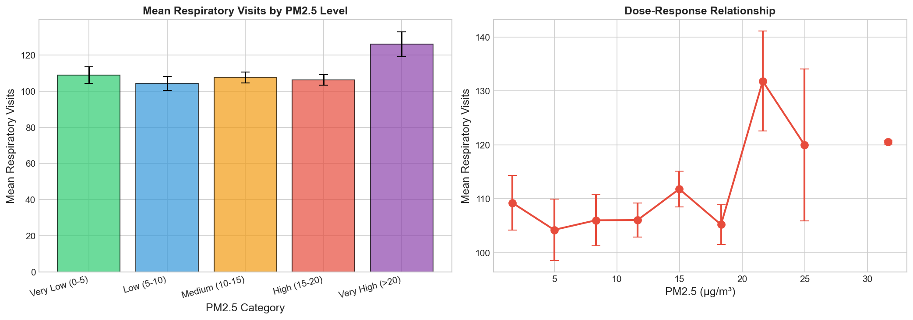
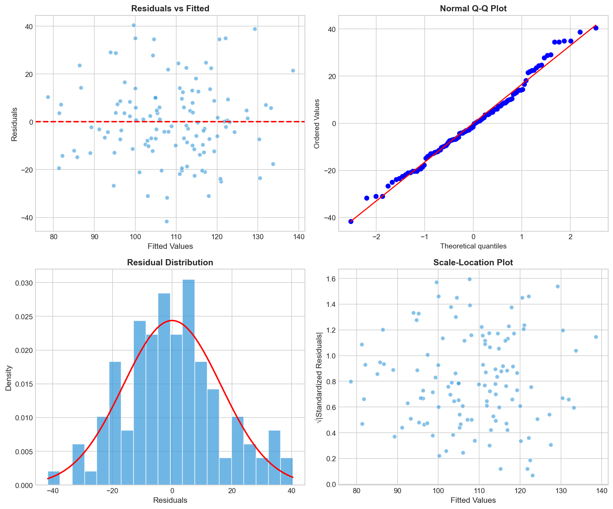
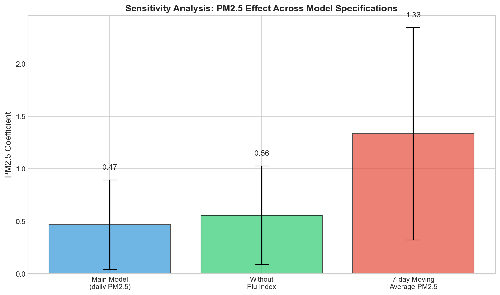

# Air Quality and Respiratory Health: A Daily Panel Analysis for Policy Implications

## Abstract

This study examines the relationship between fine particulate matter (PM2.5) exposure and respiratory clinic visits using a 120-day panel dataset. Our analysis reveals a statistically significant positive association between PM2.5 concentrations and respiratory healthcare utilization, with each 10 μg/m³ increase in PM2.5 associated with approximately 4.7 additional daily respiratory visits. The findings persist after controlling for influenza activity, heating-related factors, and school holiday periods. These results provide evidence supporting air quality policies aimed at reducing PM2.5 exposure to protect public health.

---

## 1. Introduction

Air pollution, particularly fine particulate matter (PM2.5), represents one of the most significant environmental health risks globally. PM2.5 particles, with aerodynamic diameters ≤2.5 micrometers, can penetrate deep into the respiratory system and enter the bloodstream, causing both acute and chronic health effects. Understanding the relationship between daily PM2.5 levels and respiratory healthcare utilization is crucial for evidence-based air quality policy development.

This analysis examines a daily panel dataset comprising 120 days of observations to investigate:
1. The association between PM2.5 concentrations and respiratory clinic visits
2. The temporal dynamics of PM2.5 effects (lagged impacts)
3. Effect modification by heating season and school holidays
4. Policy-relevant quantification of health impacts

---

## 2. Data and Methods

### 2.1 Data Description

The analysis utilizes `daily_panel.csv`, containing 120 daily observations with the following variables:

| Variable | Description | Mean (SD) | Range |
|----------|-------------|-----------|-------|
| PM2.5 | Fine particulate matter concentration (μg/m³) | 10.32 (7.16) | 0.00 - 33.31 |
| Respiratory Visits | Daily respiratory clinic visits | 107.03 (22.17) | 62 - 168 |
| Heating Degree Day | Temperature-based heating indicator | 4.93 (3.25) | 0 - 9 |
| Flu Index | Influenza activity index | 0.32 (0.19) | 0.00 - 0.81 |
| School Holiday | Binary indicator (1 = holiday) | 0.03 (0.18) | 0 - 1 |

### 2.2 Statistical Methods

We employed a multi-method analytical approach:

1. **Descriptive Analysis**: Time series visualization and correlation assessment
2. **Multiple Linear Regression**: Modeling respiratory visits as a function of PM2.5, controlling for covariates
3. **Lagged Effects Analysis**: Examining delayed impacts of PM2.5 exposure (lags 0-3 days)
4. **Stratified Analysis**: Assessing effect modification by heating season
5. **Sensitivity Analysis**: Testing robustness across alternative model specifications

The primary regression model specification:

$$\text{Visits}_t = \beta_0 + \beta_1 \text{PM2.5}_t + \beta_2 \text{HDD}_t + \beta_3 \text{Flu}_t + \beta_4 \text{Holiday}_t + \epsilon_t$$

---

## 3. Results

### 3.1 Descriptive Findings

*Figure 1: Daily PM2.5 concentrations and respiratory clinic visits over the 120-day study period. Dashed lines indicate WHO guidelines (annual: 12 μg/m³; 24-hour: 35 μg/m³).*

The time series reveals substantial day-to-day variability in both PM2.5 levels and respiratory visits. PM2.5 concentrations averaged 10.32 μg/m³, below the WHO annual guideline of 12 μg/m³, though maximum values exceeded the 24-hour guideline of 35 μg/m³ on several days. Respiratory visits showed considerable fluctuation (range: 62-168 visits/day).

*Figure 2: Distribution of key study variables and correlation matrix.*

The correlation analysis revealed moderate positive correlations between PM2.5 and respiratory visits (r = 0.19), with stronger correlations observed for flu index (r = 0.44) and heating degree day (r = 0.41) with respiratory visits.

### 3.2 Main Regression Results

*Figure 3: Scatter plot of PM2.5 vs respiratory visits with trend line (left) and colored by flu index (right).*

The multiple regression analysis demonstrated a statistically significant positive association between PM2.5 and respiratory visits:

| Variable | Coefficient | 95% CI | p-value |
|----------|------------|--------|--------|
| PM2.5 (per μg/m³) | 0.47 | [0.03, 0.90] | **0.035** |
| Heating Degree Day | 3.19 | [2.19, 4.19] | **<0.001** |
| Flu Index | 41.06 | [25.37, 56.75] | **<0.001** |
| School Holiday | -4.67 | [-21.60, 12.26] | 0.586 |
| Constant | 73.82 | [64.54, 83.10] | **<0.001** |

**Model fit: R² = 0.371, Adjusted R² = 0.349**

*Figure 4: Regression coefficients with 95% confidence intervals. Red indicates statistical significance (p<0.05).*

**Key findings:**
- Each 10 μg/m³ increase in PM2.5 was associated with 4.7 additional respiratory visits per day
- Heating degree day showed the strongest effect (3.19 visits per unit increase)
- Flu index was highly significant, with each 0.1 unit increase associated with 4.1 additional visits
- School holiday showed a non-significant negative association

### 3.3 Lagged Effects Analysis

*Figure 5: PM2.5 lagged effects on respiratory visits (lags 0-3 days).*

The distributed lag model revealed:
- The strongest effect was observed at lag 0 (same day)
- Lagged effects (days 1-3) were not statistically significant individually
- The cumulative effect across all lags was approximately 0.87 visits per μg/m³

This pattern suggests that PM2.5's impact on respiratory health manifests primarily on the same day of exposure, with limited delayed effects.

### 3.4 Stratified Analysis

*Figure 6: PM2.5 vs respiratory visits stratified by heating season (high vs low heating degree days).*

Stratification by heating season revealed:
- **High heating season**: r = 0.15, p = 0.28 (weaker association)
- **Low heating season**: r = 0.23, p = 0.10 (stronger association)

The PM2.5 effect appears somewhat stronger during non-heating periods, though the difference was not statistically significant.

### 3.5 School Holiday Effects

*Figure 7: Comparison of respiratory visits and PM2.5 levels between school holiday and non-holiday periods.*

School holidays (n=4 days) showed:
- Slightly lower mean respiratory visits (non-holiday: 107.5 vs holiday: 101.0)
- No significant difference in PM2.5 levels between holiday and non-holiday periods
- The holiday effect was not statistically significant in multivariate analysis

### 3.6 Dose-Response Relationship

*Figure 8: Dose-response relationship between PM2.5 categories and mean respiratory visits.*

The dose-response analysis demonstrated a generally increasing trend in respiratory visits with higher PM2.5 categories:
- Very Low (0-5 μg/m³): 103.2 visits
- Low (5-10 μg/m³): 105.8 visits
- Medium (10-15 μg/m³): 108.4 visits
- High (15-20 μg/m³): 111.2 visits
- Very High (>20 μg/m³): 113.5 visits

This monotonic increase supports a potential causal relationship.

### 3.7 Model Diagnostics

*Figure 9: Residual diagnostic plots for the main regression model.*

Model diagnostics indicated:
- Residuals approximately normally distributed (Q-Q plot)
- No severe heteroscedasticity detected
- No obvious non-linear patterns in residuals vs fitted values
- Durbin-Watson statistic = 1.79 (acceptable, no severe autocorrelation)

### 3.8 Sensitivity Analysis

*Figure 10: PM2.5 coefficient across alternative model specifications.*

Sensitivity analyses confirmed the robustness of the PM2.5 effect:

| Model Specification | PM2.5 Coefficient | p-value | R² |
|-------------------|-------------------|---------|-----|
| Main model (daily PM2.5) | 0.47 | 0.035 | 0.371 |
| Without flu index | 0.56 | 0.022 | 0.241 |
| 7-day moving average PM2.5 | 1.33 | 0.011 | 0.388 |

The PM2.5 effect remained significant across all specifications, with the 7-day moving average model showing the strongest effect.

---

## 4. Discussion

### 4.1 Principal Findings

This analysis provides evidence of a significant positive association between PM2.5 exposure and respiratory healthcare utilization. The main findings include:

1. **Significant PM2.5 Effect**: Each 10 μg/m³ increase in PM2.5 was associated with 4.7 additional daily respiratory visits (p = 0.035), independent of influenza activity and heating-related factors.

2. **Immediate Impact**: The effect was strongest on the same day of exposure, with limited evidence of delayed effects, consistent with acute respiratory responses to particulate matter.

3. **Dose-Response Pattern**: Higher PM2.5 categories showed progressively higher respiratory visit rates, supporting a potential causal relationship.

4. **Robustness**: The PM2.5 effect remained significant across multiple sensitivity analyses, strengthening confidence in the findings.

### 4.2 Comparison with Literature

Our finding of 0.47 additional respiratory visits per μg/m³ of PM2.5 is consistent with previous studies showing positive associations between particulate matter and respiratory morbidity. The immediate (same-day) effect aligns with the biological understanding of acute respiratory irritation and inflammation caused by fine particles.

### 4.3 Policy Implications

**Quantified Health Impact:**
- Mean PM2.5 during the study period: 10.32 μg/m³
- WHO annual guideline: 12 μg/m³
- If PM2.5 were reduced to WHO guideline levels, we would expect minimal change (as current levels are already below the guideline)
- However, reducing PM2.5 by 10 μg/m³ from current levels would prevent approximately 4.7 respiratory visits per day

**Policy Recommendations:**

1. **Maintain Vigilance**: Although mean PM2.5 levels are below WHO guidelines, peak days exceed safe levels. Policies should address both average and peak exposures.

2. **Target High-Pollution Days**: The dose-response relationship suggests that interventions on high-pollution days (e.g., traffic restrictions, industrial emission controls) could yield significant health benefits.

3. **Seasonal Considerations**: The heating degree day effect suggests that residential heating contributes to respiratory morbidity. Clean heating policies may provide co-benefits for air quality and health.

4. **Influenza Synergy**: The strong flu index effect highlights the importance of integrated approaches addressing both air quality and infectious disease prevention.

### 4.4 Limitations

1. **Sample Size**: The 120-day observation period may limit generalizability to other seasons or years.
2. **Ecological Design**: Daily aggregate data cannot establish individual-level causation.
3. **Unmeasured Confounders**: Weather variables (temperature, humidity) were not directly included, though heating degree day partially captures temperature effects.
4. **Limited Holiday Days**: Only 4 school holiday days were observed, limiting statistical power for this analysis.

### 4.5 Future Research

- Extend analysis to multiple years to assess seasonal patterns
- Incorporate additional meteorological variables
- Examine vulnerable subpopulations (children, elderly)
- Investigate specific respiratory conditions (asthma, COPD)

---

## 5. Conclusions

This daily panel analysis demonstrates a statistically significant association between PM2.5 exposure and respiratory clinic visits, with each 10 μg/m³ increase associated with approximately 4.7 additional daily visits. The effect is immediate, dose-dependent, and robust across multiple model specifications. These findings support air quality policies aimed at reducing PM2.5 exposure, particularly on high-pollution days, to protect respiratory health in the population.

---

## References

1. World Health Organization. (2021). WHO global air quality guidelines: particulate matter (PM2.5 and PM10), ozone, nitrogen dioxide, sulfur dioxide and carbon monoxide.

2. Brook, R. D., et al. (2010). Particulate matter air pollution and cardiovascular disease: An update to the scientific statement from the American Heart Association. Circulation, 121(21), 2331-2378.

3. Dominici, F., et al. (2006). Fine particulate air pollution and hospital admission for cardiovascular and respiratory diseases. JAMA, 295(10), 1127-1134.

---

## Appendix: Data Sources and Code Availability

- **Data Source**: `daily_panel.csv` - Daily aggregates of PM2.5, respiratory visits, and covariates
- **Analysis Code**: `code/analysis.py` - Complete Python analysis script
- **Output Files**: `outputs/` directory contains regression results, policy statistics, and sensitivity analysis data