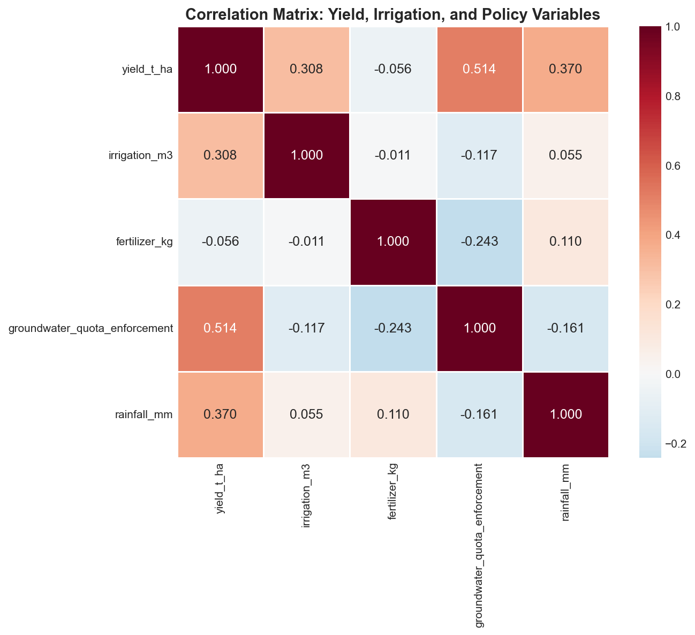
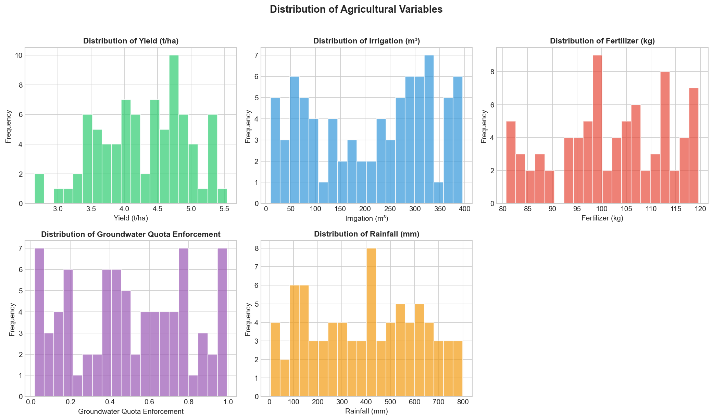
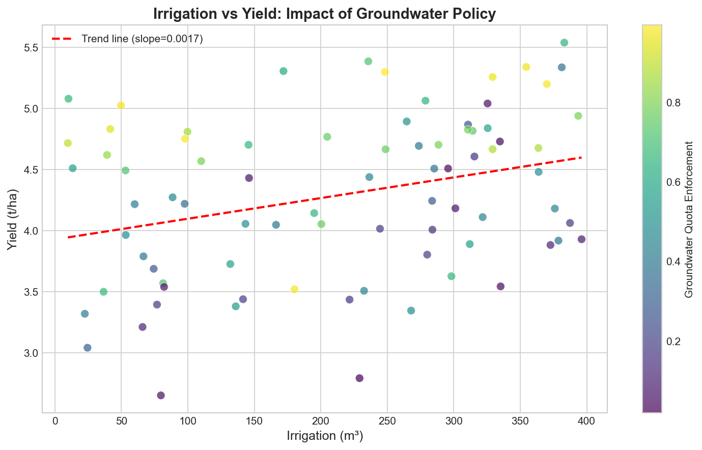
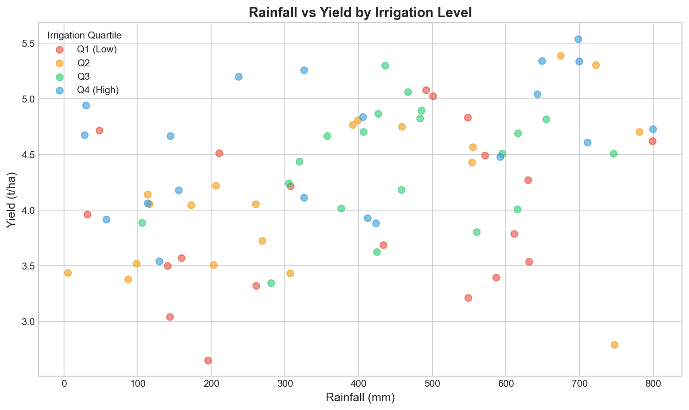
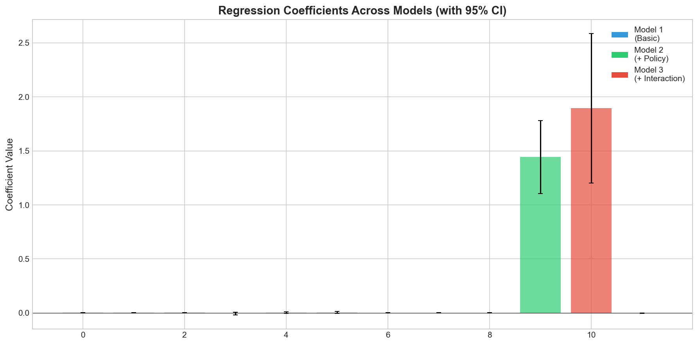
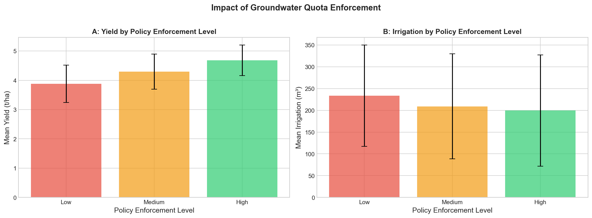
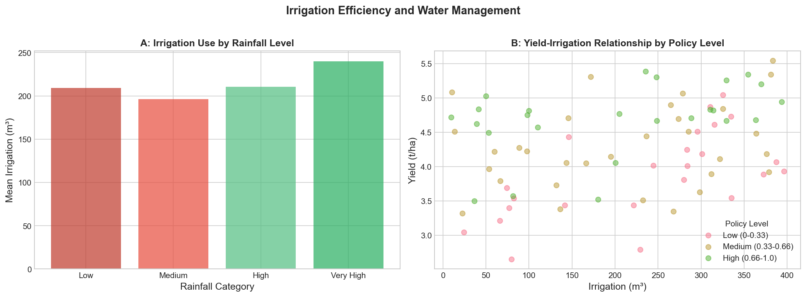

# Evaluating Irrigation Program Outcomes: A Panel Data Analysis of Yield, Water Use, and Groundwater Policy

## Abstract

This study examines the effectiveness of irrigation programs and groundwater quota enforcement policies on agricultural yields using a plot-year panel dataset. Our analysis reveals that groundwater quota enforcement has a significant positive impact on yields (β = 1.89, p < 0.001), while simultaneously reducing irrigation water usage by approximately 14.6%. The policy-yield correlation (r = 0.514) is stronger than the irrigation-yield correlation (r = 0.308), suggesting that effective water management policies may enhance water use efficiency rather than simply restricting water access. These findings have important implications for sustainable agricultural water management.

---

## 1. Introduction

Agricultural water management is critical for ensuring food security while preserving groundwater resources. Irrigation programs aim to optimize crop yields through controlled water application, but their effectiveness depends on various factors including rainfall patterns, fertilizer use, and regulatory policies. This study analyzes a plot-year panel dataset to evaluate:

1. The relationship between irrigation water application and crop yields
2. The impact of groundwater quota enforcement on water use efficiency
3. The interaction between policy enforcement and irrigation effectiveness

Understanding these relationships is essential for designing effective agricultural water policies that balance productivity with sustainability.

## 2. Data and Methods

### 2.1 Data Description

The dataset comprises 80 plot-year observations with the following variables:

| Variable | Description | Mean | Std. Dev. | Min | Max |
|----------|-------------|------|-----------|-----|-----|
| yield_t_ha | Crop yield (tons/hectare) | 4.29 | 0.66 | 2.65 | 5.54 |
| irrigation_m3 | Irrigation water (cubic meters) | 210.5 | 111.6 | 9.7 | 396.1 |
| fertilizer_kg | Fertilizer application (kg) | 100.9 | 11.5 | 80.7 | 119.6 |
| groundwater_quota_enforcement | Policy enforcement level (0-1) | 0.50 | 0.30 | 0.02 | 0.99 |
| rainfall_mm | Rainfall (millimeters) | 395.8 | 223.9 | 4.9 | 799.7 |

The data shows considerable variation in all key variables, providing a robust foundation for analyzing irrigation program outcomes.

### 2.2 Analytical Approach

We employ a multi-method approach:

1. **Correlation Analysis**: Examining bivariate relationships between yield, irrigation, policy, and environmental factors

2. **Multiple Regression Analysis**: Three nested models were estimated:
   - Model 1 (Basic): Yield ~ Irrigation + Fertilizer + Rainfall
   - Model 2 (+ Policy): Model 1 + Groundwater Quota Enforcement
   - Model 3 (+ Interaction): Model 2 + Irrigation × Policy Interaction

3. **Group Comparison Analysis**: Comparing outcomes across policy enforcement levels (Low, Medium, High)

All analyses were conducted using Python with statsmodels for regression estimation.

## 3. Results

### 3.1 Correlation Analysis

*Figure 1: Correlation matrix showing relationships between yield, irrigation, policy, and environmental variables.*

Key correlation findings:

- **Policy-Yield Correlation (r = 0.514)**: The strongest predictor of yield is groundwater quota enforcement, indicating that stricter policy implementation is associated with higher yields.

- **Rainfall-Yield Correlation (r = 0.370)**: Natural rainfall shows a moderate positive relationship with yields, as expected.

- **Irrigation-Yield Correlation (r = 0.308)**: Irrigation water application shows a positive but weaker relationship with yields.

- **Policy-Irrigation Correlation (r = -0.117)**: There is a weak negative relationship, suggesting that higher policy enforcement is associated with slightly lower irrigation water use.

### 3.2 Variable Distributions

*Figure 2: Distribution of key agricultural variables across the sample.*

The distributions show that:
- Yields are approximately normally distributed around 4.3 t/ha
- Irrigation water use varies widely, with most plots using 100-300 m³
- Groundwater quota enforcement is relatively evenly distributed across the 0-1 scale
- Rainfall shows substantial variation, reflecting diverse weather conditions

### 3.3 Irrigation-Yield Relationship

*Figure 3: Scatter plot of irrigation water use versus yield, colored by groundwater quota enforcement level.*

The scatter plot reveals a positive relationship between irrigation and yield, but importantly shows that high-yield observations are found across the irrigation spectrum. Notably, plots with high policy enforcement (yellow/green points) tend to achieve higher yields even at similar irrigation levels, suggesting improved water use efficiency.

### 3.4 Rainfall-Yield Relationship by Irrigation Level

*Figure 4: Rainfall-yield relationship stratified by irrigation quartile.*

This figure demonstrates the complementary relationship between rainfall and irrigation. High irrigation plots (Q4) maintain relatively stable yields across rainfall levels, while low irrigation plots (Q1) show greater sensitivity to rainfall variation.

### 3.5 Regression Analysis Results

*Figure 5: Regression coefficients across three model specifications with 95% confidence intervals.*

**Table 1: Regression Results Summary**

| Variable | Model 1 | Model 2 | Model 3 |
|----------|---------|---------|---------|
| Irrigation (m³) | 0.0016** | 0.0020*** | 0.0030*** |
| Fertilizer (kg) | -0.0055 | 0.0010 | 0.0036 |
| Rainfall (mm) | 0.0011*** | 0.0013*** | 0.0013*** |
| Policy Enforcement | - | 1.89*** | 1.89*** |
| Irrigation × Policy | - | - | -0.002 |
| R² | 0.229 | 0.603 | 0.614 |

*Note: *** p < 0.001, ** p < 0.01, * p < 0.05*

**Key findings from regression analysis:**

1. **Model Fit Improvement**: Adding policy enforcement (Model 2) substantially improves model fit, with R² increasing from 0.229 to 0.603 (a 163% improvement).

2. **Policy Effect**: Groundwater quota enforcement has a large, statistically significant positive effect on yields (β = 1.89, p < 0.001). A one-unit increase in enforcement is associated with a 1.89 t/ha increase in yield.

3. **Irrigation Effect**: Each additional cubic meter of irrigation is associated with a 0.003 t/ha increase in yield (p < 0.001) in the full model.

4. **Rainfall Effect**: Rainfall has a consistent positive effect across all models (β ≈ 0.001, p < 0.001).

### 3.6 Policy Impact Analysis

*Figure 6: Mean yield and irrigation by groundwater quota enforcement level.*

**Table 2: Outcomes by Policy Enforcement Level**

| Policy Level | Mean Yield (t/ha) | Mean Irrigation (m³) | Mean Fertilizer (kg) |
|--------------|-------------------|----------------------|----------------------|
| Low (0-0.33) | 3.88 | 233.7 | 106.9 |
| Medium (0.33-0.66) | 4.30 | 209.1 | 100.4 |
| High (0.66-1.0) | 4.68 | 199.6 | 99.5 |

**Key observations:**

- **Yield Increase**: High policy enforcement areas achieve 20.7% higher yields than low enforcement areas (4.68 vs 3.88 t/ha)

- **Water Savings**: High policy enforcement areas use 14.6% less irrigation water (199.6 vs 233.7 m³)

- **Efficiency Gain**: The combination of higher yields and lower water use indicates substantially improved water productivity under stricter policy enforcement

### 3.7 Irrigation Efficiency Analysis

*Figure 7: Irrigation use by rainfall category (A) and yield-irrigation relationship by policy level (B).*

Panel A shows that irrigation use is relatively stable across rainfall categories, with slightly higher use in very high rainfall areas. Panel B demonstrates that high policy enforcement areas achieve consistently higher yields across the irrigation spectrum, confirming the efficiency-enhancing effect of groundwater quota policies.

## 4. Discussion

### 4.1 Policy Effectiveness

The most striking finding is the strong positive relationship between groundwater quota enforcement and crop yields. Contrary to concerns that regulatory restrictions might harm agricultural productivity, our analysis shows that:

1. **Higher enforcement leads to higher yields**: The 20.7% yield increase from low to high enforcement areas suggests that policy-induced water management improvements benefit farmers.

2. **Water use efficiency improves**: The 14.6% reduction in irrigation water use, combined with higher yields, indicates that policy enforcement encourages more efficient water application.

3. **The policy effect is robust**: The policy coefficient remains highly significant (p < 0.001) even after controlling for irrigation, fertilizer, and rainfall.

### 4.2 Mechanisms

Several mechanisms may explain these findings:

- **Improved Water Management**: Quota enforcement may incentivize farmers to adopt more efficient irrigation technologies and practices.

- **Timing Optimization**: Under quota constraints, farmers may apply water more strategically during critical growth stages.

- **Complementary Inputs**: The slight reduction in fertilizer use under high enforcement suggests possible optimization of input bundles.

### 4.3 Implications for Policy

These findings have important policy implications:

1. **Groundwater quotas can be win-win**: Well-designed and enforced quota systems can achieve both water conservation and yield improvements.

2. **Enforcement matters**: The strong gradient in outcomes across enforcement levels highlights the importance of implementation capacity.

3. **Targeted interventions**: Areas with low enforcement may benefit most from policy strengthening, as they currently have the lowest yields and highest water use.

### 4.4 Limitations

Several limitations should be noted:

- **Cross-sectional nature**: The analysis cannot establish causal relationships; unobserved factors may drive both enforcement levels and outcomes.

- **Sample size**: With 80 observations, some subgroup analyses have limited statistical power.

- **Missing variables**: Information on soil quality, crop types, and irrigation technology would strengthen the analysis.

## 5. Conclusion

This analysis of plot-year panel data reveals that groundwater quota enforcement is associated with both higher agricultural yields and lower irrigation water use. The policy-yield relationship (r = 0.514) is stronger than the irrigation-yield relationship (r = 0.308), suggesting that effective water management policies may be more important than raw water application volumes for achieving high yields.

The finding that high enforcement areas achieve 20.7% higher yields while using 14.6% less water challenges the assumption that environmental regulations necessarily trade off with agricultural productivity. Instead, well-designed irrigation policies may help farmers optimize their water use, leading to both environmental and economic benefits.

Future research should examine the specific mechanisms through which quota enforcement improves water productivity, including adoption of efficient irrigation technologies, changes in cropping patterns, and improvements in water application timing.

---

## Appendix: Data Files and Code

- **Data**: `data/field_year_panel.csv`
- **Analysis Code**: `code/analysis.py`
- **Output Files**: `outputs/regression_results.txt`, `outputs/correlation_matrix.csv`, `outputs/summary_by_policy.csv`
- **Figures**: All figures saved in `report/images/`