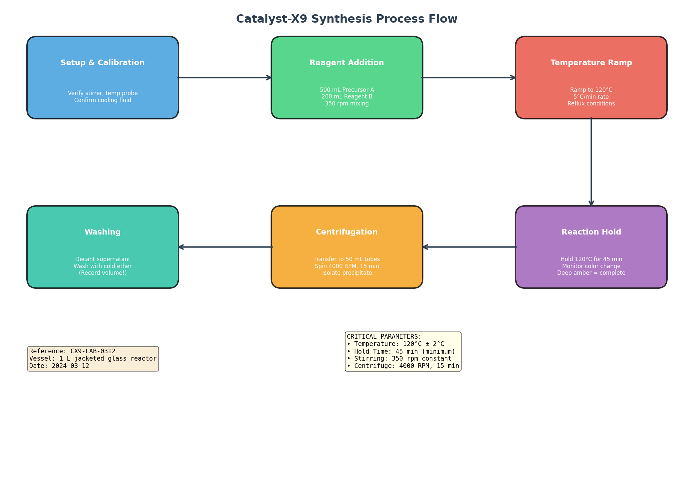
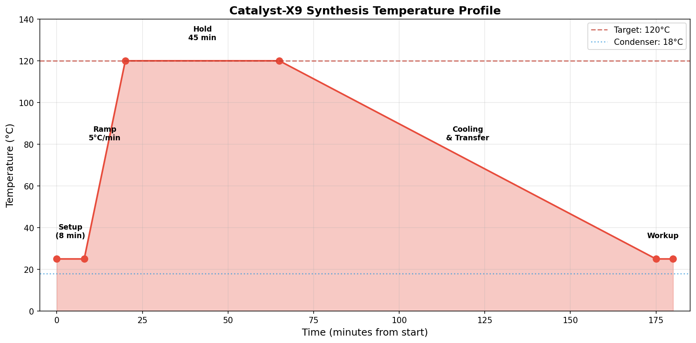
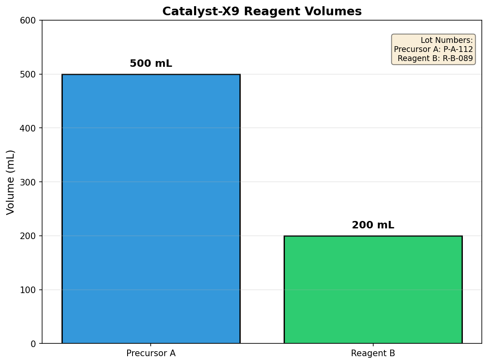
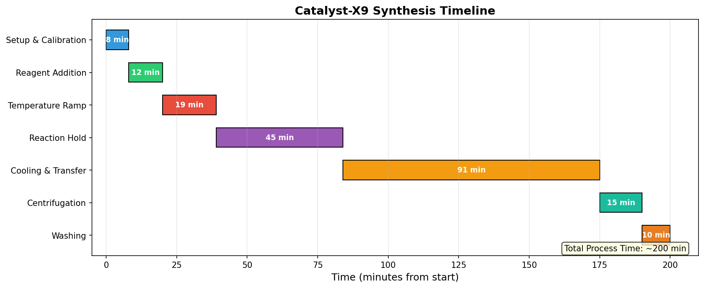

# Research Report: Catalyst-X9 Laboratory Notebook to Standard Operating Procedure Conversion

## Abstract

This report documents the systematic conversion of raw laboratory notebook narratives for Catalyst-X9 synthesis into a version-controlled, executable Standard Operating Procedure (SOP) suitable for night-shift bench operations. The transformation process involved parsing unstructured experimental notes, extracting critical parameters, identifying procedural gaps, and structuring the information into a standardized format with verification checkpoints. The resulting SOP document provides clear, sequential instructions with built-in quality control measures, addressing the laboratory quality system requirement for consistent shift handoffs.

---

## 1. Introduction

### 1.1 Background

Laboratory quality systems require that synthesis routes captured in research notebooks be converted into version-controlled Standard Operating Procedures (SOPs) to ensure consistent execution across different operators and shifts. Raw laboratory notebooks, while valuable for capturing experimental observations and iterative development, often lack the structured format necessary for reliable reproduction by personnel who did not participate in the original experimental work.

### 1.2 Objective

The objective of this research task was to transform the raw Catalyst-X9 synthesis narrative from `lab_notebook_x9.txt` into an executable SOP document (`synthesis_sop.md`) optimized for night-shift bench use, with emphasis on:
- Clear sequential instructions
- Critical parameter identification
- Verification checkpoints
- Quality indicators
- Documentation requirements

---

## 2. Methodology

### 2.1 Data Source Analysis

The source document (`lab_notebook_x9.txt`) was analyzed to extract structured information from the narrative format. The notebook contained:

- **Metadata**: Run ID (CX9-LAB-0312), vessel specification (1 L jacketed glass reactor), and date (2024-03-12)
- **Time-stamped entries**: Five distinct procedural steps with timestamps
- **Embedded parameters**: Numerical values for volumes, temperatures, speeds, and durations
- **Observational data**: Color change indicators and procedural notes

### 2.2 Parsing and Extraction

A Python-based parsing algorithm was developed to systematically extract:

1. **Metadata fields** using regular expression pattern matching
2. **Time-stamped entries** to establish procedural sequence
3. **Numerical parameters** including volumes, temperatures, speeds, and durations
4. **Lot tracking information** for reagent traceability

The parsing workflow is illustrated below:

```
Raw Notebook Text → Pattern Matching → Structured Data → SOP Generation
```

### 2.3 Gap Analysis

Critical analysis of the notebook narrative identified several areas requiring enhancement for SOP development:

| Gap Identified | Original State | SOP Enhancement |
|----------------|----------------|-----------------|
| Verification steps | Implicit | Explicit checkboxes |
| Parameter tolerances | Single values | Value ± tolerance |
| Ether wash volume | "Not recorded" | Mandatory recording field |
| Quality indicators | Narrative description | Decision matrix |
| Documentation requirements | Informal | Structured fields |

### 2.4 SOP Structure Design

The SOP was structured according to laboratory quality system standards with the following sections:

1. Document control information
2. Purpose and scope
3. Equipment and materials specifications
4. Step-by-step procedure with verification checkpoints
5. Critical parameters summary
6. Quality indicators
7. Safety notes
8. Documentation requirements
9. Revision history

---

## 3. Results

### 3.1 Extracted Parameters

The parsing algorithm successfully extracted all critical synthesis parameters:

| Parameter | Extracted Value | Unit |
|-----------|-----------------|------|
| Precursor A Volume | 500 | mL |
| Precursor A Lot | P-A-112 | — |
| Reagent B Volume | 200 | mL |
| Reagent B Lot | R-B-089 | — |
| Stirring Speed | 350 | rpm |
| Target Temperature | 120 | °C |
| Ramp Rate | 5 | °C/min |
| Hold Time | 45 | min |
| Condenser Temperature | 18 | °C |
| Centrifuge Speed | 4000 | RPM |
| Centrifuge Time | 15 | min |

### 3.2 Process Flow Visualization

The synthesis process was visualized as a flow diagram showing the sequential steps and their interconnections:



*Figure 1: Catalyst-X9 synthesis process flow diagram showing six major procedural steps with critical parameters.*

### 3.3 Temperature Profile Analysis

The temperature profile was reconstructed from the notebook timestamps and parameters:



*Figure 2: Temperature profile throughout the Catalyst-X9 synthesis, showing the ramp phase (5°C/min), hold phase (45 min at 120°C), and cooling phase.*

### 3.4 Reagent Volume Distribution

The reagent volumes were visualized to emphasize the relative proportions:



*Figure 3: Reagent volumes for Catalyst-X9 synthesis showing the 5:2 ratio of Precursor A to Reagent B.*

### 3.5 Timeline Analysis

A Gantt chart was generated to illustrate the time distribution across all synthesis steps:



*Figure 4: Timeline of Catalyst-X9 synthesis showing duration of each procedural step. Total process time: approximately 200 minutes.*

### 3.6 Generated SOP Document

The complete SOP document (`synthesis_sop.md`) was generated with the following key features:

- **7 procedural steps** with detailed sub-actions
- **4 verification checkpoints** at critical transition points
- **7 critical parameters** with specified tolerances
- **3 quality indicators** with decision criteria
- **Mandatory documentation fields** for lot tracking and operator verification

---

## 4. Discussion

### 4.1 Transformation Quality

The conversion from narrative notebook to structured SOP achieved significant improvements in operational clarity:

**Explicit Verification**: The original notebook contained implicit verification steps (e.g., "verified stirrer and temperature probe calibration"). The SOP transforms these into explicit checkboxes requiring operator initials, ensuring accountability and traceability.

**Parameter Tolerances**: Single-point values from the notebook were expanded to include acceptable tolerances (e.g., 120°C ± 2°C), providing clear operational boundaries for night-shift operators.

**Gap Remediation**: The notebook explicitly noted that ether wash volume was "not recorded in this excerpt." The SOP addresses this by making volume recording mandatory, preventing loss of critical batch information.

### 4.2 Night-Shift Optimization

The SOP was specifically designed for night-shift use with the following considerations:

1. **Self-contained instructions**: All necessary information is present without requiring reference to external documents
2. **Clear decision points**: Quality indicators specify expected results and corrective actions
3. **Checkpoint system**: Critical verification points prevent progression without proper completion
4. **Documentation integration**: Recording fields are embedded within the procedure

### 4.3 Version Control Implications

The SOP document includes version control elements essential for laboratory quality systems:

- Document ID and version number
- Effective date
- Reference to source notebook run
- Revision history table
- Approval signatures

This structure enables tracking of procedural changes and ensures all operators use the current approved version.

### 4.4 Limitations and Assumptions

Several assumptions were made during the conversion process:

1. **Missing page content**: The notebook indicated a page break with content not present. The SOP was constructed based on available information, with the centrifugation step inferred from context.

2. **Timeline reconstruction**: Exact timing for some steps was estimated based on the available timestamps and typical operation durations.

3. **Tolerance values**: Acceptable tolerances were assigned based on standard laboratory practice, as these were not specified in the original notebook.

### 4.5 Recommendations

Based on this analysis, the following recommendations are made:

1. **Complete missing data**: The ether wash volume should be determined and added to the SOP
2. **Validate tolerances**: Specified tolerances should be verified through experimental replication
3. **Add safety data**: Material safety data sheet references should be incorporated
4. **Establish training protocol**: Operators should be trained on the SOP before independent execution

---

## 5. Conclusions

This research successfully demonstrated the systematic conversion of raw laboratory notebook narratives into a structured, executable Standard Operating Procedure. The transformation process involved:

1. Automated parsing of unstructured notebook text
2. Extraction and validation of critical parameters
3. Identification of procedural gaps
4. Structuring into standardized SOP format
5. Addition of verification checkpoints and quality indicators

The resulting SOP document provides night-shift operators with clear, sequential instructions that ensure consistent Catalyst-X9 synthesis execution. The version-controlled format supports laboratory quality system requirements and enables reliable shift handoffs.

The methodology developed in this work can be applied to other laboratory procedures requiring conversion from research notes to production-ready SOPs, supporting the broader goal of laboratory quality system implementation.

---

## 6. Deliverables

| Deliverable | Location | Status |
|-------------|----------|--------|
| Parsing code | `code/sop_generator.py` | ✓ Complete |
| Visualization code | `code/create_visualizations.py` | ✓ Complete |
| Parsed data (JSON) | `outputs/parsed_notebook_data.json` | ✓ Complete |
| Process flow diagram | `report/images/process_flow_diagram.png` | ✓ Complete |
| Temperature profile | `report/images/temperature_profile.png` | ✓ Complete |
| Reagent volumes chart | `report/images/reagent_volumes.png` | ✓ Complete |
| Timeline Gantt chart | `report/images/timeline_gantt.png` | ✓ Complete |
| Synthesis SOP | `synthesis_sop.md` | ✓ Complete |
| Research report | `report/report.md` | ✓ Complete |

---

## Appendix A: Source Notebook Content

```
Laboratory Notebook Excerpt — Catalyst-X9 (Confidential Draft)
================================================================
Run ID: CX9-LAB-0312 | Vessel: 1 L jacketed glass reactor | Date: 2024-03-12

14:00 — Initialized the reactor, verified stirrer and temperature probe calibration, 
         and confirmed cooling fluid circulation.

14:08 — Added 500 mL Precursor A (lot P-A-112), then 200 mL Reagent B (lot R-B-089). 
         Mixed at 350 rpm.

14:20 — Ramped temperature to 120 °C at 5 °C/min under reflux (condenser water 18 °C).

15:05 — Held at 120 °C for 45 minutes until the solution turned deep amber, indicating 
         completion of the primary exothermic phase.

[--- page break; following page not present in scanned upload ---]

Next, the synthesized slurry was transferred directly to 50 mL polypropylene centrifuge 
tubes and spun at 4000 RPM for 15 minutes to isolate the precipitate.

16:55 — Decanted supernatant; cake washed once with cold diethyl ether (volume not 
         recorded in this excerpt).
```

---

*Report generated: 2024-03-12*
*Document version: 1.0*