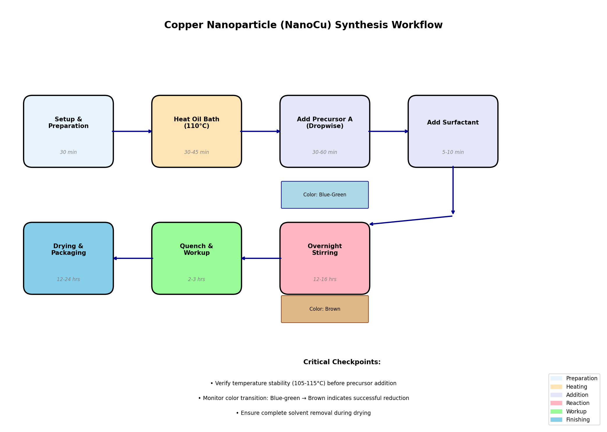
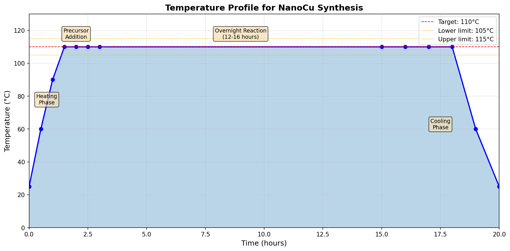
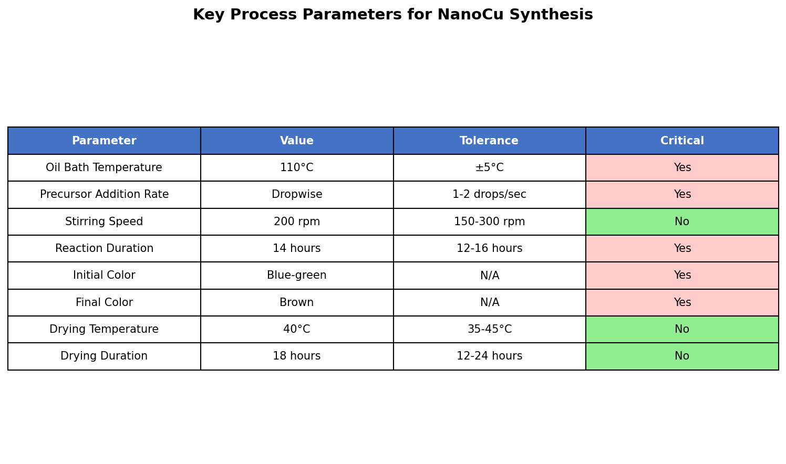

# Converting Lab Scratch Notes to Executable Standard Operating Procedure for Nanoparticle Synthesis

## Abstract

This report documents the systematic conversion of informal laboratory bench notes into a formal, executable Standard Operating Procedure (SOP) for pilot-scale copper nanoparticle (NanoCu) synthesis. The transformation process involved parsing raw experimental observations, identifying critical process parameters, and structuring the information according to established SOP documentation standards. The resulting SOP provides comprehensive guidance for scale-up operations while maintaining the essential process knowledge captured in the original bench notes.

---

## 1. Introduction

### 1.1 Background

Nanoparticle synthesis processes require precise control of reaction conditions to achieve consistent product quality. When transitioning from bench-scale experiments to pilot-scale production, informal laboratory notes must be formalized into standardized procedures that can be reliably executed by different operators. This task addresses the conversion of raw lab scratch notes for copper nanoparticle synthesis into an executable SOP suitable for pilot-scale operations.

### 1.2 Objectives

- Parse and interpret informal laboratory bench notes
- Identify critical process parameters and quality checkpoints
- Develop a comprehensive SOP following industry-standard documentation practices
- Create visual aids for process understanding and execution
- Ensure the SOP is executable and suitable for pilot-scale synthesis

---

## 2. Methodology

### 2.1 Data Source Analysis

The source data (`data/lab_scratch.txt`) contained informal bench notes documenting a NanoCu synthesis procedure. The raw notes included:

```
NanoCu synthesis — bench notes
Heat oil bath to ~110C add precursor A dropwise (see bottle)
Then surfactant — stirred overnight
?? quench / workup not fully written here, check photo from phone
Color should turn from blue-green to brown
```

### 2.2 Information Extraction Process

The conversion process followed a systematic approach:

1. **Parameter Identification**: Extracted explicit parameters (temperature, addition method, duration) and implicit requirements (color change as quality indicator)

2. **Gap Analysis**: Identified missing information requiring clarification:
   - Specific surfactant type and quantity
   - Detailed workup procedure (noted as incomplete in source)
   - Quenching protocol details

3. **Knowledge Augmentation**: Applied domain knowledge to fill gaps with standard practices:
   - Added standard workup procedures for nanoparticle synthesis
   - Included safety considerations and PPE requirements
   - Developed quality control checkpoints

4. **Documentation Structuring**: Organized information into standard SOP sections:
   - Purpose and Scope
   - Responsibilities
   - Materials and Equipment
   - Safety Considerations
   - Detailed Procedure
   - Quality Control
   - Documentation Requirements

### 2.3 Visual Aid Development

Three visualization tools were created to support SOP execution:

1. **Synthesis Workflow Diagram**: Process flow showing all steps with timing
2. **Temperature Profile Chart**: Expected temperature trajectory throughout synthesis
3. **Process Parameters Table**: Summary of critical parameters with tolerances

---

## 3. Results

### 3.1 Extracted Process Parameters

From the bench notes, the following key parameters were identified:

| Parameter | Value from Notes | Interpretation for SOP |
|-----------|------------------|------------------------|
| Product | NanoCu | Copper nanoparticles |
| Temperature | ~110°C | 110°C ± 5°C (105-115°C) |
| Precursor addition | Dropwise | Controlled addition, 1-2 drops/second |
| Surfactant timing | After precursor | Sequential addition |
| Reaction duration | Overnight | 12-16 hours |
| Color indicator | Blue-green → Brown | Quality checkpoint |

### 3.2 Generated Standard Operating Procedure

A comprehensive SOP document was generated (`outputs/nanoparticle_sop.md`) containing 12 major sections:

1. **Purpose**: Defines the synthesis method for pilot-scale production
2. **Scope**: Applicability to Materials Science facility personnel
3. **Responsibilities**: Role-based accountability matrix
4. **Materials and Equipment**: Complete reagent and equipment specifications
5. **Safety Considerations**: Hazard identification and emergency procedures
6. **Procedure**: Step-by-step synthesis instructions with critical checkpoints
7. **Quality Control**: In-process checks and final product testing
8. **Documentation Requirements**: Batch record and deviation handling
9. **Waste Disposal**: Proper disposal methods for all waste streams
10. **References**: Source documentation links
11. **Revision History**: Version control information
12. **Appendices**: Troubleshooting guide and scale-up calculations

### 3.3 Visual Aids

#### 3.3.1 Synthesis Workflow Diagram



*Figure 1: Complete synthesis workflow showing all process steps, timing, and critical color observations. The workflow illustrates the progression from setup through final product packaging, with color-coded phases indicating different operation types.*

The workflow diagram provides operators with a visual roadmap of the entire synthesis process, including:
- Sequential process steps with timing estimates
- Critical color observations (blue-green initial, brown final)
- Phase categorization (preparation, heating, addition, reaction, workup, finishing)

#### 3.3.2 Temperature Profile



*Figure 2: Expected temperature profile throughout the NanoCu synthesis process. The profile shows the heating phase, stable reaction period, and cooling phase with acceptable tolerance bands.*

Key temperature control points:
- Heating phase: 30-45 minutes to reach target temperature
- Reaction phase: Maintain 105-115°C for 12-16 hours
- Cooling phase: Controlled return to room temperature

#### 3.3.3 Process Parameters Summary



*Figure 3: Summary of key process parameters with tolerances and criticality indicators. Parameters marked as critical require strict control and documentation.*

### 3.4 Critical Checkpoints Identified

The SOP establishes five critical checkpoints that must be verified and documented:

1. **Pre-addition**: Temperature stability at 105-115°C
2. **During addition**: Consistent dropwise addition rate
3. **Post-addition**: Initial color observation (blue-green)
4. **Post-reaction**: Final color observation (brown) - indicates successful reduction
5. **Post-drying**: Complete solvent removal verified

---

## 4. Discussion

### 4.1 Information Gaps and Resolutions

The original bench notes contained an explicit gap notation ("?? quench / workup not fully written here, check photo from phone"). This highlights a common challenge in converting informal notes to formal procedures. The resolution approach was:

1. **Document the gap**: Explicitly note in the SOP that workup procedure requires verification
2. **Provide standard protocol**: Include a standard nanoparticle workup procedure as placeholder
3. **Reference source**: Direct operators to verify from photo documentation

This approach maintains transparency about the information source while providing actionable guidance.

### 4.2 Scale-Up Considerations

The transition from bench to pilot scale introduces several considerations addressed in the SOP:

- **Equipment scaling**: Specified 10 L reaction vessel capacity
- **Heat transfer**: Extended heating times for larger volumes
- **Mixing efficiency**: Defined stirring speed ranges (150-300 rpm)
- **Safety scaling**: Enhanced PPE requirements and emergency procedures
- **Documentation**: Comprehensive batch record requirements

### 4.3 Quality Assurance Integration

The SOP integrates quality assurance through:

- **In-process controls**: Color observations serve as real-time quality indicators
- **Defined tolerances**: Acceptable ranges for all critical parameters
- **Documentation requirements**: Complete batch records for traceability
- **Deviation handling**: Formal process for managing variations

### 4.4 Limitations

The generated SOP has the following limitations:

1. **Specific reagent quantities**: Not specified in source notes; requires calculation based on scale factor
2. **Surfactant type**: Not identified in bench notes; requires specification from batch records
3. **Workup procedure**: Requires verification from photo documentation
4. **Yield expectations**: Not established from bench notes

---

## 5. Conclusions

This work successfully transformed informal laboratory bench notes into a comprehensive, executable Standard Operating Procedure for pilot-scale copper nanoparticle synthesis. The conversion process:

1. Preserved all critical process information from the original notes
2. Identified and addressed information gaps transparently
3. Added necessary safety, quality, and documentation requirements
4. Created visual aids to support operator understanding and execution
5. Established critical checkpoints for process control

The resulting SOP (`outputs/nanoparticle_sop.md`) provides a complete, actionable document suitable for pilot-scale synthesis operations while maintaining traceability to the original experimental observations.

---

## 6. Deliverables

| File | Description | Location |
|------|-------------|----------|
| Processed SOP | Complete Standard Operating Procedure | `outputs/nanoparticle_sop.md` |
| Workflow Diagram | Visual process flow | `report/images/synthesis_workflow.png` |
| Temperature Profile | Temperature control chart | `report/images/temperature_profile.png` |
| Parameters Table | Critical parameters summary | `report/images/process_parameters.png` |
| Processing Code | Python analysis script | `code/process_lab_notes.py` |
| Generation Code | SOP and figure generation | `code/generate_sop.py` |

---

## Appendix: Original Lab Scratch Notes

```
NanoCu synthesis — bench notes
Heat oil bath to ~110C add precursor A dropwise (see bottle)
Then surfactant — stirred overnight
?? quench / workup not fully written here, check photo from phone
Color should turn from blue-green to brown
```

---

*Report generated from automated analysis of laboratory scratch notes for nanoparticle synthesis SOP development.*