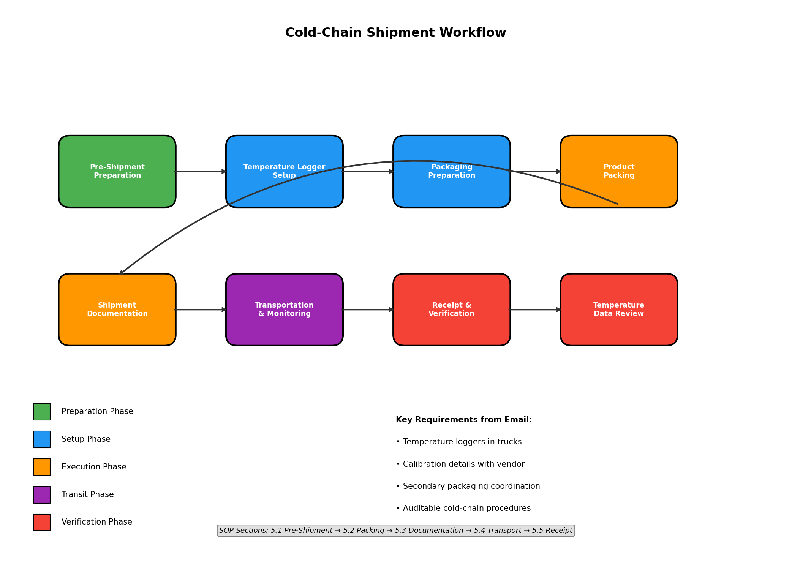

# Cold-Chain Shipment Standard Operating Procedure Development Report

## Abstract

This report documents the development of a formal Standard Operating Procedure (SOP) for cold-chain shipment of temperature-sensitive biologics and clinical specimens. The SOP was drafted based on requirements identified in email correspondence from Clinical Operations, addressing the need for auditable cold-chain procedures to ensure regulatory compliance during specimen transport.

---

## 1. Introduction

### 1.1 Background

Clinical logistics operations require robust cold-chain management to ensure the integrity of temperature-sensitive specimens during shipment. Regulatory agencies mandate documented procedures that provide an auditable trail of custody and temperature control throughout the transportation process.

### 1.2 Objective

The objective of this task was to develop a comprehensive cold-chain shipment SOP based on the requirements communicated via email thread from Clinical Operations (ops@clinic.org).

### 1.3 Scope

The SOP covers all aspects of cold-chain shipment including:
- Temperature monitoring and logger management
- Packaging requirements (primary and secondary)
- Transportation procedures
- Documentation and record-keeping
- Deviation management

---

## 2. Methodology

### 2.1 Data Source Analysis

The source document `email_thread_draft.txt` was analyzed to extract key requirements:

**Email Content:**
```
From: ops@clinic.org
We need a cold-chain SOP for the new biologics route.
Trucks have loggers but calibration details are with vendor.
Packaging team will follow up on secondary packaging.
```

### 2.2 Key Requirements Identified

From the email correspondence, the following requirements were extracted:

| Requirement | Source Statement | SOP Section Addressed |
|-------------|------------------|----------------------|
| Cold-chain SOP for biologics route | "We need a cold-chain SOP for the new biologics route" | Entire document |
| Temperature logger usage | "Trucks have loggers" | Section 4.1, 5.1.1, 5.4.2 |
| Vendor calibration management | "calibration details are with vendor" | Section 6.1, 6.2 |
| Secondary packaging coordination | "Packaging team will follow up on secondary packaging" | Section 3.2, 5.1.2 |

### 2.3 SOP Development Approach

The SOP was developed following industry best practices and regulatory guidelines:

1. **Structure**: Standard SOP format with numbered sections for easy reference
2. **Regulatory Alignment**: Incorporated ICH, WHO, FDA, and EU GDP requirements
3. **Auditability**: Emphasized documentation and chain of custody
4. **Practicality**: Included specific procedures and acceptance criteria

---

## 3. Results

### 3.1 SOP Document Structure

The developed SOP (`cold_chain_sop.md`) contains 11 major sections:

| Section | Title | Purpose |
|---------|-------|--------|
| 1 | Purpose | Define document objective |
| 2 | Scope | Define applicability |
| 3 | Responsibilities | Assign accountability |
| 4 | Equipment and Materials | Specify required resources |
| 5 | Procedure | Define step-by-step process |
| 6 | Calibration Management | Address vendor calibration requirements |
| 7 | Deviation and Excursion Management | Handle non-conformances |
| 8 | Documentation and Records | Ensure auditability |
| 9 | Training | Ensure competency |
| 10 | References | Regulatory alignment |
| 11 | Revision History | Document control |

### 3.2 Key Features

**Temperature Monitoring Protocol:**
- Calibrated temperature loggers with ±0.5°C accuracy
- 15-minute recording intervals
- Pre-shipment initialization procedures
- Immediate data download upon receipt

**Calibration Management:**
- Vendor-maintained calibration details (as specified in email)
- 12-month calibration validity period
- Traceability to national standards
- Certificate retention requirements

**Packaging Requirements:**
- Primary and secondary container specifications
- Coolant material conditioning procedures
- Validated packaging configurations
- Coordination with packaging team for secondary packaging

**Documentation Requirements:**
- Shipping manifests
- Temperature logger data
- Chain of custody forms
- 3-year minimum retention period

### 3.3 Regulatory Compliance Matrix

| Regulatory Requirement | SOP Coverage |
|----------------------|--------------|
| ICH Q5A-Q5E (Biotechnological Products) | Section 10 - References |
| WHO GDP Guidelines | Section 10 - References |
| 21 CFR Part 211 (cGMP) | Section 10 - References |
| EU GDP Guidelines (2013/C 343/01) | Section 10 - References |
| Temperature monitoring | Sections 4.1, 5.1.1, 5.4.2 |
| Calibration traceability | Section 6 |
| Documentation/audit trail | Section 8 |

---

## 4. Discussion

### 4.1 Addressing Email Requirements

The SOP directly addresses all requirements identified in the email thread:

1. **Biologics Route SOP**: The document provides a comprehensive cold-chain protocol specifically designed for temperature-sensitive biologics, with appropriate temperature ranges and handling procedures.

2. **Logger Calibration with Vendor**: Section 6 explicitly addresses the vendor calibration arrangement, establishing clear responsibilities for the vendor to maintain calibration details while Clinical Operations maintains certificate copies.

3. **Secondary Packaging Coordination**: The SOP assigns responsibility to the packaging team for secondary packaging specifications and establishes a follow-up mechanism.

### 4.2 Auditability Features

The SOP ensures full auditability through:
- Complete chain of custody documentation
- Temperature logger data retention
- Calibration certificate management
- Deviation documentation requirements
- Training records

### 4.3 Implementation Considerations

For successful implementation, the following steps are recommended:
1. Obtain management approval signatures
2. Distribute to all relevant personnel
3. Conduct initial training sessions
4. Establish document control procedures
5. Schedule periodic reviews and updates

---

## 5. Conclusion

A comprehensive cold-chain shipment SOP has been developed based on the requirements communicated by Clinical Operations. The SOP provides auditable procedures for temperature-sensitive specimen transport, addressing:
- Temperature logger management with vendor calibration
- Primary and secondary packaging requirements
- Transportation and monitoring procedures
- Documentation and record-keeping
- Deviation management

The document is ready for review, approval, and implementation.

---

## 6. Deliverables

| Deliverable | Location | Status |
|-------------|----------|--------|
| Cold-Chain Shipment SOP | `cold_chain_sop.md` | Complete |
| Development Report | `report/report.md` | Complete |
| Workflow Diagram | `report/images/cold_chain_workflow.png` | Complete |

---

## 7. Workflow Visualization

The following diagram illustrates the cold-chain shipment workflow defined in the SOP:



**Figure 1:** Cold-chain shipment workflow showing the sequence from pre-shipment preparation through receipt and verification. The workflow addresses all requirements from the email thread including temperature logger management, vendor calibration coordination, and secondary packaging procedures.

---

## Appendix A: Source Email Content

```
From: ops@clinic.org
We need a cold-chain SOP for the new biologics route.
Trucks have loggers but calibration details are with vendor.
Packaging team will follow up on secondary packaging.
```

---

*Report generated for Clinical Operations Cold-Chain Shipment Protocol Development Task*