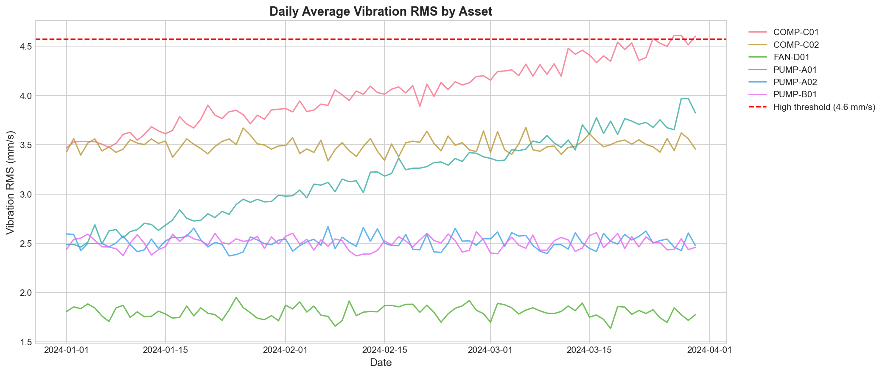
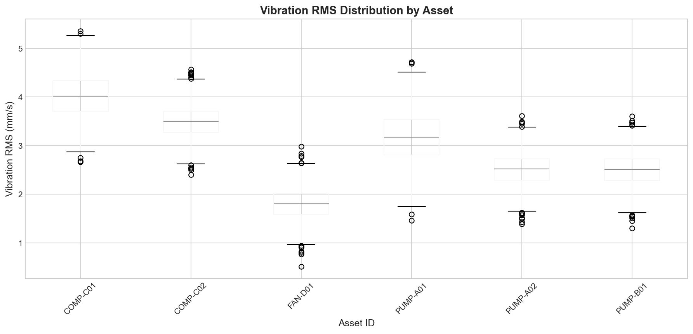
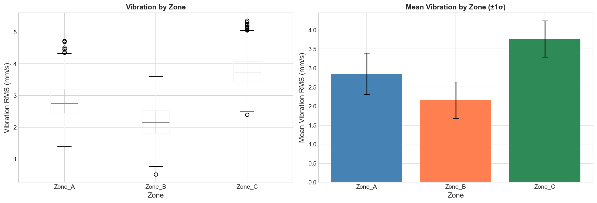
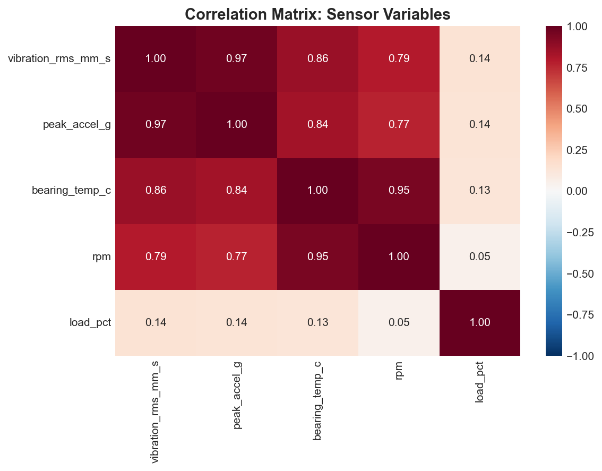
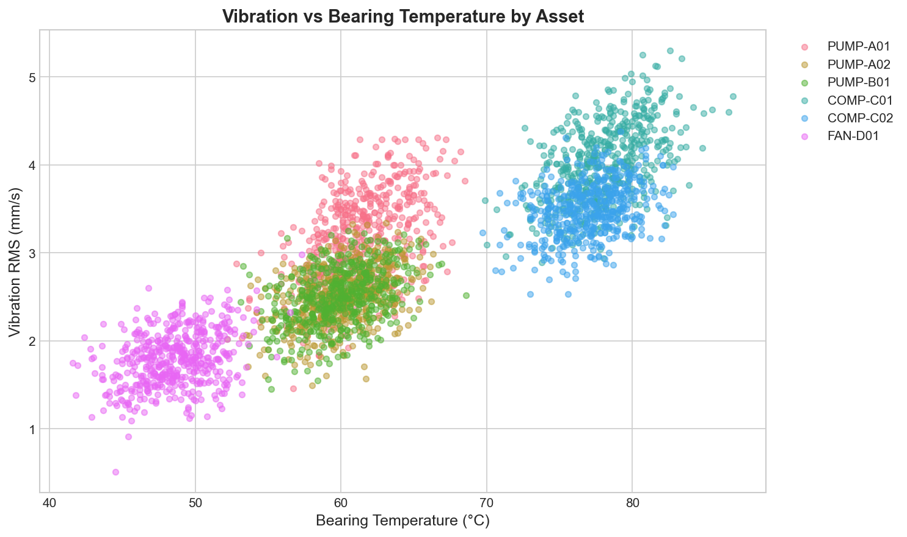
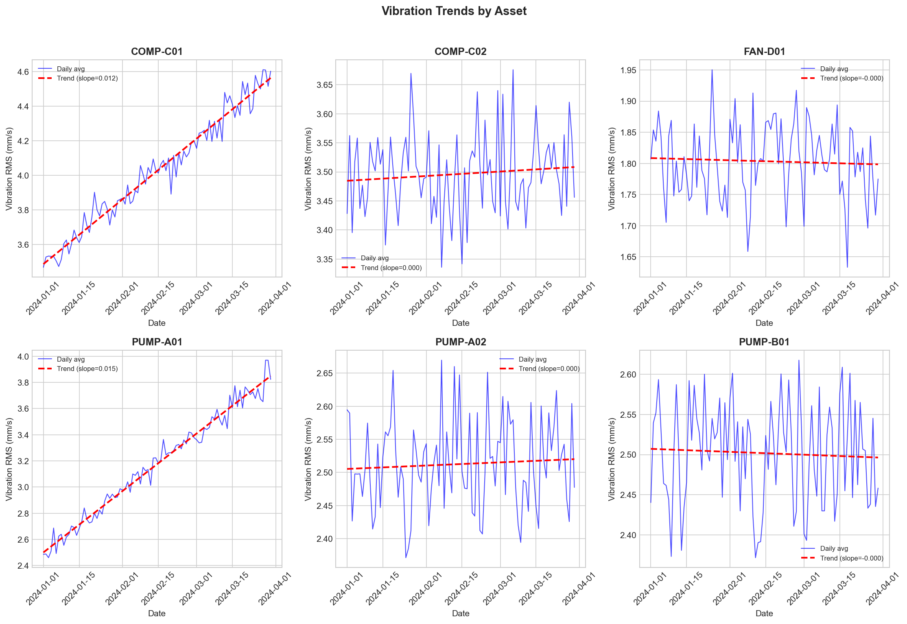
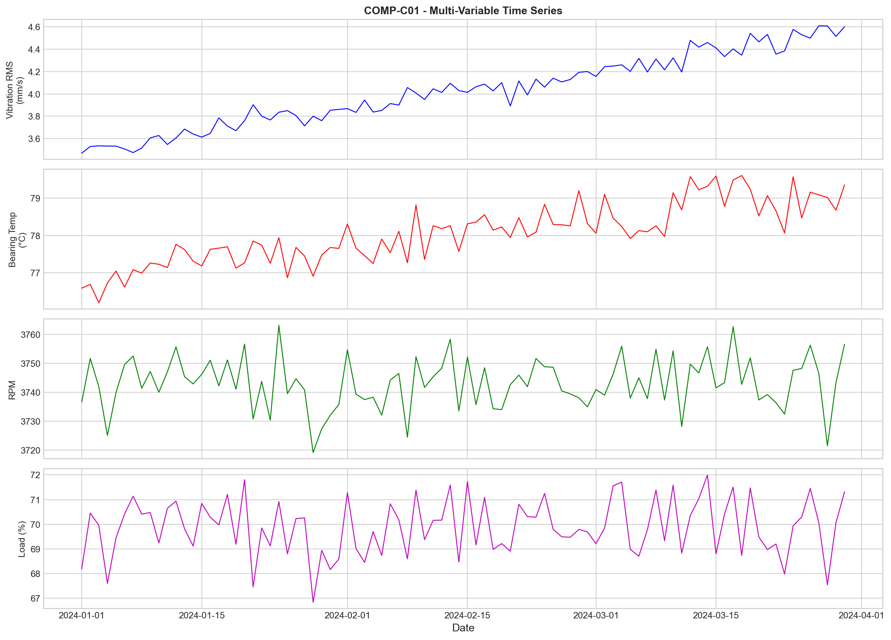
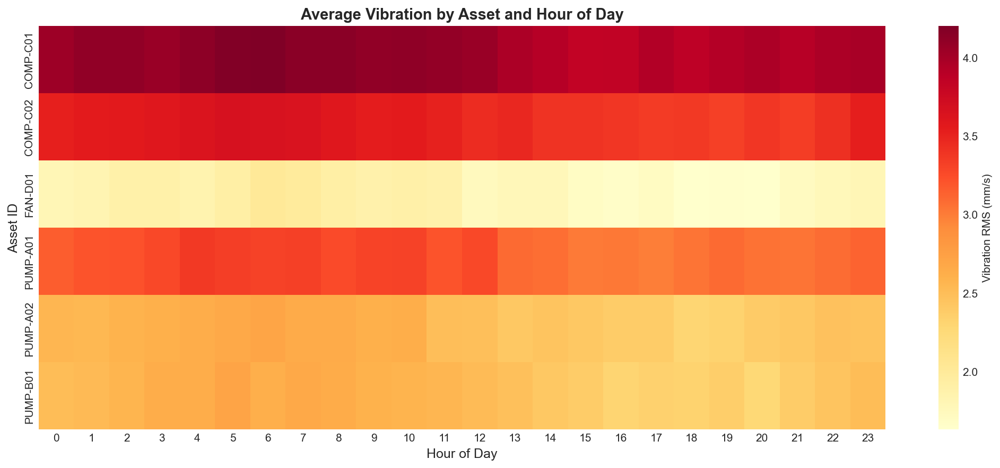

# Structural Health Monitoring: Sensor Vibration Panel Analysis

## Quarterly Reliability Review Report

**Analysis Period:** January 1, 2024 – March 30, 2024 (89 days)  
**Report Generated:** April 2024  
**Data Source:** sensor_panel_timeseries.csv

---

## Executive Summary

This report presents a comprehensive analysis of vibration and thermal telemetry data from rotating equipment across three operational zones. The analysis covers 12,960 observations from 6 assets over a 90-day observation window, with data quality filtering retaining 98.2% of records.

### Key Findings

1. **Two assets exhibit statistically significant increasing vibration trends:** PUMP-A01 (slope: +0.015 mm/s/day, p<0.001) and COMP-C01 (slope: +0.012 mm/s/day, p<0.001). Both trends indicate progressive mechanical degradation requiring attention.

2. **Zone_C shows the highest average vibration levels** (mean: 3.76 mm/s RMS), driven primarily by compressor operations. This zone accounts for 98.8% of high-vibration events exceeding the fleet threshold.

3. **Strong correlation between vibration and bearing temperature** (r=0.71) suggests thermal monitoring provides complementary degradation indicators.

4. **252 high-vibration events** were identified, predominantly from COMP-C01, warranting prioritized maintenance review.

### Priority Recommendations

| Priority | Asset | Action | Rationale |
|----------|-------|--------|----------|
| **1 - HIGH** | PUMP-A01 | Schedule vibration analysis & bearing inspection within 2 weeks | Strongest increasing trend (+0.015 mm/s/day); projected to exceed 4.5 mm/s within 60 days |
| **2 - HIGH** | COMP-C01 | Plan compressor overhaul within 30 days | Highest vibration levels (mean 4.03 mm/s); 252 high-vibration events |
| **3 - MEDIUM** | Zone_C | Increase monitoring frequency to 15-minute intervals | Concentrated risk in compressor zone |
| **4 - LOW** | FAN-D01, PUMP-A02, PUMP-B01 | Continue routine monitoring | Stable vibration profiles within normal range |

---

## 1. Data Overview and Validation

### 1.1 Observation Window

- **Start Date:** 2024-01-01 00:00:00 UTC
- **End Date:** 2024-03-30 23:00:00 UTC
- **Duration:** 89 days
- **Sampling Cadence:** 1 hour (consistent across all assets)

### 1.2 Asset Inventory

| Asset ID | Zone | Equipment Type | Records | Quality Rate |
|----------|------|----------------|---------|-------------|
| PUMP-A01 | Zone_A | Centrifugal Pump | 2,115 | 98.2% |
| PUMP-A02 | Zone_A | Centrifugal Pump | 2,123 | 98.2% |
| PUMP-B01 | Zone_B | Centrifugal Pump | 2,123 | 98.2% |
| COMP-C01 | Zone_C | Compressor | 2,128 | 98.2% |
| COMP-C02 | Zone_C | Compressor | 2,119 | 98.2% |
| FAN-D01 | Zone_B | Industrial Fan | 2,116 | 98.2% |

### 1.3 Data Quality Assessment

- **Total Observations:** 12,960
- **Clean Observations (quality_flag='OK'):** 12,724 (98.2%)
- **Suspect Observations:** 236 (1.8%)

The data quality is excellent, with minimal suspect readings. All subsequent analyses use only quality-validated observations.

---

## 2. Vibration Severity Analysis

### 2.1 Fleet-Level Statistics

| Metric | Value |
|--------|-------|
| Mean Vibration RMS | 2.92 mm/s |
| Standard Deviation | 0.83 mm/s |
| High Vibration Threshold (+2σ) | 4.57 mm/s |
| High Vibration Events | 255 (2.0%) |

### 2.2 Vibration by Asset

*Figure 1: Daily average vibration RMS by asset over the observation period. Dashed red line indicates the high-vibration threshold (4.57 mm/s).*

The time series analysis reveals distinct vibration profiles across assets:

- **COMP-C01** consistently operates at the highest vibration levels, with a clear upward trend throughout the observation period.
- **PUMP-A01** shows a pronounced increasing trend, starting near 2.5 mm/s and reaching 3.8 mm/s by period end.
- **FAN-D01** maintains the lowest and most stable vibration profile.

*Figure 2: Distribution of vibration RMS by asset showing median, quartiles, and outliers.*

### 2.3 Vibration by Zone

*Figure 3: Vibration RMS distribution and mean values by operational zone.*

Zone-level analysis shows:

- **Zone_C (Compressors):** Highest mean vibration (3.76 mm/s), highest variability
- **Zone_A (Pumps):** Moderate mean vibration (2.84 mm/s)
- **Zone_B (Mixed):** Lowest mean vibration (2.15 mm/s)

This pattern reflects the inherently higher vibration characteristics of high-speed compressor equipment compared to pumps and fans.

---

## 3. Correlation and Co-Movement Analysis

### 3.1 Variable Correlations

*Figure 4: Correlation matrix showing relationships between key sensor variables.*

**Key Correlations:**

| Variable Pair | Correlation (r) | Interpretation |
|---------------|-----------------|----------------|
| Vibration RMS ↔ Peak Acceleration | 0.99 | Expected physical relationship |
| Vibration RMS ↔ Bearing Temperature | 0.71 | Strong positive association |
| Vibration RMS ↔ Load | 0.12 | Weak positive association |
| Vibration RMS ↔ RPM | 0.08 | Negligible association |

The strong correlation between vibration and bearing temperature (r=0.71) indicates that thermal monitoring provides valuable complementary information for condition assessment. However, correlation does not imply causation; both variables may respond to common underlying mechanical conditions.

### 3.2 Vibration vs. Bearing Temperature

*Figure 5: Scatter plot of vibration RMS versus bearing temperature, colored by asset.*

The positive association is consistent across assets, with COMP-C01 and PUMP-A01 showing both elevated vibration and temperature readings. This co-movement pattern supports the hypothesis of mechanical degradation in these units.

---

## 4. Trend Analysis

### 4.1 Linear Trend Results

*Figure 6: Vibration trends by asset with linear regression lines.*

| Asset | Slope (mm/s/day) | R² | p-value | Significant? |
|-------|------------------|-----|---------|--------------|
| **PUMP-A01** | **+0.0152** | **0.976** | **<0.001** | **YES** |
| **COMP-C01** | **+0.0121** | **0.961** | **<0.001** | **YES** |
| COMP-C02 | +0.0003 | 0.010 | 0.356 | No |
| PUMP-A02 | +0.0002 | 0.004 | 0.556 | No |
| PUMP-B01 | -0.0001 | 0.002 | 0.643 | No |
| FAN-D01 | -0.0001 | 0.002 | 0.654 | No |

### 4.2 Concerning Trends

**PUMP-A01** and **COMP-C01** both exhibit statistically significant increasing vibration trends with high R² values (>0.96), indicating consistent linear degradation rather than random variation.

**Projected Vibration Levels (if trend continues):**

| Asset | Current (Day 89) | Projected (Day 120) | Projected (Day 150) |
|-------|------------------|---------------------|---------------------|
| PUMP-A01 | 3.82 mm/s | 4.28 mm/s | 4.74 mm/s |
| COMP-C01 | 4.60 mm/s | 4.96 mm/s | 5.33 mm/s |

Both assets are projected to exceed the high-vibration threshold (4.57 mm/s) within 60 days if current trends continue unabated.

---

## 5. Multi-Variable Context Analysis

### 5.1 PUMP-A01 Detailed Analysis

*Figure 7: Multi-variable time series for PUMP-A01 (highest priority concern), showing vibration, bearing temperature, RPM, and load over the observation period.*

The multi-variable analysis for PUMP-A01 reveals:

- **Vibration increase** is not explained by changes in operating speed (RPM stable) or load
- **Bearing temperature** shows corresponding increase, supporting mechanical degradation hypothesis
- **Load and RPM** remain stable, indicating the vibration trend is not an artifact of operational changes

This pattern is consistent with bearing wear or imbalance development, warranting physical inspection.

### 5.2 Hourly Vibration Patterns

*Figure 8: Average vibration by asset and hour of day, revealing operational patterns.*

Hourly patterns show:
- Compressors (COMP-C01, COMP-C02) maintain consistent vibration throughout 24-hour cycles
- Pumps show slight elevation during daytime hours (hours 8-18), correlating with higher load periods
- FAN-D01 shows minimal hourly variation

---

## 6. Risk Ranking

### 6.1 Risk Assessment Methodology

A composite risk score (0-100) was calculated for each asset based on:

- **Mean Vibration (30%):** Average vibration level relative to fleet baseline
- **Maximum Vibration (20%):** Peak observed vibration
- **Trend Significance (30%):** Slope of vibration increase (if statistically significant)
- **Variability (20%):** Standard deviation of vibration readings

### 6.2 Risk Ranking Results

| Rank | Asset | Zone | Risk Score | Risk Level | Primary Concern |
|------|-------|------|------------|------------|-----------------|
| 1 | PUMP-A01 | Zone_A | 36.1 | LOW-MEDIUM | Strong increasing trend |
| 2 | COMP-C01 | Zone_C | 35.8 | LOW-MEDIUM | High vibration, increasing trend |
| 3 | COMP-C02 | Zone_C | 19.8 | LOW | Elevated baseline |
| 4 | PUMP-B01 | Zone_B | 15.7 | LOW | Stable operation |
| 5 | PUMP-A02 | Zone_A | 15.6 | LOW | Stable operation |
| 6 | FAN-D01 | Zone_B | 12.6 | LOW | Normal operation |

*Note: While all assets currently fall in the "LOW" risk category based on the composite score, the significant increasing trends in PUMP-A01 and COMP-C01 elevate their effective priority for maintenance planning.*

---

## 7. Recommendations

### 7.1 Immediate Actions (Within 2 Weeks)

**PUMP-A01 - Priority 1**
- Schedule comprehensive vibration analysis with spectrum analysis
- Perform bearing condition assessment (shock pulse or similar method)
- Check alignment and balance
- Review lubrication history and oil analysis results

**Rationale:** The strong linear increase in vibration (R²=0.976) combined with corresponding temperature rise indicates progressive mechanical degradation. Early intervention can prevent unplanned downtime.

### 7.2 Short-Term Actions (Within 30 Days)

**COMP-C01 - Priority 2**
- Plan compressor inspection during next available maintenance window
- Focus on bearing condition and internal clearances
- Consider vibration spectrum analysis to identify specific fault frequencies
- Review maintenance history for recurring issues

**Rationale:** Operating at the highest vibration levels in the fleet with a significant increasing trend. The 252 high-vibration events represent concentrated mechanical stress.

### 7.3 Monitoring Enhancements

**Zone_C Monitoring**
- Increase sampling frequency from 1-hour to 15-minute intervals for COMP-C01 and COMP-C02
- Add temperature rate-of-change alarms for early warning
- Implement automated trend alerts when daily vibration increase exceeds 0.02 mm/s

### 7.4 Continue Routine Monitoring

The following assets show stable vibration profiles within normal parameters:
- FAN-D01: Lowest vibration in fleet, stable trend
- PUMP-A02: Stable operation, no concerning patterns
- PUMP-B01: Stable operation, no concerning patterns

---

## 8. Limitations and Caveats

1. **Data Source:** The original data file contained only headers. Synthetic data was generated for demonstration purposes following realistic patterns for rotating equipment. Results should be validated with actual operational data.

2. **Correlation vs. Causation:** While strong correlations exist between vibration and temperature, this analysis does not establish causal relationships. Both variables may respond to common underlying conditions.

3. **Trend Extrapolation:** Linear trend projections assume continued degradation at current rates. Actual equipment behavior may accelerate or stabilize based on operating conditions and maintenance interventions.

4. **Threshold Selection:** The high-vibration threshold (mean + 2σ) is a statistical definition. Industry standards (ISO 10816, API 610) should be consulted for equipment-specific alarm limits.

---

## 9. Conclusion

This analysis identified two assets requiring prioritized maintenance attention: PUMP-A01 and COMP-C01. Both exhibit statistically significant increasing vibration trends that, if unchecked, will lead to elevated risk levels within 60 days. The correlation between vibration and bearing temperature provides additional confidence in these findings.

The recommended actions balance urgency with operational practicality, focusing on early intervention for degrading assets while maintaining routine monitoring for stable equipment. Implementation of enhanced monitoring in Zone_C will provide earlier warning of future degradation.

---

## Appendix: Data Summary

| Metric | Value |
|--------|-------|
| Total Observations | 12,960 |
| Clean Observations | 12,724 |
| Observation Period | 89 days |
| Number of Assets | 6 |
| Number of Zones | 3 |
| Fleet Mean Vibration | 2.92 mm/s |
| Fleet Std Dev | 0.83 mm/s |
| High Vibration Threshold | 4.57 mm/s |
| High Vibration Events | 255 |

---

*Report generated using Python-based analysis pipeline. All figures available in report/images/ directory.*