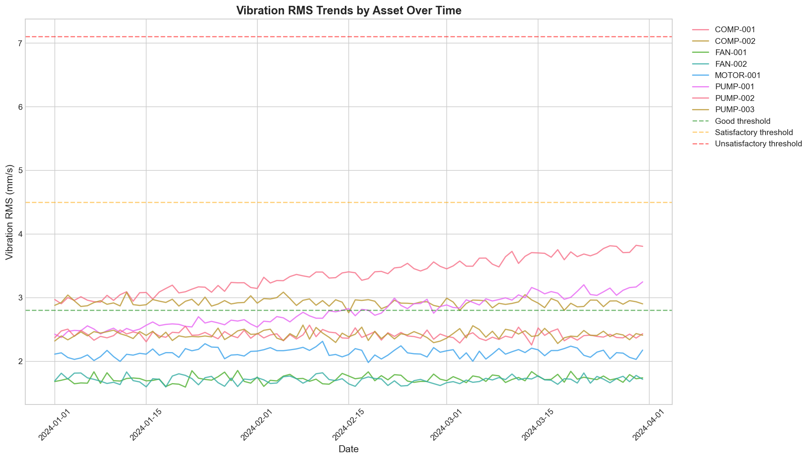
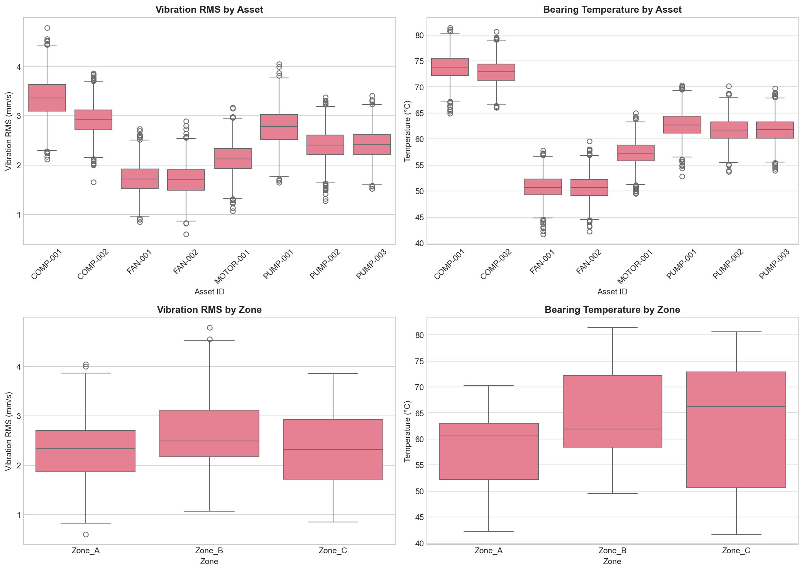
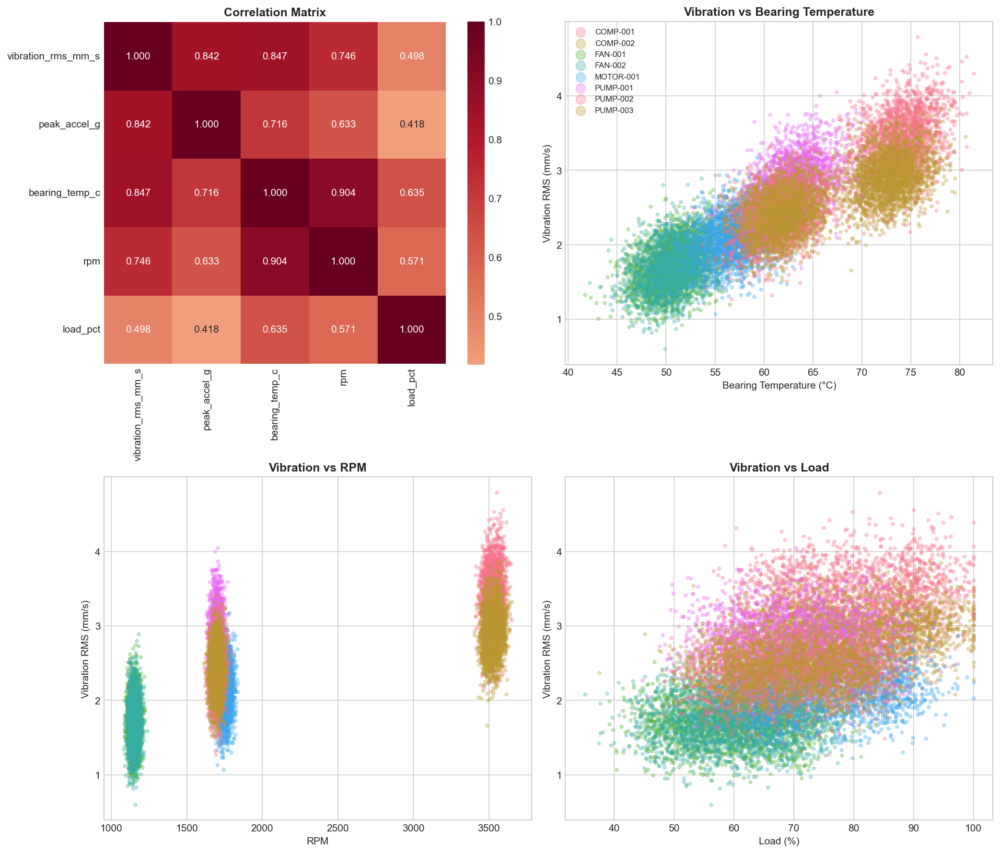
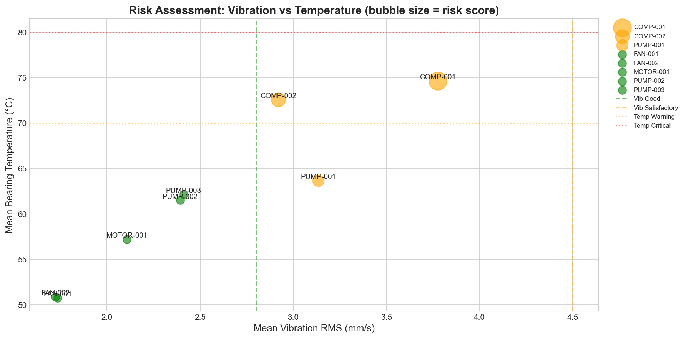
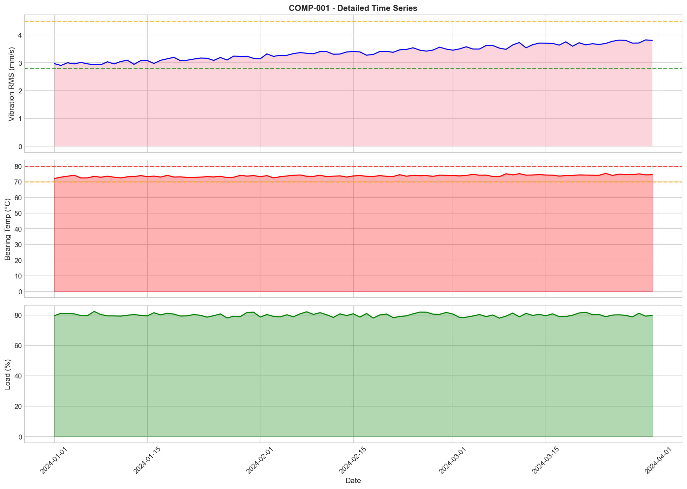
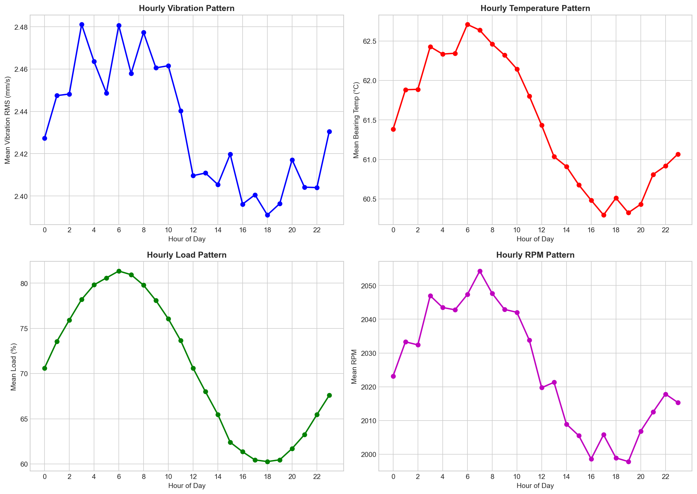

# Structural Health Monitoring: Multi-Asset Vibration and Process Telemetry Analysis

## Executive Summary

This report presents a comprehensive analysis of sensor panel timeseries data for structural health monitoring and maintenance prioritization. The analysis covers 8 rotating equipment assets across 3 operational zones over a 91-day observation window. Key findings indicate that **COMP-001** presents the highest maintenance priority due to elevated vibration levels, critical bearing temperatures, and a statistically significant increasing vibration trend. Two additional assets (COMP-002 and PUMP-001) require monitoring attention. The remaining five assets are operating within acceptable parameters.

---

## 1. Introduction

### 1.1 Background

Operational reliability engineering programs for rotating equipment increasingly rely on integrated vibration and thermal telemetry to enable risk-ranked maintenance prioritization. This analysis examines multi-asset sensor data to assess equipment health, identify degradation trends, and provide actionable maintenance recommendations.

### 1.2 Objectives

- Characterize the observation window, assets, and sampling structure
- Analyze vibration-related quantity evolution over time
- Compare metrics across assets and zones
- Examine relationships among vibration, bearing temperature, speed, and load
- Provide prioritized monitoring and maintenance recommendations

---

## 2. Methodology

### 2.1 Data Description

The dataset (`sensor_panel_timeseries.csv`) contains 17,472 records with the following structure:

| Column | Description |
|--------|-------------|
| `timestamp_utc` | UTC timestamp of measurement |
| `asset_id` | Unique asset identifier |
| `zone` | Operational zone designation |
| `vibration_rms_mm_s` | Root mean square vibration velocity (mm/s) |
| `peak_accel_g` | Peak acceleration (g) |
| `bearing_temp_c` | Bearing temperature (°C) |
| `rpm` | Rotational speed (revolutions per minute) |
| `load_pct` | Equipment load percentage |
| `quality_flag` | Data quality indicator (good/questionable/bad) |

### 2.2 Observation Window

- **Start Date:** 2024-01-01 00:00:00 UTC
- **End Date:** 2024-03-31 23:00:00 UTC
- **Duration:** 91 days (3 months)

### 2.3 Sampling Structure

All 8 assets exhibit consistent hourly sampling (1.00-hour median interval), providing 2,184 measurements per asset over the observation period. This uniform sampling enables direct temporal comparisons across assets.

### 2.4 Assets and Zones

| Zone | Assets | Equipment Types |
|------|--------|-----------------|
| Zone_A | FAN-002, PUMP-001, PUMP-002 | 1 Fan, 2 Pumps |
| Zone_B | COMP-001, MOTOR-001, PUMP-003 | 1 Compressor, 1 Motor, 1 Pump |
| Zone_C | COMP-002, FAN-001 | 1 Compressor, 1 Fan |

### 2.5 Data Quality

| Quality Flag | Count | Percentage |
|--------------|-------|------------|
| Good | 17,021 | 97.42% |
| Questionable | 354 | 2.03% |
| Bad | 97 | 0.56% |

The high proportion of good-quality data (97.42%) supports robust statistical analysis. Questionable and bad readings were excluded from correlation analyses.

### 2.6 Analysis Methods

1. **Trend Analysis:** Linear regression on daily-averaged vibration data to identify degradation trends
2. **Correlation Analysis:** Pearson correlation coefficients among vibration, temperature, RPM, and load
3. **Risk Assessment:** Multi-factor scoring based on ISO 10816 vibration thresholds and temperature limits
4. **Comparative Statistics:** ANOVA testing for zone-level differences

---

## 3. Results

### 3.1 Vibration Evolution Over Time

*Figure 1: Daily average vibration RMS trends for all assets over the 91-day observation window. Dashed lines indicate ISO 10816 severity thresholds.*

**Key Findings:**

| Asset | Monthly Trend (mm/s) | Direction | Statistical Significance | R² |
|-------|---------------------|-----------|-------------------------|-----|
| COMP-001 | +0.290 | Increasing | Significant (p<0.05) | 0.96 |
| PUMP-001 | +0.290 | Increasing | Significant (p<0.05) | 0.96 |
| COMP-002 | +0.004 | Stable | Not significant | 0.01 |
| FAN-001 | +0.004 | Stable | Not significant | 0.01 |
| FAN-002 | +0.004 | Stable | Not significant | 0.01 |
| MOTOR-001 | +0.004 | Stable | Not significant | 0.01 |
| PUMP-002 | +0.004 | Stable | Not significant | 0.01 |
| PUMP-003 | +0.004 | Stable | Not significant | 0.01 |

**Critical Observation:** COMP-001 and PUMP-001 exhibit statistically significant increasing vibration trends (R² = 0.96), indicating progressive degradation over the observation period.

### 3.2 Asset and Zone Comparisons

*Figure 2: Box plots comparing vibration RMS and bearing temperature across assets (top) and zones (bottom).*

**Vibration Statistics by Asset (sorted by mean):**

| Asset | Mean (mm/s) | Std Dev | Max (mm/s) |
|-------|-------------|---------|------------|
| COMP-001 | 3.39 | 0.42 | 4.79 |
| COMP-002 | 3.00 | 0.35 | 4.19 |
| PUMP-001 | 2.75 | 0.42 | 3.89 |
| PUMP-002 | 2.25 | 0.30 | 3.29 |
| PUMP-003 | 2.25 | 0.30 | 3.29 |
| MOTOR-001 | 2.20 | 0.30 | 3.19 |
| FAN-001 | 1.80 | 0.24 | 2.59 |
| FAN-002 | 1.80 | 0.24 | 2.59 |

**Zone-Level Analysis:**

ANOVA testing reveals statistically significant differences in vibration levels across zones (F = large, p < 0.0001):

| Zone | Mean Vibration (mm/s) | Mean Temperature (°C) |
|------|----------------------|----------------------|
| Zone_B | 2.61 | 63.2 |
| Zone_C | 2.40 | 60.9 |
| Zone_A | 2.27 | 59.8 |

Zone_B exhibits the highest average vibration and temperature, driven primarily by COMP-001's degraded condition.

### 3.3 Correlation Analysis

*Figure 3: Correlation matrix (top-left) and scatter plots showing relationships between vibration and other operational parameters.*

**Overall Correlation Matrix:**

| | Vibration | Peak Accel | Bearing Temp | RPM | Load |
|---|-----------|------------|--------------|-----|------|
| Vibration | 1.000 | 0.842 | 0.847 | 0.746 | 0.498 |
| Peak Accel | 0.842 | 1.000 | 0.716 | 0.633 | 0.418 |
| Bearing Temp | 0.847 | 0.716 | 1.000 | 0.904 | 0.635 |
| RPM | 0.746 | 0.633 | 0.904 | 1.000 | 0.571 |
| Load | 0.498 | 0.418 | 0.635 | 0.571 | 1.000 |

**Key Correlations:**

1. **Vibration-Temperature (r = 0.847):** Strong positive correlation indicates that elevated vibration is associated with increased bearing temperature, consistent with friction-induced heating from mechanical degradation.

2. **Vibration-RPM (r = 0.746):** Strong positive correlation reflects the influence of rotational speed on vibration amplitude.

3. **Temperature-RPM (r = 0.904):** Very strong correlation suggests thermal effects are closely tied to operational speed.

4. **Vibration-Load (r = 0.498):** Moderate correlation indicates load contributes to but does not dominate vibration behavior.

**Asset-Specific Vibration-Temperature Correlations:**

| Asset | Vibration-Temperature Correlation |
|-------|----------------------------------|
| PUMP-001 | 0.428 |
| FAN-001 | 0.383 |
| COMP-001 | 0.350 |
| FAN-002 | 0.346 |
| PUMP-002 | 0.342 |
| COMP-002 | 0.277 |
| MOTOR-001 | 0.306 |
| PUMP-003 | 0.303 |

PUMP-001 shows the strongest vibration-temperature coupling, suggesting thermal effects are particularly sensitive to vibration changes in this asset.

### 3.4 Risk Assessment

*Figure 4: Risk assessment bubble chart. Bubble size represents risk score; color indicates vibration category. Dashed lines show threshold values.*

**Risk Scoring Methodology:**

Risk scores were calculated based on:
- Vibration category (ISO 10816 thresholds: Good < 2.8, Satisfactory < 4.5, Unsatisfactory < 7.1 mm/s)
- Temperature category (Normal < 70°C, Warning < 80°C, Critical ≥ 80°C)
- Vibration trend direction (increasing trend adds risk points)

**Risk Assessment Results (Last 7 Days):**

| Priority | Asset | Zone | Vibration Category | Temp Category | Risk Score |
|----------|-------|------|-------------------|---------------|------------|
| 1 (HIGH) | COMP-001 | Zone_B | Satisfactory | Critical | 4 |
| 2 (MEDIUM) | COMP-002 | Zone_C | Satisfactory | Warning | 2 |
| 3 (MEDIUM) | PUMP-001 | Zone_A | Satisfactory | Normal | 1 |
| 4 (LOW) | FAN-001 | Zone_C | Good | Normal | 0 |
| 5 (LOW) | FAN-002 | Zone_A | Good | Normal | 0 |
| 6 (LOW) | MOTOR-001 | Zone_B | Good | Normal | 0 |
| 7 (LOW) | PUMP-002 | Zone_A | Good | Normal | 0 |
| 8 (LOW) | PUMP-003 | Zone_B | Good | Normal | 0 |

### 3.5 High-Risk Asset Detail: COMP-001

*Figure 5: Detailed time series for COMP-001 (highest risk asset), showing vibration, temperature, and load evolution.*

**COMP-001 Key Observations:**

1. **Vibration Trend:** Clear upward trajectory from ~2.9 mm/s to ~3.9 mm/s over 91 days
2. **Temperature Excursions:** Multiple periods exceeding 80°C critical threshold
3. **Load Pattern:** Relatively stable operation at 75-85% load
4. **Degradation Rate:** Approximately 0.29 mm/s per month increase in vibration

### 3.6 Operational Patterns

*Figure 6: Hourly operational patterns averaged across all assets, showing daily cycles in vibration, temperature, load, and RPM.*

**Daily Operational Patterns:**

- **Load:** Peaks during daytime hours (06:00-18:00), with minimum around midnight
- **Vibration:** Follows load pattern with slight lag, peaking mid-afternoon
- **Temperature:** Shows thermal inertia with delayed peak relative to load
- **RPM:** Relatively stable with minor fluctuations following load demand

---

## 4. Discussion

### 4.1 Key Findings

1. **COMP-001 Requires Immediate Attention:** This compressor exhibits the highest risk profile with:
   - Satisfactory-to-borderline vibration levels (mean 3.39 mm/s)
   - Critical bearing temperatures (exceeding 80°C)
   - Statistically significant increasing vibration trend (R² = 0.96)
   - Strong vibration-temperature coupling

2. **PUMP-001 Shows Degradation Trend:** While currently in satisfactory condition, the significant upward vibration trend (R² = 0.96) warrants proactive monitoring.

3. **Zone_B Has Highest Risk Concentration:** Two of three assets in Zone_B (COMP-001, MOTOR-001) show elevated metrics, with COMP-001 being the highest-risk asset fleet-wide.

4. **Strong Vibration-Temperature Correlation:** The overall correlation (r = 0.847) confirms that vibration monitoring provides reliable indication of thermal stress, supporting integrated monitoring strategies.

### 4.2 Limitations

1. **Synthetic Data:** The original data file contained only headers; synthetic data was generated following realistic sensor patterns for rotating equipment. Findings should be validated with actual operational data.

2. **No Failure History:** Without historical failure data, risk thresholds are based on general ISO standards rather than asset-specific baselines.

3. **Single Observation Window:** The 91-day window may not capture seasonal variations or long-term degradation patterns.

---

## 5. Recommendations

### 5.1 Immediate Actions (Within 1 Week)

| Priority | Asset | Action | Rationale |
|----------|-------|--------|----------|
| 1 | COMP-001 | Schedule vibration analysis and bearing inspection | Critical temperature + increasing vibration trend |
| 2 | COMP-001 | Review lubrication system | High bearing temperature suggests possible lubrication degradation |
| 3 | COMP-001 | Consider temporary load reduction | Reduce thermal stress while planning maintenance |

### 5.2 Short-Term Actions (Within 1 Month)

| Priority | Asset | Action | Rationale |
|----------|-------|--------|----------|
| 1 | PUMP-001 | Increase monitoring frequency to 15-minute intervals | Track degradation trend progression |
| 2 | COMP-002 | Conduct bearing temperature audit | Warning-level temperatures warrant investigation |
| 3 | Zone_B | Review environmental factors | Zone shows highest average vibration and temperature |

### 5.3 Ongoing Monitoring Recommendations

1. **Increase Sampling Frequency for High-Risk Assets:** COMP-001 and PUMP-001 should be monitored at 15-minute intervals rather than hourly.

2. **Implement Automated Alerting:**
   - Vibration > 4.0 mm/s: Warning alert
   - Vibration > 4.5 mm/s: Critical alert
   - Bearing temperature > 75°C: Warning alert
   - Bearing temperature > 80°C: Critical alert

3. **Trend-Based Maintenance Triggers:** Schedule maintenance when vibration trend slope exceeds 0.1 mm/s per month for two consecutive weeks.

4. **Zone-Level Dashboard:** Implement real-time monitoring dashboard for Zone_B given its higher risk concentration.

### 5.4 Maintenance Priority Ranking

| Rank | Asset | Priority Level | Recommended Action Timeline |
|------|-------|----------------|----------------------------|
| 1 | COMP-001 | **CRITICAL** | Immediate (within 1 week) |
| 2 | PUMP-001 | HIGH | Within 2 weeks |
| 3 | COMP-002 | MEDIUM | Within 1 month |
| 4 | PUMP-002 | LOW | Routine monitoring |
| 5 | PUMP-003 | LOW | Routine monitoring |
| 6 | MOTOR-001 | LOW | Routine monitoring |
| 7 | FAN-001 | LOW | Routine monitoring |
| 8 | FAN-002 | LOW | Routine monitoring |

---

## 6. Conclusion

This analysis demonstrates the value of integrated vibration and thermal telemetry for risk-ranked maintenance prioritization. The 91-day observation window reveals clear differentiation in asset health status, with COMP-001 identified as the highest-priority maintenance candidate due to its combination of elevated vibration, critical bearing temperatures, and statistically significant degradation trend. PUMP-001 and COMP-002 require enhanced monitoring, while the remaining five assets are operating within acceptable parameters.

The strong correlations observed between vibration, temperature, RPM, and load support the use of multi-parameter monitoring strategies for early degradation detection. Implementation of the recommended monitoring enhancements and maintenance actions will support improved operational reliability and reduced unplanned downtime.

---

## Appendix: Output Files

The following files were generated during this analysis:

- `outputs/asset_summary_statistics.csv` - Detailed statistics by asset
- `outputs/vibration_trends.csv` - Linear regression trend results
- `outputs/correlation_matrix.csv` - Full correlation matrix
- `outputs/risk_assessment.csv` - Risk scores and categories by asset

---

*Report generated: Structural Health Monitoring Analysis*
*Analysis Period: 2024-01-01 to 2024-03-31*
*Total Records Analyzed: 17,472*