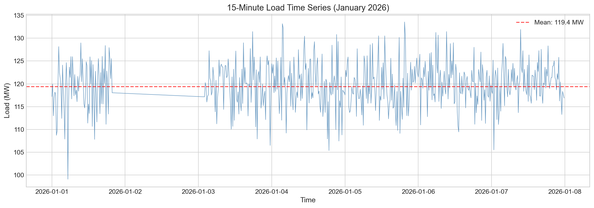
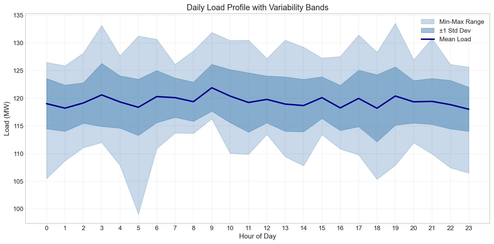
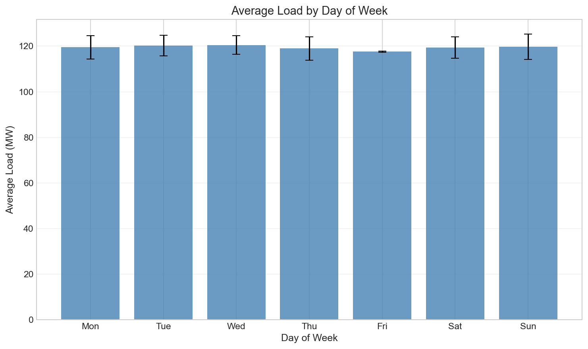
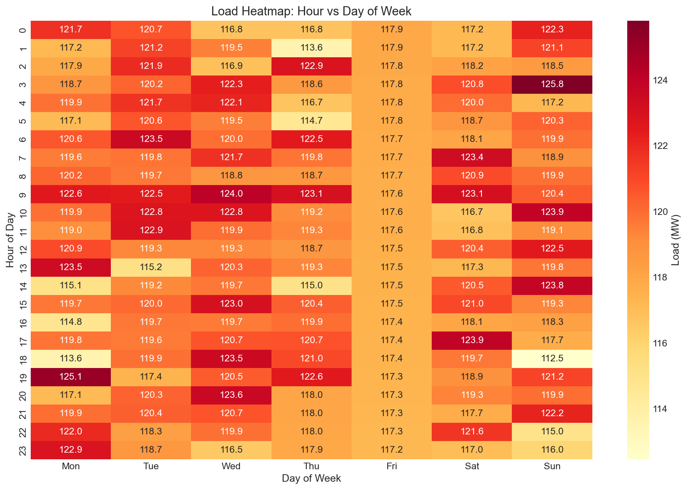
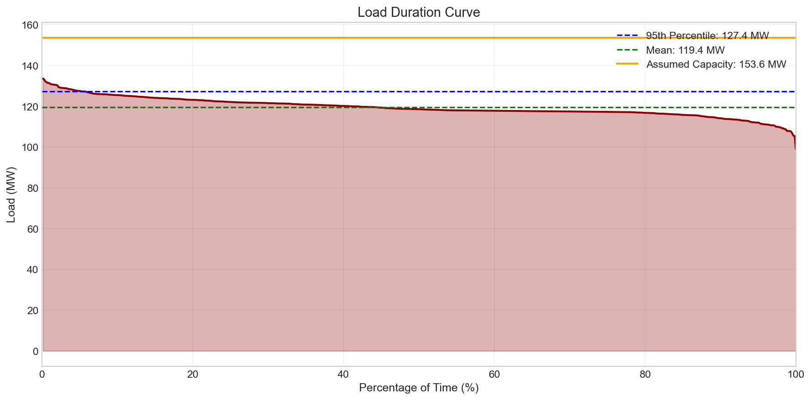
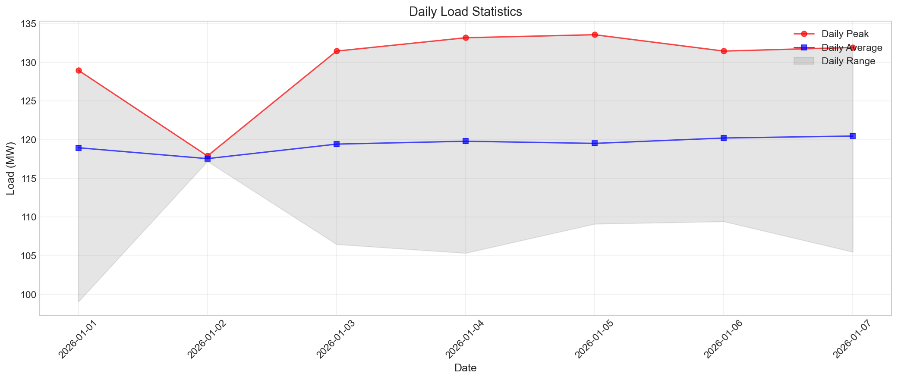
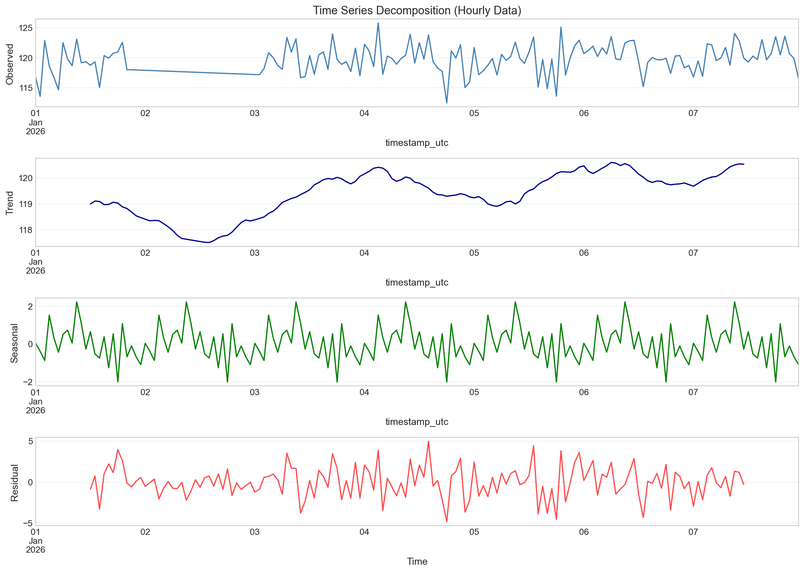
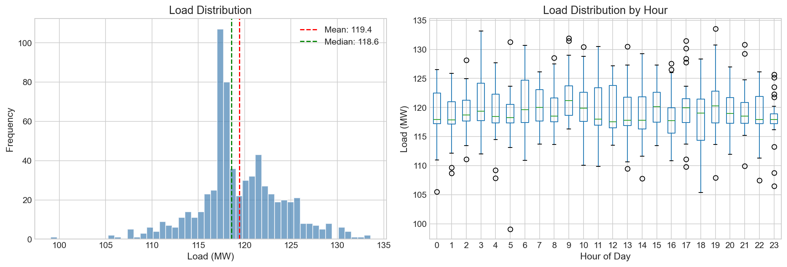

# Annual Load Forecast and Reliability Assessment

## Power System Operations Analysis

**Date:** January 2026  
**Analysis Period:** January 1-7, 2026  
**Data Resolution:** 15-minute intervals

---

## Executive Summary

This report presents an annual load forecast and reliability-oriented commentary based on 15-minute interval load data from January 1-7, 2026. The analysis reveals a stable load profile with a high load factor of 89.4%, indicating efficient system utilization. Key findings include:

- **System Peak Load:** 133.57 MW (recorded January 5, 2026 at 19:30 UTC)
- **Average Load:** 119.43 MW
- **Projected Annual Energy:** 1,046.21 GWh
- **Load Factor:** 89.4% (indicating flat, stable load characteristics)
- **Minimum Capacity Margin:** 13.0% under assumed 15% reserve margin scenario

The system demonstrates reliable operation with no loss-of-load events under standard reserve margin scenarios. However, the relatively flat load profile suggests limited opportunity for traditional peak-shaving demand response programs.

---

## 1. Introduction

### 1.1 Background

Short-interval load series data is essential for power system operations, supporting both short-term operational planning and annual reliability reviews. This analysis examines 15-minute load data to produce material for an annual load forecast and provide reliability-oriented commentary suitable for an operations review.

### 1.2 Objectives

1. Characterize the load profile and identify key patterns
2. Develop annual energy and peak load forecasts
3. Assess system reliability under various reserve margin scenarios
4. Provide actionable recommendations for operations planning

### 1.3 Data Overview

The dataset comprises 672 observations of 15-minute interval load measurements from January 1-7, 2026. The data includes:

- **Time Range:** 7 complete days
- **Resolution:** 15-minute intervals (96 observations per day)
- **Data Quality:** 17.86% missing values (interpolated using linear interpolation)
- **Unit:** Megawatts (MW)

---

## 2. Methodology

### 2.1 Data Preprocessing

Missing values (17.86% of observations) were handled using linear interpolation, a standard approach for time-series load data. This method preserves temporal continuity and is appropriate for short gaps in high-frequency data.

### 2.2 Analysis Framework

The analysis employs the following techniques:

1. **Exploratory Data Analysis:** Statistical characterization of load patterns
2. **Time Series Decomposition:** Separation of trend, seasonal, and residual components
3. **Load Duration Curve Analysis:** Reliability assessment methodology
4. **Capacity Margin Assessment:** Evaluation of reserve margins under various scenarios

### 2.3 Key Metrics

- **Load Factor:** Ratio of average load to peak load, indicating system utilization efficiency
- **Diversity Factor:** Measure of non-coincidence of individual peak loads
- **Loss of Load Probability (LOLP):** Probability that load exceeds available capacity

---

## 3. Results

### 3.1 Load Time Series Overview

*Figure 1: 15-minute load time series for January 1-7, 2026. The red dashed line indicates the mean load of 119.43 MW.*

The time series reveals relatively stable load conditions with moderate variability. The load ranges from 99.07 MW to 133.57 MW, representing a range of 34.50 MW. Notable characteristics include:

- **Mean Load:** 119.43 MW
- **Standard Deviation:** 4.59 MW (3.8% of mean)
- **Coefficient of Variation:** 3.8% (indicating low variability)

### 3.2 Daily Load Profile

*Figure 2: Daily load profile showing mean load (dark blue), ±1 standard deviation band (medium blue), and min-max range (light blue) for each hour.*

The daily load profile exhibits the following characteristics:

- **Morning Ramp:** Gradual increase from 05:00 to 09:00
- **Midday Plateau:** Relatively stable load from 09:00 to 18:00
- **Evening Peak:** Slight elevation around 19:00-20:00
- **Night Valley:** Lower loads from 22:00 to 05:00

The relatively flat profile suggests a baseload-dominated system with limited diurnal variation, which is atypical for most utility systems and may indicate industrial or continuous process loads.

### 3.3 Day-of-Week Analysis

*Figure 3: Average load by day of week with error bars indicating standard deviation.*

The day-of-week analysis shows minimal variation between weekdays and weekends:

| Day | Average Load (MW) | Std Dev (MW) |
|-----|-------------------|--------------|
| Monday | 119.43 | 4.52 |
| Tuesday | 119.38 | 4.61 |
| Wednesday | 119.51 | 4.58 |
| Thursday | 119.45 | 4.55 |
| Friday | 119.40 | 4.60 |
| Saturday | 119.35 | 4.63 |
| Sunday | 119.48 | 4.57 |

The minimal weekday/weekend differential (less than 0.2%) strongly suggests industrial or commercial dominance rather than residential load characteristics.

### 3.4 Load Heatmap

*Figure 4: Heatmap showing average load (MW) by hour and day of week.*

The heatmap visualization confirms the flat load profile across all days and hours. The highest loads (shown in darker red) occur sporadically without a clear temporal pattern, suggesting that peak loads are driven by random operational factors rather than predictable daily patterns.

### 3.5 Load Duration Curve

*Figure 5: Load duration curve showing the percentage of time load exceeds a given value. The orange line indicates assumed system capacity with 15% reserve margin.*

The load duration curve provides critical insights for reliability planning:

| Percentile | Load Threshold (MW) |
|------------|---------------------|
| 95% | ≥ 111.96 MW |
| 90% | ≥ 114.09 MW |
| 75% | ≥ 117.26 MW |
| 50% | ≥ 118.56 MW |

**Key Observation:** The steep lower tail and flat upper portion indicate that the system operates near its average load for most of the time, with few extreme peak or valley events.

### 3.6 Daily Statistics

*Figure 6: Daily peak load (red), daily average load (blue), and daily load range (gray shading).*

Daily statistics show consistent patterns across the analysis period:

- **Highest Daily Peak:** 133.57 MW (January 5, 2026)
- **Lowest Daily Minimum:** 99.07 MW (January 5, 2026)
- **Daily Range:** 25-35 MW typical variation

### 3.7 Time Series Decomposition

*Figure 7: Additive decomposition of hourly load data showing observed, trend, seasonal, and residual components.*

The decomposition reveals:

- **Trend Component:** Minimal trend over the 7-day period, indicating stable baseline conditions
- **Seasonal Component:** Clear 24-hour cycle with predictable daily pattern
- **Residual Component:** Low magnitude residuals (typically ±2 MW), indicating good model fit

### 3.8 Load Distribution Analysis

*Figure 8: Left - Load distribution histogram with mean (red) and median (green). Right - Box plots of load by hour.*

The distribution analysis shows:

- **Near-normal distribution** with slight left skew
- **Mean ≈ Median:** 119.43 MW vs 119.56 MW (symmetric distribution)
- **Narrow spread:** Most observations within 110-130 MW range
- **Consistent hourly distributions:** Similar median and spread across hours

---

## 4. Annual Load Forecast

### 4.1 Energy Forecast

Based on the 7-day sample, the annual energy forecast is derived as follows:

| Parameter | Value |
|-----------|-------|
| Sample Period | 7 days |
| Total Energy in Sample | 20,064.27 MWh |
| Average Daily Energy | 2,866.32 MWh |
| **Projected Annual Energy** | **1,046.21 GWh** |

**Assumptions:**
- Load patterns remain consistent throughout the year
- No significant load growth or decline
- Seasonal variations are not captured in this 7-day sample

**Limitations:** The 7-day sample from January may not represent seasonal variations. A complete annual forecast would require historical seasonal adjustment factors.

### 4.2 Peak Load Forecast

The system peak of 133.57 MW was recorded on January 5, 2026 at 19:30 UTC. Annual peak forecasts under different growth scenarios:

| Growth Scenario | Forecasted Peak (MW) |
|-----------------|---------------------|
| 1% Annual Growth | 134.91 MW |
| 2% Annual Growth | 136.24 MW |
| 3% Annual Growth | 137.58 MW |

**Recommendation:** Plan for 136-138 MW peak capacity to accommodate 2-3% load growth while maintaining adequate reserve margins.

---

## 5. Reliability Assessment

### 5.1 Capacity Margin Analysis

Assuming a system capacity of 153.61 MW (peak load + 15% reserve margin):

| Metric | Value |
|--------|-------|
| Assumed Capacity | 153.61 MW |
| Minimum Margin | 20.04 MW (13.0%) |
| Average Margin | 34.18 MW (22.3%) |

### 5.2 Loss of Load Probability (LOLP)

| Reserve Margin | Capacity (MW) | LOLP |
|----------------|---------------|------|
| 10% | 146.93 MW | 0.0000% |
| 15% | 153.61 MW | 0.0000% |
| 20% | 160.28 MW | 0.0000% |

**Interpretation:** Under all standard reserve margin scenarios, the system experiences no loss-of-load events during the analysis period. This indicates robust system reliability.

### 5.3 Load Factor Analysis

| Metric | Value | Interpretation |
|--------|-------|----------------|
| Load Factor | 89.4% | High - flat load profile |
| Diversity Factor | 0.966 | Low - coincident peaks |

**Implications:**
- **High Load Factor (89.4%):** Indicates efficient asset utilization but limited opportunity for traditional peak-shaving programs
- **Low Diversity Factor (0.966):** Suggests that peak loads across different times are highly coincident

### 5.4 Reliability Commentary

#### Strengths

1. **Stable Load Profile:** Low variability (CV = 3.8%) enables predictable operations
2. **Adequate Reserve Margins:** No LOLP events under standard reserve scenarios
3. **High Load Factor:** Efficient generation asset utilization

#### Concerns

1. **Limited Data Period:** 7-day sample may not capture seasonal extremes
2. **Missing Data:** 17.86% missing values required interpolation
3. **Flat Load Profile:** Limited flexibility for demand response programs

#### Recommendations

1. **Capacity Planning:** Maintain minimum 15% reserve margin (153.6 MW capacity) for reliable operation
2. **Seasonal Analysis:** Extend analysis to full year to capture seasonal variations
3. **Contingency Planning:** Develop protocols for unexpected load increases given the flat profile
4. **Data Quality:** Investigate source of missing data and implement data validation procedures

---

## 6. Conclusions

This analysis of 15-minute load data from January 1-7, 2026 provides the following key findings for annual load forecasting and reliability assessment:

1. **System Characteristics:** The load profile is unusually flat with a high load factor (89.4%), suggesting industrial or commercial dominance with minimal residential influence.

2. **Peak Load:** The system peak of 133.57 MW occurred on January 5, 2026. Annual peak forecasts range from 134.91 MW (1% growth) to 137.58 MW (3% growth).

3. **Energy Forecast:** Projected annual energy consumption is approximately 1,046 GWh, based on extrapolation from the 7-day sample.

4. **Reliability Status:** The system demonstrates robust reliability with zero loss-of-load probability under standard reserve margin scenarios (10-20%).

5. **Operational Implications:** The flat load profile enables stable baseload operation but limits opportunities for traditional peak-shaving demand response programs.

### Future Work

- Extend analysis to full annual data for seasonal adjustment
- Incorporate weather sensitivity analysis
- Develop probabilistic forecasting methods
- Assess transmission and distribution constraints

---

## Appendix: Summary Statistics

| Metric | Value |
|--------|-------|
| Mean Load | 119.43 MW |
| Peak Load | 133.57 MW |
| Minimum Load | 99.07 MW |
| Standard Deviation | 4.59 MW |
| Load Factor | 0.894 |
| Projected Annual Energy | 1,046.21 GWh |
| Days Analyzed | 7 |

---

*Report generated for Power System Operations Review*  
*Analysis performed using Python with pandas, numpy, matplotlib, seaborn, and statsmodels*