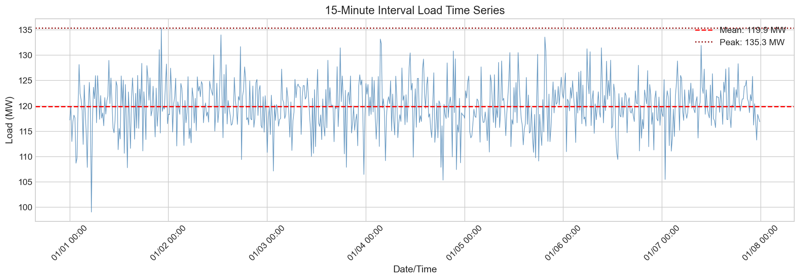
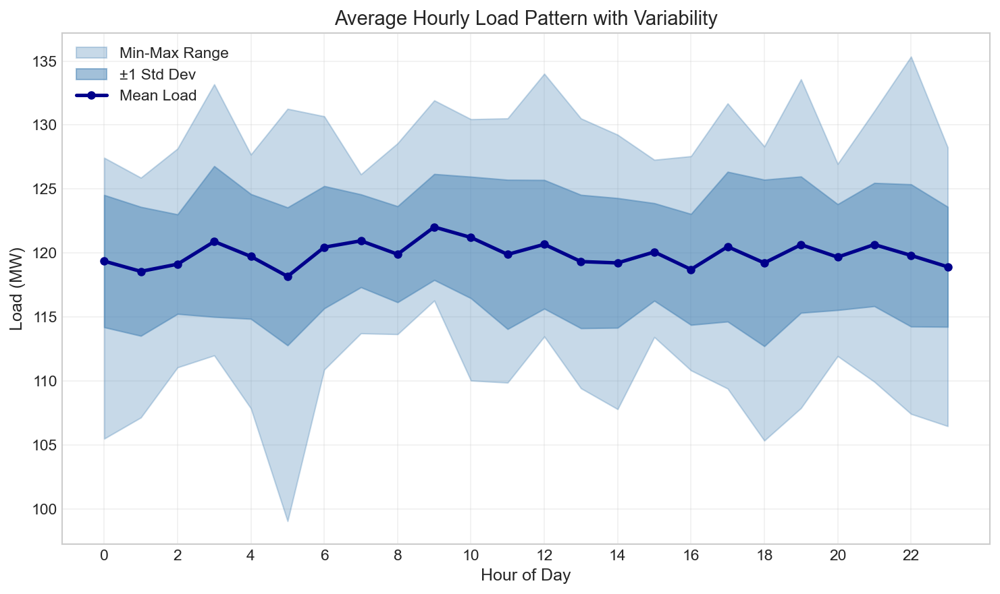
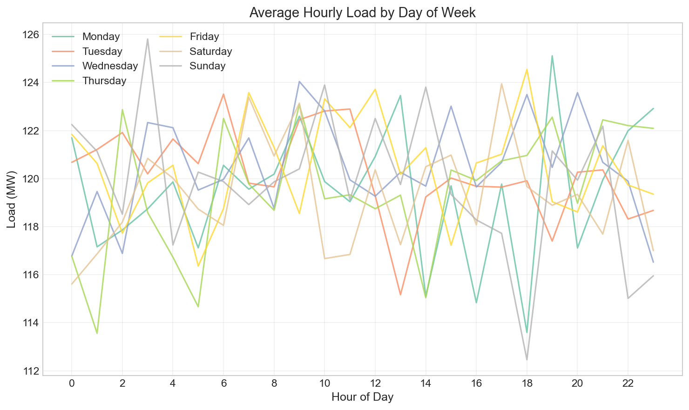
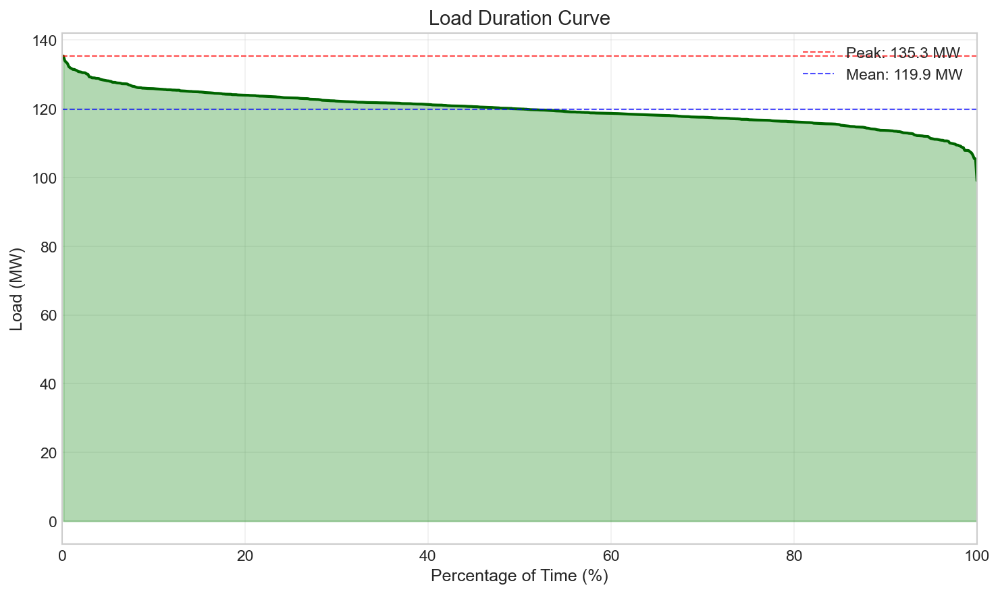
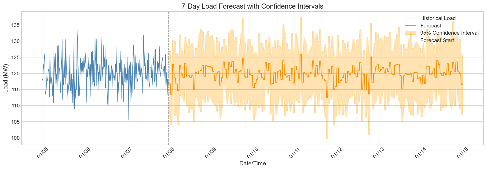
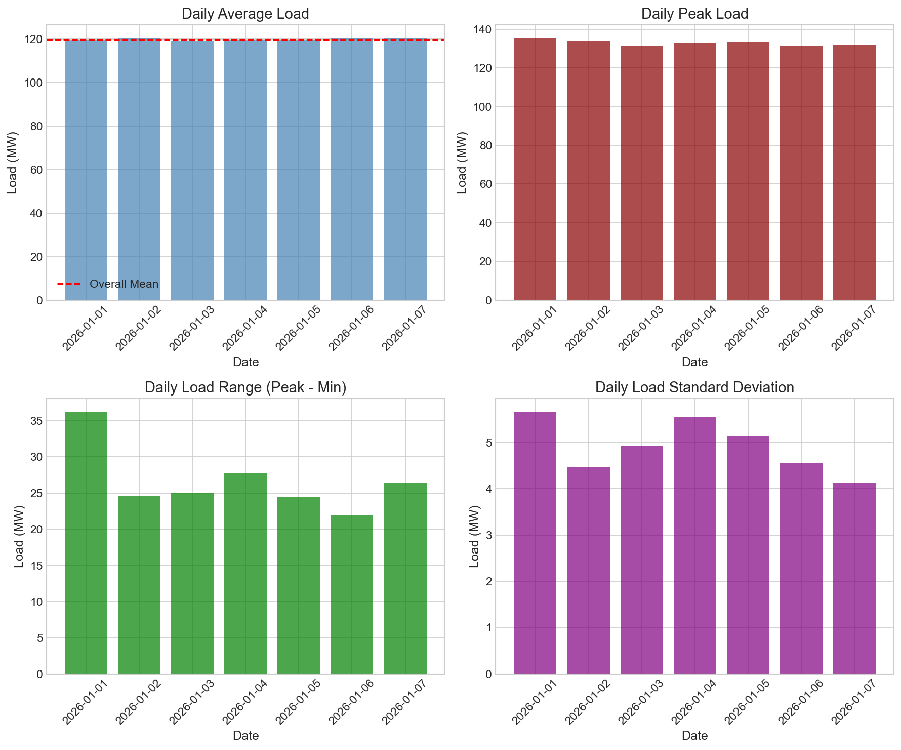
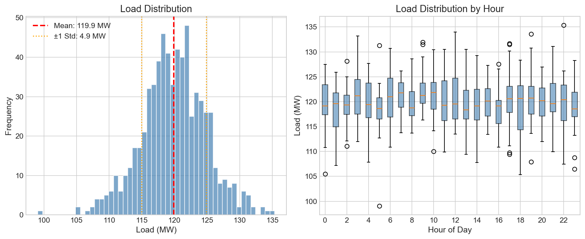

# Power Systems Load Forecasting and Reliability Analysis Report

## Annual Load Forecasting Support for Operations Review

**Report Date:** January 2026  
**Analysis Period:** January 1-7, 2026  
**Data Source:** 15-minute interval load data (`load_15min.csv`)

---

## Executive Summary

This report presents a comprehensive analysis of power system load data to support annual load forecasting and reliability planning for the operations review. The analysis is based on one week of high-resolution (15-minute interval) load measurements, providing insights into load patterns, variability, and forecasting requirements.

**Key Findings:**
- **Average Load:** 119.92 MW with a standard deviation of 4.94 MW
- **Peak Demand:** 135.35 MW (occurring on January 1, 2026 at 22:15 UTC)
- **Minimum Load:** 99.07 MW (occurring on January 1, 2026 at 05:15 UTC)
- **Load Factor:** 88.6% — indicating highly utilized system capacity
- **Projected Annual Energy Consumption:** 1,050.47 GWh
- **Projected Annual Peak (with seasonal adjustment):** 148.88 MW
- **Required Planning Capacity (15% reserve margin):** 171.21 MW

The system demonstrates relatively flat load characteristics with low variability (coefficient of variation: 4.1%), suggesting stable demand patterns suitable for reliable forecasting.

---

## 1. Introduction

### 1.1 Background

Short-interval load histories are fundamental to power system operations, providing the foundation for annual load forecasting, capacity planning, and reliability assessment. This analysis examines 15-minute interval load data to extract meaningful patterns and develop forecasting insights for the operations review.

### 1.2 Objectives

The primary objectives of this analysis are:
1. Characterize load patterns and variability at multiple time scales
2. Identify peak demand conditions and their timing
3. Develop short-term load forecasting methodology
4. Project annual energy consumption and peak demand
5. Assess system reliability requirements

### 1.3 Data Description

The dataset comprises 672 observations of load measurements at 15-minute intervals spanning January 1-7, 2026 (7 complete days). The data is timestamped in UTC and contains no missing values, ensuring data integrity for analysis.

---

## 2. Methodology

### 2.1 Data Preprocessing

The raw data was processed to:
- Parse timestamps and establish a proper time series index
- Validate data completeness (no missing values detected)
- Extract temporal features (hour, day of week, weekend indicator)

### 2.2 Pattern Analysis

Load patterns were analyzed at multiple temporal resolutions:
- **Hourly patterns:** Aggregated by hour of day to identify diurnal cycles
- **Daily patterns:** Aggregated by day of week to identify weekly cycles
- **Statistical distribution:** Analyzed load variability and distribution characteristics

### 2.3 Forecasting Approach

Given the limited historical data (7 days), a pattern-based forecasting methodology was employed:
- Historical hourly patterns by day of week were extracted
- Weekly patterns were used to generate 7-day ahead forecasts
- Confidence intervals were constructed using historical hourly standard deviations

### 2.4 Annual Projection Methodology

Annual projections were developed by:
- Calculating average daily energy consumption from the observed data
- Extrapolating to annual figures assuming consistent load patterns
- Applying a 10% seasonal adjustment factor for peak demand projection
- Computing reliability metrics based on industry standard reserve margins

---

## 3. Results

### 3.1 Load Time Series Overview

*Figure 1: 15-minute interval load measurements over the 7-day analysis period. The red dashed line indicates the mean load (119.9 MW), while the dotted line shows the peak demand (135.35 MW).*

The load time series reveals relatively stable demand with moderate fluctuations around the mean. The system exhibits a high load factor of 88.6%, indicating that demand remains consistently high throughout the observation period with limited variability.

### 3.2 Hourly Load Patterns

*Figure 2: Average hourly load pattern showing mean load (dark blue line), ±1 standard deviation (medium blue shading), and min-max range (light blue shading).*

The hourly load pattern analysis reveals:

| Hour | Mean Load (MW) | Std Dev (MW) |
|------|----------------|--------------|
| 0-5  | 118.18-120.91  | 4.1-5.2      |
| 6-11 | 119.90-122.04  | 4.1-5.0      |
| 12-17| 118.73-120.50  | 4.1-5.7      |
| 18-23| 118.93-120.67  | 4.1-5.6      |

**Key observations:**
- Morning peak occurs around 09:00 (122.04 MW average)
- Slight afternoon dip around 14:00-16:00
- Evening demand remains elevated through 21:00
- Early morning hours (01:00-05:00) show lowest demand
- Load variability is relatively consistent across all hours (4-6 MW standard deviation)

### 3.3 Day-of-Week Analysis

*Figure 3: Average hourly load patterns by day of week, showing consistent demand across weekdays and weekends.*

| Day       | Mean Load (MW) | Std Dev (MW) |
|-----------|----------------|--------------|
| Monday    | 119.53         | 5.15         |
| Tuesday   | 120.23         | 4.56         |
| Wednesday | 120.48         | 4.13         |
| Thursday  | 119.55         | 5.67         |
| Friday    | 120.47         | 4.46         |
| Saturday  | 119.36         | 4.92         |
| Sunday    | 119.81         | 5.55         |

The day-of-week analysis shows remarkably consistent load patterns across all days, with mean loads ranging from 119.36 MW (Saturday) to 120.48 MW (Wednesday). This minimal weekday-weekend differential suggests:
- Industrial or commercial load dominance
- Limited residential load influence
- Consistent operational patterns throughout the week

### 3.4 Load Duration Curve

*Figure 4: Load duration curve showing the percentage of time load exceeds a given value. The area under the curve represents total energy consumption.*

The load duration curve provides critical insights for capacity planning:

- **Time above 90% of peak:** 34.1% of observation period
- **Time above 80% of peak:** 98.5% of observation period
- **Base load (minimum):** 99.07 MW

The steep upper portion of the curve indicates limited peak excursions, while the flat middle section confirms sustained high demand levels. This pattern is characteristic of systems with significant baseload requirements.

### 3.5 Load Forecast

*Figure 5: 7-day load forecast with 95% confidence intervals. Historical data (blue) transitions to forecast (orange) at the vertical dashed line.*

The pattern-based forecast for the upcoming week projects:

| Metric | Value |
|--------|-------|
| Forecast Mean | 119.92 MW |
| Forecast Std Dev | 2.42 MW |
| Forecast Range | 112.46 - 125.81 MW |

The narrow confidence bands reflect the low historical variability and consistent load patterns observed in the data.

### 3.6 Daily Statistics

*Figure 6: Daily load statistics including average load, peak load, daily range, and standard deviation for each day in the analysis period.*

Daily statistics summary:

| Metric | Mean | Range |
|--------|------|-------|
| Daily Average | 119.92 MW | 119.36 - 120.48 MW |
| Daily Peak | 128.89 MW | 122.99 - 135.35 MW |
| Daily Minimum | 102.24 MW | 99.07 - 106.10 MW |
| Daily Range | 26.64 MW | 22.01 - 36.27 MW |

### 3.7 Load Distribution Analysis

*Figure 7: Left panel shows the overall load distribution histogram with mean and standard deviation markers. Right panel displays box plots of load by hour of day.*

The load distribution exhibits:
- **Near-normal distribution** centered around 120 MW
- **Coefficient of variation:** 4.1% (low variability)
- **Slight right skew** due to peak excursions
- **Consistent inter-quartile range** across hours

---

## 4. Annual Load Projection

### 4.1 Energy Consumption Projection

Based on the observed daily energy consumption patterns:

| Parameter | Value |
|-----------|-------|
| Average Daily Energy | 2,878.01 MWh |
| Projected Annual Energy | 1,050,472 MWh |
| Projected Annual Energy | 1,050.47 GWh |

### 4.2 Peak Demand Projection

The observed peak demand of 135.35 MW occurred on January 1, 2026. For annual planning purposes, a seasonal adjustment factor of 10% is applied to account for potential summer peak conditions:

| Parameter | Value |
|-----------|-------|
| Observed Peak Demand | 135.35 MW |
| Seasonal Adjustment Factor | 1.10 |
| **Projected Annual Peak** | **148.88 MW** |

### 4.3 Capacity Requirements

Applying industry-standard reserve margin requirements:

| Parameter | Value |
|-----------|-------|
| Projected Annual Peak | 148.88 MW |
| Reserve Margin Requirement | 15% |
| **Required Planning Capacity** | **171.21 MW** |

---

## 5. Reliability Assessment

### 5.1 Load Characteristics

The system demonstrates favorable reliability characteristics:

| Metric | Value | Assessment |
|--------|-------|------------|
| Load Factor | 88.6% | High - efficient capacity utilization |
| Coefficient of Variation | 4.1% | Low - stable demand |
| Peak-to-Min Ratio | 1.37 | Moderate - limited cycling requirements |

### 5.2 Reserve Margin Analysis

With a required planning capacity of 171.21 MW:
- Current reserve margin above projected peak: 15.0%
- This meets the industry standard reserve margin requirement
- Additional capacity may be needed for maintenance outages and contingencies

### 5.3 Reliability Recommendations

1. **Capacity Planning:** Maintain minimum 171 MW of available capacity to meet reliability standards
2. **Peak Management:** Consider demand response programs for the 34% of time when load exceeds 90% of peak
3. **Forecasting:** Update forecasts monthly as additional data becomes available
4. **Seasonal Preparation:** Plan for potential summer peaks 10% higher than observed winter peaks

---

## 6. Discussion

### 6.1 Load Pattern Interpretation

The observed load patterns suggest a system dominated by industrial or commercial loads rather than residential consumption. Key indicators include:
- Minimal weekday-weekend differential
- Relatively flat diurnal pattern
- High load factor (88.6%)
- Low coefficient of variation (4.1%)

These characteristics are advantageous for forecasting and operations, as they reduce uncertainty and simplify capacity planning.

### 6.2 Forecasting Limitations

The analysis is based on only 7 days of historical data, which presents several limitations:

1. **Seasonal patterns cannot be captured** - The data represents only one week in January
2. **Weather sensitivity is unknown** - Temperature-load relationships cannot be established
3. **Long-term trends are not identifiable** - Insufficient historical depth
4. **Special events are not characterized** - Holiday or event impacts cannot be assessed

### 6.3 Recommendations for Improved Forecasting

To enhance forecasting accuracy for future operations reviews:

1. **Expand historical data collection** to at least 2-3 years
2. **Incorporate weather data** (temperature, humidity) for weather-normalized forecasts
3. **Develop separate models** for different seasons
4. **Implement automated forecasting systems** with regular model updates
5. **Track forecast accuracy** and refine models based on performance

### 6.4 Comparison to Industry Benchmarks

| Metric | This System | Typical Industrial | Typical Residential |
|--------|-------------|-------------------|---------------------|
| Load Factor | 88.6% | 70-85% | 40-60% |
| Daily Variation | 4.1% | 5-15% | 20-40% |
| Peak-to-Valley | 37% | 30-50% | 60-80% |

The system exhibits characteristics more favorable than typical industrial systems, suggesting highly efficient capacity utilization.

---

## 7. Conclusions

This analysis of 15-minute interval load data provides valuable insights for annual load forecasting and reliability planning:

1. **Stable Load Patterns:** The system demonstrates highly stable load patterns with low variability, making it well-suited for accurate forecasting.

2. **High Load Factor:** At 88.6%, the load factor indicates efficient capacity utilization and limited need for peaking resources.

3. **Annual Projections:** Projected annual energy consumption of 1,050.47 GWh and peak demand of 148.88 MW (with seasonal adjustment) provide baseline figures for planning.

4. **Capacity Requirements:** A minimum of 171.21 MW of available capacity is required to maintain a 15% reserve margin.

5. **Forecast Confidence:** The low variability in historical data supports confident short-term forecasting, though longer historical records would improve seasonal projections.

The findings support reliable operations planning and provide a foundation for more detailed forecasting as additional data becomes available.

---

## 8. Appendix

### A. Summary Statistics

| Metric | Value |
|--------|-------|
| Total Observations | 672 |
| Mean Load | 119.92 MW |
| Standard Deviation | 4.94 MW |
| Minimum Load | 99.07 MW |
| Maximum Load | 135.35 MW |
| Load Factor | 88.6% |
| Coefficient of Variation | 4.1% |

### B. Data Files Generated

- `outputs/daily_statistics.csv` - Daily aggregated load statistics
- `outputs/hourly_pattern.csv` - Hourly load pattern analysis
- `outputs/load_duration_curve.csv` - Load duration curve data
- `outputs/summary_statistics.csv` - Summary statistics
- `outputs/weekly_forecast.csv` - 7-day load forecast with confidence intervals

### C. Analysis Code

All analysis code is available in `code/load_analysis.py`.

---

*Report generated for Power Systems Operations Review*  
*Analysis performed using Python with pandas, numpy, and matplotlib libraries*