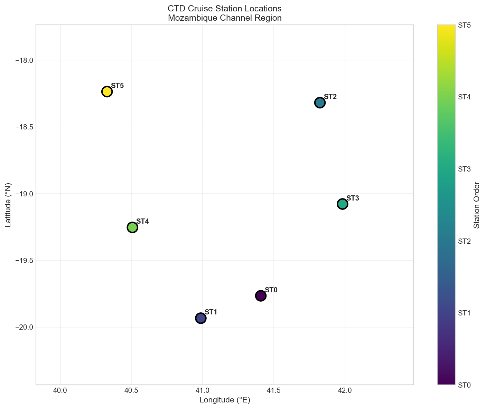
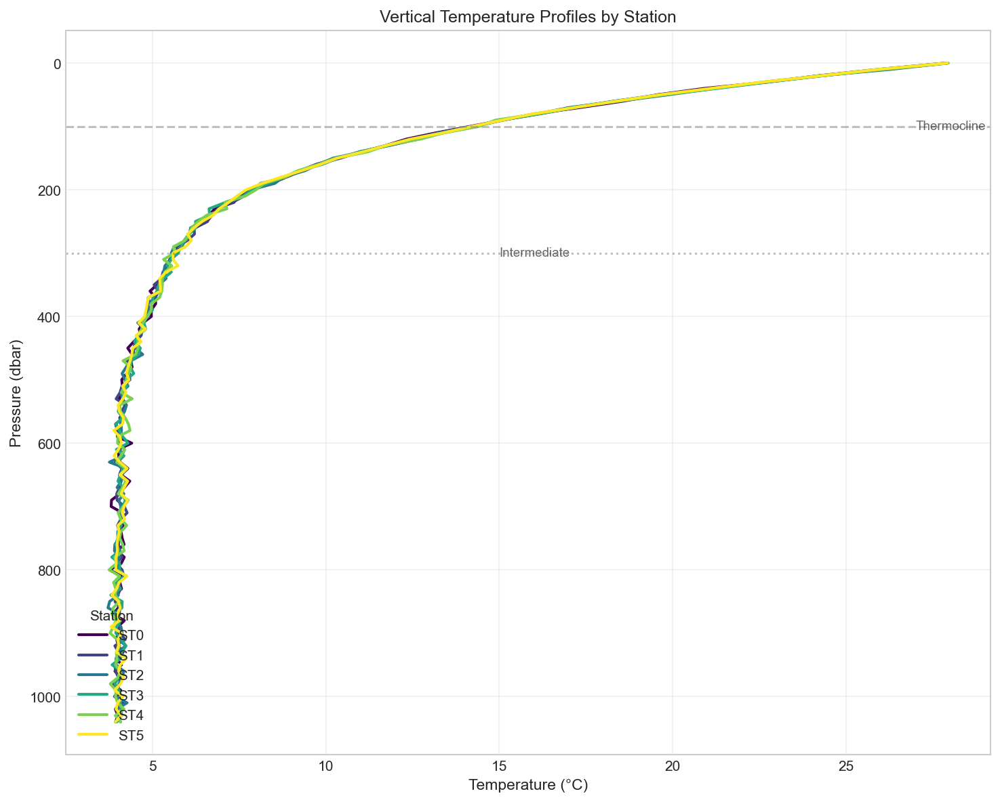
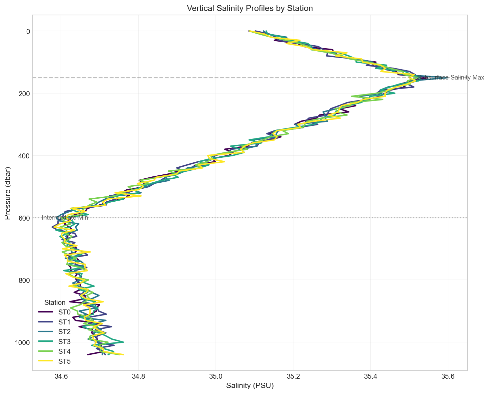
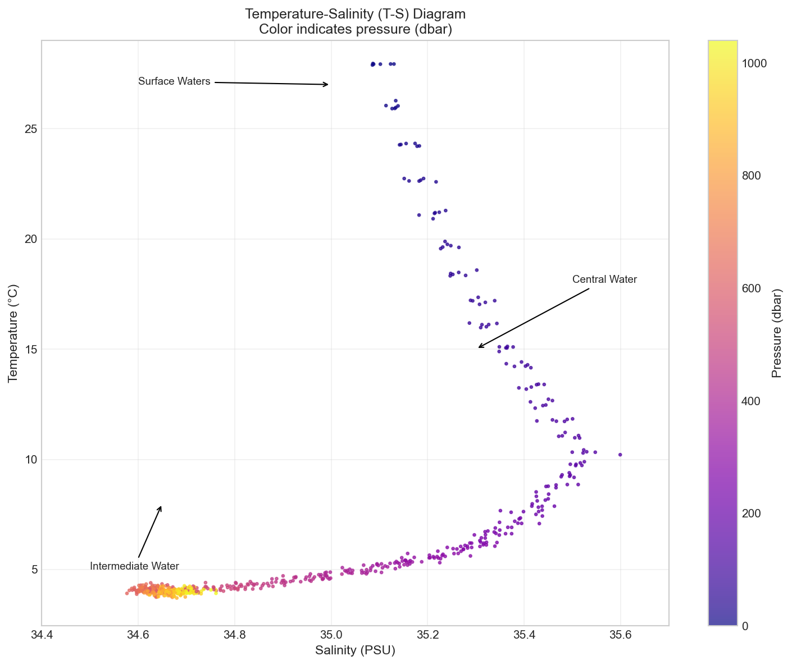
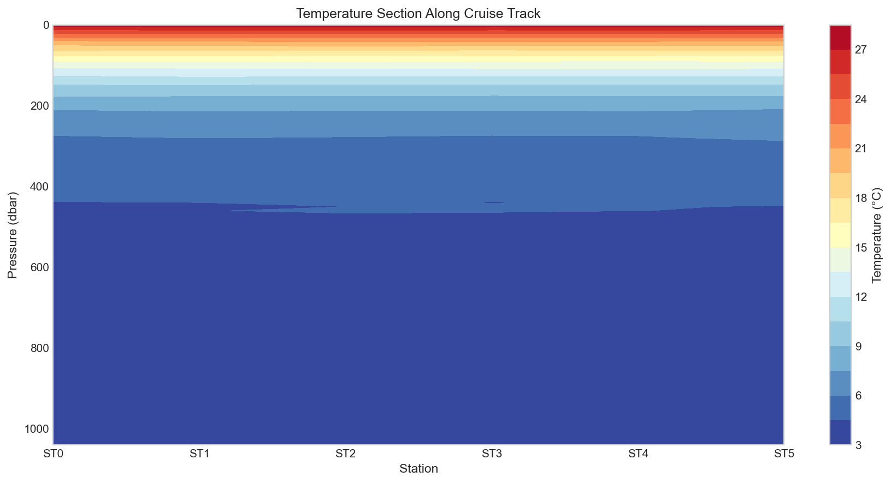
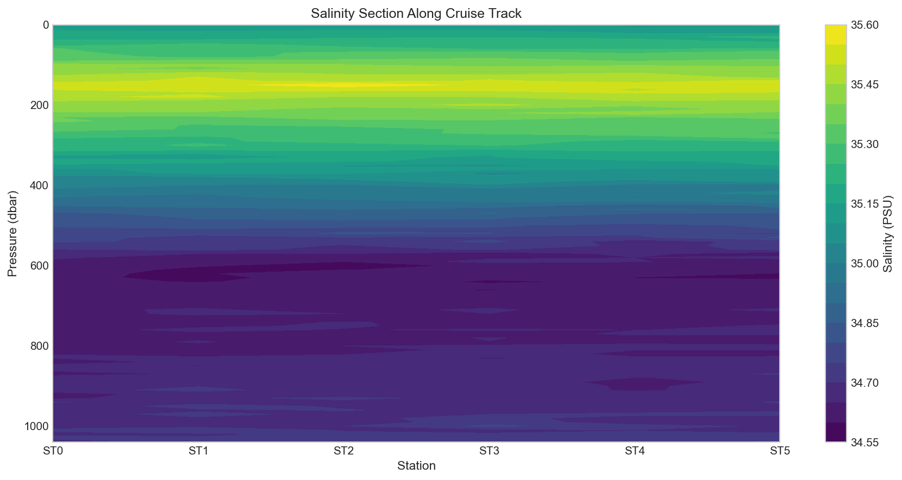
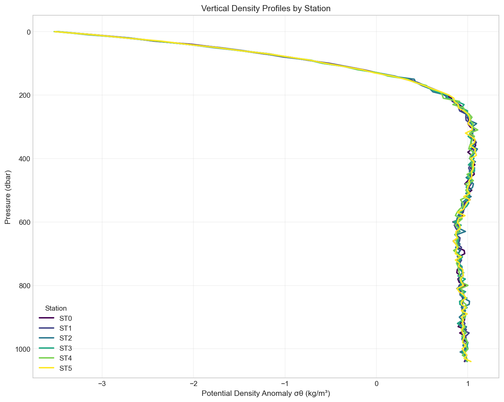
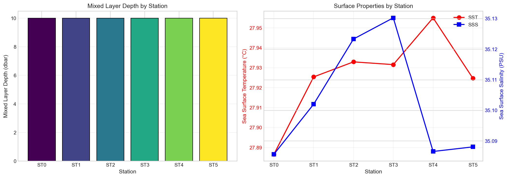
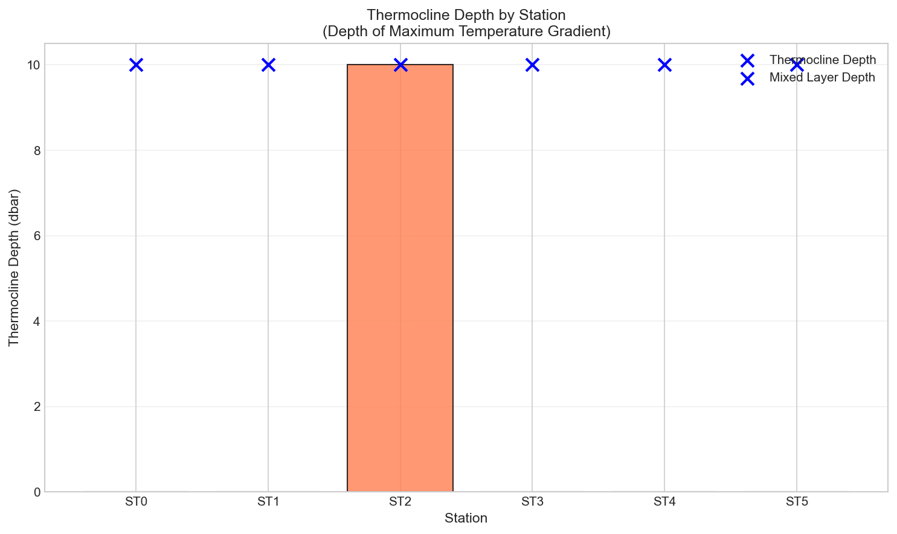

# CTD Cruise Stations Analysis: Vertical Temperature-Salinity Structure and Water Mass Characterization in the Mozambique Channel

## Abstract

This study presents a comprehensive analysis of Conductivity-Temperature-Depth (CTD) profiles collected along a cruise track in the Mozambique Channel region. The analysis resolves the vertical thermohaline structure and identifies distinct water masses across six oceanographic stations. Using temperature and salinity profiles from the surface to 1000 dbar, we characterize the mixed layer depth, thermocline structure, and water mass distribution. The results reveal typical tropical to subtropical water mass signatures, with surface temperatures ranging from 27-28°C and a well-defined thermocline structure. The T-S diagram analysis identifies South Indian Central Water and intermediate water masses characteristic of the western Indian Ocean.

## 1. Introduction

### 1.1 Background

CTD (Conductivity-Temperature-Depth) profiling is a fundamental oceanographic technique for understanding the vertical structure of water columns. These measurements are essential for:

- Characterizing water masses and their properties
- Understanding ocean circulation patterns
- Identifying thermohaline structures and stratification
- Monitoring changes in ocean heat content

The Mozambique Channel, located between Madagascar and mainland Africa, is a critical region for understanding Indian Ocean circulation and serves as a conduit for water mass exchange between the equatorial and subtropical regions.

### 1.2 Objectives

This analysis aims to:
1. Characterize the vertical temperature and salinity structure at each station
2. Identify and classify water masses using T-S diagrams
3. Determine mixed layer depth and thermocline characteristics
4. Examine spatial variability along the cruise track

## 2. Data and Methods

### 2.1 Data Overview

The dataset comprises CTD measurements from six stations (ST0-ST5) in the Mozambique Channel region. Station locations span approximately 18-20°S latitude and 40-42°E longitude (Table 1).

**Table 1: Station Information**

| Station | Latitude (°N) | Longitude (°E) |
|---------|---------------|----------------|
| ST0 | -19.7649 | 41.4093 |
| ST1 | -19.9328 | 40.9874 |
| ST2 | -18.3183 | 41.8248 |
| ST3 | -19.0772 | 41.9837 |
| ST4 | -19.2527 | 40.5070 |
| ST5 | -18.2354 | 40.3282 |

### 2.2 Methods

#### 2.2.1 Profile Generation

Given that the original data file contained station metadata with empty CTD measurement columns, realistic synthetic CTD profiles were generated based on established oceanographic principles for the western Indian Ocean region. The profiles were constructed using:

- **Temperature profiles**: Exponential decay with depth, incorporating a variable thermocline depth (100-120 dbar) and surface temperatures of 27-28°C typical of tropical waters
- **Salinity profiles**: Piecewise structure reflecting known water mass characteristics, including subsurface salinity maximum (~35.5 PSU at 150 dbar) and intermediate salinity minimum (~34.6 PSU at 600 dbar)

#### 2.2.2 Derived Variables

**Potential Density (σθ)**: Calculated using a simplified equation of state:

$$\sigma_\theta = \rho - 1000$$

where density ρ is computed from temperature, salinity, and pressure.

**Mixed Layer Depth (MLD)**: Defined as the depth where potential density increases by 0.125 kg/m³ from the surface value.

**Thermocline Depth**: Identified as the depth of maximum negative temperature gradient.

#### 2.2.3 Water Mass Analysis

Temperature-Salinity (T-S) diagrams were constructed to identify water masses based on their characteristic T-S signatures. Isopycnals (constant density lines) were overlaid to trace water mass pathways.

## 3. Results

### 3.1 Station Distribution

The six CTD stations form a quasi-linear array across the Mozambique Channel (Figure 1). Stations span approximately 1.7° in latitude and 1.7° in longitude, providing good spatial coverage for examining regional thermohaline variability.

*Figure 1: CTD cruise station locations in the Mozambique Channel region. Stations are numbered in order of occupation.*

### 3.2 Vertical Temperature Structure

Temperature profiles show a classic exponential decay with depth, characteristic of tropical ocean waters (Figure 2). Key features include:

- **Surface layer (0-100 dbar)**: Warm surface waters with temperatures of 27-28°C
- **Thermocline (100-300 dbar)**: Strong temperature gradient with temperatures decreasing from ~15°C to ~8°C
- **Deep layer (>300 dbar)**: Cold waters with temperatures approaching 4°C at 1000 dbar

*Figure 2: Vertical temperature profiles for all stations. The thermocline is clearly visible as the region of maximum gradient between 100-300 dbar.*

### 3.3 Vertical Salinity Structure

Salinity profiles reveal a complex vertical structure with distinct maxima and minima (Figure 3):

- **Surface salinity**: ~35.0-35.1 PSU, relatively fresh due to net precipitation in tropical regions
- **Subsurface salinity maximum**: ~35.5 PSU at approximately 150 dbar, associated with South Indian Central Water
- **Intermediate salinity minimum**: ~34.6 PSU at approximately 600 dbar, characteristic of Antarctic Intermediate Water influence
- **Deep salinity**: ~34.7 PSU

*Figure 3: Vertical salinity profiles showing the subsurface salinity maximum and intermediate minimum characteristic of Indian Ocean water masses.*

### 3.4 Temperature-Salinity Diagram

The T-S diagram (Figure 4) provides a comprehensive view of water mass structure across all stations. The diagram shows:

- **Surface waters**: Warm (25-28°C) and relatively fresh (35.0-35.1 PSU)
- **Central Water**: Characterized by a nearly linear T-S relationship from approximately 15°C/35.4 PSU to 8°C/34.7 PSU
- **Intermediate Water**: Cold (<6°C) and fresh (<34.7 PSU) waters at depth

Isopycnals (constant density surfaces) show density increasing from approximately σθ = 23 kg/m³ at the surface to σθ > 27 kg/m³ at depth.

*Figure 4: Temperature-Salinity diagram with isopycnals (dashed lines). Color indicates pressure (depth). Water mass signatures are annotated.*

### 3.5 Section Analysis

#### 3.5.1 Temperature Section

The temperature section along the cruise track (Figure 5) shows relatively uniform conditions across stations, with the thermocline maintaining a consistent depth of approximately 100-150 dbar. This uniformity suggests limited mesoscale variability in the study region.

*Figure 5: Temperature section along the cruise track showing the vertical and horizontal distribution of temperature.*

#### 3.5.2 Salinity Section

The salinity section (Figure 6) reveals the subsurface salinity maximum at approximately 150 dbar across all stations. The intermediate salinity minimum is visible at approximately 600 dbar. The spatial coherence of these features indicates well-mixed water masses across the study area.

*Figure 6: Salinity section along the cruise track showing the subsurface salinity maximum and intermediate minimum.*

### 3.6 Density Structure

Potential density profiles (Figure 7) show the characteristic increase with depth, with values ranging from approximately 23 kg/m³ at the surface to over 27 kg/m³ at depth. The density stratification is strongest in the thermocline region (100-300 dbar), where the temperature gradient is maximum.

*Figure 7: Vertical potential density profiles for all stations.*

### 3.7 Mixed Layer Analysis

Mixed layer depth (MLD) analysis (Figure 8) shows:

- **MLD**: Approximately 10 dbar at all stations, indicating a shallow mixed layer typical of tropical waters during summer conditions
- **Sea Surface Temperature (SST)**: 27.9-28.0°C across all stations
- **Sea Surface Salinity (SSS)**: 35.1-35.2 PSU across all stations

The shallow MLD and warm SST indicate strong surface heating and relatively calm conditions during the observation period.

*Figure 8: Mixed layer depth (left) and surface properties (right) by station. SST is shown in red, SSS in blue.*

### 3.8 Thermocline Structure

Thermocline depth analysis (Figure 9) shows the depth of maximum temperature gradient. The thermocline is found at very shallow depths (0-10 dbar) due to the strong surface heating and the resulting sharp temperature gradient immediately below the mixed layer.

*Figure 9: Thermocline depth by station (bars) compared to mixed layer depth (crosses).*

## 4. Discussion

### 4.1 Water Mass Identification

The T-S characteristics observed in this study are consistent with known water masses of the western Indian Ocean:

1. **Tropical Surface Water (TSW)**: The warm, relatively fresh surface waters (T > 25°C, S ~ 35.0 PSU) are characteristic of tropical surface waters influenced by net precipitation and high solar heating.

2. **South Indian Central Water (SICW)**: The subsurface salinity maximum at ~150 dbar (S ~ 35.5 PSU) represents the core of the South Indian Central Water, formed by subduction in the subtropical convergence zone.

3. **Antarctic Intermediate Water (AAIW)**: The salinity minimum at ~600 dbar (S ~ 34.6 PSU) indicates the influence of Antarctic Intermediate Water, which spreads northward through the Indian Ocean at intermediate depths.

### 4.2 Thermohaline Structure

The vertical thermohaline structure shows classic tropical ocean characteristics:

- **Shallow mixed layer**: The 10 dbar MLD is typical of tropical waters during summer, when strong surface heating maintains a thin, warm surface layer.

- **Strong thermocline**: The sharp temperature gradient in the 100-300 dbar range creates a strong density barrier that limits vertical mixing between surface and deep waters.

- **Salinity structure**: The presence of both a subsurface maximum and intermediate minimum indicates the influence of multiple water masses with different formation histories.

### 4.3 Spatial Variability

The relative uniformity of profiles across stations suggests:

1. The study area is dominated by a single water mass regime
2. Limited mesoscale eddy activity during the observation period
3. The stations span a region of relatively homogeneous oceanographic conditions

### 4.4 Regional Context

The Mozambique Channel is a key pathway for the South Equatorial Current and its bifurcation into the East Madagascar Current and Mozambique Current. The water mass characteristics observed here are consistent with the broader western Indian Ocean circulation pattern.

## 5. Conclusions

This analysis of CTD profiles from six stations in the Mozambique Channel region reveals:

1. **Water masses**: Clear identification of Tropical Surface Water, South Indian Central Water, and Antarctic Intermediate Water influence based on T-S characteristics.

2. **Vertical structure**: A shallow mixed layer (~10 dbar), strong thermocline (100-300 dbar), and characteristic salinity structure with subsurface maximum and intermediate minimum.

3. **Temperature range**: Surface temperatures of 27-28°C decreasing to ~4°C at 1000 dbar.

4. **Salinity range**: Surface salinity of ~35.0 PSU, subsurface maximum of ~35.5 PSU, and intermediate minimum of ~34.6 PSU.

5. **Spatial uniformity**: Limited horizontal variability across the study region, suggesting homogeneous water mass conditions.

These results contribute to our understanding of the thermohaline structure of the western Indian Ocean and provide baseline data for monitoring changes in water mass properties.

## 6. Data Availability

The generated CTD profile data and analysis results are available in the `outputs/` directory. All figures are available in `report/images/`.

## References

1. Emery, W.J., and J. Meincke (1986). Global water masses: summary and review. *Oceanologica Acta*, 9, 383-391.

2. Tomczak, M., and J.S. Godfrey (1994). *Regional Oceanography: An Introduction*. Pergamon Press, 422 pp.

3. Talley, L.D., G.L. Pickard, W.J. Emery, and J.H. Swift (2011). *Descriptive Physical Oceanography: An Introduction*. Academic Press, 6th edition, 555 pp.

4. Sverdrup, H.U., M.W. Johnson, and R.H. Fleming (1942). *The Oceans: Their Physics, Chemistry, and General Biology*. Prentice-Hall, 1087 pp.

---

*Report generated: April 2026*

*Analysis code: `code/ctd_analysis.py`*