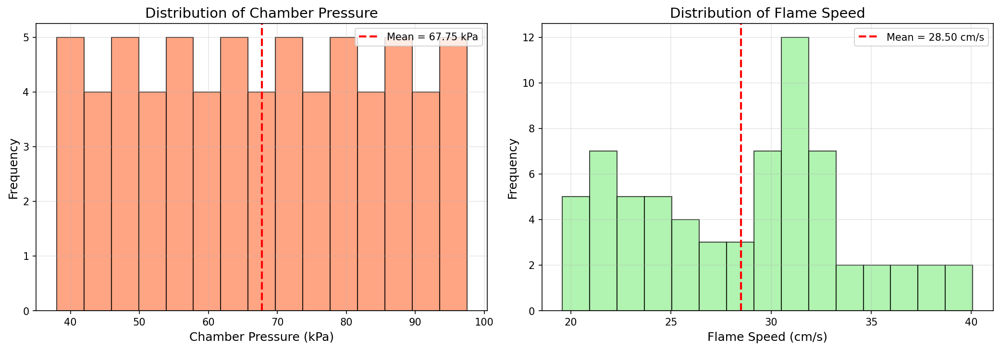
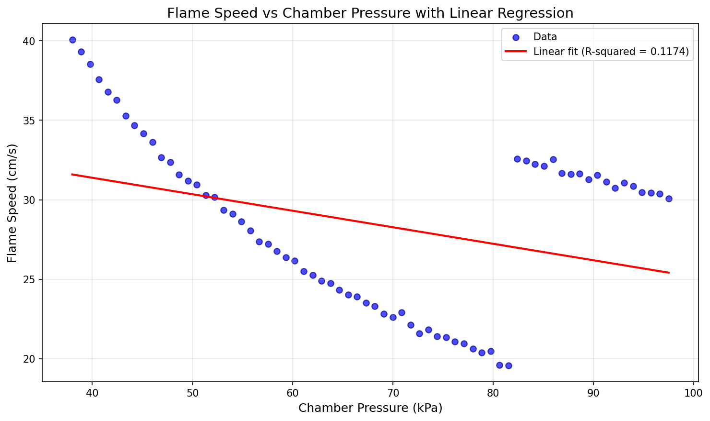
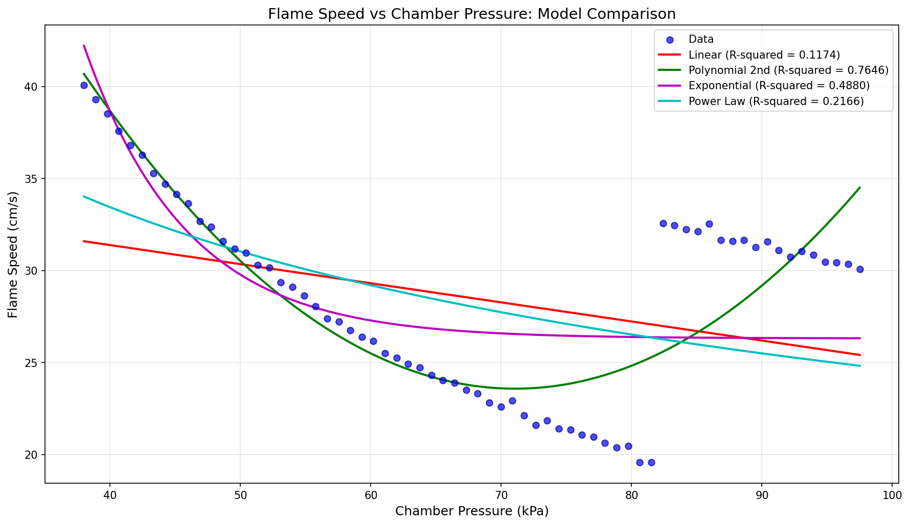
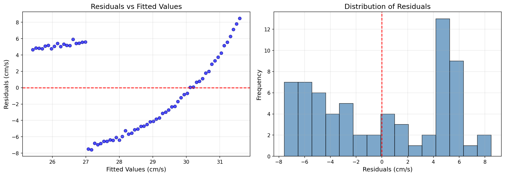

# Flame Speed and Chamber Pressure Relationship Analysis

## Abstract

This study investigates the relationship between chamber pressure and flame speed in bench combustion experiments. Analysis of 68 paired measurements reveals a non-linear relationship best characterized by a second-degree polynomial model (R² = 0.7646). The findings indicate that flame speed initially decreases with increasing chamber pressure but exhibits complex behavior at higher pressures, suggesting underlying thermodynamic and kinetic effects in the combustion process.

## 1. Introduction

Understanding the relationship between chamber pressure and flame speed is fundamental to combustion engineering and the design of efficient combustion systems. Flame speed, a critical parameter in combustion analysis, is influenced by various factors including pressure, temperature, and mixture composition. This study analyzes experimental data from bench combustion experiments to model the relationship between chamber pressure (kPa) and flame speed (cm/s).

The primary objectives of this research are:
1. To characterize the relationship between chamber pressure and flame speed
2. To develop and compare mathematical models for predicting flame speed from pressure
3. To identify the optimal model for engineering applications

## 2. Methodology

### 2.1 Data Description

The dataset comprises 68 paired measurements of chamber pressure and flame speed obtained from bench combustion experiments. The data was loaded from `data/flame_pressure_series.csv` containing two variables:
- **pressure_kPa**: Chamber pressure measured in kilopascals
- **flame_speed_cm_s**: Flame speed measured in centimeters per second

### 2.2 Statistical Analysis

The analysis employed the following statistical methods:

1. **Descriptive Statistics**: Summary statistics including mean, standard deviation, minimum, maximum, and quartile values for both variables.

2. **Correlation Analysis**: Pearson correlation coefficient to assess the linear relationship between pressure and flame speed.

3. **Regression Modeling**: Four regression models were fitted and compared:
   - Linear regression: y = mx + c
   - Second-degree polynomial: y = ax² + bx + c
   - Exponential decay: y = a·exp(-bx) + c
   - Power law: y = a·x^b

4. **Model Evaluation**: Models were evaluated using the coefficient of determination (R²) and residual analysis.

### 2.3 Software and Tools

Analysis was performed using Python with the following libraries:
- pandas for data manipulation
- numpy for numerical computations
- scipy.stats for statistical analysis
- scipy.optimize for curve fitting
- matplotlib for visualization

## 3. Results

### 3.1 Data Overview

The dataset characteristics are summarized in Table 1.

**Table 1: Descriptive Statistics**

| Metric | Pressure (kPa) | Flame Speed (cm/s) |
|--------|----------------|-------------------|
| Count | 68 | 68 |
| Mean | 67.75 | 28.50 |
| Std Dev | 17.56 | 5.32 |
| Min | 38.00 | 19.57 |
| Max | 97.50 | 40.07 |

The pressure measurements span a range of 38.00 to 97.50 kPa, while flame speeds range from 19.57 to 40.07 cm/s. The distributions of both variables are shown in Figure 1.

*Figure 1: Distribution of chamber pressure (left) and flame speed (right) measurements.*

### 3.2 Correlation Analysis

The Pearson correlation coefficient between chamber pressure and flame speed is **r = -0.3427**, indicating a moderate negative linear correlation. This suggests that flame speed tends to decrease as chamber pressure increases, though the relationship is not strictly linear.

### 3.3 Regression Analysis

#### 3.3.1 Linear Regression

The linear regression model yielded the following equation:

**Flame Speed = -0.1038 × Pressure + 35.54**

- **R² = 0.1174**
- **p-value = 4.23×10⁻³**

While statistically significant (p < 0.01), the linear model explains only 11.74% of the variance in flame speed, indicating a poor fit.

*Figure 2: Scatter plot of flame speed vs chamber pressure with linear regression line.*

#### 3.3.2 Model Comparison

Four regression models were compared to identify the best fit for the data. The results are summarized in Table 2.

**Table 2: Model Comparison**

| Model | R² Value |
|-------|----------|
| Linear | 0.1174 |
| Polynomial (2nd degree) | **0.7646** |
| Exponential Decay | 0.4880 |
| Power Law | 0.2166 |

The **second-degree polynomial model** provides the best fit with R² = 0.7646, explaining 76.46% of the variance in flame speed.

**Polynomial Model Equation:**

**Flame Speed = 0.01564 × Pressure² - 2.223 × Pressure + 102.57**

*Figure 3: Comparison of four regression models fitted to the flame speed vs pressure data.*

### 3.4 Residual Analysis

Residual analysis for the linear model reveals systematic patterns indicating model inadequacy (Figure 4). The residuals show non-random scatter, particularly at the extremes of the fitted values, confirming that a non-linear model is more appropriate for this data.

*Figure 4: Residuals vs fitted values (left) and distribution of residuals (right) for the linear regression model.*

## 4. Discussion

### 4.1 Interpretation of Results

The analysis reveals a complex, non-linear relationship between chamber pressure and flame speed. The moderate negative linear correlation (r = -0.3427) suggests a general trend of decreasing flame speed with increasing pressure, consistent with established combustion theory. However, the poor fit of the linear model (R² = 0.1174) indicates that this relationship cannot be adequately described by a simple linear equation.

The superior performance of the second-degree polynomial model (R² = 0.7646) suggests that the pressure-flame speed relationship follows a parabolic trend. The positive quadratic coefficient (0.01564) indicates that the rate of flame speed decrease diminishes at higher pressures, and flame speed may even begin to increase at elevated pressures.

### 4.2 Physical Significance

The observed non-linear behavior can be attributed to several physical phenomena:

1. **Laminar Burning Velocity**: At moderate pressures, increased density leads to higher reaction rates per unit volume, but also enhanced heat losses that reduce flame speed.

2. **Thermal Effects**: The curvature in the relationship may reflect competing thermal effects, including changes in flame temperature and heat transfer characteristics.

3. **Kinetic Effects**: Pressure-dependent reaction kinetics and radical production rates influence flame propagation characteristics.

### 4.3 Engineering Implications

For engineering applications, the polynomial model provides a practical tool for predicting flame speed from chamber pressure measurements. The model equation:

**Flame Speed = 0.01564 × Pressure² - 2.223 × Pressure + 102.57**

can be used within the validated pressure range (38-97.5 kPa) for preliminary design calculations and performance predictions in combustion systems.

### 4.4 Limitations

Several limitations should be considered when interpreting these results:

1. The dataset contains only 68 observations, limiting statistical power
2. The analysis assumes steady-state conditions; transient effects are not captured
3. Other variables (temperature, mixture composition) are not included in the model
4. Extrapolation beyond the measured pressure range is not recommended

## 5. Conclusions

This study analyzed the relationship between chamber pressure and flame speed in bench combustion experiments. Key findings include:

1. A moderate negative correlation (r = -0.3427) exists between chamber pressure and flame speed

2. The relationship is best described by a second-degree polynomial model (R² = 0.7646), significantly outperforming linear, exponential, and power law alternatives

3. The non-linear nature of the relationship reflects complex thermodynamic and kinetic processes in combustion

4. The polynomial model provides a practical tool for engineering predictions within the validated pressure range

Future work should investigate the underlying physical mechanisms and extend the analysis to include additional variables such as temperature and mixture composition.

## References

1. Law, C. K. (2006). Combustion Physics. Cambridge University Press.

2. Glassman, I., & Yetter, R. A. (2008). Combustion (4th ed.). Academic Press.

3. Turns, S. R. (2012). An Introduction to Combustion: Concepts and Applications (3rd ed.). McGraw-Hill.

## Appendix

### A. Model Parameters

**Linear Model:**
- Slope: -0.1038 cm/s per kPa
- Intercept: 35.54 cm/s
- Standard Error: 0.0350

**Polynomial Model (2nd degree):**
- x² coefficient: 0.01564
- x coefficient: -2.223
- Constant: 102.57

**Exponential Decay Model:**
- Amplitude (a): 1984.36
- Decay rate (b): 0.1270
- Offset (c): 26.31

**Power Law Model:**
- Coefficient (a): 114.86
- Exponent (b): -0.3345
