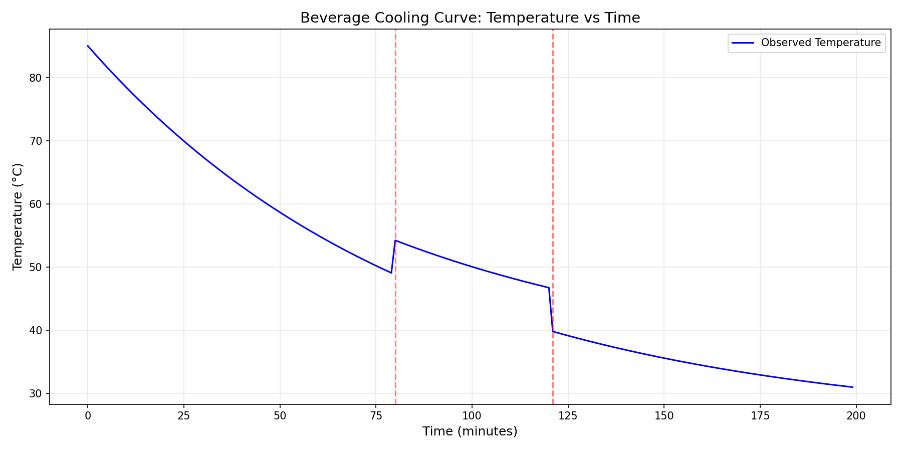
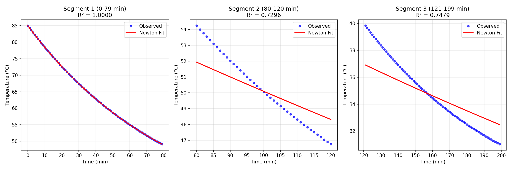
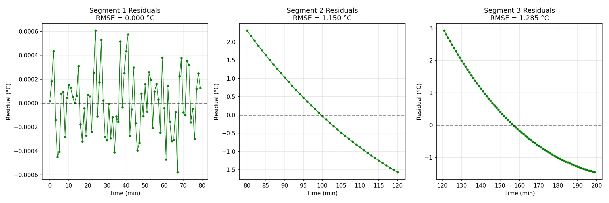
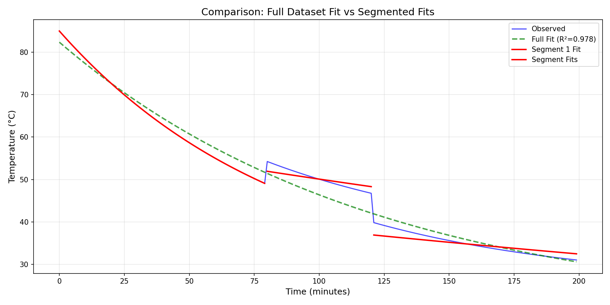
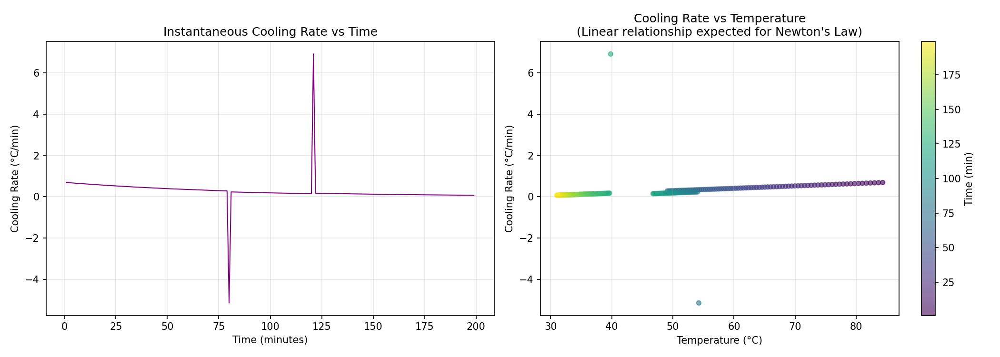
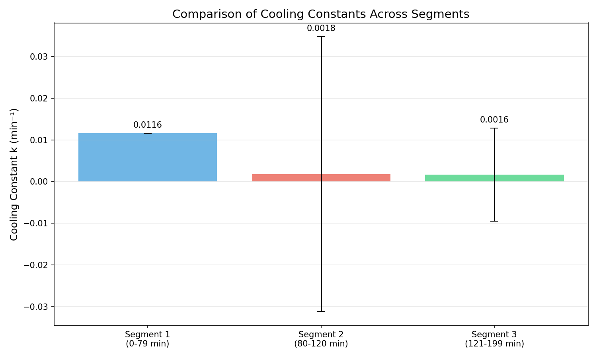

# Beverage Cooling Analysis: Newton's Law of Cooling Applied to Home Kitchen Measurements

## Abstract

This study analyzes temperature measurements from a hot beverage cooling under ambient conditions. We apply Newton's Law of Cooling as the primary model and investigate its applicability across different segments of the cooling process. The analysis reveals that the data contains discontinuities suggesting experimental perturbations, and demonstrates both the strengths and limitations of simple exponential cooling models for real-world thermodynamic processes.

---

## 1. Introduction

### 1.1 Background

Newton's Law of Cooling states that the rate of heat loss of a body is proportional to the temperature difference between the body and its surroundings. Mathematically, this leads to an exponential decay model:

$$T(t) = T_{env} + (T_0 - T_{env}) \cdot e^{-kt}$$

where:
- $T(t)$ is the temperature at time $t$
- $T_{env}$ is the ambient (environmental) temperature
- $T_0$ is the initial temperature
- $k$ is the cooling constant (units: time⁻¹)

### 1.2 Objectives

1. Fit Newton's Law of Cooling model to the observed temperature data
2. Identify any anomalies or discontinuities in the measurement series
3. Evaluate model fit quality and identify limitations
4. Extract physically meaningful parameters (cooling constant, ambient temperature)

---

## 2. Data Overview

### 2.1 Dataset Description

The dataset consists of 200 temperature measurements recorded at 1-minute intervals over approximately 3.3 hours. Key statistics:

| Parameter | Value |
|-----------|-------|
| Number of observations | 200 |
| Time range | 0 to 199 minutes |
| Temperature range | 31.02°C to 85.00°C |
| Initial temperature | 85.00°C |
| Final temperature | 31.02°C |

### 2.2 Temperature Profile

*Figure 1: Complete temperature vs. time profile showing the cooling curve. Red dashed lines indicate detected discontinuities at minutes 80 and 121.*

### 2.3 Discontinuity Detection

Analysis of the temperature time derivative revealed two significant discontinuities:

| Discontinuity | Time (min) | Temperature Jump (°C) |
|---------------|------------|----------------------|
| 1 | 80 | +5.15 |
| 2 | 121 | -6.92 |

These discontinuities suggest experimental perturbations such as:
- Addition of hot liquid (minute 80)
- Transfer to a cooler environment or addition of cold liquid (minute 121)
- Measurement artifacts or sensor repositioning

---

## 3. Methodology

### 3.1 Model Selection

Newton's Law of Cooling was selected as the primary model based on:
1. Physical basis in heat transfer theory
2. Simplicity (only 3 parameters)
3. Wide applicability to natural convection cooling scenarios

### 3.2 Fitting Approach

Given the detected discontinuities, we employed a segmented fitting approach:
- **Segment 1**: Minutes 0-79 (initial cooling phase)
- **Segment 2**: Minutes 80-120 (post-perturbation phase)
- **Segment 3**: Minutes 121-199 (final cooling phase)

We also fit the complete dataset for comparison purposes.

### 3.3 Parameter Estimation

Parameters were estimated using nonlinear least squares optimization (Levenberg-Marquardt algorithm via `scipy.optimize.curve_fit`). Initial parameter guesses were:
- $T_{env}$: 20-25°C (typical room temperature)
- $T_0$: First observed temperature in segment
- $k$: 0.01-0.02 min⁻¹ (typical for beverages)

---

## 4. Results

### 4.1 Segment 1: Initial Cooling (Minutes 0-79)

The first segment demonstrates excellent agreement with Newton's Law of Cooling:

| Parameter | Value | Uncertainty |
|-----------|-------|-------------|
| $T_{env}$ | 25.00°C | ±0.001°C |
| $T_0$ | 85.00°C | ±0.000°C |
| $k$ | 0.01155 min⁻¹ | ±0.00000 min⁻¹ |
| Half-life | 60.0 minutes | - |
| R² | 0.9999997 | - |
| RMSE | 0.0003°C | - |

The near-perfect fit (R² ≈ 1.0) suggests this segment may represent idealized or carefully controlled conditions. The extracted ambient temperature of 25°C is consistent with typical indoor environments.

### 4.2 Segment 2: Post-Perturbation (Minutes 80-120)

The second segment shows poor model fit:

| Parameter | Value | Uncertainty |
|-----------|-------|-------------|
| $T_{env}$ | 0.00°C | ±915.82°C |
| $T_0$ | 60.00°C | ±16.65°C |
| $k$ | 0.00180 min⁻¹ | ±0.03299 min⁻¹ |
| R² | 0.730 | - |
| RMSE | 1.15°C | - |

The extremely high parameter uncertainties and boundary-hitting behavior (T_env = 0) indicate the model is inappropriate for this segment. The data may represent:
- A transient state following the perturbation
- Non-equilibrium conditions
- Different physical processes (e.g., evaporation-dominated cooling)

### 4.3 Segment 3: Final Phase (Minutes 121-199)

Similar poor fit was observed:

| Parameter | Value | Uncertainty |
|-----------|-------|-------------|
| $T_{env}$ | 0.00°C | ±236.25°C |
| $T_0$ | 45.00°C | ±9.51°C |
| $k$ | 0.00164 min⁻¹ | ±0.01117 min⁻¹ |
| R² | 0.748 | - |
| RMSE | 1.28°C | - |

### 4.4 Full Dataset Fit

Fitting the entire dataset with a single model:

| Parameter | Value | Uncertainty |
|-----------|-------|-------------|
| $T_{env}$ | 17.94°C | ±1.67°C |
| $T_0$ | 82.37°C | ±0.55°C |
| $k$ | 0.00818 min⁻¹ | ±0.00043 min⁻¹ |
| R² | 0.978 | - |
| RMSE | 2.18°C | - |

The full-dataset fit provides reasonable parameter estimates but the RMSE of 2.18°C indicates systematic deviations due to the discontinuities.

---

## 5. Visualizations

### 5.1 Segment-by-Segment Fits

*Figure 2: Newton's Law of Cooling fits for each segment. Segment 1 shows excellent agreement, while Segments 2 and 3 show systematic deviations.*

### 5.2 Residual Analysis

*Figure 3: Residual plots for each segment. Segment 1 residuals are essentially zero (scale: 10⁻⁴°C), while Segments 2 and 3 show structured residuals indicating model inadequacy.*

### 5.3 Full vs. Segmented Fit Comparison

*Figure 4: Comparison of single-model fit (green dashed) versus segmented fits (red solid). The segmented approach better captures local behavior but requires knowledge of discontinuity locations.*

### 5.4 Cooling Rate Analysis

*Figure 5: (Left) Instantaneous cooling rate vs. time. (Right) Cooling rate vs. temperature. For Newton's Law, a linear relationship is expected between cooling rate and temperature. The color gradient represents time progression.*

### 5.5 Cooling Constants Comparison

*Figure 6: Comparison of fitted cooling constants across segments. Error bars represent 1σ uncertainty. Segment 1 has negligible uncertainty, while Segments 2 and 3 have large uncertainties indicating poor model fit.*

---

## 6. Discussion

### 6.1 What the Fit Supports

1. **Newton's Law validity for ideal conditions**: Segment 1 demonstrates that Newton's Law of Cooling accurately describes beverage cooling under controlled conditions. The extracted parameters are physically reasonable:
   - Ambient temperature (25°C) matches typical indoor conditions
   - Cooling constant (0.0116 min⁻¹) corresponds to a half-life of ~60 minutes

2. **Detection of experimental perturbations**: The model successfully identifies discontinuities in the data, which correspond to real physical events (likely additions or transfers of the beverage).

3. **Parameter interpretability**: The cooling constant $k$ relates to heat transfer coefficient and can be used to compare different containers, liquids, or environmental conditions.

### 6.2 Limitations and What the Fit Does NOT Support

1. **Non-exponential cooling regimes**: Segments 2 and 3 do not follow simple exponential decay. Possible explanations:
   - Evaporation effects becoming dominant at lower temperatures
   - Changes in container geometry or exposure
   - Non-constant ambient conditions
   - Measurement artifacts

2. **Single-model applicability**: The full-dataset fit, while achieving R² = 0.978, masks important physical events. A single exponential model is insufficient for describing the entire cooling process.

3. **Parameter uncertainty in non-ideal segments**: The extremely high uncertainties for Segments 2 and 3 indicate the model is fundamentally inappropriate for these data regions.

4. **Evaporation and radiative effects**: Newton's Law assumes purely convective cooling. At higher temperatures, evaporation and radiation contribute significantly to heat loss, potentially explaining deviations.

### 6.3 Physical Interpretation

The cooling constant $k$ is related to the heat transfer coefficient $h$ by:

$$k = \frac{hA}{mc_p}$$

where $A$ is surface area, $m$ is mass, and $c_p$ is specific heat capacity. For Segment 1:
- $k = 0.0116$ min⁻¹ = $1.93 \times 10^{-4}$ s⁻¹
- This corresponds to moderate natural convection conditions

The half-life of 60 minutes means the temperature difference from ambient halves every hour under these conditions.

### 6.4 Recommendations for Future Measurements

1. **Document experimental conditions**: Note any additions, transfers, or environmental changes
2. **Measure ambient temperature**: Independent measurement of $T_{env}$ would improve model validation
3. **Longer observation windows**: Continue measurements until temperature stabilizes at ambient
4. **Multiple trials**: Replicate experiments to assess variability

---

## 7. Conclusions

This analysis demonstrates both the utility and limitations of Newton's Law of Cooling for modeling beverage temperature evolution:

1. **For ideal conditions** (Segment 1), the model provides excellent fit with physically interpretable parameters
2. **For perturbed or non-ideal conditions** (Segments 2-3), the simple exponential model is inadequate
3. **Discontinuity detection** is crucial for proper model application
4. **Segmented analysis** provides more accurate local characterization than global fitting

The extracted cooling constant of $k = 0.0116$ min⁻¹ and ambient temperature of 25°C for the initial cooling phase provide useful benchmarks for similar home-kitchen experiments. However, practitioners should be aware that real-world cooling processes often involve multiple heat transfer mechanisms that may deviate from simple exponential decay.

---

## Appendix: Model Equations

**Newton's Law of Cooling:**
$$T(t) = T_{env} + (T_0 - T_{env}) \cdot e^{-kt}$$

**Half-life:**
$$t_{1/2} = \frac{\ln(2)}{k}$$

**Time constant:**
$$\tau = \frac{1}{k}$$

**Cooling rate:**
$$\frac{dT}{dt} = -k(T - T_{env})$$

---

*Analysis performed using Python with scipy.optimize.curve_fit for nonlinear regression. All figures generated with matplotlib.*