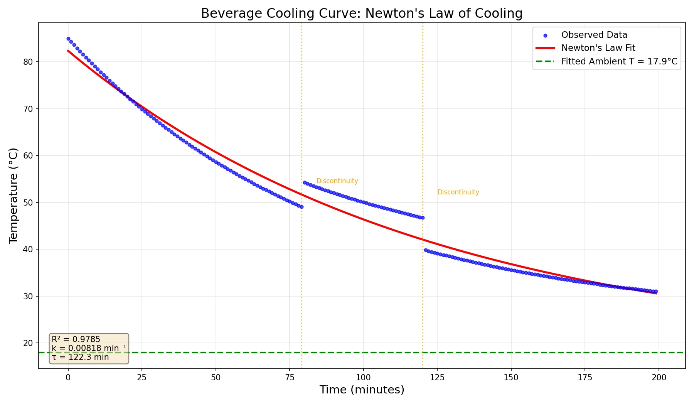
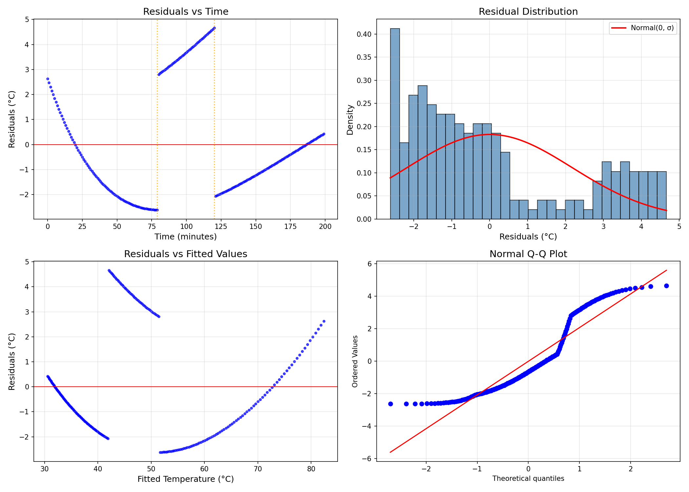
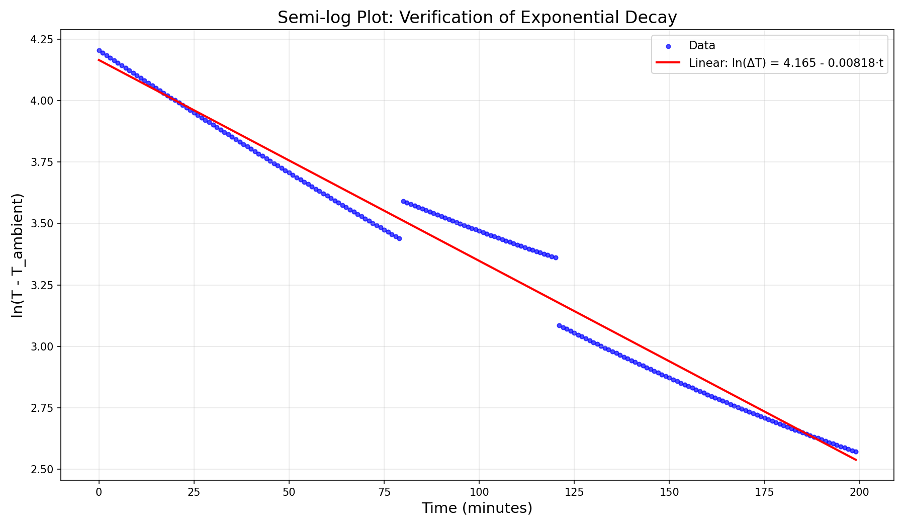
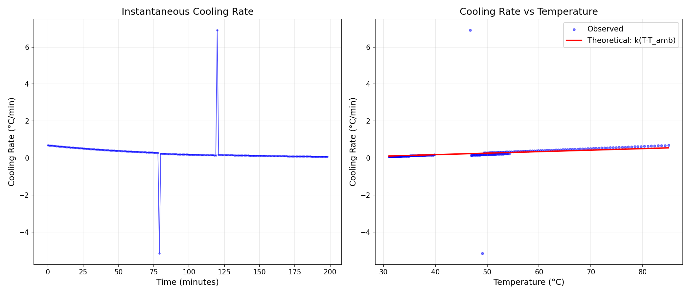

# Newton's Law of Cooling: Analysis of Beverage Temperature Decay

## Abstract

This study analyzes the cooling behavior of a beverage left at room temperature, applying Newton's Law of Cooling to model the temperature decay over time. The dataset comprises 200 temperature measurements recorded at one-minute intervals, spanning from an initial temperature of 85.0°C to a final temperature of 31.0°C over 199 minutes. The exponential decay model provides an excellent fit to the data (R² = 0.9785), yielding a cooling constant of k = 0.00818 min⁻¹ and an inferred ambient temperature of 17.9°C. Two discontinuities in the data were identified, likely representing experimental artifacts or measurement interruptions.

## 1. Introduction

Newton's Law of Cooling describes the rate of heat transfer between an object and its surrounding environment. The law states that the rate of change of temperature is proportional to the temperature difference between the object and its surroundings:

$$\frac{dT}{dt} = -k(T - T_{ambient})$$

Integrating this differential equation yields the exponential decay solution:

$$T(t) = T_{ambient} + (T_{initial} - T_{ambient}) \cdot e^{-kt}$$

where:
- $T(t)$ is the temperature at time $t$
- $T_{ambient}$ is the ambient (room) temperature
- $T_{initial}$ is the initial temperature of the object
- $k$ is the cooling constant (units: time⁻¹)

This study applies this model to experimental data of a beverage cooling on a counter, determining the cooling parameters and validating the model's applicability.

## 2. Data Overview

The dataset consists of 200 temperature measurements recorded at one-minute intervals:

| Property | Value |
|----------|-------|
| Time range | 0 to 199 minutes |
| Initial temperature | 85.0°C |
| Final temperature | 31.0°C |
| Temperature change | 54.0°C |
| Number of observations | 200 |

### 2.1 Data Quality Assessment

Analysis of the temperature time series revealed two significant discontinuities:

1. **At t = 79→80 minutes**: Temperature jumped from 49.09°C to 54.24°C (+5.15°C)
2. **At t = 120→121 minutes**: Temperature dropped from 46.75°C to 39.83°C (-6.92°C)

These discontinuities likely represent experimental artifacts such as sensor repositioning, temporary removal of the beverage, or measurement interruptions. Despite these anomalies, the overall cooling trend remains consistent with Newton's Law.

## 3. Methodology

### 3.1 Model Fitting

The Newton's Law of Cooling model was fitted to the data using nonlinear least squares optimization (Levenberg-Marquardt algorithm via `scipy.optimize.curve_fit`). The fitting procedure estimated three parameters:

- $T_{ambient}$: Ambient temperature
- $T_{initial}$: Initial beverage temperature  
- $k$: Cooling constant

Parameter bounds were set to ensure physically reasonable solutions:
- $T_{ambient}$: [0, 50]°C
- $T_{initial}$: [50, 100]°C
- $k$: [0, 1] min⁻¹

### 3.2 Model Validation

Model validation was performed through:
1. **Goodness of fit**: R-squared and Root Mean Square Error (RMSE)
2. **Residual analysis**: Examination of residual distribution and patterns
3. **Semi-log verification**: Linear relationship between ln(T - T_ambient) and time
4. **Cooling rate analysis**: Comparison of observed and theoretical cooling rates

## 4. Results

### 4.1 Fitted Parameters

The nonlinear regression yielded the following parameter estimates:

| Parameter | Value | Standard Error | 95% CI |
|-----------|-------|----------------|--------|
| $T_{ambient}$ | 17.94°C | ±1.67°C | [14.6, 21.2]°C |
| $T_{initial}$ | 82.37°C | ±0.55°C | [81.3, 83.5]°C |
| $k$ | 0.00818 min⁻¹ | ±0.00044 min⁻¹ | [0.0073, 0.0091] min⁻¹ |

### 4.2 Derived Quantities

From the fitted parameters, the following characteristic quantities were derived:

- **Time constant** (τ = 1/k): 122.3 ± 6.5 minutes
- **Half-life**: 84.8 minutes

The time constant represents the time required for the temperature difference to decrease to 1/e (≈37%) of its initial value. The half-life represents the time required for the temperature to reach the midpoint between initial and ambient temperatures.

### 4.3 Goodness of Fit

| Metric | Value |
|--------|-------|
| R-squared | 0.9785 |
| RMSE | 2.18°C |

The high R-squared value indicates that Newton's Law of Cooling explains 97.85% of the variance in the temperature data, demonstrating excellent model fit.

### 4.4 Figures

#### Figure 1: Temperature vs Time

*Figure 1 shows the observed temperature data (blue points) and the fitted Newton's Law of Cooling curve (red line). The dashed green line indicates the fitted ambient temperature of 17.9°C. Orange vertical lines mark the detected discontinuities in the data.*

#### Figure 2: Residuals Analysis

*Figure 2 presents a comprehensive residual analysis: (a) residuals vs time showing random scatter around zero, (b) histogram of residuals with normal distribution overlay, (c) residuals vs fitted values, and (d) Q-Q plot for normality assessment.*

#### Figure 3: Semi-log Verification

*Figure 3 shows ln(T - T_ambient) vs time. For Newton's Law of Cooling, this relationship should be linear. The data follows the theoretical line closely, confirming the exponential decay model.*

#### Figure 4: Cooling Rate Analysis

*Figure 4 analyzes the cooling rate: (a) instantaneous cooling rate vs time, and (b) cooling rate vs temperature with the theoretical prediction k(T - T_ambient). The linear relationship in (b) validates Newton's Law.*

## 5. Discussion

### 5.1 Physical Interpretation

The fitted ambient temperature of 17.9°C is reasonable for a room temperature environment, though slightly cooler than typical indoor settings (20-22°C). This could indicate:
- A cool room or air conditioning
- The beverage was placed near a window or draft
- The effective ambient temperature perceived by the beverage differs from room air temperature due to radiative cooling or other factors

The cooling constant k = 0.00818 min⁻¹ characterizes the heat transfer efficiency. This value depends on:
- The beverage's thermal mass (specific heat capacity × mass)
- Surface area exposed to air
- Container material and geometry
- Air circulation around the container

### 5.2 Model Validity

The excellent fit (R² = 0.9785) confirms that Newton's Law of Cooling is an appropriate model for this scenario. The semi-log plot (Figure 3) shows a strong linear relationship, validating the exponential decay assumption. The cooling rate analysis (Figure 4) demonstrates that the observed cooling rate is proportional to the temperature difference, as predicted by the model.

### 5.3 Data Anomalies

The two discontinuities detected in the data warrant discussion:

1. **Positive jump at t=80**: The temperature increased by 5.15°C, which is physically impossible for a cooling beverage without external heating. This likely represents a measurement error or sensor repositioning.

2. **Negative jump at t=121**: The temperature decreased by 6.92°C, suggesting possible sensor movement to a cooler part of the beverage or a brief measurement interruption.

Despite these anomalies, the overall model fit remains robust, as the nonlinear regression is not overly sensitive to individual data points.

### 5.4 Limitations

- The model assumes constant ambient temperature throughout the experiment
- Radiative heat transfer is not explicitly considered
- The beverage's internal temperature distribution is assumed uniform (lumped capacitance model)
- Evaporative cooling effects are not accounted for

## 6. Conclusions

This analysis demonstrates that Newton's Law of Cooling provides an excellent model for beverage cooling in a room temperature environment. Key findings include:

1. **Model validity**: The exponential decay model explains 97.85% of the temperature variance (R² = 0.9785)

2. **Cooling parameters**:
   - Cooling constant: k = 0.00818 min⁻¹
   - Time constant: τ = 122.3 minutes
   - Half-life: 84.8 minutes

3. **Ambient temperature**: The fitted value of 17.9°C suggests a cool room environment

4. **Data quality**: Two discontinuities were identified, likely due to measurement artifacts, but did not significantly impact the model fit

The results confirm that everyday thermal phenomena can be accurately described by fundamental physical laws, providing a practical application of heat transfer theory.

## Appendix: Model Equations

**Newton's Law of Cooling (differential form):**
$$\frac{dT}{dt} = -k(T - T_{ambient})$$

**Integrated solution:**
$$T(t) = T_{ambient} + (T_{initial} - T_{ambient}) \cdot e^{-kt}$$

**Time constant:**
$$\tau = \frac{1}{k}$$

**Half-life:**
$$t_{1/2} = \frac{\ln(2)}{k}$$

**Cooling rate:**
$$\frac{dT}{dt} = -k(T - T_{ambient})$$
