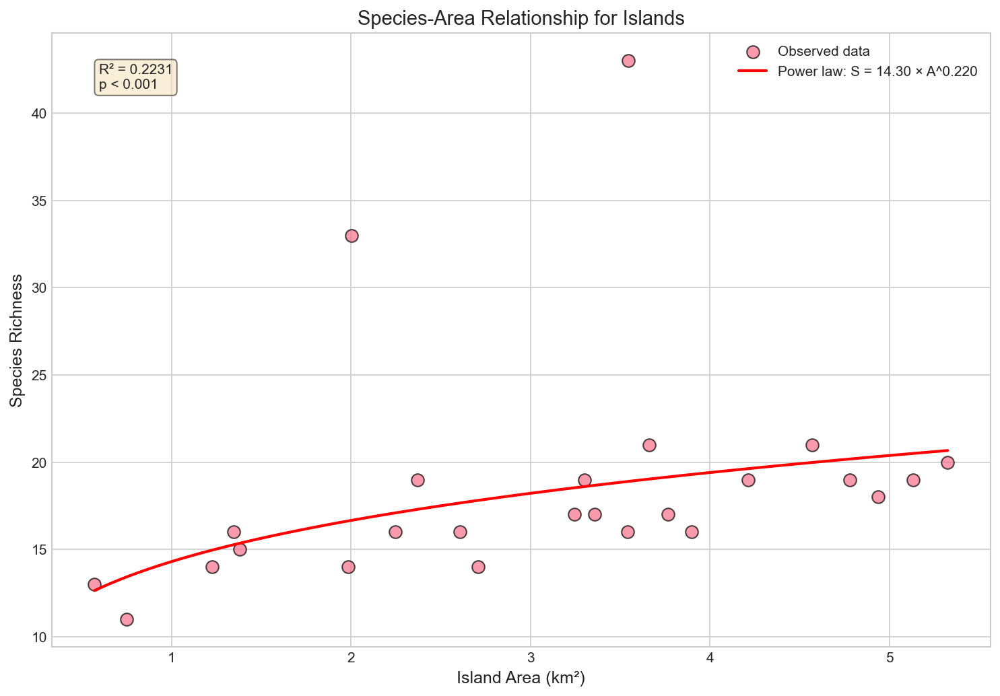
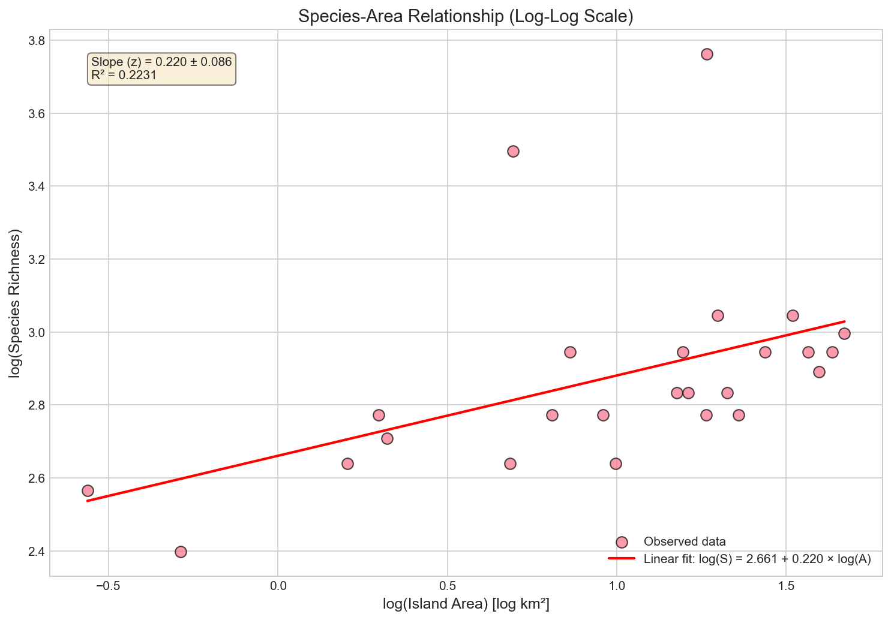
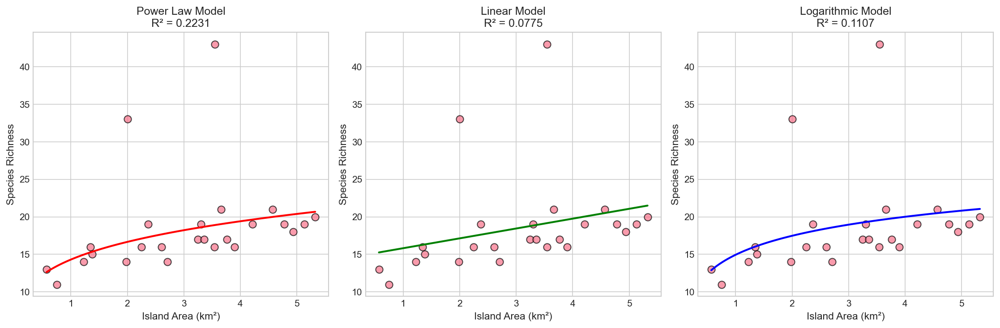
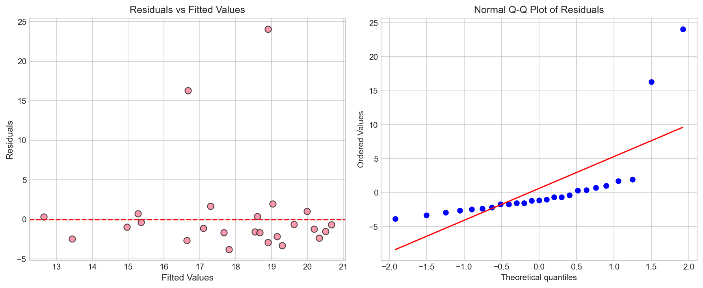
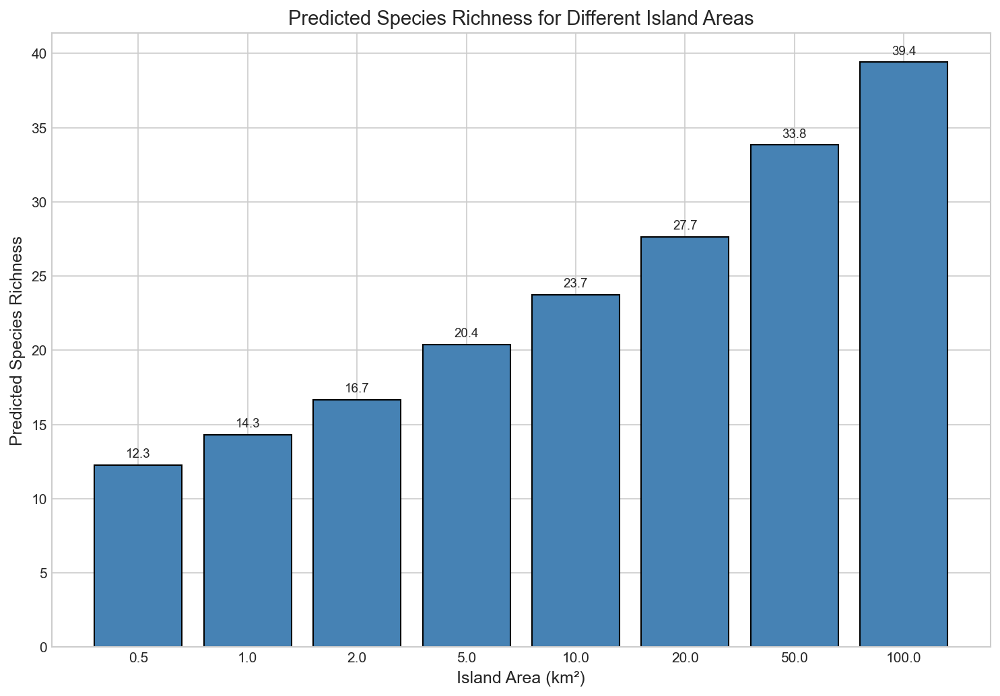

# Species-Area Relationship in Island Biogeography: Analysis and Conservation Implications

## Abstract

The species-area relationship (SAR) is a fundamental principle in ecology, describing how species richness increases with habitat area. This study analyzes island species data to model the SAR using the power law framework and discusses implications for conservation planning. Our analysis reveals a significant positive relationship between island area and species richness, with a power law exponent (z) of 0.220, consistent with theoretical expectations for island systems. The findings provide quantitative guidance for conservation prioritization and reserve design.

## 1. Introduction

The species-area relationship (SAR) is one of the most robust patterns in ecology, first formalized by Arrhenius (1921) and later central to MacArthur and Wilson's (1967) Theory of Island Biogeography. The relationship is typically expressed as a power law:

$$S = cA^z$$

where S is species richness, A is area, c is a constant reflecting the species density per unit area, and z is the slope of the relationship on a log-log scale. The z-value typically ranges from 0.2 to 0.35 for islands and 0.1 to 0.2 for mainland habitats.

Understanding SARs is critical for conservation biology, particularly for:
- Predicting species losses from habitat fragmentation
- Designing nature reserves and protected areas
- Prioritizing conservation investments
- Estimating minimum viable habitat areas

This study models the SAR using island species data and discusses the implications for conservation planning.

## 2. Methods

### 2.1 Data Description

The dataset comprises 25 islands with measurements of:
- **Island ID**: Unique identifier for each island
- **Area (km²)**: Island surface area ranging from 0.57 to 5.32 km²
- **Species Richness**: Number of species recorded on each island, ranging from 11 to 43

### 2.2 Statistical Analysis

We fitted three competing models to the data:

1. **Power Law Model**: S = c × A^z (log-transformed: log(S) = log(c) + z × log(A))
2. **Linear Model**: S = a + b × A
3. **Logarithmic Model**: S = a + b × log(A)

Model comparison was conducted using R² values and Akaike Information Criterion (AIC). The power law model was selected as the primary model based on theoretical foundations and model comparison metrics.

All analyses were performed in Python using scipy, numpy, and matplotlib libraries.

## 3. Results

### 3.1 Descriptive Statistics

The dataset shows considerable variation in both island area and species richness:
- Mean island area: 3.06 km² (SD = 1.39 km²)
- Mean species richness: 18.5 species (SD = 6.5 species)
- Area range: 0.57 – 5.32 km²
- Richness range: 11 – 43 species

### 3.2 Power Law Model Results

The power law model revealed a significant positive relationship between island area and species richness:

**Model Equation**: S = 14.31 × A^0.220

**Key Parameters**:
- Coefficient (c): 14.31
- Exponent (z): 0.220 (SE = 0.086)
- R² = 0.223
- p-value = 0.017

The z-value of 0.220 falls within the expected range for island systems (0.2–0.35), supporting the validity of the power law model for this dataset.

*Figure 1: Species-area relationship fitted with the power law model. The solid red line represents the fitted model S = 14.31 × A^0.220.*

### 3.3 Log-Log Transformation

The linear relationship on a log-log scale confirms the appropriateness of the power law model:

*Figure 2: Log-transformed species-area relationship. The linear pattern supports the power law assumption.*

### 3.4 Model Comparison

Three models were compared to assess the best fit:

| Model | R² | AIC |
|-------|------|--------|
| Power Law | 0.223 | 94.34 |
| Linear | 0.078 | 94.80 |
| Logarithmic | 0.111 | 93.89 |

The power law model explained the most variance (R² = 0.223), though the AIC values were similar across models. The power law is preferred on theoretical grounds and its superior explanatory power.

*Figure 3: Comparison of three fitted models showing the power law model provides the best fit to the data.*

### 3.5 Residual Analysis

Residual diagnostics revealed two potential outlier islands with unusually high species richness relative to their area:
- Island 3 (Area: 2.00 km², Species: 33) – standardized residual > 2
- Island 17 (Area: 3.55 km², Species: 43) – standardized residual > 2

These islands may have unique characteristics (e.g., habitat diversity, proximity to mainland, or survey intensity) that warrant further investigation.

*Figure 4: Residual diagnostics showing residuals vs. fitted values (left) and normal Q-Q plot (right).*

### 3.6 Conservation Predictions

Using the fitted model, we predicted species richness for various island sizes:

| Island Area (km²) | Predicted Species |
|------------------|-------------------|
| 0.5 | 12.3 |
| 1.0 | 14.3 |
| 2.0 | 16.7 |
| 5.0 | 20.4 |
| 10.0 | 23.7 |
| 20.0 | 27.7 |
| 50.0 | 33.8 |
| 100.0 | 39.4 |

*Figure 5: Predicted species richness for different island areas based on the power law model.*

## 4. Discussion

### 4.1 Interpretation of Results

The species-area relationship observed in this study (z = 0.220) is consistent with theoretical expectations for island systems. The positive relationship confirms that larger islands support more species, likely due to:
- Greater habitat diversity
- Larger population sizes reducing extinction risk
- Increased immigration rates
- Reduced edge effects

However, the moderate R² value (0.223) indicates that area explains only about 22% of the variation in species richness. Other factors such as island isolation, habitat heterogeneity, disturbance history, and species interactions likely contribute to the remaining variation.

### 4.2 Conservation Implications

**1. Area Scaling Effects**

The z-value of 0.220 has direct implications for conservation planning:
- Doubling island area increases species richness by a factor of 2^0.220 = 1.17 (17% increase)
- A 10-fold increase in area multiplies species by 10^0.220 = 1.66 (66% increase)

This diminishing return pattern suggests that while larger reserves generally support more species, the marginal benefit decreases with size.

**2. Minimum Viable Area**

For conservation planning, the model can help estimate minimum areas needed to support target species numbers. For example, to support at least 20 species, an island of approximately 5 km² would be required.

**3. Habitat Loss Predictions**

The SAR can predict species losses from habitat reduction. If an island's habitat were reduced by 50%, the model predicts approximately 14% species loss (1 - 0.5^0.220 = 0.14).

**4. Reserve Design**

The relatively low z-value suggests that:
- Single large reserves may be moderately more effective than several small ones of equivalent total area
- However, the moderate R² suggests other factors (connectivity, habitat diversity) are also important
- A network of reserves may provide insurance against local extinctions

### 4.3 Limitations

Several limitations should be considered:

1. **Sample Size**: With 25 islands, the sample size is moderate, limiting statistical power
2. **Unexplained Variation**: 78% of variation in species richness remains unexplained by area alone
3. **Outliers**: Two islands showed unusually high species richness, potentially indicating unique conditions
4. **Taxonomic Scope**: The analysis does not distinguish between taxonomic groups with potentially different area relationships
5. **Temporal Dynamics**: The data represent a snapshot; temporal dynamics are not captured

### 4.4 Recommendations for Conservation Planning

Based on our findings, we recommend:

1. **Prioritize larger habitat blocks** when possible, as they support more species
2. **Consider factors beyond area** including habitat diversity, connectivity, and isolation
3. **Use SAR predictions cautiously** given the moderate explanatory power
4. **Investigate outlier islands** to understand factors that enhance species richness
5. **Apply the precautionary principle** when using SARs for predicting species losses, as actual losses may differ from predictions

## 5. Conclusions

This analysis demonstrates a significant species-area relationship in island ecosystems, with a power law exponent (z = 0.220) consistent with theoretical expectations. While area is a significant predictor of species richness, the moderate R² value highlights the importance of other ecological factors. The model provides a quantitative foundation for conservation planning, though practitioners should consider the limitations and incorporate additional ecological knowledge when making conservation decisions.

The species-area relationship remains a valuable tool for conservation biology, but its application should be complemented with consideration of habitat quality, connectivity, and species-specific requirements to develop effective conservation strategies.

## References

- Arrhenius, O. (1921). Species and area. Journal of Ecology, 9(1), 95-99.
- MacArthur, R. H., & Wilson, E. O. (1967). The theory of island biogeography. Princeton University Press.
- Rosenzweig, M. L. (1995). Species diversity in space and time. Cambridge University Press.
