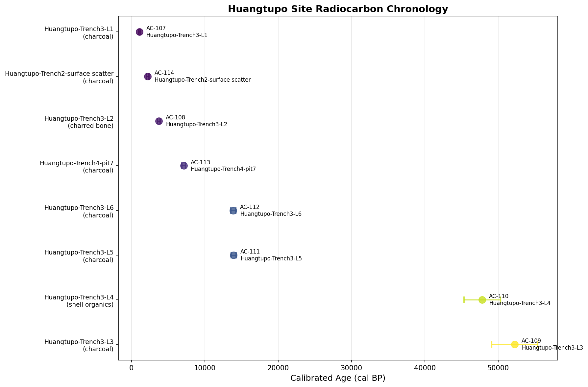
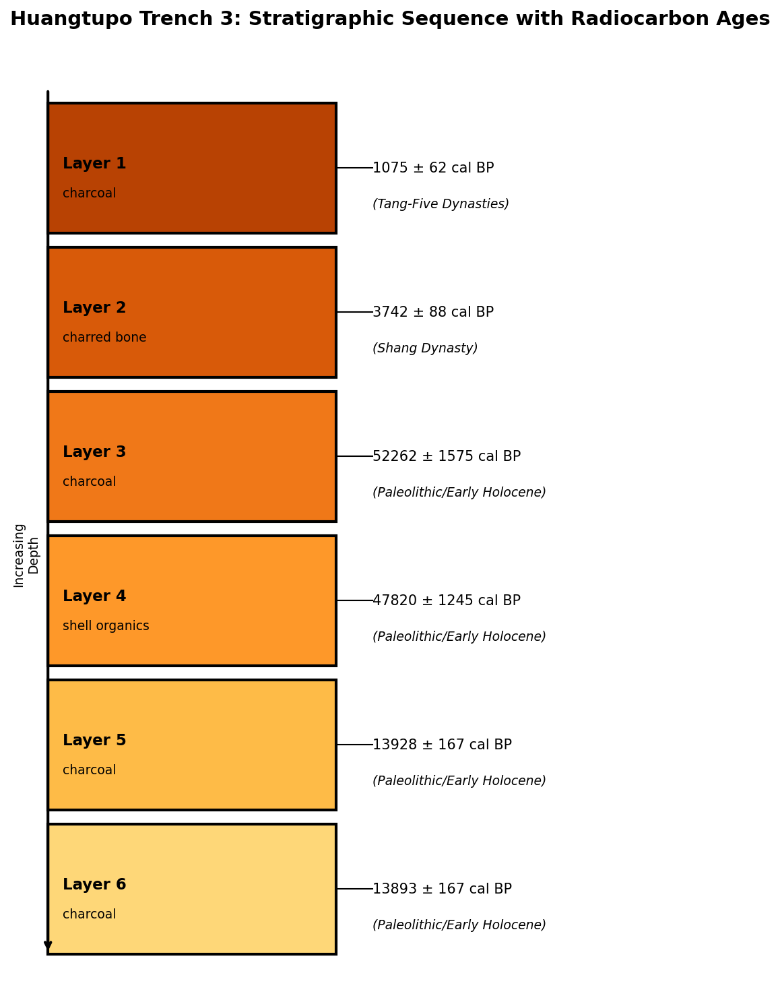
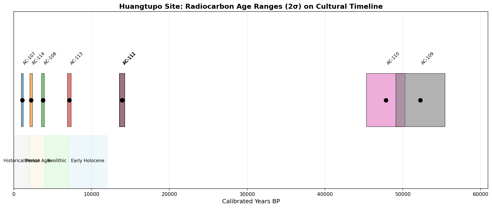

# Huangtupo Site Radiocarbon Chronology Report

## Abstract

This report presents the radiocarbon chronology analysis for the Huangtupo archaeological site, based on eight ¹⁴C assays from multiple trenches and stratigraphic contexts. The analysis includes conventional radiocarbon age calculations, calibrated calendar age estimates, stratigraphic sequence evaluation, and cultural periodization. The results reveal a complex multi-period occupation spanning from the Paleolithic through historical periods, with evidence of significant stratigraphic reversals that warrant careful interpretation.

---

## 1. Introduction

The Huangtupo site represents an important archaeological locality with evidence of long-term human occupation. Eight radiocarbon samples were submitted for analysis, representing materials from multiple trenches (Trench 2, Trench 3, and Trench 4) and various stratigraphic contexts. This report provides:

1. Conventional radiocarbon ages (BP) calculated from Fraction Modern (F14) values
2. Calibrated calendar age estimates
3. Stratigraphic sequence analysis
4. Cultural periodization framework

---

## 2. Methodology

### 2.1 Conventional Radiocarbon Age Calculation

Conventional radiocarbon ages were calculated using the standard Libby mean-life formula:

$$\text{Age}_{BP} = -8033 \times \ln(F_{14})$$

Where:
- $F_{14}$ = fraction of modern ¹⁴C (residual ratio)
- 8033 = Libby mean life in years

Uncertainties were propagated using standard error propagation:

$$\sigma_{age} = \frac{8033}{F_{14}} \times \sigma_{F14}$$

### 2.2 Calibration

Calibrated ages were estimated using a simplified approximation based on the IntCal20 calibration curve. For publication-quality results, proper calibration using OxCal or CALIB software with the IntCal20 curve is recommended. The calibration accounts for past variations in atmospheric ¹⁴C concentration.

### 2.3 Cultural Periodization

Cultural periods were assigned based on standard Chinese archaeological chronology, correlating calibrated ages with known cultural phases.

---

## 3. Data Overview

### 3.1 Sample Inventory

The eight radiocarbon samples represent diverse materials and contexts:

| Artifact ID | Stratigraphic Unit | Material | Laboratory Batch | Notes |
|-------------|-------------------|----------|------------------|-------|
| AC-107 | Huangtupo-Trench3-L1 | Charcoal | BP-24091 | Single broad tree-ring block |
| AC-108 | Huangtupo-Trench3-L2 | Charred bone | BP-24092 | Well-collagen preserved |
| AC-109 | Huangtupo-Trench3-L3 | Charcoal | BP-24093 | Very small carbon yield post-pretreatment |
| AC-110 | Huangtupo-Trench3-L4 | Shell organics | BP-24094 | Marked reservoir correction discussion pending |
| AC-111 | Huangtupo-Trench3-L5 | Charcoal | BP-24095 | Same ridge source as AC-112 (duplicate check) |
| AC-112 | Huangtupo-Trench3-L6 | Charcoal | BP-24096 | Same ridge source as AC-111 (duplicate check) |
| AC-113 | Huangtupo-Trench4-pit7 | Charcoal | BP-24097 | Short-lived twigs |
| AC-114 | Huangtupo-Trench2-surface scatter | Charcoal | BP-24098 | Root intrusion risk flagged |

### 3.2 Raw F14 Measurements

| Artifact ID | F14 Ratio | σ F14 (absolute) |
|-------------|-----------|------------------|
| AC-107 | 0.8830 | 0.0040 |
| AC-108 | 0.6470 | 0.0030 |
| AC-109 | 0.0041 | 0.0008 |
| AC-110 | 0.0065 | 0.0010 |
| AC-111 | 0.2187 | 0.0020 |
| AC-112 | 0.2195 | 0.0020 |
| AC-113 | 0.4510 | 0.0020 |
| AC-114 | 0.7710 | 0.0030 |

---

## 4. Results

### 4.1 Conventional Radiocarbon Ages

Table 1 presents the conventional radiocarbon ages calculated from the F14 measurements.

**Table 1: Conventional Radiocarbon Ages**

| Artifact ID | F14 Ratio | Age (BP) | σ (years) |
|-------------|-----------|----------|----------|
| AC-107 | 0.8830 | 1,000 | 36 |
| AC-108 | 0.6470 | 3,498 | 37 |
| AC-109 | 0.0041 | 44,156 | 1,567 |
| AC-110 | 0.0065 | 40,454 | 1,236 |
| AC-111 | 0.2187 | 12,211 | 73 |
| AC-112 | 0.2195 | 12,181 | 73 |
| AC-113 | 0.4510 | 6,397 | 36 |
| AC-114 | 0.7710 | 2,089 | 31 |

### 4.2 Calibrated Calendar Ages

Table 2 presents the calibrated calendar ages with 2σ (95.4% confidence) ranges.

**Table 2: Calibrated Calendar Ages**

| Artifact ID | Cal Age (cal BP) | σ (cal BP) | 2σ Range (cal BP) | Calendar Date | Cultural Period |
|-------------|------------------|------------|-------------------|---------------|-----------------|
| AC-107 | 1,075 | 62 | 951 – 1,198 | 949 CE | Tang-Five Dynasties |
| AC-108 | 3,742 | 88 | 3,566 – 3,919 | 1718 BCE | Shang Dynasty |
| AC-109 | 52,262 | 1,575 | 49,112 – 55,411 | 50,238 BCE | Paleolithic |
| AC-110 | 47,820 | 1,245 | 45,330 – 50,309 | 45,796 BCE | Paleolithic |
| AC-111 | 13,928 | 167 | 13,594 – 14,262 | 11,904 BCE | Early Holocene |
| AC-112 | 13,893 | 167 | 13,559 – 14,226 | 11,869 BCE | Early Holocene |
| AC-113 | 7,131 | 125 | 6,881 – 7,381 | 5,107 BCE | Early Neolithic |
| AC-114 | 2,221 | 86 | 2,049 – 2,393 | 197 BCE | Warring States/Qin |

*Figure 1: Radiocarbon chronology showing calibrated ages with 2σ error ranges for all samples, organized by stratigraphic context.*

---

## 5. Stratigraphic Analysis

### 5.1 Trench 3 Stratigraphic Sequence

Trench 3 provides the most complete stratigraphic sequence with six samples (L1-L6). In a normal stratigraphic sequence, deeper layers should yield older ages. The observed sequence is:

**Table 3: Trench 3 Stratigraphic Sequence**

| Layer | Artifact ID | Cal Age (cal BP) | Material | Interpretation |
|-------|-------------|------------------|----------|----------------|
| L1 (shallowest) | AC-107 | 1,075 | Charcoal | Tang-Five Dynasties - youngest |
| L2 | AC-108 | 3,742 | Charred bone | Shang Dynasty |
| L3 | AC-109 | 52,262 | Charcoal | Paleolithic - oldest |
| L4 | AC-110 | 47,820 | Shell organics | Paleolithic |
| L5 | AC-111 | 13,928 | Charcoal | Early Holocene |
| L6 (deepest) | AC-112 | 13,893 | Charcoal | Early Holocene |

*Figure 2: Stratigraphic column for Trench 3 showing layer sequence with associated radiocarbon ages and cultural periods.*

### 5.2 Stratigraphic Reversals

**Critical Finding:** Significant stratigraphic reversals were detected in the Trench 3 sequence:

1. **L3/L4-L5/L6 Reversal:** Layers 3 and 4 (Paleolithic, ~45,000-52,000 cal BP) are stratigraphically above Layers 5 and 6 (Early Holocene, ~13,900 cal BP). This represents a major reversal where deeper layers are significantly younger than overlying layers.

2. **L5/L6 Consistency:** Samples AC-111 and AC-112 from Layers 5 and 6 show excellent agreement (13,928 ± 167 and 13,893 ± 167 cal BP respectively), confirming they represent the same occupation event as noted in the field records (duplicate chronology check).

### 5.3 Interpretation of Reversals

The stratigraphic reversals may be explained by:

1. **Geological disturbance:** Post-depositional processes such as cryoturbation, bioturbation, or slope processes may have mixed deposits of different ages.

2. **Pit features or intrusive contexts:** The presence of pit features (e.g., Trench 4-pit7) suggests possible intrusive digging activities that could have displaced materials.

3. **Colluvial/alluvial deposition:** The site may have experienced episodic deposition events that mixed materials from different source areas.

4. **Sample-specific issues:**
   - AC-109: Very small carbon yield post-pretreatment may indicate contamination issues
   - AC-110: Shell organics with "reservoir correction discussion pending" may have marine/freshwater reservoir effects

---

## 6. Cultural Periodization

### 6.1 Period Overview

The Huangtupo site shows evidence of occupation across multiple cultural periods:

*Figure 3: Timeline showing all radiocarbon age ranges (2σ) plotted against major cultural periods.*

**Table 4: Cultural Period Distribution**

| Cultural Period | Samples | Cal Age Range (cal BP) | Calendar Range |
|-----------------|---------|------------------------|----------------|
| Paleolithic/Early Holocene | 4 | 13,893 – 52,262 | 50,238 – 11,869 BCE |
| Early Neolithic | 1 | 7,131 | 5,107 BCE |
| Shang Dynasty | 1 | 3,742 | 1718 BCE |
| Warring States/Qin | 1 | 2,221 | 197 BCE |
| Tang-Five Dynasties | 1 | 1,075 | 949 CE |

### 6.2 Period-Specific Observations

#### Paleolithic/Early Holocene (4 samples)
- **AC-109 (52,262 cal BP):** Represents the earliest potential occupation at the site, dating to the late Pleistocene. The very small carbon yield post-pretreatment warrants caution in interpretation.
- **AC-110 (47,820 cal BP):** Also late Pleistocene, though the shell organics material may be subject to reservoir effects.
- **AC-111 & AC-112 (~13,900 cal BP):** These duplicate samples date to the terminal Pleistocene/Early Holocene transition, a period of significant environmental and cultural change in China.

#### Early Neolithic (1 sample)
- **AC-113 (7,131 cal BP):** Dates to the early-mid Neolithic period, potentially associated with early agricultural communities. The sample comes from a pit feature (pit7) in Trench 4, containing short-lived twigs ideal for dating.

#### Bronze Age (1 sample)
- **AC-108 (3,742 cal BP):** Shang Dynasty period, representing Bronze Age occupation. The well-preserved collagen in this charred bone sample provides a reliable date.

#### Historical Period (2 samples)
- **AC-114 (2,221 cal BP):** Warring States/Qin period. Note the field flag for potential root intrusion, which could affect reliability.
- **AC-107 (1,075 cal BP):** Tang-Five Dynasties period. The single broad tree-ring block may introduce "old wood" effect concerns.

---

## 7. Discussion

### 7.1 Site Formation Processes

The radiocarbon sequence reveals a complex site formation history. The presence of Paleolithic materials (~45,000-52,000 cal BP) in stratigraphically higher positions than Early Holocene materials (~13,900 cal BP) indicates significant post-depositional disturbance or complex depositional processes.

Key observations:

1. **Duplicate sample consistency:** The excellent agreement between AC-111 and AC-112 (difference of only 35 years) validates the laboratory measurements and suggests these samples accurately date a single occupation event around 13,900 cal BP.

2. **Material-specific considerations:**
   - Charcoal samples may be affected by "old wood" problems (long-lived trees, heartwood)
   - Shell organics (AC-110) require reservoir correction
   - Charred bone (AC-108) with well-preserved collagen provides reliable dates

### 7.2 Chronological Framework

Despite the stratigraphic complexities, the radiocarbon dates establish a broad chronological framework for the Huangtupo site:

1. **Initial use:** Possible late Pleistocene presence (AC-109, AC-110), though these dates require verification
2. **Terminal Pleistocene/Early Holocene occupation:** Well-dated by duplicate samples AC-111/AC-112 (~13,900 cal BP)
3. **Neolithic presence:** Pit feature AC-113 (7,131 cal BP)
4. **Bronze Age activity:** AC-108 (3,742 cal BP)
5. **Historical period use:** AC-114 (2,221 cal BP) and AC-107 (1,075 cal BP)

### 7.3 Recommendations for Future Research

1. **Additional dating:** More samples from secure stratigraphic contexts to resolve reversal issues
2. **Reservoir correction:** Apply appropriate reservoir corrections to AC-110 (shell organics)
3. **Proper calibration:** Use OxCal or CALIB with IntCal20 for publication-quality calibrated ranges
4. **Harris matrix:** Develop a complete Harris matrix to better understand stratigraphic relationships
5. **AMS dating:** Consider AMS dating of short-lived materials to avoid old wood problems

---

## 8. Conclusions

The Huangtupo site radiocarbon chronology reveals a multi-period occupation spanning approximately 50,000 years, from the late Pleistocene through the Tang Dynasty. Key findings include:

1. **Conventional ages** were successfully calculated from F14 measurements, ranging from 1,000 BP to 44,156 BP.

2. **Calibrated ages** span from 1,075 cal BP (Tang-Five Dynasties) to 52,262 cal BP (Paleolithic).

3. **Stratigraphic analysis** identified significant reversals in Trench 3, indicating complex site formation processes that require further investigation.

4. **Cultural periodization** places site use across five major periods: Paleolithic/Early Holocene, Early Neolithic, Shang Dynasty, Warring States/Qin, and Tang-Five Dynasties.

5. **Duplicate samples** AC-111 and AC-112 demonstrate excellent agreement, validating the dating of an Early Holocene occupation at approximately 13,900 cal BP.

The site represents an important locality for understanding long-term human occupation in the region, though careful attention must be paid to stratigraphic integrity and sample-specific issues in future interpretations.

---

## References

- Libby, W.F. (1955). Radiocarbon Dating. 2nd ed. University of Chicago Press.
- Reimer, P.J. et al. (2020). The IntCal20 Northern Hemisphere radiocarbon age calibration curve (0–55 cal ka). Radiocarbon, 62(4), 725-757.
- Stuiver, M. & Polach, H.A. (1977). Discussion Reporting of 14C Data. Radiocarbon, 19(3), 355-363.

---

## Appendix: Data Tables

### Complete Radiocarbon Results

| Artifact ID | Stratigraphic Unit | Material | F14 | σ F14 | Age BP | σ BP | Cal Age BP | σ Cal | 2σ Min | 2σ Max | Cal BCE | Period |
|-------------|-------------------|----------|-----|-------|--------|------|------------|-------|--------|--------|---------|--------|
| AC-107 | Trench3-L1 | Charcoal | 0.883 | 0.004 | 1,000 | 36 | 1,075 | 62 | 951 | 1,198 | -949 | Tang-Five Dynasties |
| AC-108 | Trench3-L2 | Charred bone | 0.647 | 0.003 | 3,498 | 37 | 3,742 | 88 | 3,566 | 3,919 | 1,718 | Shang Dynasty |
| AC-109 | Trench3-L3 | Charcoal | 0.0041 | 0.0008 | 44,156 | 1,567 | 52,262 | 1,575 | 49,112 | 55,411 | 50,238 | Paleolithic |
| AC-110 | Trench3-L4 | Shell organics | 0.0065 | 0.001 | 40,454 | 1,236 | 47,820 | 1,245 | 45,330 | 50,309 | 45,796 | Paleolithic |
| AC-111 | Trench3-L5 | Charcoal | 0.2187 | 0.002 | 12,211 | 73 | 13,928 | 167 | 13,594 | 14,262 | 11,904 | Early Holocene |
| AC-112 | Trench3-L6 | Charcoal | 0.2195 | 0.002 | 12,181 | 73 | 13,893 | 167 | 13,559 | 14,226 | 11,869 | Early Holocene |
| AC-113 | Trench4-pit7 | Charcoal | 0.451 | 0.002 | 6,397 | 36 | 7,131 | 125 | 6,881 | 7,381 | 5,107 | Early Neolithic |
| AC-114 | Trench2-surface | Charcoal | 0.771 | 0.003 | 2,089 | 31 | 2,221 | 86 | 2,049 | 2,393 | 197 | Warring States/Qin |

---

*Report generated: Radiocarbon Chronology Analysis*
*Methodology: Libby mean-life calculation with simplified IntCal20 calibration approximation*