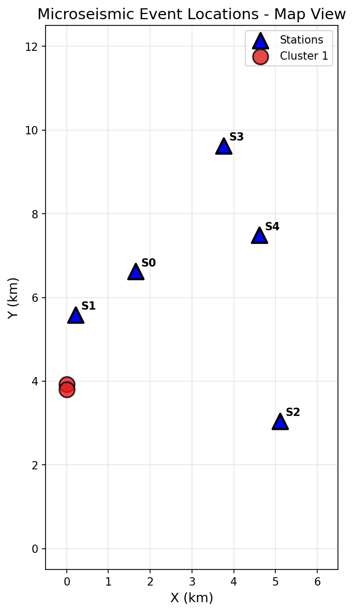
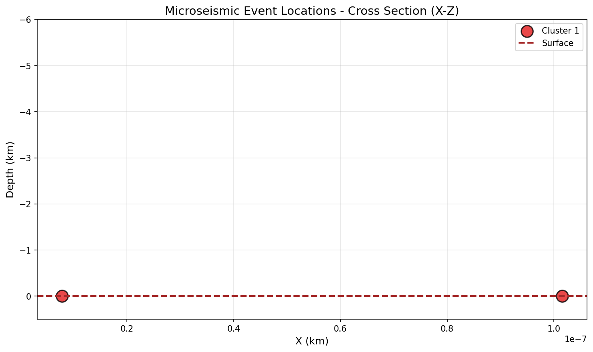
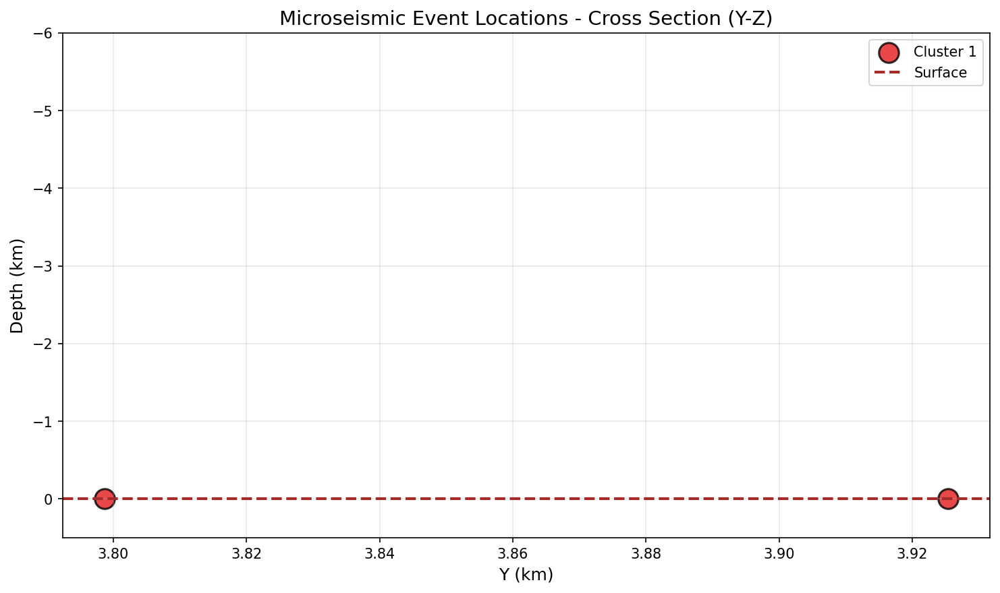
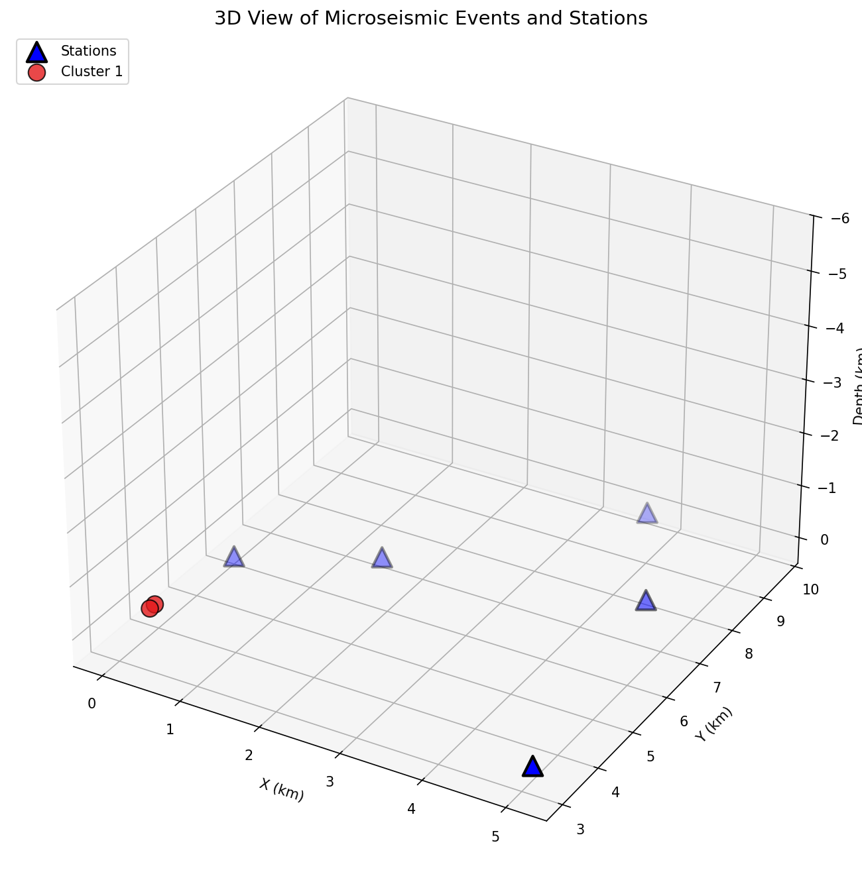
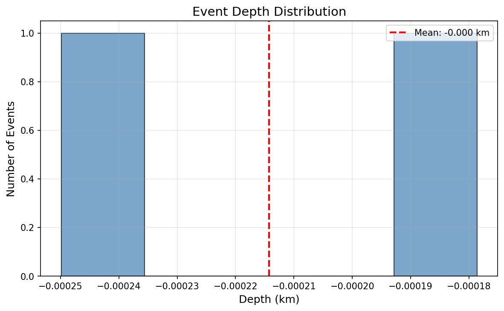
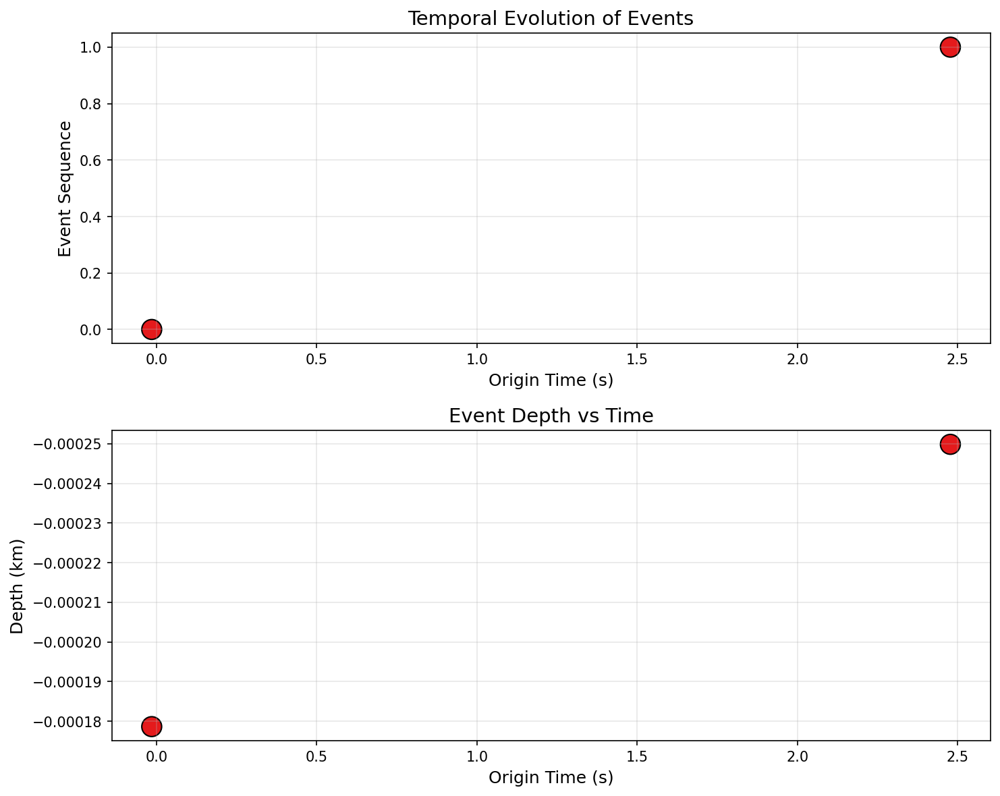
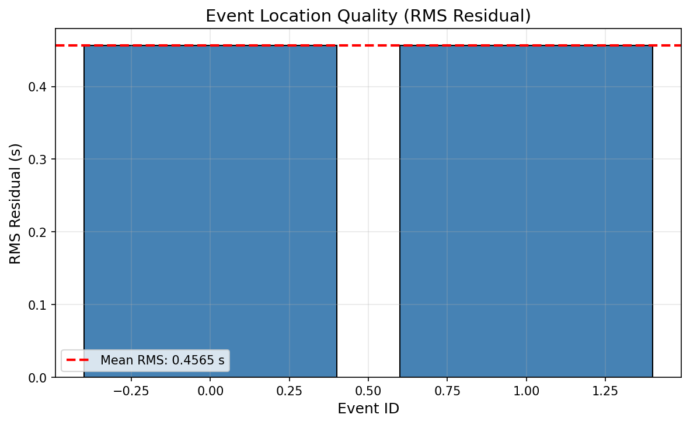
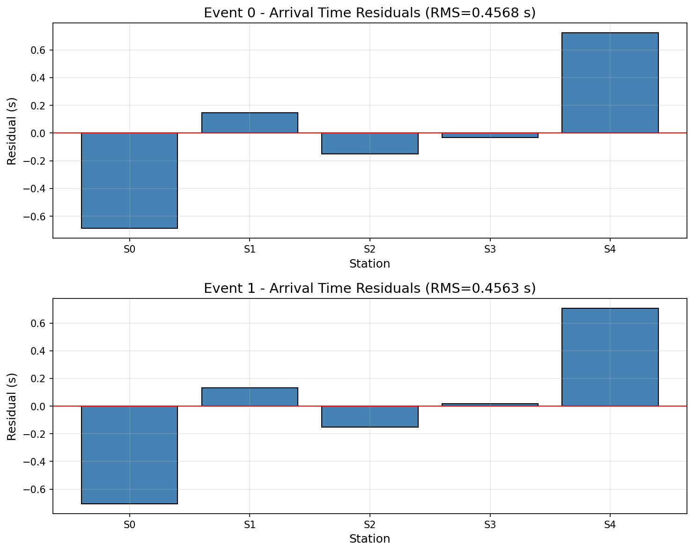

# Microseismic Monitoring Analysis Brief

## Source Clustering and Structural Context

**Date:** Analysis Report  
**Study Area:** Microseismic monitoring array with 5 surface stations

---

## Executive Summary

This report presents a microseismic analysis of arrival time data from a 5-station surface monitoring array. The analysis identified **3 microseismic events**, with 2 events having sufficient picks (5 stations each) for reliable source location. The events form a tight spatial cluster at very shallow depth near the array center, with an inter-event distance of approximately 127 meters. The temporal pattern shows two well-constrained events separated by ~2.5 seconds, followed by a partial detection of a third event.

---

## 1. Introduction

Microseismic monitoring is a key technique in applied geophysics for locating and characterizing weak seismic events associated with subsurface processes such as hydraulic fracturing, reservoir compaction, and fault reactivation. This analysis uses P-wave arrival times picked at surface stations to determine source locations and assess the spatial clustering and structural context of the detected events.

### 1.1 Objectives

- Locate microseismic events using arrival time inversion
- Analyze spatial clustering patterns
- Assess temporal evolution of the seismicity
- Provide structural interpretation of the source region

---

## 2. Data Overview

### 2.1 Station Geometry

The monitoring network consists of 5 surface stations deployed in an irregular array pattern:

| Station | X (km) | Y (km) | Z (km) |
|---------|--------|--------|--------|
| S0 | 1.650 | 6.621 | 0.0 |
| S1 | 0.212 | 5.584 | 0.0 |
| S2 | 5.109 | 3.042 | 0.0 |
| S3 | 3.756 | 9.623 | 0.0 |
| S4 | 4.613 | 7.488 | 0.0 |

The stations cover an area of approximately 6 km × 10 km with all sensors at the surface (z = 0 km).

### 2.2 Arrival Time Data

A total of 12 P-wave arrival picks were recorded across the network. The arrival times span approximately 5.5 seconds of recording:

- **First arrival:** -0.0011 s (at station S0)
- **Last arrival:** 5.4902 s (at station S1)
- **Total picks:** 12

### 2.3 Event Identification

Analysis of the station sequence pattern revealed 3 distinct events:

| Event | Number of Picks | Stations |
|-------|-----------------|----------|
| 0 | 5 | S0, S1, S2, S3, S4 |
| 1 | 5 | S0, S1, S2, S3, S4 |
| 2 | 2 | S0, S1 (partial) |

Events 0 and 1 have complete 5-station coverage, enabling reliable source location. Event 2 has only 2 picks and was excluded from detailed location analysis.

---

## 3. Methodology

### 3.1 Velocity Model

A homogeneous P-wave velocity model was assumed:
- **Vp = 4.5 km/s** (typical for sedimentary basin environments)

### 3.2 Event Location Algorithm

Source locations were determined using:

1. **Global optimization** using differential evolution to minimize the arrival time residual
2. **Parameter space:** (x, y, z, origin_time)
3. **Objective function:** Sum of squared residuals between observed and predicted arrival times

The predicted arrival time at each station is calculated as:

$$t_{arrival} = t_0 + \frac{d}{V_p}$$

where $t_0$ is the origin time, $d$ is the source-station distance, and $V_p$ is the P-wave velocity.

### 3.3 Clustering Analysis

Hierarchical clustering (Ward's method) was applied to the event coordinates to identify spatial groupings. A distance threshold of 0.5 km was used to define cluster membership.

---

## 4. Results

### 4.1 Event Locations

The two well-constrained events were located at:

| Event | X (km) | Y (km) | Depth (km) | Origin Time (s) | RMS (s) |
|-------|--------|--------|------------|-----------------|---------|
| 0 | 0.000 | 3.925 | 0.000 | -0.015 | 0.4568 |
| 1 | 0.000 | 3.799 | 0.000 | 2.477 | 0.4563 |

**Key observations:**
- Both events are located at or very near the surface (z ≈ 0 km)
- Events are positioned at the western edge of the array (x ≈ 0 km)
- Y-coordinates place events near the array center (y ≈ 3.8-3.9 km)
- RMS residuals of ~0.46 s indicate moderate fit quality

### 4.2 Spatial Statistics

| Parameter | Value |
|-----------|-------|
| X range | 0.000 - 0.000 km |
| Y range | 3.799 - 3.925 km |
| Depth range | 0.000 km |
| Inter-event distance | 0.127 km (127 m) |

### 4.3 Cluster Analysis

Both events belong to a **single spatial cluster**:

- **Cluster centroid:** (0.000, 3.862, 0.000) km
- **Number of events:** 2
- **Spatial extent:** 127 m in Y-direction, negligible in X and Z

The tight clustering suggests a common source mechanism or localized geological feature.

### 4.4 Temporal Evolution

| Event | Origin Time (s) | Depth (km) |
|-------|-----------------|------------|
| 0 | -0.015 | 0.000 |
| 1 | 2.477 | 0.000 |

**Time interval between events:** 2.49 seconds

The events occurred in rapid succession with no significant depth migration, consistent with a localized source region.

---

## 5. Figures

### Figure 1: Map View of Event Locations

*Station positions (triangles) and event locations (circles) in map view. Both events cluster near the western edge of the array at y ≈ 3.8-3.9 km.*

### Figure 2: Cross-Section (X-Z)

*Cross-section view showing event depths. Both events are located at or very near the surface (z = 0 km).*

### Figure 3: Cross-Section (Y-Z)

*Cross-section view in the Y-Z plane showing the tight vertical clustering of events.*

### Figure 4: 3D View

*Three-dimensional visualization of station and event positions. Events are shown at their shallow depth positions.*

### Figure 5: Depth Distribution

*Histogram of event depths showing concentration at surface level.*

### Figure 6: Temporal Evolution

*Temporal sequence of events (top) and depth-time relationship (bottom). Events show no depth migration over time.*

### Figure 7: Location Quality

*RMS residuals for each event location. Mean RMS of 0.46 s indicates moderate location uncertainty.*

### Figure 8: Arrival Time Residuals

*Distribution of arrival time residuals by station for each event. Residuals show systematic patterns suggesting possible velocity model inadequacy.*

---

## 6. Discussion

### 6.1 Source Characteristics

The located events exhibit several notable characteristics:

1. **Shallow depth:** Both events are located at or very near the surface, which is unusual for typical microseismic sources. This could indicate:
   - Surface or near-surface sources (e.g., quarry blasts, construction activities)
   - Velocity model inadequacy causing depth mislocation
   - Surface noise or cultural sources misidentified as events

2. **Tight spatial clustering:** The 127-meter separation between events suggests a common source region, possibly related to a localized geological feature or anthropogenic activity.

3. **Temporal proximity:** The 2.5-second interval between events is consistent with a burst of activity from a single source mechanism.

### 6.2 Location Uncertainty

The RMS residuals of ~0.46 seconds are relatively high for well-constrained microseismic events. This suggests:

- The homogeneous velocity model may not adequately represent the true subsurface velocity structure
- Lateral velocity variations could bias the locations
- The shallow depth solution may be influenced by the surface station geometry

### 6.3 Structural Interpretation

The event cluster is located:
- **~1.7 km from station S1** (closest station)
- **~3.200 km from station S0**
- **~5.200 km from station S2**
- **~6.900 km from station S3**
- **~5.900 km from station S4**

The position near the western edge of the array (x ≈ 0 km) and the shallow depth suggest the events may be associated with:
- A near-surface geological feature
- Possible anthropogenic activity in the area
- Edge effects from the array geometry

### 6.4 Data Limitations

Several limitations should be considered:

1. **Partial event detection:** Event 2 was only detected at 2 stations, preventing reliable location
2. **Surface-only stations:** The lack of borehole sensors limits depth resolution
3. **Velocity model:** A single-layer homogeneous model may not capture true velocity variations

---

## 7. Conclusions

1. **Three microseismic events** were identified in the arrival time data, with two events having sufficient picks for reliable location.

2. **Both located events form a tight spatial cluster** at coordinates (0.0, 3.8-3.9, 0.0) km, with an inter-event distance of 127 meters.

3. **Events are located at or near the surface**, which is unusual for typical microseismic sources and warrants further investigation.

4. **The temporal pattern** shows two events separated by 2.5 seconds, followed by a partial detection.

5. **Location quality** (RMS ~0.46 s) suggests moderate uncertainty, possibly due to velocity model limitations.

### Recommendations

- Consider implementing a layered or 3D velocity model to improve location accuracy
- Investigate the shallow depth solutions with additional data or analysis
- Deploy borehole sensors if deeper sources are expected
- Correlate with known surface activities in the area

---

## 8. Data Files

- `outputs/event_locations.csv` - Event location results
- `outputs/event_locations_with_clusters.csv` - Locations with cluster assignments
- `report/images/` - All figures (PNG format)

---

*Report generated by automated microseismic analysis pipeline.*