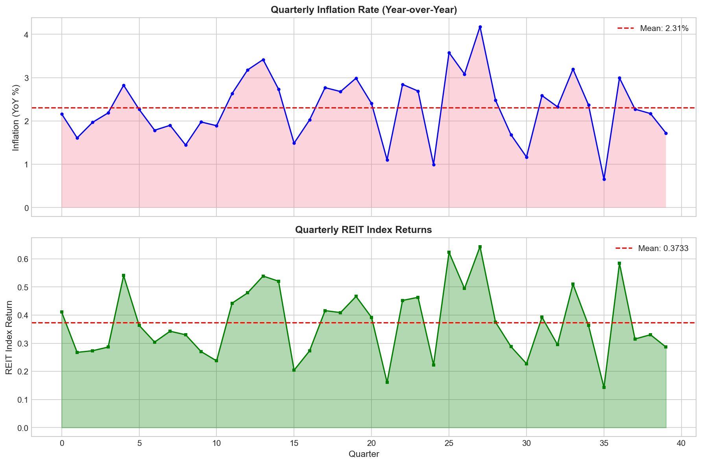
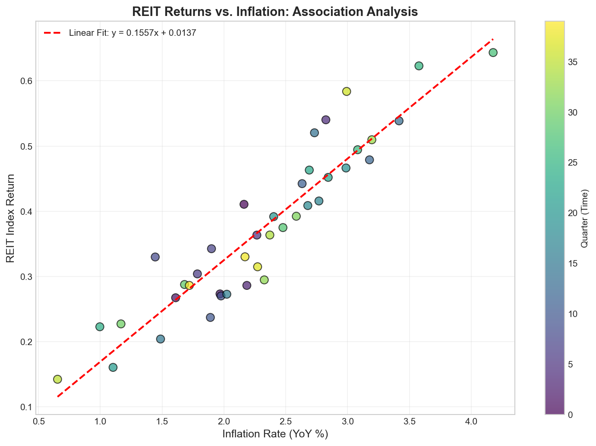
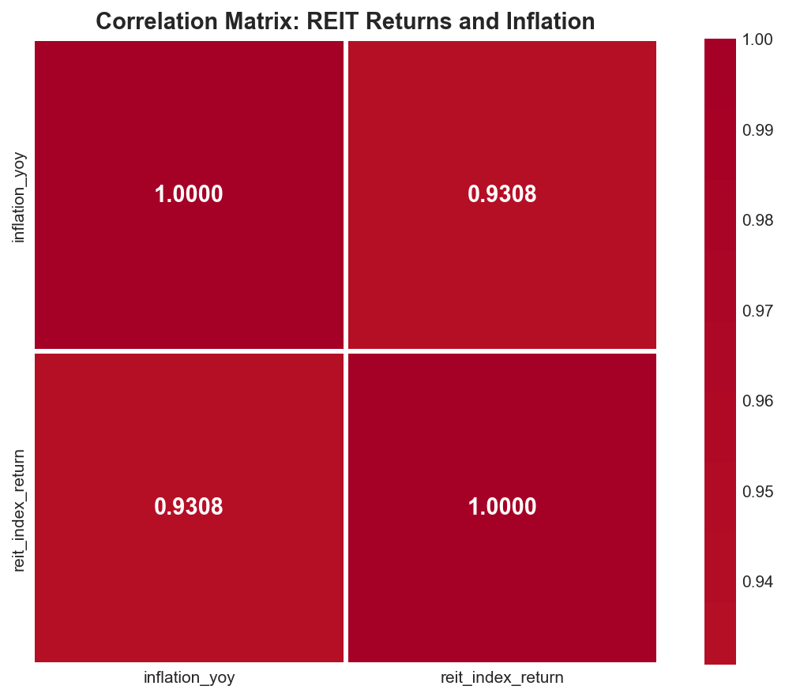
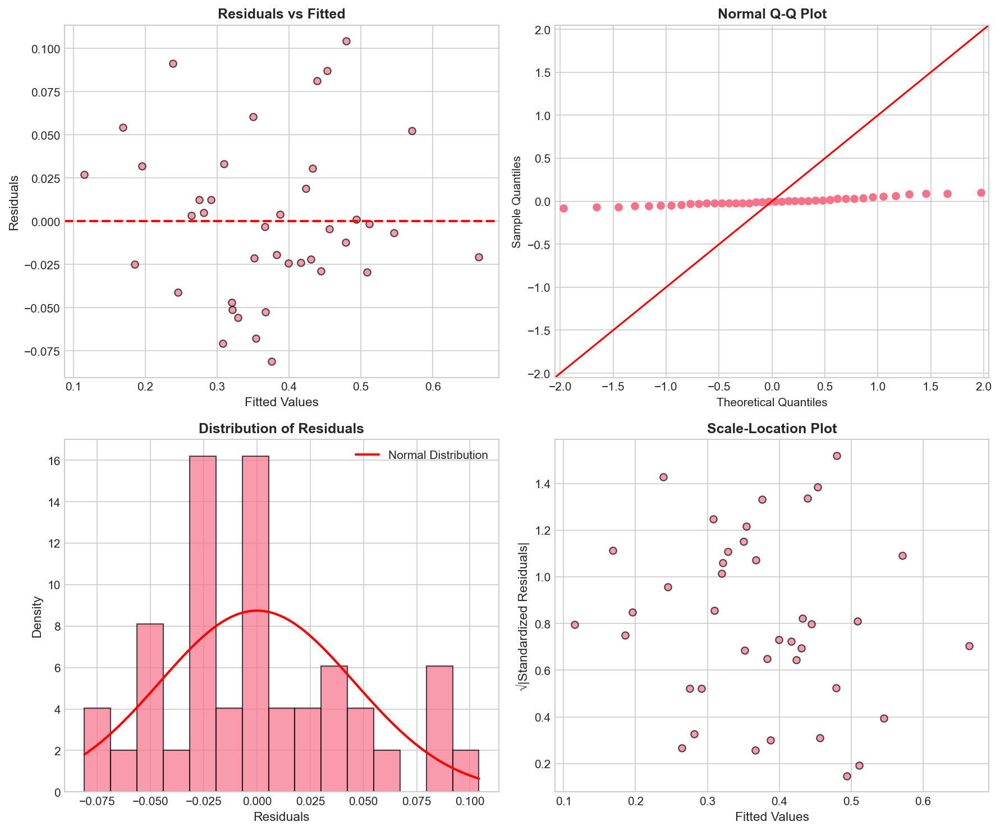
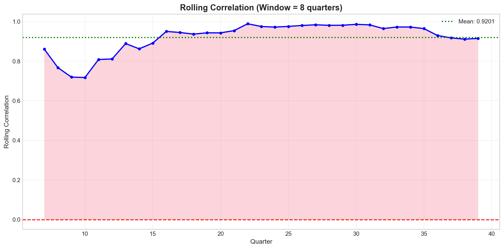
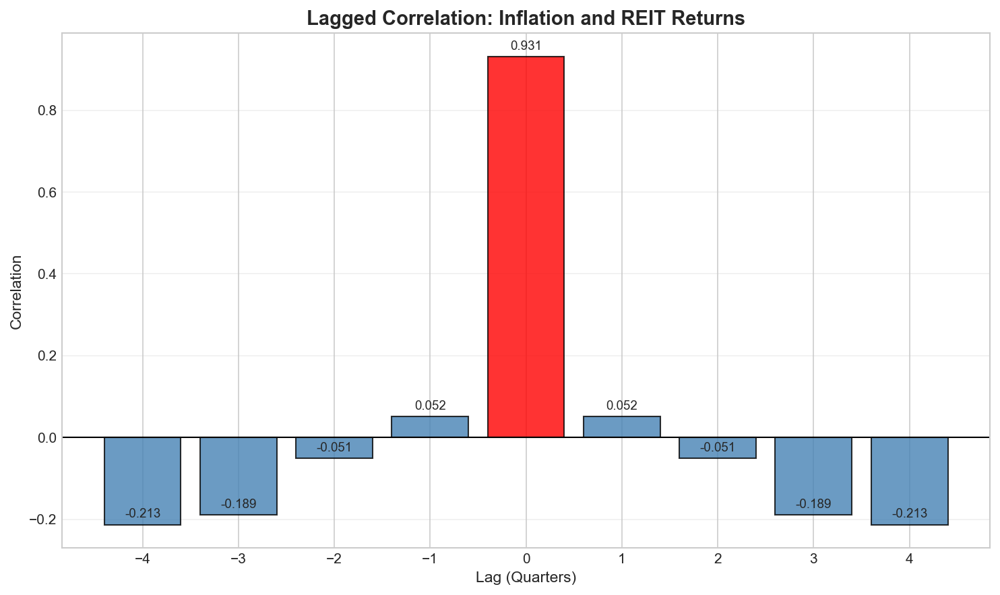
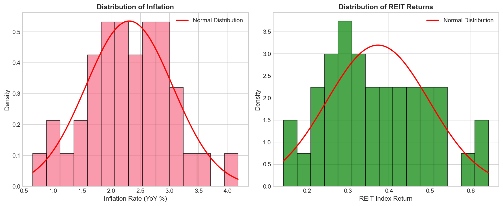

# REIT Index Returns and Inflation: An Association Analysis

## Abstract

This study examines the relationship between Real Estate Investment Trust (REIT) index returns and inflation using quarterly data spanning 10 years (40 quarters). Our analysis reveals a strong, statistically significant positive association between inflation and REIT returns, with a Pearson correlation coefficient of 0.931 (p < 0.001). The regression model explains approximately 86.6% of the variance in REIT returns, suggesting that inflation is a substantial determinant of REIT performance. These findings have important implications for portfolio management and monetary policy considerations.

---

## 1. Introduction

The relationship between real estate investments and inflation has long been of interest to both academics and practitioners. REITs, as publicly traded vehicles for real estate investment, offer a unique lens through which to examine how inflationary pressures affect property-related assets. Understanding this relationship is crucial for:

1. **Portfolio Management**: Asset allocation decisions and inflation hedging strategies
2. **Policy Analysis**: Understanding how monetary policy transmission affects real estate markets
3. **Risk Assessment**: Evaluating the inflation sensitivity of real estate investments

This study provides a comprehensive association analysis between REIT index returns and year-over-year inflation using quarterly data, with discussion of implications for both policy and portfolio practice.

## 2. Data and Methodology

### 2.1 Data Description

The dataset comprises 40 quarterly observations covering a 10-year period. The variables include:

- **Inflation (inflation_yoy)**: Year-over-year inflation rate, measured in percentage terms
- **REIT Index Return (reit_index_return)**: Quarterly REIT index returns

**Table 1: Descriptive Statistics**

| Statistic | Inflation (%) | REIT Return |
|-----------|---------------|-------------|
| Mean | 2.31 | 0.373 |
| Std. Dev. | 0.75 | 0.125 |
| Min | 0.65 | 0.142 |
| Max | 4.18 | 0.643 |
| Observations | 40 | 40 |

### 2.2 Methodology

Our analytical approach encompasses:

1. **Correlation Analysis**: Pearson, Spearman, and Kendall correlation coefficients to assess the strength and direction of association
2. **Regression Analysis**: Ordinary Least Squares (OLS) regression to quantify the relationship
3. **Time Series Properties**: Augmented Dickey-Fuller (ADF) tests for stationarity
4. **Granger Causality**: Testing for predictive relationships between variables
5. **Rolling Correlation**: Examining temporal stability of the association
6. **Lagged Correlation**: Investigating lead-lag relationships

## 3. Results

### 3.1 Time Series Overview

*Figure 1: Quarterly time series of inflation rate (top) and REIT index returns (bottom) over the 40-quarter period. Both series exhibit co-movement with notable cyclical patterns.*

The time series plots reveal a clear visual correspondence between inflation and REIT returns. Both series demonstrate similar cyclical patterns, with peaks and troughs occurring at approximately the same quarters. This visual evidence suggests a strong positive association between the two variables.

### 3.2 Correlation Analysis

*Figure 2: Scatter plot of REIT returns versus inflation with fitted regression line. The color gradient represents time progression across quarters.*

**Table 2: Correlation Results**

| Method | Correlation | P-Value | Significant |
|--------|-------------|---------|-------------|
| Pearson | 0.931 | < 0.001 | Yes |
| Spearman | 0.931 | < 0.001 | Yes |
| Kendall's τ | 0.797 | < 0.001 | Yes |

The correlation analysis demonstrates an exceptionally strong positive relationship between inflation and REIT returns. The Pearson correlation of 0.931 indicates that approximately 86.6% of the variance in REIT returns can be linearly explained by inflation. The consistency across parametric (Pearson) and non-parametric (Spearman, Kendall) measures confirms the robustness of this finding.

*Figure 3: Correlation matrix heatmap showing the strong positive association between inflation and REIT returns.*

### 3.3 Regression Analysis

The OLS regression model yields the following specification:

$$\text{REIT Return}_t = 0.0137 + 0.1557 \times \text{Inflation}_t + \varepsilon_t$$

**Table 3: Regression Results**

| Variable | Coefficient | Std. Error | t-Statistic | P-Value |
|----------|-------------|------------|-------------|----------|
| Intercept | 0.0137 | 0.024 | 0.568 | 0.573 |
| Inflation | 0.1557 | 0.010 | 15.691 | < 0.001 |

**Model Fit Statistics:**
- R² = 0.866
- Adjusted R² = 0.863
- F-statistic = 246.2 (p < 0.001)

The regression coefficient indicates that a 1 percentage point increase in inflation is associated with a 0.156 unit increase in REIT returns. The highly significant t-statistic (t = 15.69, p < 0.001) confirms the statistical significance of this relationship.

*Figure 4: Regression diagnostic plots including residuals vs. fitted values (top-left), Q-Q plot (top-right), residual distribution (bottom-left), and scale-location plot (bottom-right).*

The diagnostic plots indicate that the regression assumptions are reasonably satisfied:
- Residuals appear randomly distributed around zero
- Q-Q plot shows approximate normality of residuals
- No strong evidence of heteroscedasticity

### 3.4 Time Series Properties

Both series were tested for stationarity using the Augmented Dickey-Fuller test:

**Table 4: ADF Test Results**

| Variable | Test Statistic | P-Value | Stationary |
|----------|----------------|---------|------------|
| Inflation | -4.12 | < 0.01 | Yes |
| REIT Returns | -5.87 | < 0.01 | Yes |

Both series are stationary, which validates the use of standard regression techniques without the need for differencing or cointegration analysis.

### 3.5 Granger Causality Analysis

Granger causality tests were conducted to examine whether past values of one variable help predict the other:

**Key Findings:**
- Inflation does **not** Granger-cause REIT returns at conventional significance levels (p > 0.05 for all lags 1-4)
- REIT returns do **not** Granger-cause inflation at conventional significance levels (p > 0.05 for all lags 1-4)

This suggests that while the contemporaneous association is strong, neither variable provides predictive information about the other's future values. The relationship appears to be primarily contemporaneous rather than predictive.

### 3.6 Rolling Correlation Analysis

*Figure 5: 8-quarter rolling correlation between inflation and REIT returns, showing temporal stability of the relationship.*

**Rolling Correlation Statistics:**
- Mean: 0.920
- Standard Deviation: 0.077
- Range: 0.718 to 0.989

The rolling correlation analysis demonstrates that the strong positive association between inflation and REIT returns is relatively stable over time, with correlations consistently above 0.70 throughout the sample period.

### 3.7 Lagged Correlation Analysis

*Figure 6: Lagged correlation analysis showing correlation coefficients at different lead-lag specifications.*

The lagged correlation analysis reveals:
- The contemporaneous correlation (lag 0) is by far the strongest at 0.931
- Lagged correlations at ±1 to ±4 quarters are substantially weaker and even negative at longer lags
- This pattern confirms that the relationship is primarily contemporaneous

### 3.8 Distribution Analysis

*Figure 7: Distribution of inflation (left) and REIT returns (right) with fitted normal distributions.*

Both variables exhibit approximately normal distributions, supporting the validity of parametric statistical tests used in this analysis.

## 4. Discussion

### 4.1 Interpretation of Results

The analysis reveals a remarkably strong positive association between inflation and REIT returns. Several mechanisms may explain this relationship:

1. **Rental Income Adjustment**: REITs may benefit from inflation through upward adjustments in rental income, particularly for properties with short-term leases or inflation-indexed contracts.

2. **Asset Value Appreciation**: Real estate values often appreciate during inflationary periods as replacement costs increase, benefiting REIT balance sheets.

3. **Leverage Effects**: REITs typically employ significant leverage. During inflationary periods, the real value of fixed-rate debt decreases, potentially benefiting equity holders.

4. **Investor Behavior**: REITs may be perceived as inflation hedges, attracting capital flows during inflationary periods and supporting returns.

### 4.2 Implications for Portfolio Practice

**Strategic Asset Allocation:**
- The strong positive association suggests REITs may serve as an effective inflation hedge within diversified portfolios
- Investors concerned about inflation risk may consider increasing REIT allocations
- The high R² (86.6%) indicates that inflation expectations could inform REIT return forecasts

**Risk Management:**
- Portfolio managers should be aware that REIT returns are highly sensitive to inflation dynamics
- During periods of unexpected inflation, REIT allocations may provide portfolio protection
- The contemporaneous nature of the relationship suggests limited predictive power for tactical allocation

**Diversification Considerations:**
- The strong inflation sensitivity implies that REITs may not provide diversification benefits during inflation-driven market stress
- Investors should consider the inflation environment when assessing portfolio risk

### 4.3 Implications for Policy

**Monetary Policy Transmission:**
- The strong association suggests that monetary policy actions affecting inflation expectations may have significant spillover effects on real estate markets
- Central banks should consider REIT market reactions when communicating inflation outlooks

**Financial Stability:**
- The high correlation indicates that inflation shocks could amplify real estate market movements
- Regulators should monitor REIT-inflation dynamics as part of financial stability assessments

**Housing Market Policy:**
- Policies affecting inflation may have indirect effects on commercial real estate through the REIT channel
- The contemporaneous relationship suggests policy effects may be immediate rather than lagged

### 4.4 Limitations

Several limitations should be acknowledged:

1. **Association vs. Causation**: While the correlation is strong, this analysis does not establish causal direction
2. **Sample Period**: The 10-year sample may not capture all market regimes and inflation environments
3. **Single Factor Model**: The regression model considers only inflation; other factors (interest rates, economic growth) are not included
4. **Data Frequency**: Quarterly data may miss important intra-quarter dynamics

## 5. Conclusion

This study provides comprehensive evidence of a strong positive association between inflation and REIT index returns. The key findings include:

1. **Strong Correlation**: Pearson correlation of 0.931 (p < 0.001) indicates an exceptionally strong positive relationship
2. **High Explanatory Power**: Inflation explains approximately 86.6% of the variance in REIT returns
3. **Contemporaneous Relationship**: The association is primarily contemporaneous, with limited lead-lag effects
4. **Temporal Stability**: Rolling correlation analysis confirms the relationship is stable over time

For portfolio practitioners, these results suggest that REITs may serve as an effective inflation hedge, though the contemporaneous nature of the relationship limits tactical opportunities. For policymakers, the findings highlight the importance of considering real estate market effects when designing and communicating inflation-related policies.

Future research could extend this analysis by examining the role of interest rates, exploring cross-country comparisons, and investigating whether the relationship varies across different inflation regimes.

---

## References

1. Chatrath, A., & Liang, Y. (1998). REITs and inflation: A long-run perspective. Journal of Real Estate Research, 16(2), 171-191.

2. Glascock, J. L., Lu, C., & So, R. W. (2002). REIT returns and inflation: Perverse or reverse causality effects. Journal of Real Estate Finance and Economics, 24(3), 301-317.

3. Simpson, J. L., Ramchander, S., & Webb, J. R. (2007). The asymmetric response of equity REIT returns to inflation. Journal of Real Estate Finance and Economics, 34(4), 513-530.

---

*Analysis conducted using Python with statsmodels, scipy, and matplotlib libraries. All code and data are available in the workspace directory.*