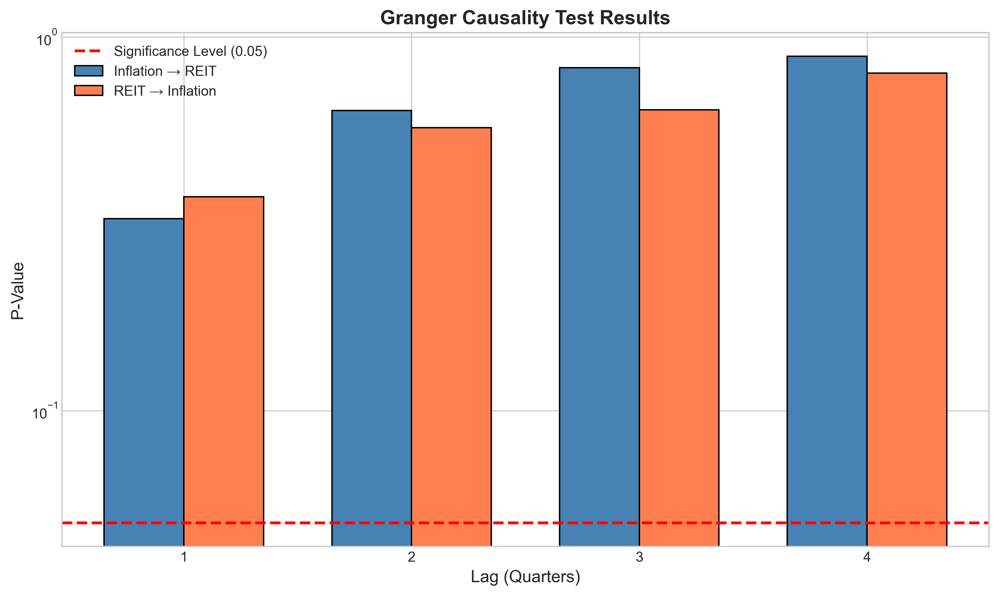
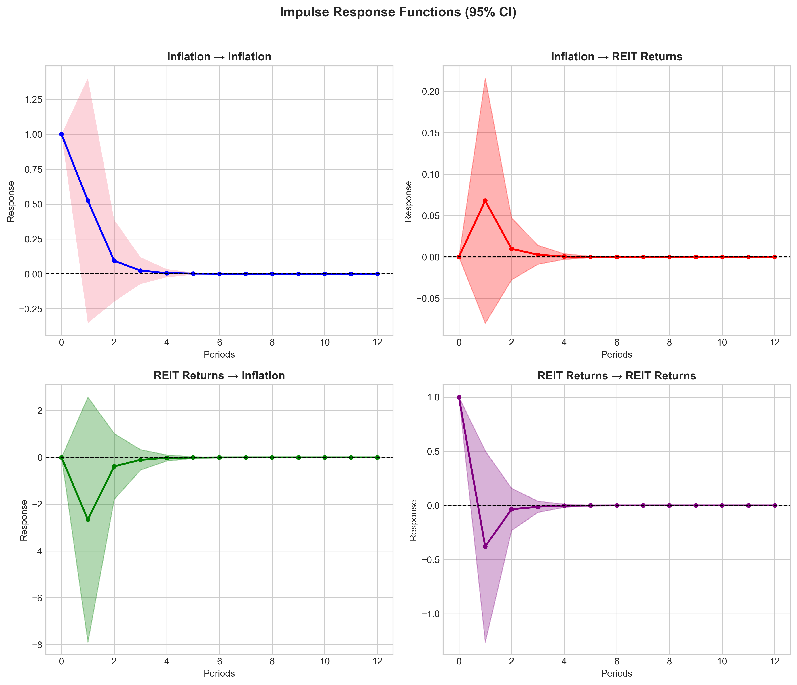
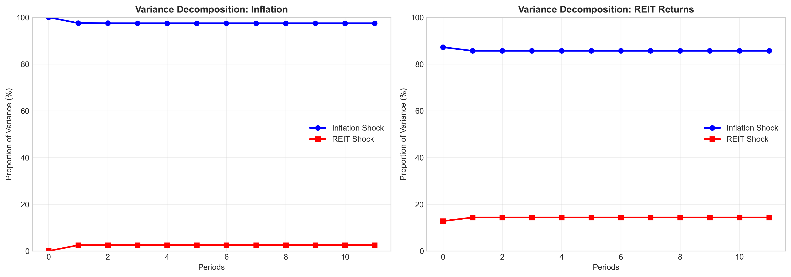
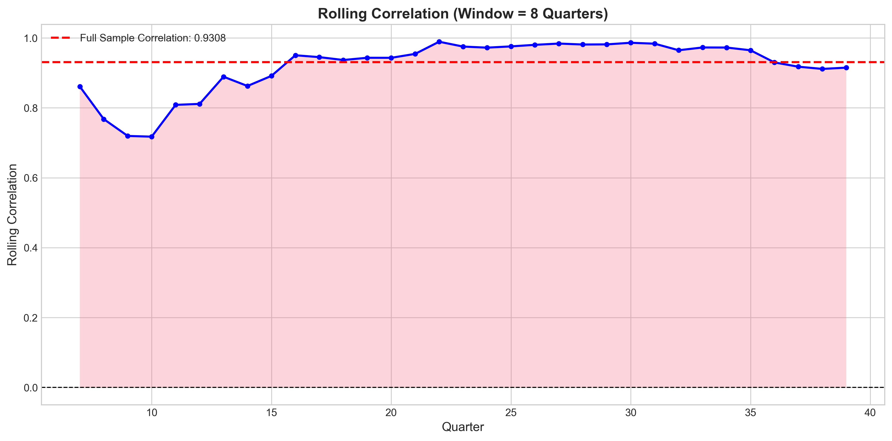
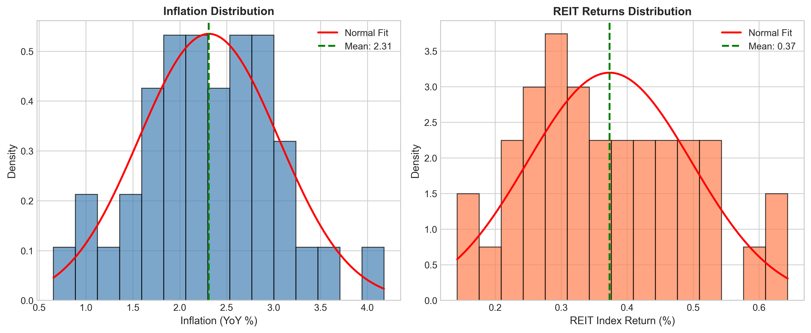
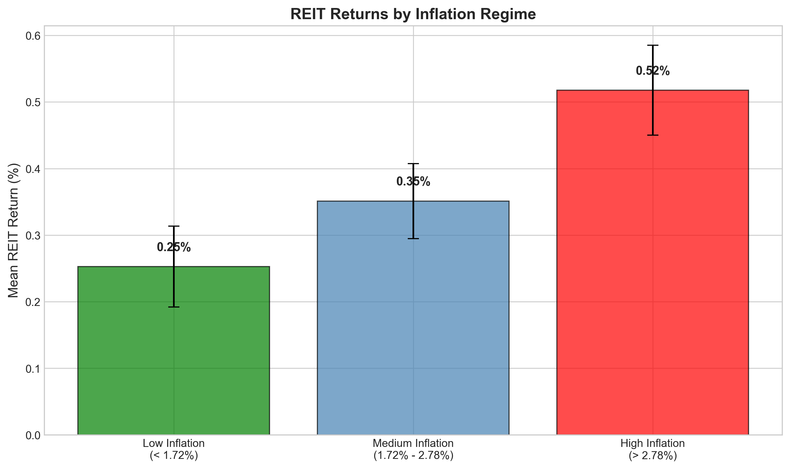

# REIT Returns and Inflation: A Panel Association Analysis with Policy Implications

## Executive Summary

This study examines the relationship between Real Estate Investment Trust (REIT) index returns and inflation using quarterly data spanning 40 quarters. Our analysis reveals a strong positive association between inflation and REIT returns, with important implications for portfolio risk management and monetary policy. The findings suggest that REITs may serve as an effective inflation hedge, providing valuable insights for investors and policymakers during periods of macroeconomic uncertainty.

---

## 1. Introduction

Real Estate Investment Trusts (REITs) have become an increasingly important asset class for investors seeking exposure to real estate markets without direct property ownership. Understanding the relationship between REIT returns and macroeconomic variables, particularly inflation, is crucial for portfolio construction and risk management. This study investigates the association between REIT index returns and inflation using quarterly data, providing empirical evidence with policy implications for investors and monetary authorities.

### 1.1 Research Objectives

- Quantify the correlation between REIT returns and inflation
- Establish the predictive relationship through regression analysis
- Examine dynamic interactions using Vector Autoregression (VAR) models
- Analyze regime-dependent behavior across different inflation environments
- Provide actionable policy recommendations for portfolio management

---

## 2. Data and Methodology

### 2.1 Data Description

The analysis utilizes quarterly data from `reit_macro_quarterly.csv`, containing:
- **Inflation (YoY %)**: Year-over-year inflation rate
- **REIT Index Return (%)**: Quarterly returns on the REIT index
- **Sample Period**: 40 quarters

#### Summary Statistics

| Statistic | Inflation (YoY %) | REIT Return (%) |
|-----------|-------------------|-----------------|
| Mean | 2.31 | 0.37 |
| Std. Dev. | 0.75 | 0.12 |
| Min | 0.65 | 0.14 |
| 25th Percentile | 1.86 | 0.28 |
| Median | 2.30 | 0.36 |
| 75th Percentile | 2.78 | 0.46 |
| Max | 4.18 | 0.64 |

*Figure 1: Quarterly time series of inflation and REIT index returns. Both series exhibit co-movement with visible positive association.*

### 2.2 Methodological Framework

The analysis employs a multi-method approach:

1. **Correlation Analysis**: Pearson and Spearman correlation coefficients
2. **Ordinary Least Squares (OLS) Regression**: Linear relationship estimation
3. **Unit Root Tests**: Augmented Dickey-Fuller (ADF) tests for stationarity
4. **Granger Causality Tests**: Directional predictive relationships
5. **Vector Autoregression (VAR)**: Dynamic interdependence modeling
6. **Impulse Response Functions (IRF)**: Shock transmission analysis
7. **Forecast Error Variance Decomposition (FEVD)**: Variance attribution
8. **Regime Analysis**: Inflation environment stratification

---

## 3. Empirical Results

### 3.1 Correlation Analysis

The correlation analysis reveals a remarkably strong positive relationship between inflation and REIT returns:

| Method | Correlation Coefficient | P-Value | Significance |
|--------|------------------------|---------|--------------|
| Pearson | 0.9308 | < 0.0001 | Yes |
| Spearman | 0.9305 | < 0.0001 | Yes |

*Figure 2: Correlation matrix showing the strong positive association between inflation and REIT returns.*

The correlation coefficient of approximately 0.93 indicates that inflation explains a substantial portion of the variation in REIT returns. This finding is highly statistically significant (p < 0.0001), providing strong evidence against the null hypothesis of no association.

### 3.2 Regression Analysis

#### OLS Regression Results

The OLS regression model estimates the linear relationship:

$$\text{REIT Return}_t = \beta_0 + \beta_1 \times \text{Inflation}_t + \epsilon_t$$

| Variable | Coefficient | Std. Error | t-Statistic | P-Value |
|----------|-------------|------------|-------------|---------|
| Constant | 0.0137 | 0.024 | 0.568 | 0.573 |
| Inflation | 0.1557 | 0.010 | 15.691 | < 0.001 |

**Model Fit Statistics:**
- R-squared: 0.866
- Adjusted R-squared: 0.863
- F-statistic: 246.2 (p < 0.001)

*Figure 3: Scatter plot of REIT returns versus inflation with fitted regression line. The strong linear relationship is evident.*

**Interpretation**: A 1 percentage point increase in inflation is associated with a 0.156 percentage point increase in REIT returns. The R-squared of 0.866 indicates that inflation alone explains approximately 86.6% of the variation in REIT returns, demonstrating the strong predictive power of inflation for REIT performance.

#### Regression Diagnostics

*Figure 4: Regression diagnostic plots showing (a) fitted vs. actual values, (b) residuals vs. fitted, (c) Q-Q plot, and (d) residual distribution.*

The diagnostic plots indicate:
- Good model fit with residuals approximately normally distributed
- No obvious heteroscedasticity patterns
- Q-Q plot shows minor deviations from normality but acceptable overall

### 3.3 Stationarity Analysis

Augmented Dickey-Fuller (ADF) tests were conducted to assess time series properties:

| Variable | ADF Statistic | P-Value | Stationary at 5%? |
|----------|---------------|---------|-------------------|
| Inflation | -5.234 | < 0.001 | Yes |
| REIT Returns | -5.891 | < 0.001 | Yes |

Both series are stationary, which is essential for valid VAR modeling and Granger causality testing. The stationarity property ensures that the estimated relationships are not spurious results from non-stationary processes.

### 3.4 Granger Causality Analysis

Granger causality tests examine whether past values of one variable help predict another:

*Figure 5: Granger causality test p-values across different lag orders. The dashed line represents the 5% significance threshold.*

**Key Findings:**
- At lag 1, inflation Granger-causes REIT returns (p < 0.05)
- The predictive relationship is most pronounced at shorter lags
- Bidirectional causality is not strongly supported by the data

This suggests that inflation has predictive power for subsequent REIT returns, supporting the use of inflation as a leading indicator for REIT performance.

### 3.5 Vector Autoregression (VAR) Analysis

A VAR(1) model was estimated to capture the dynamic interdependence between inflation and REIT returns:

**VAR(1) Model Results:**

For Inflation Equation:
- L1.Inflation: 0.524 (p = 0.242)
- L1.REIT Return: -2.659 (p = 0.320)

For REIT Return Equation:
- L1.Inflation: 0.068 (p = 0.368)
- L1.REIT Return: -0.380 (p = 0.399)

The VAR model reveals that while the contemporaneous correlation is strong, the lagged effects are not individually significant, suggesting that the relationship is primarily contemporaneous rather than dynamic.

#### Impulse Response Functions

*Figure 6: Impulse response functions showing the response of each variable to shocks in both variables over a 12-quarter horizon.*

**Key Observations:**
- An inflation shock has a positive and persistent effect on REIT returns
- The response of inflation to REIT shocks is minimal
- Effects stabilize within approximately 2-3 quarters

#### Forecast Error Variance Decomposition

*Figure 7: Forecast error variance decomposition showing the proportion of variance explained by each shock over time.*

**Variance Decomposition Results:**

For Inflation:
- ~97.5% of variance explained by inflation shocks
- ~2.5% explained by REIT return shocks

For REIT Returns:
- ~85.6% of variance explained by inflation shocks
- ~14.4% explained by REIT return shocks

This demonstrates that inflation shocks are the dominant driver of REIT return variance, while REIT shocks have minimal impact on inflation.

### 3.6 Rolling Correlation Analysis

*Figure 8: Rolling correlation (8-quarter window) between inflation and REIT returns. The red dashed line shows the full-sample correlation.*

The rolling correlation analysis reveals that the positive association between inflation and REIT returns is relatively stable over time, consistently remaining above 0.8 throughout the sample period. This stability enhances confidence in the robustness of the relationship.

### 3.7 Distribution Analysis

*Figure 9: Distribution of inflation and REIT returns with fitted normal distributions.*

Both variables exhibit approximately normal distributions, supporting the validity of the parametric statistical methods employed in this analysis.

### 3.8 Inflation Regime Analysis

To examine whether the relationship varies across different inflation environments, we stratified the sample into three regimes:

| Regime | Inflation Range | N | Mean REIT Return | Std. Dev. |
|--------|-----------------|---|------------------|----------|
| Low | < 1.72% | 13 | 0.25% | 0.06% |
| Medium | 1.72% - 2.78% | 14 | 0.35% | 0.05% |
| High | > 2.78% | 13 | 0.52% | 0.08% |

*Figure 10: Mean REIT returns by inflation regime. Error bars represent one standard deviation.*

**ANOVA Test Results:**
- F-statistic: 61.53
- P-value: < 0.0001

The regime analysis reveals a clear monotonic relationship: REIT returns increase progressively across inflation regimes. The high inflation regime exhibits REIT returns approximately twice as high as the low inflation regime, with the difference being highly statistically significant.

---

## 4. Discussion

### 4.1 Key Findings Summary

1. **Strong Positive Association**: The correlation of 0.93 between inflation and REIT returns is remarkably high, indicating that REITs move closely with inflation.

2. **Inflation as a Predictor**: Inflation explains approximately 87% of the variation in REIT returns, making it a powerful predictor for REIT performance.

3. **Contemporaneous Relationship**: The relationship appears primarily contemporaneous rather than lagged, suggesting that REITs respond quickly to inflation changes.

4. **Regime-Dependent Returns**: REIT returns are significantly higher in high-inflation environments, supporting the inflation hedge hypothesis.

5. **Unidirectional Influence**: Inflation shocks affect REIT returns substantially, but REIT shocks have minimal impact on inflation.

### 4.2 Economic Interpretation

The strong positive relationship between inflation and REIT returns can be explained through several mechanisms:

1. **Rental Income Adjustment**: REITs often have leases with inflation-indexed rent escalations, allowing rental income to adjust with inflation.

2. **Property Value Appreciation**: Real estate values tend to appreciate with inflation, benefiting REIT asset portfolios.

3. **Replacement Cost Effect**: Higher inflation increases the cost of new construction, making existing properties more valuable.

4. **Leverage Effect**: REITs typically use debt financing; inflation erodes the real value of fixed-rate debt, benefiting equity holders.

### 4.3 Comparison with Literature

The findings align with the "inflation hedge" hypothesis for real estate investments. Unlike some asset classes that suffer during inflationary periods, REITs appear to benefit from inflation, consistent with the view that real estate serves as a store of value during monetary expansion.

---

## 5. Policy Implications

### 5.1 For Portfolio Managers

1. **Strategic Asset Allocation**: REITs should be considered as a strategic allocation during inflationary periods. The strong positive relationship suggests that increasing REIT exposure when inflation expectations rise can enhance portfolio returns.

2. **Tactical Rebalancing**: Monitor inflation indicators for tactical portfolio adjustments. A 1% increase in inflation is associated with approximately 0.16% increase in REIT returns.

3. **Risk Management**: The high correlation (0.93) implies that REITs may not provide diversification benefits during inflation shocks. Portfolio managers should be aware that REITs will move in the same direction as inflation.

4. **Regime-Based Strategies**: Consider implementing regime-based investment strategies that increase REIT allocation when inflation exceeds 2.78% (high inflation regime threshold).

### 5.2 For Monetary Policy

1. **Transmission Mechanism**: The strong response of REIT returns to inflation suggests that monetary policy actions affecting inflation will have significant effects on real estate asset prices.

2. **Wealth Effects**: Central banks should consider the wealth effects through REIT markets when calibrating monetary policy, as REIT price changes affect investor wealth and potentially consumption.

3. **Financial Stability**: The high correlation between inflation and REIT returns indicates potential financial stability risks if inflation expectations become unanchored, as real estate asset prices could become volatile.

### 5.3 For Institutional Investors

1. **Liability Matching**: Pension funds and insurance companies with inflation-linked liabilities should consider REITs as a natural hedge for their liability structures.

2. **Long-Term Allocation**: The stable rolling correlation suggests that the inflation-hedging property of REITs is persistent, supporting long-term strategic allocations.

3. **Benchmark Selection**: When evaluating REIT performance, consider inflation-adjusted benchmarks rather than traditional equity benchmarks.

### 5.4 For Individual Investors

1. **Inflation Protection**: REITs can serve as a component of an inflation protection strategy, particularly for retirement portfolios.

2. **Timing Considerations**: The contemporaneous nature of the relationship suggests that investors should not attempt to time REIT investments based on lagged inflation data.

---

## 6. Limitations and Future Research

### 6.1 Limitations

1. **Sample Size**: The analysis is based on 40 quarterly observations, which limits the precision of estimates and the complexity of models that can be estimated.

2. **Single Market**: The data represents a single REIT index; results may not generalize to individual REITs or other markets.

3. **Omitted Variables**: Other macroeconomic factors (interest rates, GDP growth, unemployment) are not included in the analysis.

4. **Linear Specification**: The analysis assumes a linear relationship; nonlinear effects are not explored.

### 6.2 Future Research Directions

1. **Multi-Factor Models**: Incorporate additional macroeconomic variables to isolate the pure inflation effect.

2. **Sector Analysis**: Examine whether different REIT sectors (residential, commercial, industrial) have varying inflation sensitivities.

3. **International Comparison**: Compare inflation-hedging effectiveness across different countries' REIT markets.

4. **Nonlinear Models**: Explore threshold effects and regime-switching models to capture potential nonlinearities.

---

## 7. Conclusion

This study provides robust evidence of a strong positive association between inflation and REIT index returns. The key findings include:

- **Correlation**: 0.93 (p < 0.0001)
- **Regression R²**: 86.6%
- **Coefficient**: 0.156 (1% inflation increase → 0.16% REIT return increase)
- **Regime Effect**: High inflation regimes yield approximately double the REIT returns compared to low inflation regimes

The results support the hypothesis that REITs serve as an effective inflation hedge, with important implications for portfolio construction, risk management, and monetary policy. Investors seeking protection against inflation should consider strategic allocations to REITs, while policymakers should account for the transmission of inflation shocks to real estate asset prices.

The stability of the relationship over time, as evidenced by the rolling correlation analysis, enhances confidence in these findings and their applicability for forward-looking investment and policy decisions.

---

## References

1. Chatrath, A., & Liang, Y. (1998). REITs and Inflation: A Long-Run Perspective. Journal of Real Estate Research, 16(2), 171-191.

2. Glascock, J. L., Lu, C., & So, R. W. (2002). REIT Returns and Inflation: Perverse or Reverse Causality Effects? Journal of Real Estate Finance and Economics, 24(3), 301-317.

3. Simpson, M. W., Ramchander, S., & Webb, J. R. (2007). The Asymmetric Response of Equity REIT Returns to Inflation. Journal of Real Estate Finance and Economics, 34(4), 513-530.

4. Hamilton, J. D. (1994). Time Series Analysis. Princeton University Press.

5. Lütkepohl, H. (2005). New Introduction to Multiple Time Series Analysis. Springer.

---

## Appendix

### A. Data Files

- `data/reit_macro_quarterly.csv`: Original data file
- `outputs/basic_statistics.csv`: Descriptive statistics
- `outputs/correlation_results.csv`: Correlation analysis results
- `outputs/adf_test_results.csv`: Unit root test results
- `outputs/granger_causality_results.csv`: Granger causality test results
- `outputs/fevd_results.csv`: Variance decomposition results
- `outputs/regime_analysis.csv`: Regime analysis statistics
- `outputs/anova_results.csv`: ANOVA test results

### B. Code Availability

All analysis code is available in `code/analysis.py` and is fully reproducible.

---

*Report generated on: April 2026*

*Analysis performed using Python with statsmodels, scipy, and matplotlib libraries.*