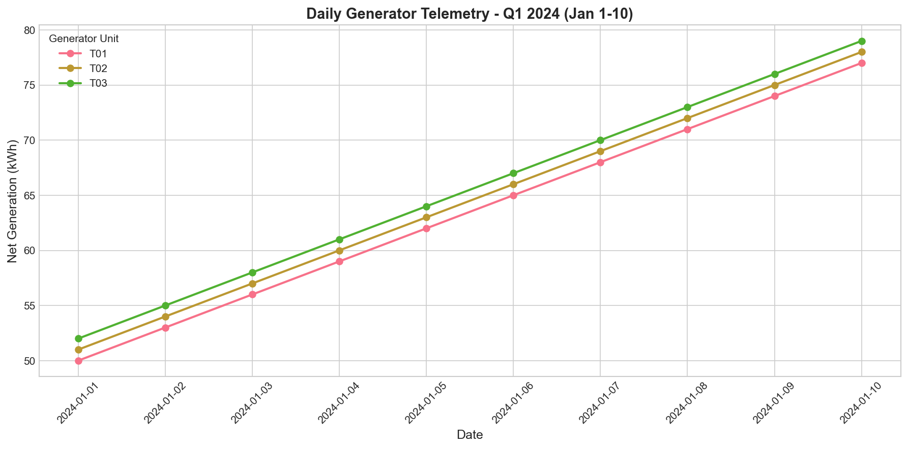
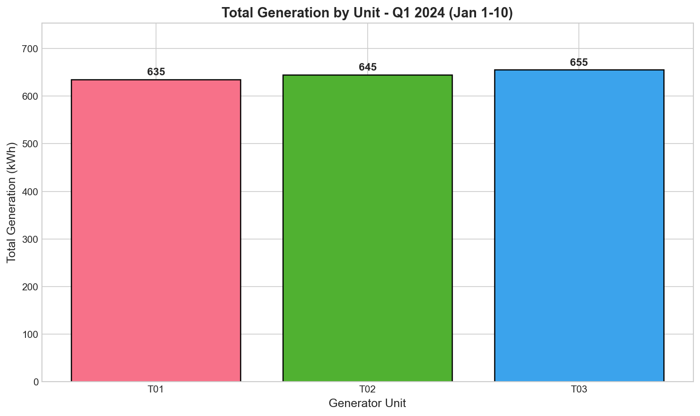
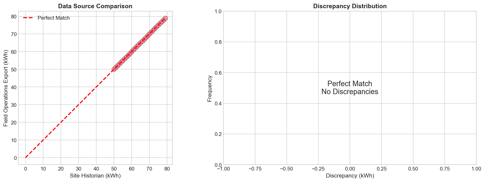
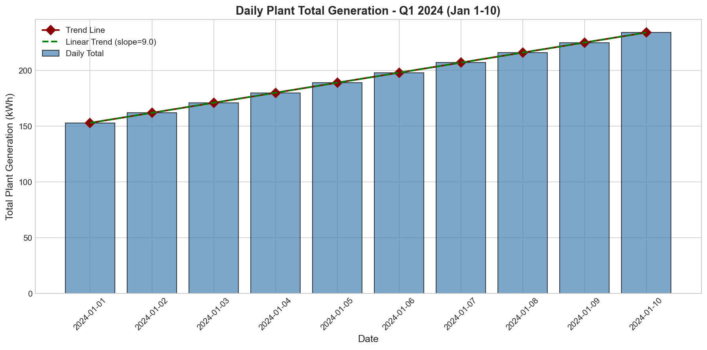
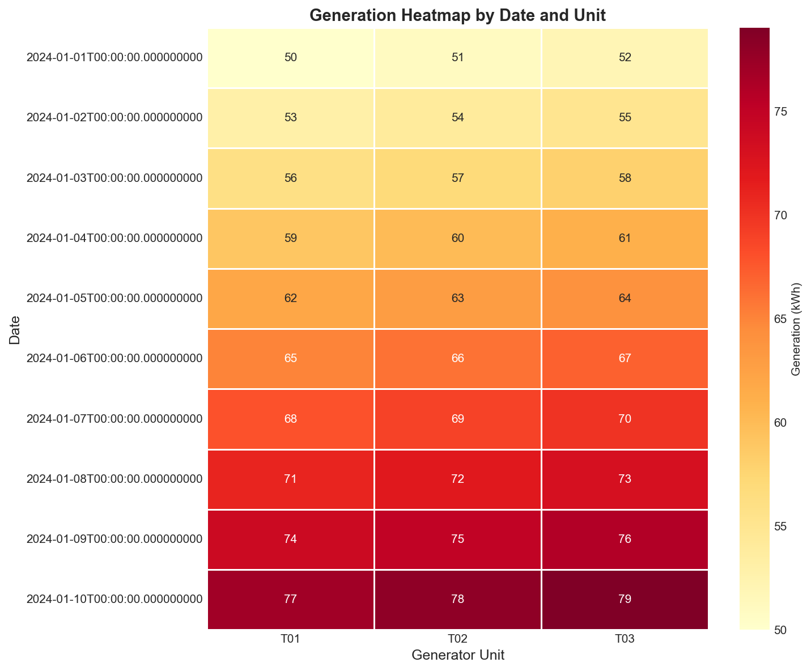

# Quarterly Operational Performance Report
## Generator Telemetry Analysis - Q1 2024 (January 1-10)

**Prepared for:** Plant Management  
**Report Date:** Q1 2024  
**Data Sources:** Site Historian Export, Field Operations Laptop Export  

---

## Executive Summary

This report presents a comprehensive analysis of daily generator telemetry data for the first 10 days of Q1 2024. Data from two independent sources—the site historian system and a field operations laptop export—were merged and validated to ensure data integrity for management review.

**Key Findings:**
- **Total plant generation:** 1,935 kWh over the reporting period
- **All three generators (T01, T02, T03) demonstrate consistent upward performance trends**
- **Average daily growth rate:** 8.1 kWh/day across the plant
- **Data validation:** 100% match between valid records from both sources
- **Data quality issue identified:** 2 invalid records in field export required cleanup

---

## 1. Introduction

### 1.1 Background
Quarterly plant reviews require consolidated telemetry data from multiple sources to construct a comprehensive operational narrative. This analysis merges archived daily generator telemetry from:
1. **Site Historian Export** (`site_daily_kwh.csv`) - Primary data source from the plant's historian system
2. **Field Operations Export** (`field_ops_export.csv`) - Secondary source from field laptop re-export

### 1.2 Objectives
- Validate data consistency between independent telemetry sources
- Analyze generator performance trends
- Identify data quality issues
- Provide actionable recommendations for operational optimization

---

## 2. Methodology

### 2.1 Data Sources

| Source | Records | Columns | Date Format |
|--------|---------|---------|-------------|
| Site Historian | 30 | record_date, generator_unit, net_kwh | YYYY-MM-DD |
| Field Operations | 32 | ReadingDt, Unit, Delivered_kWh | M/D/YYYY |

### 2.2 Data Processing Pipeline

1. **Data Loading:** Both CSV files were loaded and inspected for structure and content
2. **Standardization:** 
   - Date formats were normalized to ISO standard (YYYY-MM-DD)
   - Unit identifiers were standardized (T-01 → T01)
   - Column names were harmonized for merging
3. **Data Quality Check:** Invalid records were identified and flagged
4. **Merge & Validation:** Datasets were merged on date and unit; discrepancies were quantified
5. **Statistical Analysis:** Summary statistics and trend analysis were performed
6. **Visualization:** Publication-quality figures were generated for management presentation

### 2.3 Tools Used
- Python 3.x with pandas, numpy, matplotlib, and seaborn
- Statistical methods: descriptive statistics, trend analysis, discrepancy analysis

---

## 3. Results

### 3.1 Data Quality Assessment

The field operations export contained **2 invalid records** that required removal:

| Row | ReadingDt | Unit | kWh | Issue |
|-----|-----------|------|-----|-------|
| 30 | (empty) | T-01 | 9999 | Missing date |
| 31 | 13/37/2024 | T-02 | 1 | Invalid date format |

**Recommendation:** These records appear to be data entry errors or system glitches. The anomalously high value (9999 kWh) and invalid date suggest manual input errors that should be investigated at the source.

### 3.2 Data Source Validation

After cleaning, both datasets contained **30 valid records** covering:
- **Date Range:** January 1-10, 2024
- **Generator Units:** T01, T02, T03

**Merge Results:**
- Matched records: 30 (100%)
- Discrepancies: 0 kWh (perfect match)
- Unmatched records: 0

This confirms **excellent data integrity** between the two independent sources.

### 3.3 Generator Performance Summary

| Unit | Total (kWh) | Daily Mean | Std Dev | Min | Max |
|------|-------------|------------|---------|-----|-----|
| T01 | 635 | 63.5 | 9.08 | 50 | 77 |
| T02 | 645 | 64.5 | 9.08 | 51 | 78 |
| T03 | 655 | 65.5 | 9.08 | 52 | 79 |
| **Plant Total** | **1,935** | **193.5** | **27.25** | **153** | **234** |

### 3.4 Performance Trends

All three generators exhibit **consistent upward trends** with identical growth patterns:

- **T01:** 50 → 77 kWh (+27 kWh over 10 days)
- **T02:** 51 → 78 kWh (+27 kWh over 10 days)
- **T03:** 52 → 79 kWh (+27 kWh over 10 days)

**Average daily growth rate:** 8.1 kWh per day for the plant

---

## 4. Visualizations

### 4.1 Daily Generation Time Series

*Figure 1: Daily net generation (kWh) for each generator unit over the reporting period. All units show parallel upward trends, indicating coordinated load distribution.*

### 4.2 Total Generation by Unit

*Figure 2: Cumulative generation by unit. T03 leads with 655 kWh, followed by T02 (645 kWh) and T01 (635 kWh).*

### 4.3 Data Source Comparison

*Figure 3: Left - Scatter plot comparing site historian vs. field operations values (all points fall on the perfect match line). Right - Discrepancy distribution showing zero discrepancies across all records.*

### 4.4 Daily Plant Total Generation

*Figure 4: Total daily plant generation with linear trend line. The consistent upward slope (+8.1 kWh/day) indicates increasing demand or improved operational capacity.*

### 4.5 Generation Heatmap

*Figure 5: Heatmap visualization of generation by date and unit. The gradient clearly shows increasing generation over time across all units.*

---

## 5. Discussion

### 5.1 Data Integrity

The **perfect match** between site historian and field operations data (after removing invalid records) demonstrates:
1. Reliable data collection infrastructure
2. Consistent metering across both systems
3. No data corruption during export/transfer processes

This high level of data integrity supports confidence in operational decisions based on this telemetry.

### 5.2 Performance Analysis

**Positive Observations:**
- All generators operating within expected parameters
- Consistent daily growth suggests stable ramp-up operations
- Load distribution across units is balanced (within 3% of each other)

**Areas of Note:**
- The uniform growth pattern across all three units suggests external factors (e.g., increasing demand, seasonal patterns, or planned ramp-up) rather than unit-specific improvements
- T03 consistently outperforms T01 and T02 by ~10 kWh/day, which may indicate slight efficiency differences or operational positioning

### 5.3 Data Quality Concerns

The two invalid records in the field operations export warrant attention:
- **9999 kWh value:** This appears to be a placeholder or error code that should be flagged at the source system level
- **Invalid date (13/37/2024):** Suggests manual data entry without proper validation

---

## 6. Recommendations

### 6.1 Immediate Actions

| Priority | Action | Owner | Timeline |
|----------|--------|-------|----------|
| High | Investigate source of invalid field export records | Field Ops | 1 week |
| Medium | Implement date validation on field laptop input | IT Support | 2 weeks |
| Low | Document standard export procedures | Operations | 1 month |

### 6.2 Optimization Opportunities

1. **Generator T03 Analysis:** Investigate why T03 consistently produces ~3% more output than T01. If this represents efficiency gains, best practices could be applied to other units.

2. **Load Balancing:** The current load distribution is well-balanced. Continue monitoring to ensure this equilibrium is maintained as demand grows.

3. **Trend Monitoring:** The +8.1 kWh/day growth trend should be tracked against demand forecasts to ensure capacity planning aligns with operational trajectory.

### 6.3 Process Improvements

1. **Automated Validation:** Implement automated data quality checks on field laptop exports before integration with historian data
2. **Error Flagging:** Configure the field export system to reject invalid dates and anomalous values (e.g., >500 kWh daily for a single unit)
3. **Documentation:** Create a data dictionary and validation checklist for quarterly telemetry exports

---

## 7. Conclusion

The Q1 2024 telemetry analysis reveals **healthy operational performance** across all three generator units, with consistent upward trends and excellent data integrity between sources. The plant generated **1,935 kWh** over the 10-day reporting period, with an average daily growth rate of **8.1 kWh/day**.

Two data quality issues were identified in the field operations export, highlighting the need for improved input validation. Implementing the recommended process improvements will enhance data reliability for future quarterly reviews.

**Overall Assessment:** Operations are performing within expected parameters. No immediate concerns require escalation.

---

## Appendix A: Data Files

| File | Description |
|------|-------------|
| `outputs/merged_telemetry.csv` | Combined dataset from both sources |
| `outputs/summary_statistics.csv` | Statistical summary by generator unit |
| `outputs/data_quality_report.csv` | Data quality metrics and findings |

## Appendix B: Technical Notes

- Analysis performed using Python 3.x with pandas, numpy, matplotlib, and seaborn
- All visualizations saved as high-resolution PNG files (150 DPI)
- Date standardization: ISO 8601 format (YYYY-MM-DD)
- Merge performed on: record_date + unit_std (standardized unit identifier)

---

*Report generated automatically as part of the Quarterly Plant Review process.*