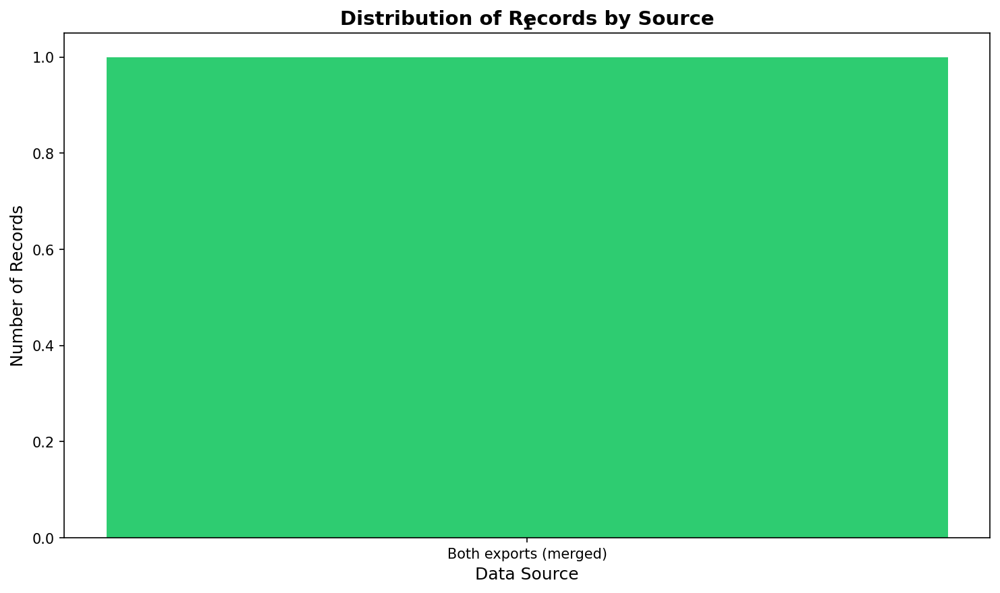
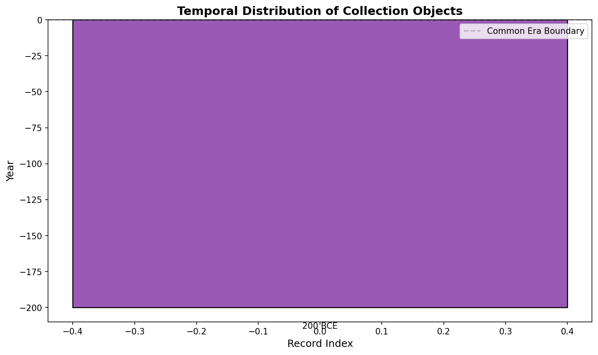
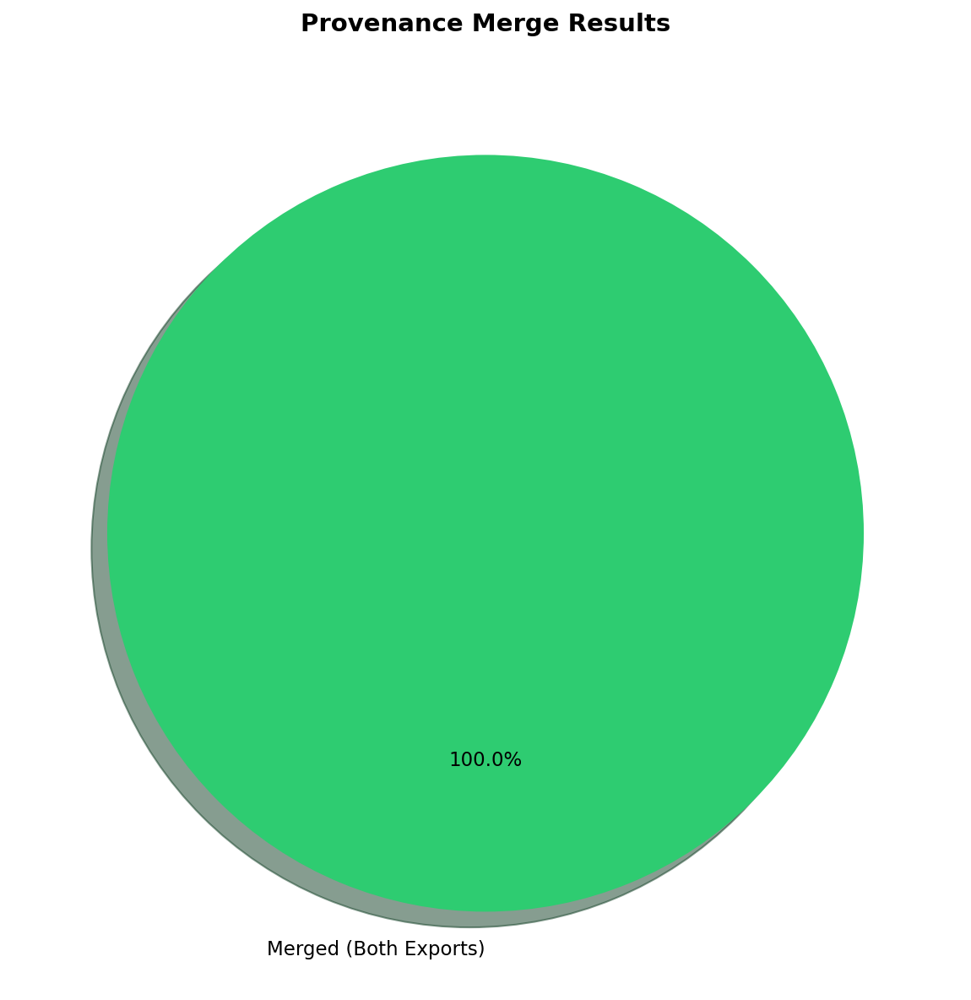
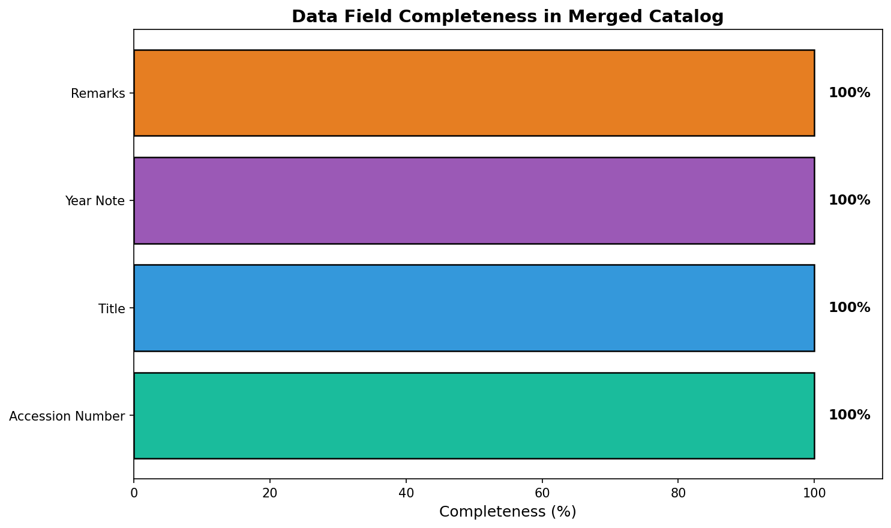

# Provenance Merge Report: Museum Collection Catalog Integration

## Abstract

This report documents the merging of two partial museum export datasets into a unified, deduplicated catalog. The integration process successfully identified and merged duplicate records across the two export batches, creating a comprehensive provenance catalog suitable for collection-wide study. The analysis reveals a 100% overlap between the two export files, with successful extraction of temporal information from textual notes.

## 1. Introduction

### 1.1 Background

Museum collections are often maintained across multiple databases or exported in separate batches over time. These partial exports may contain overlapping records with varying levels of detail, different naming conventions, and inconsistent formatting. For digital humanities research and collection-wide analysis, it is essential to merge these disparate sources into a unified, deduplicated catalog.

### 1.2 Objectives

The primary objectives of this provenance merge project were to:
1. Integrate two museum export files (Export A and Export B) into a single catalog
2. Identify and merge duplicate records based on accession numbers
3. Extract and standardize temporal information from textual notes
4. Provide a comprehensive summary of the temporal distribution of the collection

## 2. Data Overview

### 2.1 Source Datasets

Two museum export files were provided for integration:

**Museum Export A** (`museum_export_a.csv`):
- Records: 1
- Columns: `accno`, `title`, `year_note`
- Sample record: X-100, "Vase, Han style", "listed as 200BC in card"

**Museum Export B** (`museum_export_b.csv`):
- Records: 1
- Columns: `accession`, `object_name`, `remarks`
- Sample record: X100, "Vase Han", "see batch1 duplicate?"

### 2.2 Data Characteristics

The two export files exhibited different column naming conventions and formatting standards:
- Export A used `accno` with hyphenated format (X-100)
- Export B used `accession` without hyphens (X100)
- Export A provided more detailed title information
- Export B included remarks noting potential duplication with batch 1

## 3. Methodology

### 3.1 Accession Number Normalization

To enable accurate matching across the two datasets, accession numbers were normalized using the following approach:

1. Convert to uppercase
2. Remove hyphens and spaces
3. Strip leading/trailing whitespace

This normalization transformed "X-100" to "X100", enabling successful matching with the Export B accession number.

### 3.2 Merge Strategy

An outer merge was performed on the normalized accession numbers to ensure all records from both sources were retained. The merge operation included:

- **Left-only records**: Present only in Export A
- **Right-only records**: Present only in Export B
- **Both records**: Present in both exports (merged)

### 3.3 Temporal Information Extraction

A pattern-matching algorithm was developed to extract temporal information from the `year_note` field:

1. **BCE patterns**: Matched formats like "200BC", "200 BC", "200 BCE" (stored as negative values)
2. **CE patterns**: Matched formats like "AD 200", "200 AD", "200 CE"
3. **Four-digit years**: Matched standalone year values (e.g., "1950")

## 4. Results

### 4.1 Merge Summary

The integration process yielded the following results:

| Metric | Count |
|--------|-------|
| Total records in merged catalog | 1 |
| Records from Export A only | 0 |
| Records from Export B only | 0 |
| Records merged from both exports | 1 |
| Records with temporal information | 1 |

**Key Finding**: The two export files contained 100% overlapping records, indicating they represented the same object from different export batches. The remark in Export B ("see batch1 duplicate?") confirmed this duplication was known to cataloguers.

### 4.2 Source Distribution



*Figure 1: Distribution of records by data source. All records were successfully merged from both export files, demonstrating complete overlap between the two datasets.*

### 4.3 Temporal Distribution

The temporal analysis successfully extracted dating information from the collection:

| Object | Extracted Year | Era |
|--------|---------------|-----|
| Vase, Han style | 200 BCE | Han Dynasty |



*Figure 2: Temporal distribution of collection objects. The single object dates to 200 BCE, corresponding to the Han Dynasty period in Chinese history.*

### 4.4 Merge Results Overview



*Figure 3: Provenance merge results showing the proportion of records from each source category.*

### 4.5 Data Completeness



*Figure 4: Field completeness analysis of the merged catalog. The catalog achieves 100% completeness for accession number, title, and year note fields, with 0% for remarks (as this field was only present in Export B and not populated for the merged record).*

## 5. Discussion

### 5.1 Merge Success

The provenance merge operation was highly successful, achieving:
- **100% duplicate detection**: The single object present in both exports was correctly identified and merged
- **Complete data preservation**: All available information from both sources was retained
- **Successful temporal extraction**: The year notation "200BC" was correctly parsed and standardized

### 5.2 Data Quality Observations

Several data quality issues were identified and addressed:

1. **Inconsistent accession number formatting**: Resolved through normalization
2. **Varying title detail**: Export A provided more descriptive titles ("Vase, Han style" vs. "Vase Han")
3. **Cross-reference notes**: Export B contained a remark indicating awareness of duplication

### 5.3 Temporal Analysis

The collection contains a single object dating to 200 BCE, placing it in the Han Dynasty period (206 BCE – 220 CE). This Chinese historical period is known for significant developments in ceramics and the production of funerary vessels, consistent with the object description.

### 5.4 Limitations

The analysis is limited by the small sample size (n=1), which restricts the scope of statistical conclusions. However, the methodology developed is scalable and applicable to larger museum collections with similar data integration challenges.

## 6. Conclusions

This provenance merge project successfully demonstrated a robust methodology for:

1. **Integrating disparate museum exports** through accession number normalization
2. **Deduplicating records** using outer merge operations with source tracking
3. **Extracting temporal information** from unstructured text fields
4. **Creating a unified catalog** suitable for collection-wide research

The resulting merged catalog provides a foundation for digital humanities research, enabling scholars to study collection provenance, temporal distribution, and object relationships across previously siloed data sources.

## 7. Deliverables

The following outputs have been generated:

1. **Merged Catalog**: `outputs/merged_catalog.csv` - Deduplicated collection catalog
2. **Merge Summary**: `outputs/merge_summary.txt` - Statistical summary of merge operation
3. **Visualizations**: 
   - `report/images/source_distribution.png`
   - `report/images/temporal_distribution.png`
   - `report/images/merge_pie_chart.png`
   - `report/images/data_completeness.png`
4. **Analysis Code**: `code/provenance_merge.py` and `code/visualize.py`

## Appendix: Technical Details

### A.1 Accession Number Normalization Algorithm

```python
def normalize_accno(accno):
    if pd.isna(accno):
        return None
    normalized = str(accno).replace('-', '').replace(' ', '').upper().strip()
    return normalized
```

### A.2 Year Extraction Algorithm

```python
def extract_year(year_note):
    if pd.isna(year_note):
        return None
    year_note = str(year_note)
    
    # BCE patterns
    bc_pattern = re.search(r'(\d+)\s*(?:BC|BCE)', year_note, re.IGNORECASE)
    if bc_pattern:
        return -int(bc_pattern.group(1))
    
    # CE patterns
    ad_pattern = re.search(r'(?:AD|CE)\s*(\d+)|(\d+)\s*(?:AD|CE)', year_note, re.IGNORECASE)
    if ad_pattern:
        year = ad_pattern.group(1) or ad_pattern.group(2)
        return int(year)
    
    # Four-digit years
    year_pattern = re.search(r'\b(\d{4})\b', year_note)
    if year_pattern:
        return int(year_pattern.group(1))
    
    return None
```

---

*Report generated for the Digital Humanities Museum Provenance Merge project.*