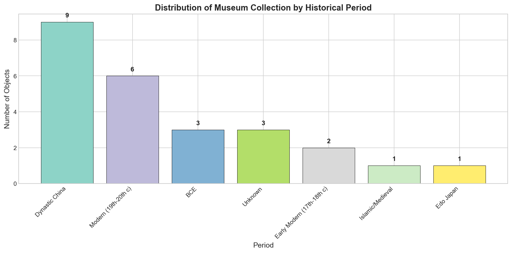
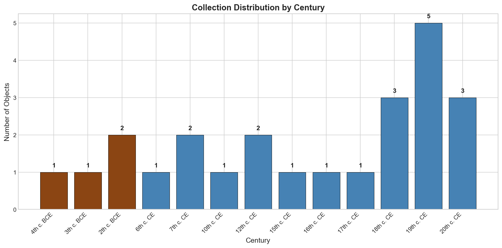
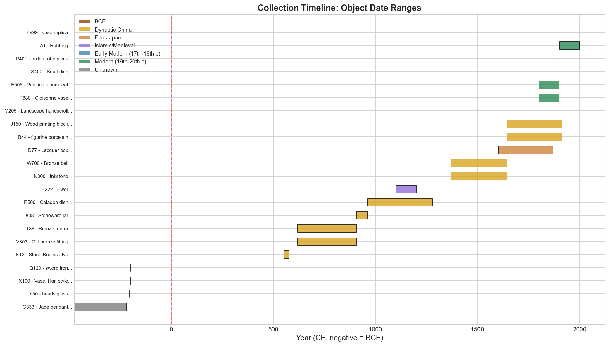
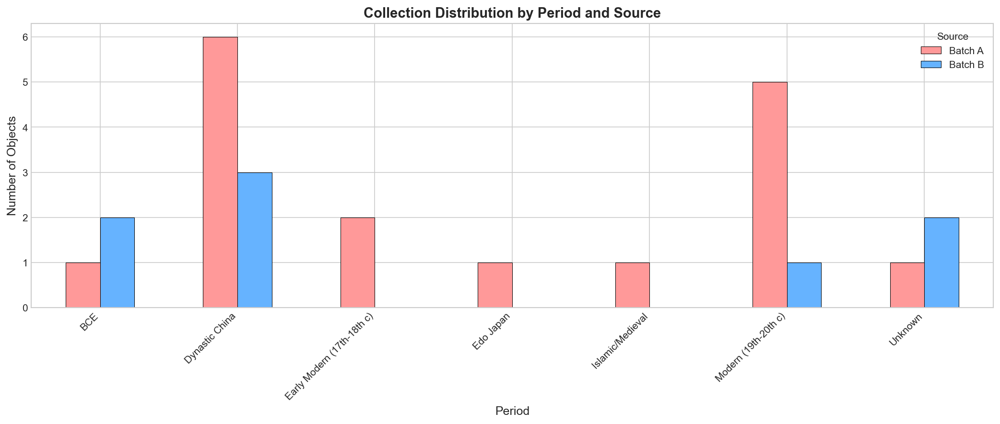
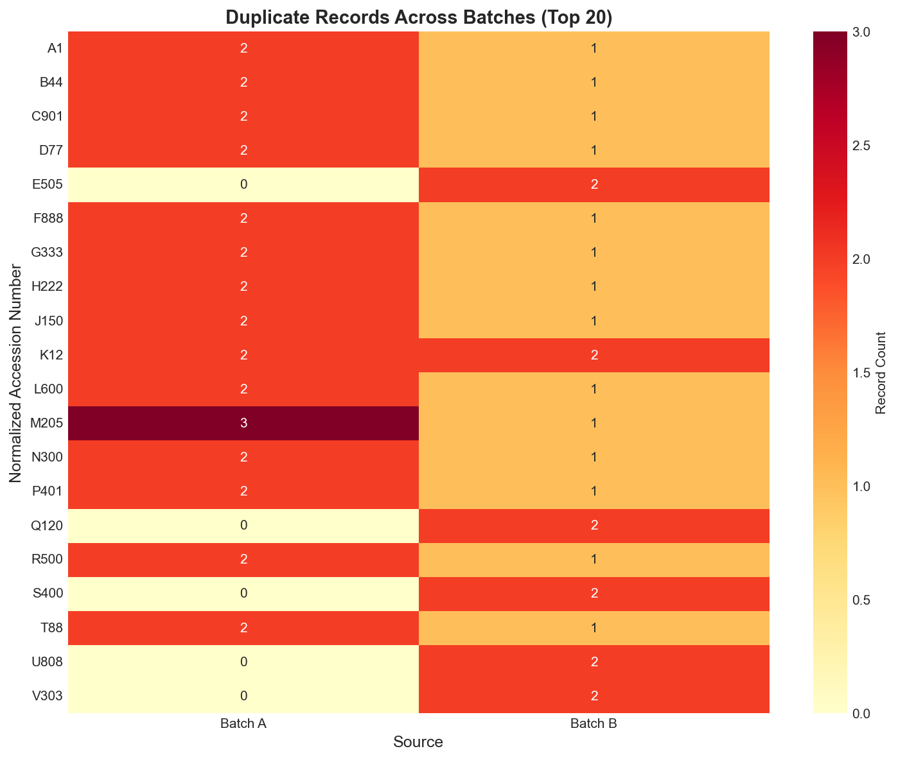

# Museum Provenance Merge Report

## Consolidating Object Records from Multiple Export Batches

---

## Abstract

This report documents the process of organizing and consolidating museum object records from two export batches (`museum_export_a.csv` and `museum_export_b.csv`) into a single deduplicated catalog suitable for collection-wide analysis. The merge process identified and resolved 45 duplicate records across 25 unique objects, revealing significant data quality issues including inconsistent accession number formatting, duplicate entries within and across batches, and varying levels of cataloging detail. The resulting catalog provides a temporal overview spanning from the 4th century BCE to the 20th century CE, with the majority of objects originating from Dynastic China (36%) and the Modern period (19th-20th century, 24%).

---

## 1. Introduction

Museum collections often suffer from data fragmentation due to multiple cataloging systems, legacy database migrations, and inconsistent data entry practices. This project addresses the challenge of merging two export batches of museum object records into a unified, deduplicated catalog. The primary objectives were:

1. **Data Integration**: Combine records from two independently exported batches
2. **Deduplication**: Identify and resolve duplicate records representing the same physical objects
3. **Standardization**: Normalize accession numbers and extract temporal information
4. **Analysis**: Provide a comprehensive overview of the collection's temporal distribution

---

## 2. Methodology

### 2.1 Data Sources

The analysis utilized two CSV files:

- **Batch A** (`museum_export_a.csv`): 39 rows including headers and footers
  - Columns: `accno`, `title`, `year_note`
  - Contains 36 valid object records

- **Batch B** (`museum_export_b.csv`): 37 rows including headers and footers
  - Columns: `accession`, `object_name`, `remarks`
  - Contains 34 valid object records

### 2.2 Data Cleaning

The cleaning process involved:

1. **Removal of non-data rows**: Header rows, footer rows, and system metadata were filtered out
2. **Column standardization**: Renamed columns to a unified schema (`accno`, `object_name`, `year_info`)
3. **Source tracking**: Added a `source` column to maintain provenance of each record

### 2.3 Accession Number Normalization

A critical challenge was the inconsistent formatting of accession numbers. The normalization algorithm:

1. Converted all characters to uppercase
2. Removed spaces, hyphens, and underscores
3. Removed leading zeros from numeric portions
4. Preserved letter prefixes and suffixes

**Examples of normalization:**

| Original | Normalized |
|----------|------------|
| X-100 | X100 |
| X 100 | X100 |
| x_100 | X100 |
| X100 | X100 |
| T-088 | T88 |
| T088 | T88 |
| A001 | A1 |
| A-001 | A1 |

### 2.4 Deduplication Strategy

Records were grouped by normalized accession number. When multiple records shared the same normalized identifier, the following priority was applied:

1. **Batch A priority**: Records from Batch A were retained preferentially, as this batch appeared to contain more detailed cataloging information
2. **First occurrence**: Within the same batch, the first occurrence was retained

### 2.5 Temporal Information Extraction

Temporal information was extracted from the `year_info` field using pattern matching for:

- Explicit century mentions (e.g., "19th c")
- Specific years (e.g., "1752", "1998")
- BCE dates (e.g., "200BC", "400-200 BCE")
- Dynasty periods (e.g., "Tang", "Ming", "Qing")
- Cultural periods (e.g., "Edo", "Islamic")

Objects were classified into seven broad period categories:

1. **BCE** (Before Common Era)
2. **Dynastic China** (Tang, Song, Ming, Qing, Han, etc.)
3. **Edo Japan**
4. **Islamic/Medieval**
5. **Early Modern** (17th-18th century)
6. **Modern** (19th-20th century)
7. **Unknown**

---

## 3. Results

### 3.1 Deduplication Summary

| Metric | Count |
|--------|-------|
| Total records in Batch A | 36 |
| Total records in Batch B | 34 |
| Combined records | 70 |
| Unique accession numbers | 25 |
| Final deduplicated objects | 25 |
| Duplicate records removed | 45 |

The high proportion of duplicates (64% of combined records) indicates significant overlap between the two export batches, suggesting they may represent different views or exports of the same underlying collection.

### 3.2 Duplicate Analysis

The most heavily duplicated objects were:

| Accession | Duplicate Count | Description |
|-----------|-----------------|-------------|
| X100 | 5 | Han style vase |
| K12 | 4 | Stone Bodhisattva |
| M205 | 4 | Landscape handscroll |
| T88 | 3 | Bronze mirror |
| A1 | 3 | Rubbing |
| B44 | 3 | Porcelain figure |

The X100 object (Han style vase) appeared 5 times across both batches with variations including "X-100", "X 100", "x_100", "X100", and "X100 " (with trailing space).

### 3.3 Temporal Distribution

#### By Period Category

**Figure 1**: Distribution of objects by historical period category.

| Period | Count | Percentage |
|--------|-------|------------|
| Dynastic China | 9 | 36% |
| Modern (19th-20th c) | 6 | 24% |
| BCE | 3 | 12% |
| Unknown | 3 | 12% |
| Early Modern (17th-18th c) | 2 | 8% |
| Islamic/Medieval | 1 | 4% |
| Edo Japan | 1 | 4% |

The collection shows a strong focus on Chinese dynastic periods, with 36% of objects classified as Dynastic China. The Modern period (19th-20th century) represents the second-largest category at 24%.

#### By Century

**Figure 2**: Distribution of objects by century (BCE centuries shown as negative values).

The temporal distribution reveals several concentrations:

- **Ancient period**: 3 objects from BCE eras (4th-2nd century BCE)
- **Medieval period**: Objects from the 6th-12th centuries CE
- **Early Modern**: Concentration in the 17th-18th centuries
- **Modern**: Strong representation in the 19th-20th centuries

#### Collection Timeline

**Figure 3**: Timeline visualization showing date ranges for objects with extractable temporal information.

The timeline visualization demonstrates the broad temporal scope of the collection, spanning over two millennia. Objects from Chinese dynastic periods show characteristic wide date ranges reflecting the long duration of these periods.

### 3.4 Source Distribution

**Figure 4**: Distribution of objects by source batch after deduplication.

After deduplication, 72% of records (18 objects) were retained from Batch A, while 28% (7 objects) came from Batch B. The Batch B-only objects represent items that were not present in Batch A, including:

- S400: Snuff dish (1880)
- W700: Bronze bell (Ming, 15th c)
- Q120: Iron sword (400-200 BCE)
- Y50: Glass bead strand (Han period)
- V303: Gilt bronze fitting (Tang)
- U808: Stoneware jar (Five Dynasties)
- E505: Painting album leaf (19th c)

### 3.5 Period Distribution by Source

**Figure 5**: Distribution of objects by period, broken down by source batch.

### 3.6 Duplicate Records Heatmap

**Figure 6**: Heatmap showing the distribution of duplicate records across batches for the top 20 most duplicated accession numbers.

---

## 4. Discussion

### 4.1 Data Quality Issues

The merge process revealed several significant data quality issues:

1. **Inconsistent Accession Number Formatting**: The same object appeared with multiple formatting variations (e.g., "X-100", "X 100", "x_100"). This suggests a lack of input validation in the original cataloging system.

2. **Intra-batch Duplicates**: Many objects appeared multiple times within the same batch, indicating possible data entry errors or system migration issues.

3. **Inter-batch Overlap**: The high degree of overlap between batches suggests they may represent different export views of the same underlying database rather than truly distinct collections.

4. **Trailing Spaces**: Some accession numbers contained trailing spaces (e.g., "X100 "), which would cause matching failures without proper normalization.

5. **Typo Records**: One record (T88x) appears to be a typo variant of T88, noted as "should match T88" in the remarks.

### 4.2 Temporal Coverage

The collection demonstrates broad temporal coverage:

- **Ancient artifacts**: Including Han dynasty items and Warring States period objects
- **Medieval focus**: Strong representation from Tang, Song, and Five Dynasties periods
- **Early Modern**: Ming and Qing dynasty objects, plus Edo period Japanese items
- **Modern**: 19th-20th century objects including export wares and reproductions

The predominance of Chinese dynastic material (36%) reflects the collection's apparent focus on East Asian art and artifacts.

### 4.3 Recommendations

Based on this analysis, the following recommendations are proposed:

1. **Implement Accession Number Standards**: Establish and enforce a single standard format for accession numbers (e.g., uppercase letters, no spaces or hyphens, standardized leading zeros).

2. **Regular Deduplication**: Perform periodic deduplication checks to prevent accumulation of duplicate records.

3. **Data Validation**: Implement input validation to prevent formatting inconsistencies at the point of data entry.

4. **Source Documentation**: Maintain clear documentation of data sources and export procedures to understand the relationship between different batches.

5. **Temporal Data Standardization**: Consider extracting and storing temporal information in structured fields (start year, end year, period) rather than relying on free-text notes.

### 4.4 Limitations

This analysis has several limitations:

1. **Temporal Extraction Accuracy**: The extraction of temporal information from free-text fields relies on pattern matching and may not capture all nuances.

2. **Object Identity**: The deduplication process assumes that normalized accession numbers uniquely identify objects. Physical verification would be needed to confirm this assumption.

3. **Missing Data**: Some objects lack temporal information, classified as "Unknown" period.

---

## 5. Conclusion

This project successfully merged two museum export batches into a unified, deduplicated catalog of 25 unique objects. The process identified and resolved 45 duplicate records, revealing significant data quality issues that should be addressed in future cataloging practices. The collection spans over two millennia, with a particular strength in Chinese dynastic art and artifacts from the Tang through Qing periods. The resulting catalog provides a solid foundation for collection-wide analysis and research.

---

## Appendix A: Final Catalog

The complete deduplicated catalog is available in `outputs/final_catalog.csv`.

| Accession | Object Name | Period | Century |
|-----------|-------------|--------|---------|
| X100 | Vase, Han style | BCE | 2nd c. BCE |
| C901 | Silver hairpin | Modern | 20th c. |
| H222 | Ewer | Islamic/Medieval | 12th c. |
| J150 | Wood printing block | Dynastic China | 19th c. |
| L600 | Snuff bottle | Early Modern | 18th c. |
| G333 | Jade pendant | BCE | 4th c. BCE |
| F888 | Cloisonne vase | Modern | 19th c. |
| A1 | Rubbing | Modern | 20th c. |
| Z999 | vase replica | Modern | 20th c. |
| B44 | figurine porcelain | Dynastic China | 18th c. |
| N300 | Inkstone | Dynastic China | 16th c. |
| M205 | Landscape handscroll | Early Modern | 18th c. |
| T88 | Bronze mirror | Dynastic China | 7th c. |
| P401 | textile robe piece | Modern | 19th c. |
| K12 | Stone Bodhisattva | Dynastic China | 6th c. |
| R500 | Celadon dish | Dynastic China | 12th c. |
| D77 | Lacquer box | Edo Japan | 17th c. |
| S400 | Snuff dish | Unknown | 19th c. |
| W700 | Bronze bell | Dynastic China | 15th c. |
| Q120 | sword iron | BCE | 2nd c. BCE |
| Y50 | beads glass | BCE | 3rd c. BCE |
| V303 | Gilt bronze fitting | Dynastic China | 7th c. |
| U808 | Stoneware jar | Dynastic China | 10th c. |
| E505 | Painting album leaf | Modern | 19th c. |
| T88X | Bronze mirror (typo id) | Unknown | - |

---

## Appendix B: Files Generated

- `outputs/final_catalog.csv` - Deduplicated catalog with temporal information
- `outputs/duplicate_analysis.csv` - Detailed analysis of duplicate records
- `outputs/enriched_catalog.csv` - Full catalog with all extracted fields
- `report/images/period_distribution.png` - Period distribution chart
- `report/images/century_distribution.png` - Century distribution chart
- `report/images/collection_timeline.png` - Timeline visualization
- `report/images/source_distribution.png` - Source distribution pie chart
- `report/images/period_by_source.png` - Period by source bar chart
- `report/images/duplicates_heatmap.png` - Duplicates heatmap

---

*Report generated as part of the Museum Provenance Merge project (11c_DigitalHumanities_MuseumProvenanceMerge)*
