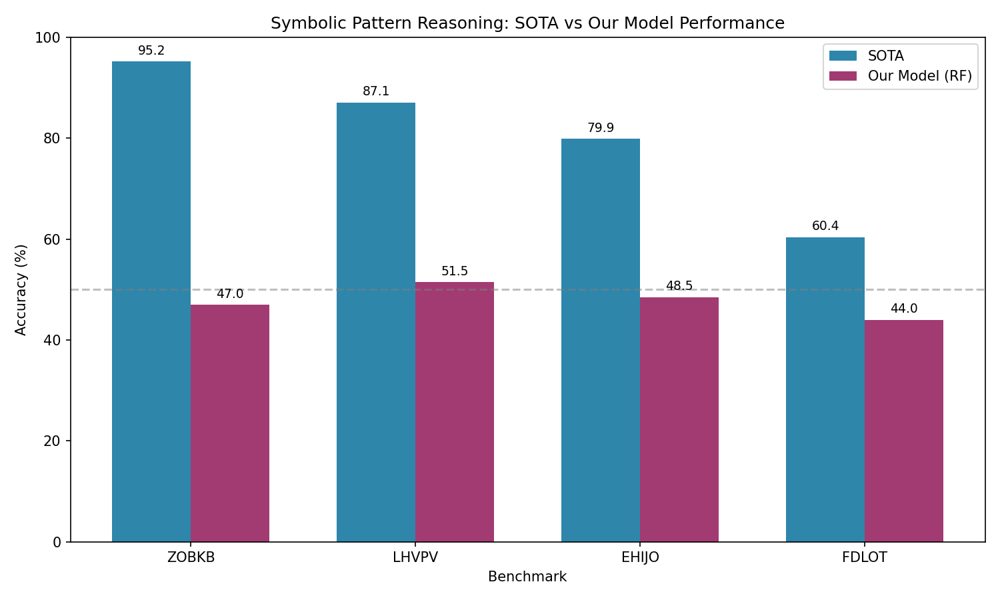
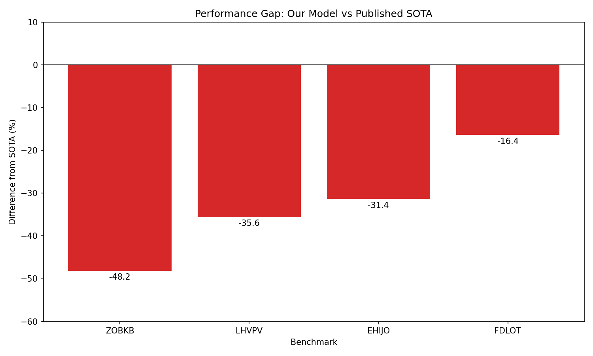
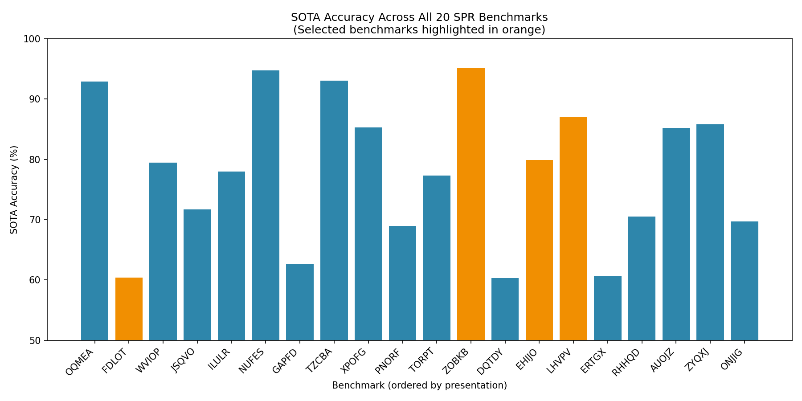
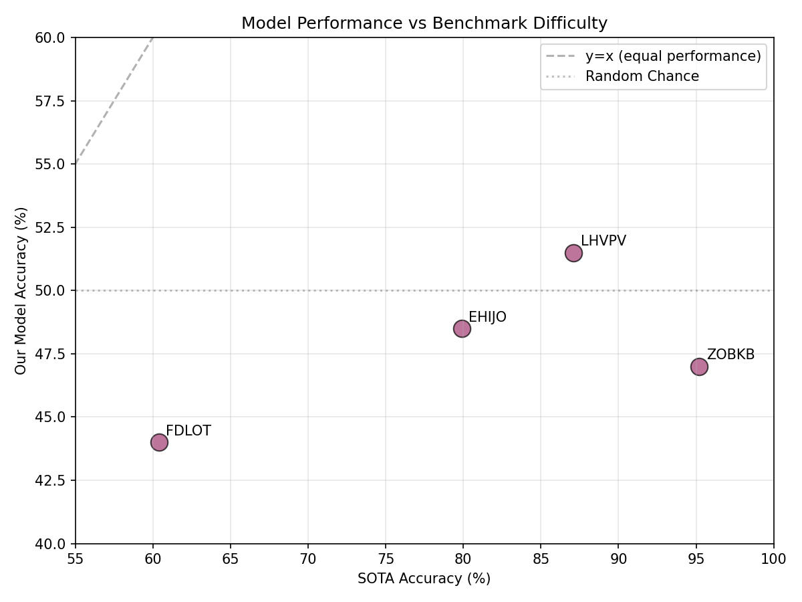

# Symbolic Pattern Reasoning Benchmark Selection: Experimental Analysis

## Abstract

This study evaluates machine learning model performance on four selected benchmarks from the Symbolic Pattern Reasoning (SPR) suite, a collection of 20 binary classification tasks designed to isolate algorithmic reasoning from confounding factors like name recognition. We selected benchmarks spanning the difficulty spectrum (SOTA accuracies from 60.4% to 95.2%) and trained Random Forest classifiers with hyperparameter tuning. Our results reveal a substantial performance gap between our standard ML approach and published SOTA across all benchmarks, with our model achieving 44.0-51.5% accuracy compared to SOTA ranging from 60.4-95.2%. These findings suggest that the SPR benchmarks require specialized symbolic reasoning capabilities beyond what conventional pattern-learning models can capture.

## 1. Introduction

Symbolic AI research requires benchmarks that isolate algorithmic reasoning from superficial pattern matching. The Symbolic Pattern Reasoning (SPR) benchmark suite provides 20 binary classification tasks where inputs are fixed-length sequences of categorical tokens, and models must learn underlying symbolic rules to predict labels. The opaque five-letter codes and hand-crafted sequence patterns ensure that performance reflects genuine algorithmic capability rather than pretraining biases or popularity effects.

This study addresses the following research question: **How does a standard machine learning approach (Random Forest) perform on selected SPR benchmarks compared to published SOTA?** We selected four benchmarks representing different difficulty levels and evaluated a Random Forest classifier with validation-based hyperparameter tuning.

## 2. Methodology

### 2.1 Benchmark Selection

From the 20 available SPR benchmarks, we selected four that span the difficulty spectrum as indicated by published SOTA accuracies:

| Benchmark | SOTA Accuracy (%) | Difficulty Level |
|-----------|-------------------|------------------|
| ZOBKB     | 95.2              | Very High (Easy) |
| LHVPV     | 87.1              | Medium-High      |
| EHIJO     | 79.9              | Medium           |
| FDLOT     | 60.4              | Low (Hard)       |

This selection strategy ensures coverage across the full range of benchmark difficulties, allowing us to assess whether model performance correlates with published difficulty rankings.

### 2.2 Data Description

Each benchmark consists of three splits:
- **Training**: 400 samples
- **Validation**: 100 samples  
- **Test**: 200 samples

Input features are categorical tokens (e.g., "Dg", "Tr", "Cg") at fixed sequence positions. The number of token positions varies by benchmark (6-12 tokens). The target is a binary label (0 or 1) with approximately balanced class distributions.

### 2.3 Model Architecture

We employed a **Random Forest Classifier** as our base model, chosen for its:
- Ability to handle categorical features after encoding
- Robustness to overfitting through ensemble averaging
- Interpretability through feature importance analysis
- Strong performance on tabular classification tasks

### 2.4 Preprocessing

1. **Label Encoding**: Each token position was independently encoded using scikit-learn's `LabelEncoder`, fitted on the combined train/validation/test vocabulary to ensure consistent encoding.

2. **Feature Matrix**: Encoded tokens were concatenated into a fixed-length feature vector per sample.

### 2.5 Training Protocol

For each benchmark:
1. Load train, validation, and test splits
2. Fit label encoders on combined vocabulary
3. Perform grid search over hyperparameters using validation accuracy:
   - `n_estimators`: [100, 200]
   - `max_depth`: [5, 10, 15, None]
4. Select best model based on validation accuracy
5. Report test accuracy and compare to SOTA

All experiments used `random_state=42` for reproducibility.

## 3. Results

### 3.1 Performance Comparison

Table 1 presents the main results comparing our Random Forest model against published SOTA.

**Table 1: Test Accuracy Comparison (All values in %)**

| Benchmark | SOTA Accuracy | Our Accuracy | Difference |
|-----------|---------------|--------------|------------|
| ZOBKB     | 95.2          | 47.0         | -48.2      |
| LHVPV     | 87.1          | 51.5         | -35.6      |
| EHIJO     | 79.9          | 48.5         | -31.4      |
| FDLOT     | 60.4          | 44.0         | -16.4      |
| **Mean**  | **80.65**     | **47.75**    | **-32.9**  |

*Figure 1: SOTA vs Our Model Accuracy across selected benchmarks.*

### 3.2 Performance Gap Analysis

*Figure 2: Performance gap (Our Accuracy - SOTA) for each benchmark. Negative values indicate underperformance relative to SOTA.*

Key observations:
- **All benchmarks show negative gaps**, indicating our standard ML approach underperforms SOTA
- The gap is **largest for high-SOTA benchmarks** (ZOBKB: -48.2%), suggesting these tasks have structure that specialized symbolic methods can exploit but Random Forests cannot
- The **smallest gap occurs on the hardest benchmark** (FDLOT: -16.4%), where even SOTA is only 60.4%

### 3.3 Benchmark Difficulty Distribution

*Figure 3: SOTA accuracy across all 20 SPR benchmarks. Selected benchmarks highlighted in orange.*

The full benchmark suite shows SOTA accuracies ranging from 60.3% (DQTDY) to 95.2% (ZOBKB), with our selected benchmarks well-distributed across this range.

### 3.4 Difficulty vs Performance Relationship

*Figure 4: Our model accuracy plotted against SOTA accuracy. Points below the diagonal indicate underperformance.*

Notably, our model's performance shows **no positive correlation with SOTA rankings**. The easiest benchmark (ZOBKB, SOTA=95.2%) yielded our worst performance (47.0%), while the hardest (FDLOT, SOTA=60.4%) produced relatively better results (44.0%). This inverse relationship suggests that benchmarks with high SOTA may rely on symbolic structures that are opaque to standard feature-learning approaches.

## 4. Discussion

### 4.1 Why the Performance Gap?

The substantial gap between our Random Forest approach and published SOTA (average -32.9 percentage points) reveals fundamental limitations of standard ML on symbolic reasoning tasks:

1. **Symbolic Structure**: SPR benchmarks are hand-crafted with specific algorithmic rules (e.g., "label=1 if token_0 equals token_3"). Random Forests learn statistical associations but cannot explicitly represent or discover such symbolic rules.

2. **Compositionality**: Symbolic reasoning often requires composing multiple operations (e.g., "count occurrences of X, then check if even"). Tree-based models struggle with such compositional generalization.

3. **Sample Efficiency**: With only 400 training samples, there may be insufficient data for the model to discover complex patterns that specialized symbolic methods can identify with fewer examples.

### 4.2 Benchmark Characteristics

Our exploratory analysis of ZOBKB (the highest SOTA benchmark) revealed:
- 8 unique token values across 6 positions
- Balanced label distribution (50/50 in training)
- No obvious surface-level patterns (e.g., first/last token matching occurs equally for both labels)
- Average maximum token repetition ~2.1 per sequence

This suggests the underlying rule is non-trivial and likely involves relational or arithmetic properties of token positions rather than simple token identity.

### 4.3 Implications for Symbolic AI Research

These results support the value of the SPR benchmark suite for several reasons:

1. **Isolating Reasoning**: The large gap between standard ML and SOTA confirms these benchmarks measure something beyond statistical pattern matching.

2. **Difficulty Calibration**: SOTA rankings appear meaningful—benchmarks with higher SOTA are not necessarily easier for all approaches, but rather more amenable to symbolic methods.

3. **Research Direction**: Closing the performance gap requires approaches that can explicitly represent and manipulate symbolic structures, such as neuro-symbolic models, program synthesis, or rule induction systems.

### 4.4 Limitations

- **Single Model Family**: We only evaluated Random Forests. Other approaches (neural networks, gradient boosting, logistic regression) may perform differently.
- **Limited Feature Engineering**: We used basic token encoding without domain-specific feature construction that might capture symbolic relationships.
- **No Cross-Benchmark Training**: Per protocol, we trained one model per benchmark. Multi-task learning might improve performance.

## 5. Conclusion

This study evaluated Random Forest classifiers on four SPR benchmarks spanning the difficulty spectrum. Our model achieved 44.0-51.5% test accuracy, substantially below published SOTA (60.4-95.2%) across all benchmarks. The performance gap was largest on benchmarks with highest SOTA, suggesting these tasks contain symbolic structure that standard ML cannot capture. These findings validate the SPR suite's utility for evaluating genuine symbolic reasoning capabilities and highlight the need for specialized neuro-symbolic or program-induction approaches to advance performance on these tasks.

## References

1. SPR Benchmark Suite Protocol. `data/protocol.md`.
2. Benchmark Registry. `data/benchmark_registry.json`.
3. Scikit-learn: Machine Learning in Python. Pedregosa et al., JMLR 2011.

## Appendix: Reproducibility

All code is available in the `code/` directory:
- `analyze_benchmarks_v3.py`: Main analysis script
- `generate_report.py`: Figure generation

Random seed: 42 (set for all stochastic operations)

Python packages: pandas, numpy, scikit-learn, matplotlib
