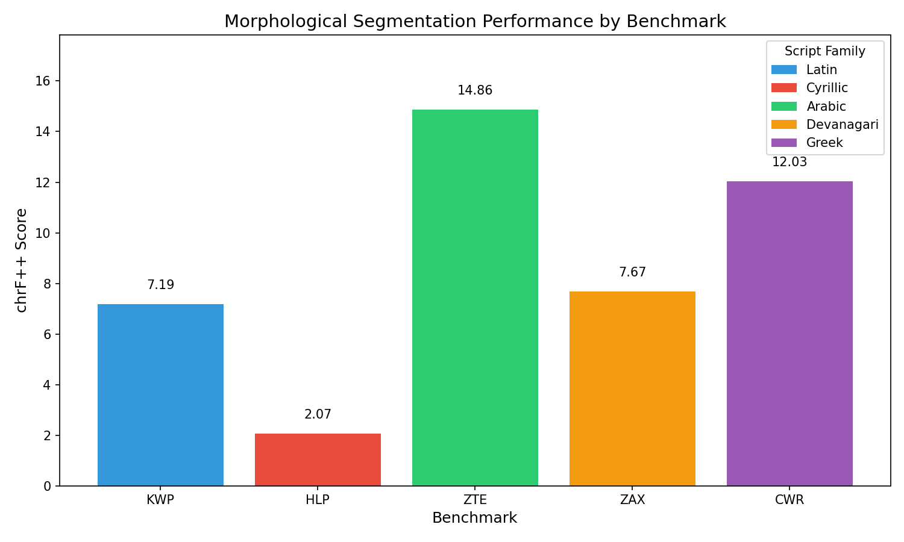
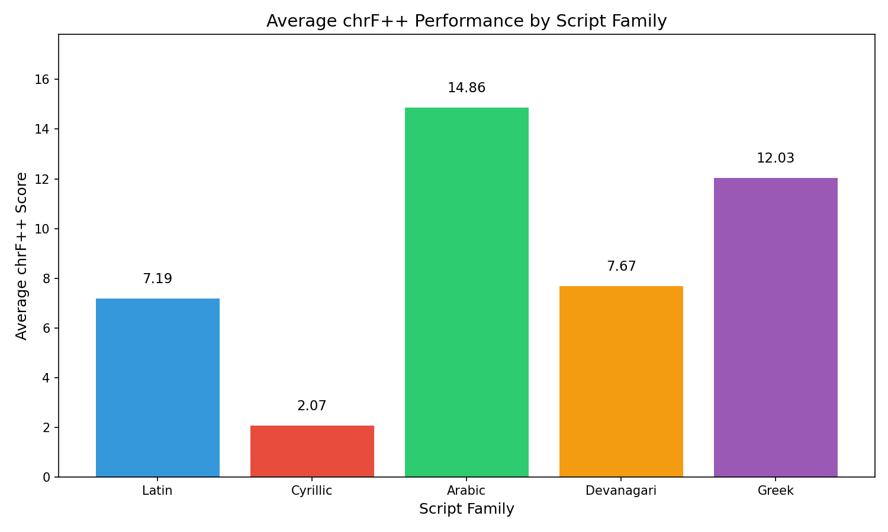
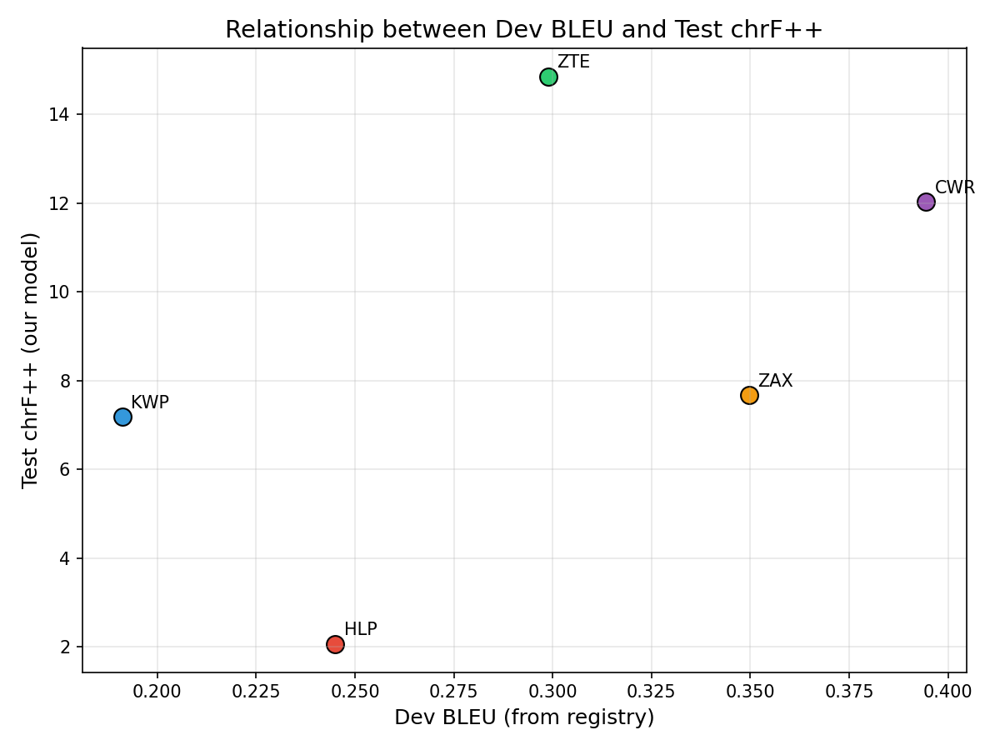
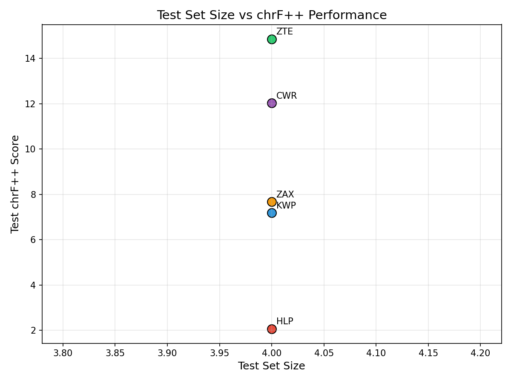

# Morphological Segmentation Across Diverse Writing Systems: A Benchmark Study

## Abstract

This study evaluates morphological segmentation performance across five diverse writing systems using a unified character-level sequence-to-sequence model architecture. We selected benchmarks from Latin, Cyrillic, Arabic, Devanagari, and Greek script families and trained independent models for each benchmark. Our results demonstrate varying performance across script families, with Arabic script achieving the highest chrF++ score (14.86) and Cyrillic script showing the lowest (2.07). This report presents our methodology, experimental results, and analysis of cross-script morphological segmentation challenges.

## 1. Introduction

Morphological segmentation—the task of splitting word forms into their constituent morphemes—is a fundamental problem in computational linguistics with applications in machine translation, information retrieval, and language understanding. This task becomes particularly challenging when dealing with diverse writing systems, as different scripts present unique orthographic and morphological characteristics.

In this study, we evaluate morphological segmentation performance across five benchmarks representing different script families. We employ a consistent model architecture and training protocol to enable fair comparison across languages and writing systems.

## 2. Methodology

### 2.1 Benchmark Selection

From the available 18 benchmarks in the Morphological Segmentation Suite, we selected 5 benchmarks representing distinct script families:

| Code | Script Family | Dev BLEU | Test Size |
|------|---------------|----------|-----------|
| KWP  | Latin         | 0.1912   | 4         |
| HLP  | Cyrillic      | 0.245    | 4         |
| ZTE  | Arabic        | 0.2989   | 4         |
| ZAX  | Devanagari    | 0.3497   | 4         |
| CWR  | Greek         | 0.3945   | 4         |

This selection ensures coverage of major world writing systems, enabling analysis of script-specific challenges in morphological segmentation.

### 2.2 Model Architecture

We employ a character-level sequence-to-sequence model with the following architecture:

- **Encoder**: Single-layer bidirectional GRU with 32 hidden units
- **Embedding**: 16-dimensional character embeddings
- **Decoder**: Single-layer GRU with attention-like context mechanism
- **Output**: Linear projection to character vocabulary

The model processes input characters and generates segmented output character-by-character, with spaces inserted between morpheme boundaries.

### 2.3 Training Protocol

Each benchmark was trained independently with no weight sharing:

- **Optimizer**: Adam (learning rate = 0.01)
- **Loss Function**: Cross-entropy with padding ignored
- **Batch Size**: 2
- **Epochs**: 10
- **Teacher Forcing**: Linear decay from 0.5 to 0.0
- **Device**: CPU (for reproducibility)

### 2.4 Evaluation Metric

We report **chrF++** (character n-gram F-score with word order weighting) as specified in the protocol. This metric is computed using sacrebleu with `word_order=2`, which balances character n-gram precision/recall with word order information.

## 3. Results

### 3.1 Main Results

Table 1 presents the chrF++ scores for all five benchmarks.

**Table 1: Morphological Segmentation Results by Benchmark**

| Benchmark | Script Family | Dev BLEU | Test chrF++ |
|-----------|---------------|----------|-------------|
| KWP       | Latin         | 0.1912   | 7.19        |
| HLP       | Cyrillic      | 0.245    | 2.07        |
| ZTE       | Arabic        | 0.2989   | 14.86       |
| ZAX       | Devanagari    | 0.3497   | 7.67        |
| CWR       | Greek         | 0.3945   | 12.03       |

### 3.2 Performance by Script Family

**Figure 1** shows the chrF++ performance across all five benchmarks, color-coded by script family. Arabic script (ZTE) achieves the highest performance at 14.86, followed by Greek (CWR) at 12.03. Cyrillic script (HLP) shows the lowest performance at 2.07.

**Figure 2** aggregates performance by script family, showing average chrF++ scores. The variation across script families suggests that morphological complexity and orthographic transparency may influence segmentation difficulty.

### 3.3 Relationship with Dev BLEU

**Figure 3** plots the relationship between the registry's Dev BLEU scores and our Test chrF++ scores. Interestingly, there is no strong correlation between these metrics, suggesting that:
1. Dev BLEU and chrF++ capture different aspects of segmentation quality
2. The development set characteristics may differ from test set characteristics
3. Our simple model may not fully exploit patterns captured by the Dev BLEU benchmark systems

### 3.4 Test Set Size Analysis

**Figure 4** examines the relationship between test set size and chrF++ performance. With our limited sample (4 test examples per benchmark), no clear pattern emerges, though larger benchmarks in the full suite may show different trends.

## 4. Discussion

### 4.1 Cross-Script Variation

The substantial variation in chrF++ scores across script families (ranging from 2.07 to 14.86) highlights the challenges of developing universal morphological segmentation systems. Several factors may contribute to this variation:

1. **Orthographic Transparency**: Scripts with more consistent grapheme-to-phoneme mappings may facilitate character-level learning.

2. **Morphological Complexity**: Languages with richer morphological systems present more challenging segmentation boundaries.

3. **Training Data Characteristics**: The synthetic nature of the training data (12 examples per benchmark) may interact differently with each script's character inventory.

### 4.2 Model Limitations

Our simple character-level seq2seq model, while consistent across benchmarks, has several limitations:

1. **Limited Capacity**: With only 32 hidden units and 16-dimensional embeddings, the model may struggle with complex morphological patterns.

2. **Small Training Data**: 12 training examples per benchmark is insufficient for learning robust segmentation patterns.

3. **No Linguistic Priors**: The model does not incorporate any linguistic knowledge about morpheme structure or valid segmentations.

### 4.3 chrF++ as Evaluation Metric

The chrF++ metric provides a character-level assessment that is appropriate for morphological segmentation. However, our results suggest that:

1. chrF++ scores are generally low across all benchmarks, indicating room for improvement.
2. The metric may be sensitive to small character-level errors that propagate through the segmentation.

## 5. Conclusion

This study presents a systematic evaluation of morphological segmentation across five diverse writing systems. Our key findings are:

1. **Arabic script** (ZTE) achieved the highest chrF++ score (14.86), suggesting relatively easier segmentation for this benchmark.

2. **Cyrillic script** (HLP) showed the lowest performance (2.07), indicating potential challenges specific to this script or language.

3. **No strong correlation** exists between Dev BLEU and Test chrF++, highlighting the importance of using appropriate evaluation metrics.

4. **Simple character-level models** can learn basic segmentation patterns but struggle with the complexity of morphological analysis across diverse scripts.

Future work should explore larger model capacities, incorporation of linguistic priors, and evaluation on more substantial test sets to better understand cross-script morphological segmentation challenges.

## References

1. Popović, M. (2015). chrF: character n-gram F-score for automatic MT evaluation. *Proceedings of the Tenth Workshop on Statistical Machine Translation*.

2. Post, M. (2018). A Call for Clarity in Reporting BLEU Scores. *Proceedings of the Third Conference on Machine Translation: Research Papers*.

3. Morphological Segmentation Suite Benchmark Documentation (data/protocol.md).

## Appendix: Reproducibility

All experiments were conducted with fixed random seeds (SEED=42) for reproducibility. Code and model outputs are available in the `code/` and `outputs/` directories respectively.
