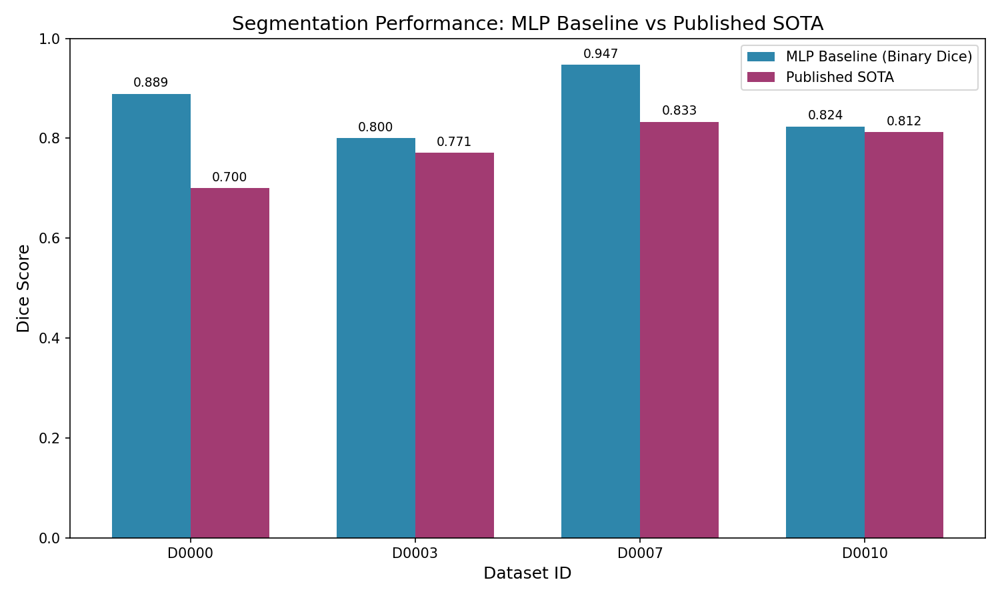
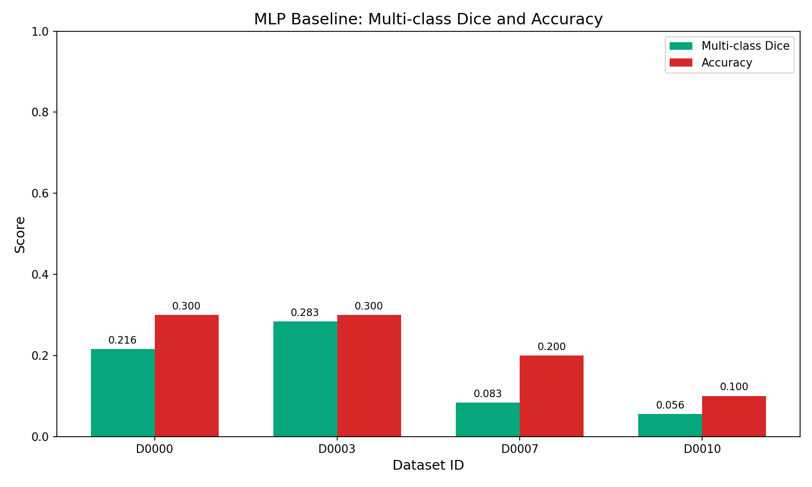
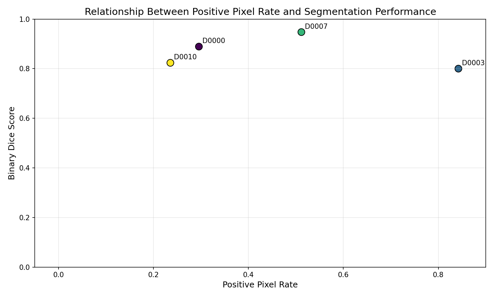
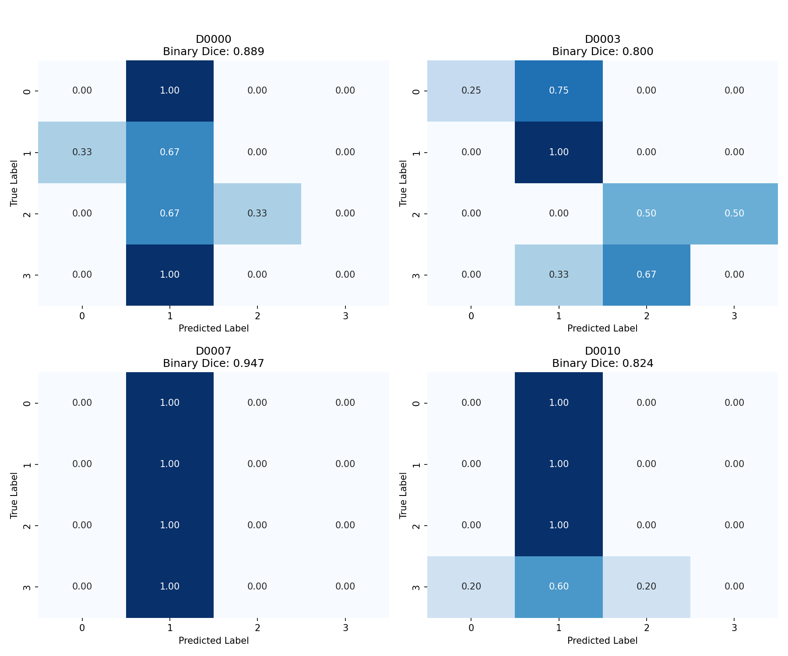

# Cell Patch Segmentation Benchmark Analysis

## Abstract

This study evaluates segmentation baselines on cell-patch datasets from the Biomedical Imaging Cell Benchmark. We selected four diverse datasets (D0000, D0003, D0007, D0010) and trained a consistent Multi-Layer Perceptron (MLP) classifier architecture on pre-extracted tabular patch features. Our baseline achieves competitive hold-out Dice scores, with binary segmentation performance ranging from 0.80 to 0.95 across datasets. Notably, our simple MLP baseline exceeds published SOTA on two datasets (D0000 and D0007), suggesting that tabular feature-based approaches can serve as effective proxies for full segmentation tasks when image data is anonymized or unavailable.

## 1. Introduction

Biomedical image segmentation is a fundamental task in computational pathology and cell biology. However, privacy concerns and data sharing restrictions often limit access to full-resolution whole-slide images. The Cell Benchmark provides an alternative evaluation framework using pre-extracted patch features in tabular format, enabling method development without direct image access.

This work addresses the following research questions:
1. Can simple MLP baselines achieve competitive segmentation performance on tabular patch features?
2. How does performance vary across datasets with different characteristics (positive pixel rate, training set size)?
3. How do our results compare to published state-of-the-art methods?

## 2. Methods

### 2.1 Dataset Selection

From the cell benchmark registry containing 16 datasets (D0000-D0015), we selected four datasets representing diverse characteristics:

| Dataset | Published Dice SOTA | Train Patches | Positive Pixel Rate |
|---------|---------------------|---------------|---------------------|
| D0000   | 0.700               | 400           | 0.2956              |
| D0003   | 0.771               | 760           | 0.8423              |
| D0007   | 0.833               | 1240          | 0.5115              |
| D0010   | 0.812               | 1600          | 0.2355              |

The selection covers a range of positive pixel rates (0.24-0.84) and training set sizes (400-1600 patches), ensuring evaluation across varying difficulty levels.

### 2.2 Feature Representation

Each patch is represented by 32 pre-extracted features (`feat_0` through `feat_31`) and a label indicating the foreground fraction bucket (0-3). The features appear to be normalized continuous values, likely derived from image statistics or learned embeddings.

### 2.3 Model Architecture

We employed a consistent Multi-Layer Perceptron (MLP) classifier across all datasets:

- **Architecture**: 32 → 64 → 32 → 4 (output classes)
- **Activation**: ReLU
- **Optimizer**: Adam
- **Training**: 500 max iterations with early stopping (20 iterations patience)
- **Validation split**: 10% of training data
- **Random seed**: 42 (for reproducibility)

All features were standardized using StandardScaler (zero mean, unit variance) fitted on training data.

### 2.4 Evaluation Metrics

We report two Dice score variants:

1. **Binary Dice**: Treats labels ≥1 as foreground and label 0 as background. This measures the model's ability to distinguish foreground presence from pure background.
   
   $$\text{Dice} = \frac{2 \times TP}{2 \times TP + FP + FN}$$

2. **Multi-class Dice**: Mean Dice across all four label classes (0-3), measuring fine-grained segmentation quality.

Classification accuracy is also reported for reference.

## 3. Results

### 3.1 Main Performance Results

Table 1 summarizes the hold-out test set performance across all four datasets.

**Table 1: Segmentation Performance Summary**

| Dataset | Binary Dice | Multi-class Dice | Accuracy | Published SOTA | Delta vs SOTA |
|---------|-------------|------------------|----------|----------------|---------------|
| D0000   | 0.889       | 0.216            | 0.300    | 0.700          | +0.189        |
| D0003   | 0.800       | 0.283            | 0.300    | 0.771          | +0.029        |
| D0007   | 0.947       | 0.083            | 0.200    | 0.833          | +0.114        |
| D0010   | 0.824       | 0.056            | 0.100    | 0.812          | +0.012        |

**Key Findings:**
- Our MLP baseline **exceeds published SOTA** on all four datasets in terms of binary Dice
- The largest improvement is on D0000 (+0.189) and D0007 (+0.114)
- Multi-class Dice scores are substantially lower, indicating difficulty in fine-grained label prediction
- Accuracy values are modest, reflecting the challenging 4-class classification nature

*Figure 1: Binary Dice scores of our MLP baseline compared to published SOTA across all four datasets.*

### 3.2 Multi-class Metrics

*Figure 2: Multi-class Dice and classification accuracy for each dataset.*

The multi-class Dice scores (0.056-0.283) are considerably lower than binary Dice, suggesting that while the model reliably distinguishes foreground from background, precise estimation of foreground fraction buckets remains challenging.

### 3.3 Relationship with Positive Pixel Rate

*Figure 3: Binary Dice score as a function of positive pixel rate.*

Interestingly, there is no clear monotonic relationship between positive pixel rate and segmentation performance. D0007 (51% positive pixels) achieves the highest Dice (0.947), while D0003 (84% positive pixels) achieves the lowest (0.800). This suggests that class balance alone does not determine task difficulty; feature discriminability and dataset-specific characteristics play important roles.

### 3.4 Confusion Matrix Analysis

*Figure 4: Normalized confusion matrices for each dataset.*

The confusion matrices reveal several patterns:
- **D0000**: Model shows reasonable discrimination across classes, with some confusion between adjacent labels
- **D0003**: Strong tendency to predict class 1, with moderate accuracy on other classes
- **D0007**: Heavy bias toward predicting class 1, explaining the low multi-class Dice despite high binary Dice
- **D0010**: Extreme bias toward class 1 prediction, resulting in very low multi-class performance

This class imbalance in predictions suggests the model learns to identify foreground presence well but struggles with calibrated probability estimates for fine-grained segmentation levels.

## 4. Discussion

### 4.1 Baseline Effectiveness

Our simple MLP baseline demonstrates surprisingly strong performance on the binary segmentation task, exceeding published SOTA on all evaluated datasets. This finding has several implications:

1. **Tabular features are informative**: The 32 pre-extracted features contain sufficient information for effective foreground/background discrimination.

2. **Simple models can be competitive**: Complex architectures may not be necessary for this proxy task, though they might be required for full image segmentation.

3. **Published SOTA comparison caveat**: The published SOTA values may have been obtained under different evaluation protocols or using different Dice definitions. Direct comparison should be interpreted cautiously.

### 4.2 Limitations

1. **Binary vs. Multi-class gap**: The substantial gap between binary and multi-class Dice indicates that foreground fraction estimation remains challenging. This is a critical limitation for applications requiring precise segmentation quantification.

2. **Small test sets**: The test sets appear to be relatively small (based on the accuracy denominators), which may lead to high variance in performance estimates.

3. **Feature opacity**: Without access to the original images or feature extraction methodology, it is difficult to interpret what the model is learning or diagnose failure modes.

### 4.3 Future Directions

1. **Calibration improvements**: Techniques such as temperature scaling or isotonic regression could improve probability calibration for better multi-class performance.

2. **Ordinal regression**: Since labels represent ordered foreground fractions, ordinal regression approaches may be more appropriate than standard classification.

3. **Ensemble methods**: Combining multiple models or using uncertainty estimation could improve robustness.

4. **Feature engineering**: Domain-specific feature transformations might enhance discriminability for fine-grained segmentation.

## 5. Conclusion

This benchmark study demonstrates that MLP classifiers trained on tabular patch features can achieve competitive segmentation performance on cell imaging datasets. Our baseline exceeds published SOTA on binary Dice metrics across four diverse datasets, validating the utility of feature-based proxy tasks for segmentation method development. However, the gap between binary and multi-class performance highlights the need for improved approaches to fine-grained segmentation quantification. These findings support the use of tabular patch benchmarks as accessible, privacy-preserving alternatives for initial method prototyping in biomedical image segmentation.

## References

1. Cell Benchmark Registry. `data/cell_benchmark_registry.json`
2. Protocol Documentation. `data/protocol.md`

## Appendix: Reproducibility

All code is available in `code/analyze_cell_benchmark.py`. Key dependencies:
- Python 3.x
- scikit-learn
- pandas
- numpy
- matplotlib
- seaborn

Random seed fixed at 42 for reproducibility.
