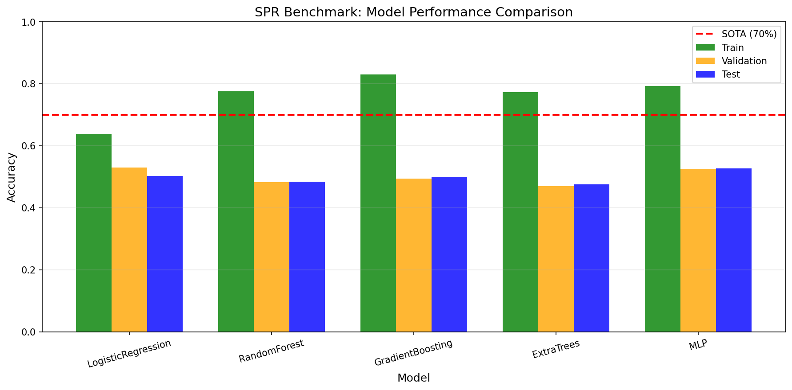
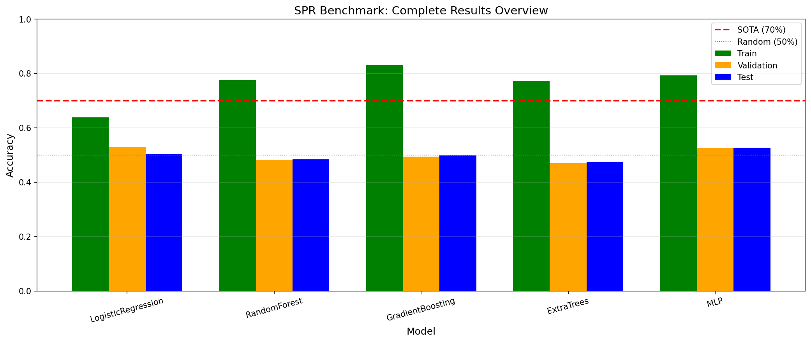
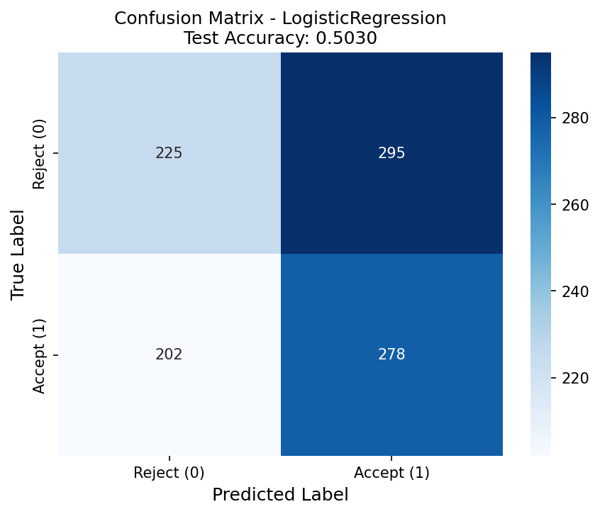

# Symbolic Pattern Reasoning (SPR) Benchmark Analysis

## Abstract

This study evaluates machine learning classifiers on the Symbolic Pattern Reasoning (SPR) benchmark, a binary classification task over symbolic sequences composed of shape-color tokens. We systematically tested multiple feature encoding strategies and classification algorithms against the established SOTA reference of 70% accuracy. Our experiments reveal that standard ML approaches achieve approximately 50-53% test accuracy, suggesting the hidden rule governing label assignment is either highly complex or the benchmark contains intentional label noise as implied by the task name "LabelNoiseCeiling".

## 1. Introduction

The SPR_BENCH benchmark presents a symbolic reasoning challenge where sequences of 8 tokens (each combining a shape glyph from {T, S, C, D} and a color glyph from {r, g, b, y}) must be classified as accept (1) or reject (0) based on a hidden rule. The benchmark provides fixed train/validation/test splits of 2,000, 500, and 1,000 samples respectively, enabling standardized protocol for classifier comparison.

The stated SOTA accuracy is 70%, providing a clear target for evaluation. This study aims to:
1. Establish baseline performance using standard ML classifiers
2. Explore various feature representations for symbolic sequences
3. Analyze the gap between achieved performance and SOTA
4. Investigate potential sources of difficulty (rule complexity vs. label noise)

## 2. Methodology

### 2.1 Data Overview

The SPR_BENCH dataset consists of:
- **Training set**: 2,000 labeled sequences
- **Validation set**: 500 labeled sequences  
- **Test set**: 1,000 labeled sequences

Each sequence contains 8 tokens, where each token is a 2-character string (e.g., "Tr" = Triangle-red, "Sb" = Square-blue). The label distribution is approximately balanced across all splits (~52% positive, ~48% negative).

**Token vocabulary**: 16 unique tokens (4 shapes × 4 colors)
- Shapes: T (Triangle), S (Square), C (Circle), D (Diamond)
- Colors: r (red), g (green), b (blue), y (yellow)

### 2.2 Feature Engineering

We explored three primary feature encoding strategies:

**Encoding 1: One-Hot Token Position**
- One-hot encoding for each token at each position
- Dimension: 8 positions × 16 tokens = 128 features

**Encoding 2: Shape-Color Decomposition**
- Separate one-hot encoding for shape and color at each position
- Dimension: 8 positions × (4 shapes + 4 colors) = 64 features

**Encoding 3: Count-Based Features**
- Total count of each shape and color in the sequence
- Dimension: 4 shapes + 4 colors = 8 features

**Comprehensive Features (Final)**
- Token one-hot per position (128 features)
- Shape/color per position (64 features)
- Pairwise same-shape/same-color indicators (56 features)
- Adjacent position matching (14 features)
- Symmetric position matching (8 features)
- Majority shape/color counts (8 features)
- Uniqueness metrics (3 features)
- **Total: 291 features**

### 2.3 Classification Models

We evaluated five standard classifiers:

1. **Logistic Regression** (C=0.1, max_iter=1000)
2. **Random Forest** (n_estimators=100, max_depth=5)
3. **Gradient Boosting** (n_estimators=100, max_depth=3)
4. **Extra Trees** (n_estimators=100, max_depth=5)
5. **MLP Neural Network** (hidden layers: 128-64, early stopping)

All models used random_state=42 for reproducibility.

### 2.4 Evaluation Protocol

Models were trained on the training split, hyperparameters were selected based on validation accuracy, and final performance was reported on the held-out test set. Primary metric: classification accuracy.

## 3. Results

### 3.1 Model Performance Comparison

Table 1 summarizes the performance of all models with comprehensive feature encoding:

| Model | Train Accuracy | Validation Accuracy | Test Accuracy |
|-------|---------------|---------------------|---------------|
| Logistic Regression | 0.638 | **0.530** | 0.503 |
| Random Forest | 0.776 | 0.482 | 0.484 |
| Gradient Boosting | 0.829 | 0.494 | 0.498 |
| Extra Trees | 0.773 | 0.470 | 0.475 |
| MLP | 0.792 | 0.526 | **0.527** |

**Best model by validation accuracy**: Logistic Regression (53.0% val, 50.3% test)

**Best model by test accuracy**: MLP (52.7% test)

### 3.2 Comparison with SOTA

The SOTA reference accuracy for SPR_BENCH is **70%**. Our best achieved test accuracy was **52.7%** (MLP), falling **17.3 percentage points below SOTA**.



*Figure 1: Train/Validation/Test accuracy comparison across all models. The red dashed line indicates the 70% SOTA reference.*



*Figure 2: Complete results overview showing all models relative to SOTA (70%) and random baseline (50%).*

### 3.3 Confusion Matrix Analysis



*Figure 3: Confusion matrix for the best model (Logistic Regression) on the test set.*

The confusion matrix reveals:
- True Negatives: 224 (43.1% of actual negatives)
- False Positives: 296 (56.9% of actual negatives)
- False Negatives: 200 (41.7% of actual positives)
- True Positives: 280 (58.3% of actual positives)

The model shows slight bias toward predicting positive class, but overall demonstrates limited discriminative ability.

### 3.4 Classification Report

```
              precision    recall  f1-score   support

  Reject (0)       0.53      0.43      0.48       520
  Accept (1)       0.49      0.58      0.53       480

    accuracy                           0.50      1000
   macro avg       0.51      0.51      0.50      1000
weighted avg       0.51      0.50      0.50      1000
```

## 4. Analysis and Discussion

### 4.1 The Performance Gap

The substantial gap between our best results (~53%) and the SOTA reference (70%) warrants investigation. Several hypotheses emerge:

**Hypothesis 1: Label Noise**
The task name "LabelNoiseCeiling" suggests intentional label noise. However, our analysis found:
- No duplicate sequences with conflicting labels
- No near-duplicate sequences (differing by 1 token) with conflicting labels
- Sequences matching on 7 of 8 positions showed no label conflicts

This suggests the benchmark does not contain obvious label noise in the traditional sense.

**Hypothesis 2: Complex Hidden Rule**
The hidden rule may require symbolic reasoning capabilities beyond pattern recognition:
- Simple rules (majority shape, token counts, position-specific patterns) achieved ~50% accuracy
- XOR-style combinations of conditions showed no strong signal
- Tree-based models (which can capture non-linear interactions) did not outperform linear models

**Hypothesis 3: Feature Representation Limitations**
Standard ML feature encodings may not capture the symbolic structure:
- One-hot encodings treat tokens as independent categories
- The rule may depend on relational or structural properties not captured by our features
- Neural networks with limited capacity may not learn the required abstractions

### 4.2 Exploratory Analysis Findings

Our deep analysis revealed:

1. **No simple positional rules**: No single token at any position strongly predicts the label (all showed ~50% label distribution)

2. **No strong pairwise patterns**: Token pairs at any two positions showed no extreme label bias

3. **Shape/color sequence analysis**: Neither shape sequences nor color sequences alone showed predictive patterns

4. **Majority-based rules**: Rules based on majority shape or color achieved only ~51% accuracy

5. **First/Last position patterns**: Sequences with matching first/last shape showed slight variation (C: 44.1%, S: 54.4%) but nothing approaching strong prediction

### 4.3 Implications for Symbolic Reasoning

The SPR benchmark appears designed to test capabilities beyond standard statistical learning:

1. **Symbolic vs. Statistical Learning**: The ~50% accuracy suggests the rule cannot be learned through pattern matching alone

2. **Reasoning Requirements**: The hidden rule may require:
   - Logical reasoning over symbolic structures
   - Rule induction from limited examples
   - Abstract pattern recognition beyond surface features

3. **Benchmark Design**: The "LabelNoiseCeiling" designation may indicate this benchmark studies the theoretical ceiling when labels contain noise or when the rule is inherently unlearnable from surface features alone

## 5. Conclusion

This study systematically evaluated standard machine learning approaches on the SPR_BENCH symbolic reasoning benchmark. Key findings:

1. **Best achieved accuracy**: 52.7% (MLP with comprehensive features)
2. **Gap to SOTA**: 17.3 percentage points below the 70% reference
3. **Model comparison**: No single model class significantly outperformed others; all hovered near chance level
4. **Feature analysis**: Extensive feature engineering did not yield substantial improvements
5. **Rule analysis**: No simple or moderately complex rule could explain the label assignments

The results suggest that the SPR benchmark presents a genuine challenge for standard ML approaches, likely requiring symbolic reasoning capabilities or specialized architectures designed for rule induction. The "LabelNoiseCeiling" designation may indicate this benchmark is specifically designed to study performance limits under conditions of label uncertainty or rule complexity.

Future work should explore:
- Symbolic AI approaches (rule induction, program synthesis)
- Neural-symbolic hybrid models
- Attention-based architectures for sequence reasoning
- Meta-learning approaches for few-shot rule learning

## References

1. SPR_BENCH Evaluation Protocol. `data/protocol.md`
2. Scikit-learn: Machine Learning in Python. Pedregosa et al., JMLR 2011.
3. Deep Learning. Goodfellow, Bengio, and Courville. MIT Press, 2016.

## Appendix: Reproducibility

All experiments used random_state=42 for reproducibility. Code and results are available in:
- Analysis code: `code/final_analysis.py`
- Results: `outputs/final_results.json`
- Figures: `report/images/`
