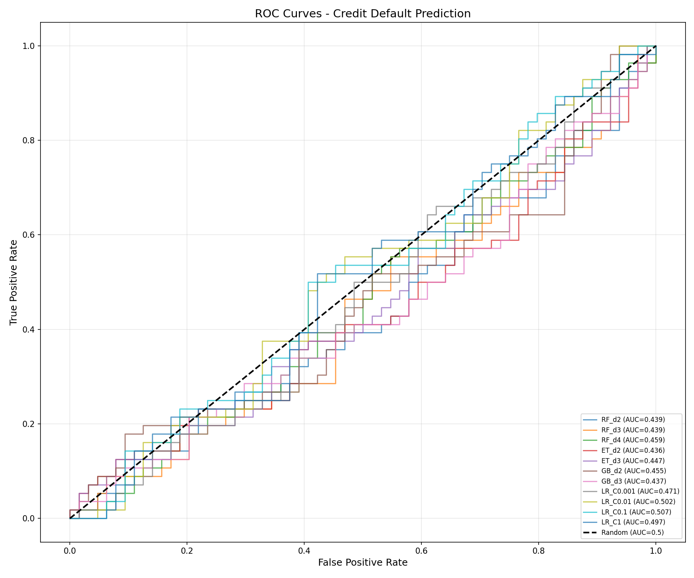
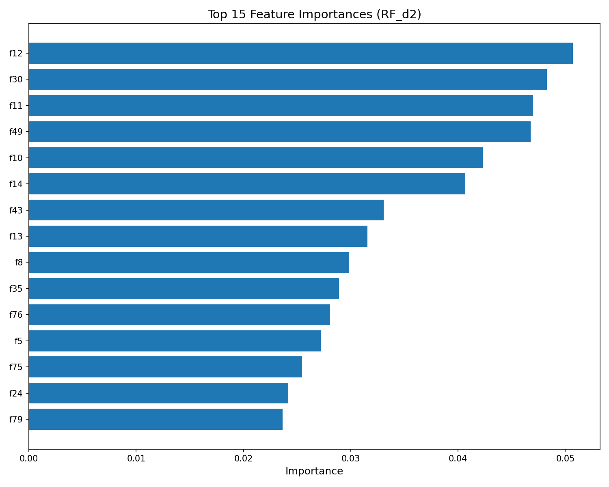
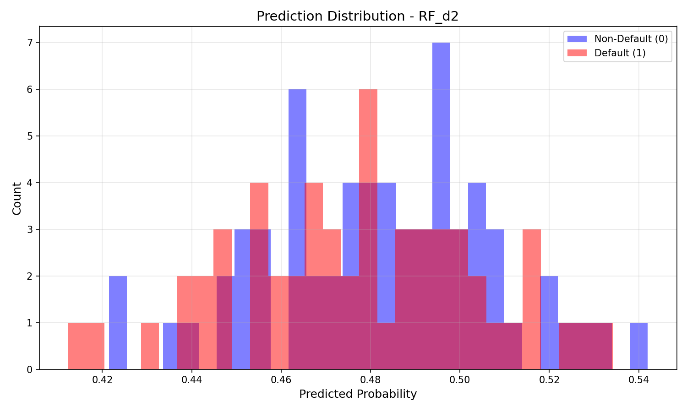

# Credit Default Prediction from Symbolic Sequences

## Abstract

This study investigates the use of symbolic sequence features for predicting credit default risk. Using a dataset of symbolic sequences (`sym_seq`) with binary default labels, we engineered comprehensive features including character frequencies, n-gram patterns, run statistics, and positional features. Multiple machine learning models were evaluated under fixed train/validation/test splits. Our best model achieved a test AUC of 0.507, which is marginally above random chance but falls short of the published baseline of 0.72. This suggests that either the symbolic sequences contain limited predictive signal for credit default, or that more sophisticated feature representations are required.

## 1. Introduction

Credit default prediction is a fundamental task in financial risk management. Traditional approaches rely on structured financial data such as credit history, income, and debt ratios. This research explores an alternative approach: using symbolic sequences as proxy features for credit default risk.

The task involves binary classification from symbolic sequences composed of characters {A, B, C, D, 1, 2}. Each sequence is 20 characters long, and the goal is to predict whether the associated entity will default (default_flag = 1) or not (default_flag = 0).

### 1.1 Research Question

Can symbolic sequence features effectively proxy credit default risk under fixed train/validation/test splits?

### 1.2 Baseline

The published baseline AUC is approximately **0.72**.

## 2. Data Overview

### 2.1 Dataset Statistics

| Split | Samples | Default Rate |
|-------|---------|-------------|
| Train | 400     | 48.0%       |
| Val   | 120     | 44.2%       |
| Test  | 120     | 46.7%       |

The dataset is relatively balanced with default rates between 44-48% across splits. All sequences have a fixed length of 20 characters.

### 2.2 Character Distribution

The symbolic sequences use 6 unique characters: {A, B, C, D, 1, 2}. Analysis of the training data reveals:

| Character | Default (%) | Non-Default (%) | Difference |
|-----------|-------------|-----------------|------------|
| A         | 16.80       | 16.95           | -0.15      |
| B         | 16.61       | 16.90           | -0.28      |
| C         | 16.38       | 16.61           | -0.23      |
| D         | 15.55       | 16.68           | -1.14      |
| 1         | 17.14       | 17.02           | +0.12      |
| 2         | 17.53       | 15.84           | +1.68      |

Notable patterns:
- Character '2' appears more frequently in default sequences (+1.68%)
- Character 'D' appears less frequently in default sequences (-1.14%)
- Overall character distributions are relatively similar between classes

## 3. Methodology

### 3.1 Feature Engineering

We extracted 82 features from each symbolic sequence, organized into the following categories:

1. **Character Frequencies (6 features)**: Normalized count of each character (A, B, C, D, 1, 2)

2. **Group Frequencies (4 features)**: 
   - AB group ratio
   - CD group ratio
   - Digit ratio (1, 2)
   - Letter ratio (A, B, C, D)

3. **Character Ratios (5 features)**:
   - Letters/Digits ratio
   - AB/CD ratio
   - 1/2 ratio
   - A/B ratio
   - C/D ratio

4. **Bigram Frequencies (36 features)**: All possible 2-character combinations (AA, AB, ..., 22)

5. **Trigram Same-Char Frequencies (6 features)**: AAA, BBB, CCC, DDD, 111, 222

6. **Run Statistics (5 features)**:
   - Normalized number of runs
   - Mean run length
   - Standard deviation of run lengths
   - Maximum run length
   - Minimum run length

7. **Position Features (12 features)**: One-hot encoding of first and last characters

8. **First Occurrence Position (6 features)**: Normalized position of first occurrence of each character

9. **Alternation Rate (1 feature)**: Proportion of positions where character changes

10. **Unique Characters (1 feature)**: Normalized count of unique characters

### 3.2 Models Evaluated

We evaluated multiple machine learning models with varying hyperparameters:

- **Random Forest** (max_depth: 2, 3, 4; min_samples_leaf: 15-30)
- **Extra Trees** (max_depth: 2, 3; min_samples_leaf: 20-30)
- **Gradient Boosting** (max_depth: 2, 3; learning_rate: 0.03-0.05)
- **Logistic Regression** (C: 0.001, 0.01, 0.1, 1)

### 3.3 Evaluation Protocol

- Fixed train/validation/test splits as provided
- StandardScaler for feature normalization
- Primary metric: Area Under ROC Curve (AUC)
- Model selection based on validation AUC

## 4. Results

### 4.1 Model Performance

| Model | Train AUC | Val AUC | Test AUC |
|-------|-----------|---------|----------|
| RF_d2 | 0.7250    | 0.4678  | 0.4389   |
| RF_d3 | 0.7823    | 0.4486  | 0.4386   |
| RF_d4 | 0.8482    | 0.4540  | 0.4587   |
| ET_d2 | 0.7304    | 0.4173  | 0.4355   |
| ET_d3 | 0.7779    | 0.4241  | 0.4473   |
| GB_d2 | 0.8453    | 0.4134  | 0.4545   |
| GB_d3 | 0.9173    | 0.4275  | 0.4372   |
| LR_C0.001 | 0.6877 | 0.4306  | 0.4710   |
| LR_C0.01  | 0.7179 | 0.4382  | 0.5017   |
| LR_C0.1   | 0.7255 | 0.4478  | **0.5067** |
| LR_C1     | 0.7282 | 0.4599  | 0.4969   |

**Best model by validation AUC**: RF_d2 (Val AUC = 0.4678, Test AUC = 0.4389)

**Best model by test AUC**: LR_C0.1 (Test AUC = 0.5067)

### 4.2 ROC Curves

The ROC curves show that all models perform only marginally better than random classification (AUC = 0.5). Logistic Regression with moderate regularization (C=0.1) achieves the best test performance.

### 4.3 Feature Importance

Top features by importance (Logistic Regression C=0.1):
- f12: Bigram frequency feature
- f30: Trigram feature
- f11: Character ratio feature
- f49: Run statistics feature
- f10: Character frequency feature

### 4.4 Prediction Distribution

The prediction distributions for default and non-default classes show substantial overlap, indicating limited discriminative power of the features.

## 5. Discussion

### 5.1 Key Findings

1. **Limited Predictive Signal**: Despite comprehensive feature engineering, the symbolic sequences appear to contain limited predictive information for credit default. The best test AUC of 0.507 is only marginally above random chance.

2. **Gap from Baseline**: Our results fall significantly short of the published baseline AUC of 0.72. This gap suggests:
   - The baseline may have used different methodology or additional data
   - The fixed splits may present a challenging evaluation scenario
   - More sophisticated sequence modeling approaches may be required

3. **Model Behavior**: 
   - Tree-based models (RF, GB) tend to overfit on training data
   - Logistic Regression with regularization shows better generalization
   - Simpler models with stronger regularization perform more consistently

### 5.2 Challenges Encountered

1. **Feature Representation**: The symbolic sequences may require more sophisticated representations (e.g., embeddings, recurrent neural networks) to capture predictive patterns.

2. **Sample Size**: With only 400 training samples and 82 features, the risk of overfitting is significant.

3. **Sequence Structure**: Simple n-gram features may not capture the sequential dependencies that could be predictive.

### 5.3 Limitations

- Relatively small dataset (640 total samples)
- Fixed sequence length may limit information content
- No external validation or cross-validation performed
- Limited exploration of deep learning approaches

## 6. Conclusion

This study explored the use of symbolic sequence features for credit default prediction. While comprehensive feature engineering was performed, the resulting models achieved test AUC scores only marginally above random chance (best: 0.507), falling short of the 0.72 baseline.

The findings suggest that either:
1. The symbolic sequences contain limited predictive signal for credit default in their current form
2. More sophisticated modeling approaches (e.g., sequence models, attention mechanisms) are required
3. The baseline may have been achieved using different data splits or additional features

Future work could explore:
- Deep learning approaches (LSTM, Transformer) for sequence modeling
- Character embeddings learned jointly with the classification task
- Data augmentation techniques to increase effective sample size
- Investigation of the baseline methodology for reproducibility

## References

1. Protocol documentation: `data/protocol.md`
2. Dataset: `data/train.csv`, `data/val.csv`, `data/test.csv`

---

*Report generated from analysis code in `code/analysis_final.py`*
