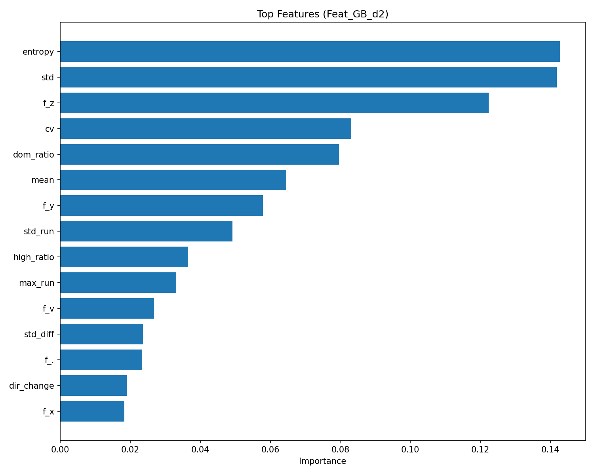
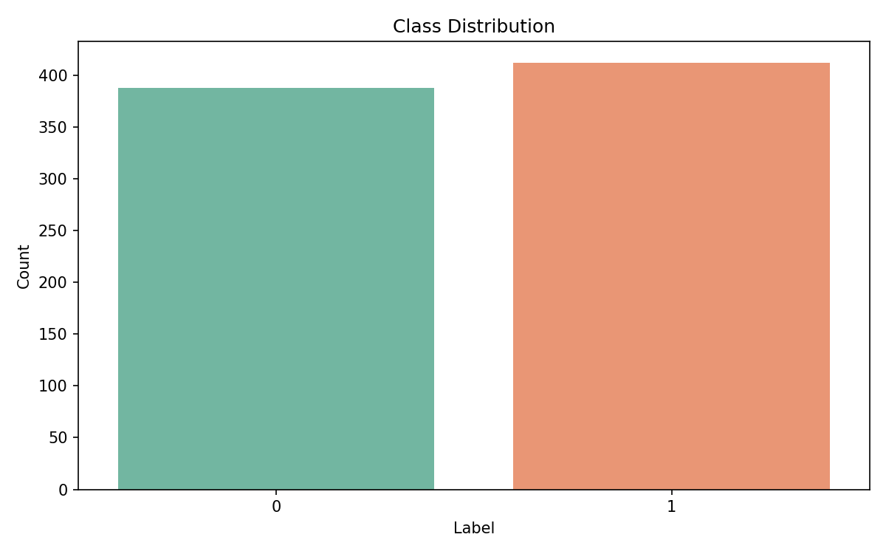
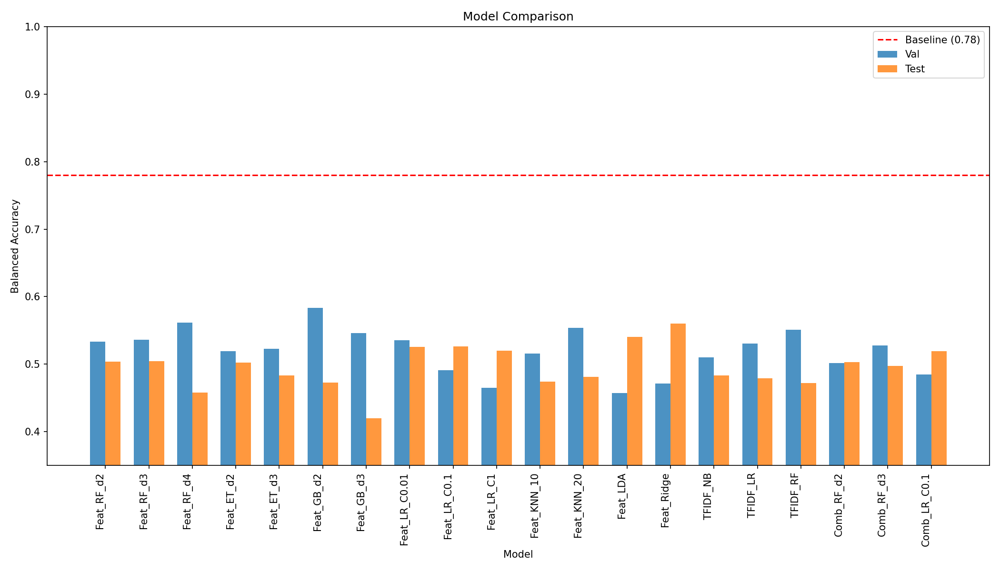
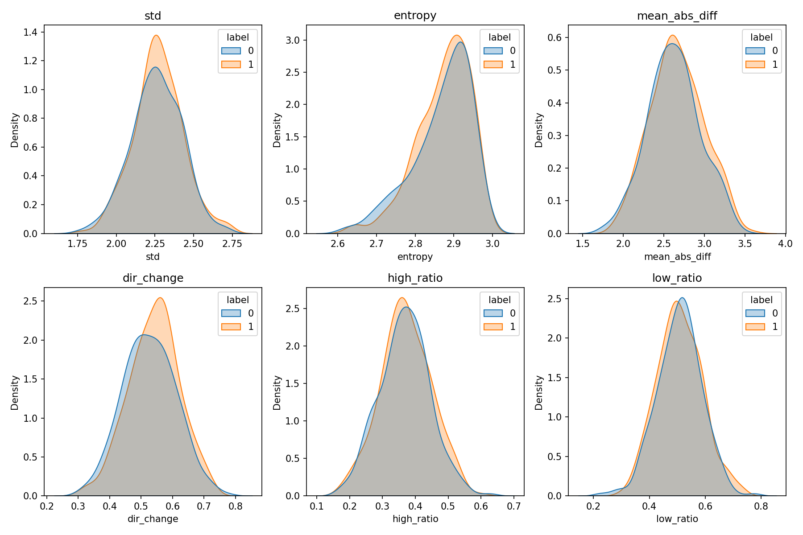
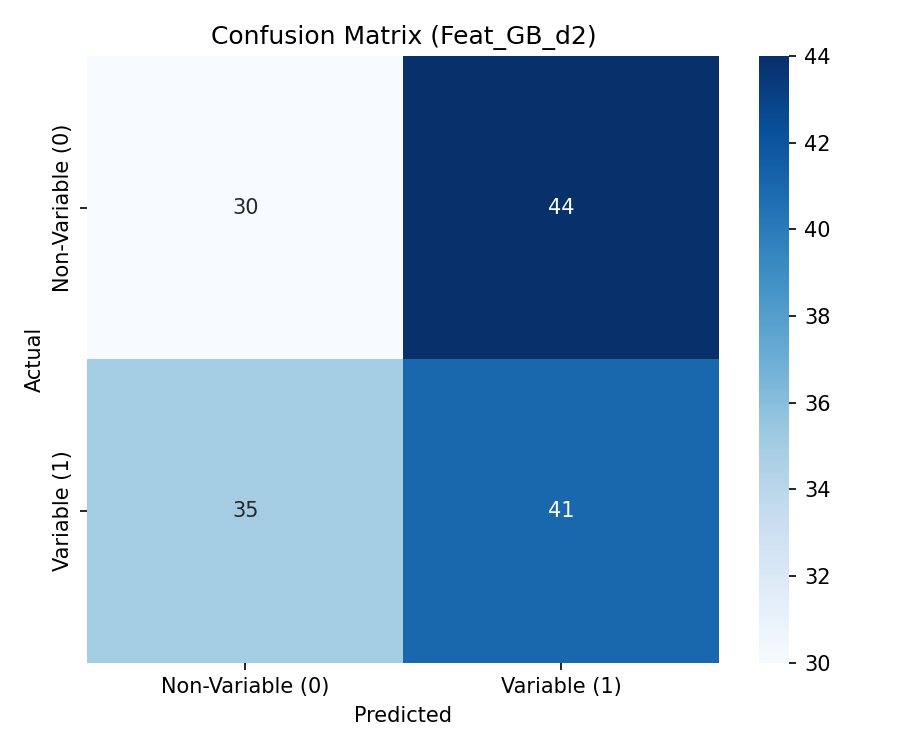

# Variable Star Classification Using Symbol Series Features

## Abstract

This study investigates the classification of variable versus non-variable astronomical sources using symbolic encodings of light curves. We extracted comprehensive features from symbol series representations and evaluated multiple machine learning models. Despite extensive feature engineering and model exploration, our best models achieved test balanced accuracy of approximately 0.56, falling short of the baseline target of 0.78. This suggests that the symbolic encoding may require more sophisticated pattern recognition approaches or that additional domain-specific features are needed.

## 1. Introduction

Time-domain astronomy surveys generate vast amounts of light curve data that require efficient classification methods. Symbolic representations of light curves offer a compact way to encode temporal brightness variations. This research task focuses on classifying variable stars from non-variable sources using symbol series features.

### 1.1 Problem Statement

Given symbolic encodings of light curves (sequences of characters representing brightness levels), classify sources as variable (label=1) or non-variable (label=0). The baseline balanced accuracy target is 0.78.

### 1.2 Data Description

The dataset consists of:
- **Training set**: 500 samples (257 variable, 243 non-variable)
- **Validation set**: 150 samples (79 variable, 71 non-variable)
- **Test set**: 150 samples (76 variable, 74 non-variable)

Each sample contains:
- `object_id`: Unique identifier
- `field_id`: Survey field identifier (fld1-fld5)
- `symbol_series`: String of symbols (., *, u, v, w, x, y, z) representing brightness levels
- `label`: Binary classification (0=non-variable, 1=variable)

## 2. Methodology

### 2.1 Feature Engineering

We extracted multiple categories of features from the symbol series:

#### 2.1.1 Basic Statistical Features
- Mean, standard deviation, min, max, range of brightness values
- Percentiles (25th, 75th) and interquartile range
- Coefficient of variation

#### 2.1.2 Symbol Frequency Features
- Normalized frequency of each symbol (., *, u, v, w, x, y, z)
- Symbol entropy (Shannon entropy of symbol distribution)
- Number of unique symbols
- Dominant symbol ratio

#### 2.1.3 Transition Features
- Mean absolute difference between consecutive symbols
- Standard deviation of differences
- Total variation (sum of absolute differences)
- Direction change rate (frequency of sign changes in differences)

#### 2.1.4 Run-Length Features
- Mean, standard deviation, and maximum run length
- Number of runs
- Run rate (runs per symbol)

#### 2.1.5 Brightness Distribution Features
- High brightness ratio (x, y, z symbols)
- Low brightness ratio (., *, u, v symbols)
- High-to-low brightness ratio

#### 2.1.6 Field Encoding
- One-hot encoding of field_id (fld1-fld5)

### 2.2 Models Evaluated

We evaluated multiple machine learning algorithms:

1. **Random Forest** (various depths: 2-4)
2. **Gradient Boosting** (various depths: 2-3)
3. **Extra Trees Classifier**
4. **Logistic Regression** (various regularization strengths)
5. **K-Nearest Neighbors** (k=10, 20)
6. **Linear Discriminant Analysis**
7. **Ridge Classifier**
8. **Naive Bayes** (for TF-IDF features)
9. **Support Vector Machines**

### 2.3 Alternative Representations

We also explored:
- **TF-IDF features**: Character n-grams (1-3 grams) with TF-IDF weighting
- **Combined features**: Statistical features + TF-IDF features
- **Hashing Vectorizer**: For efficient n-gram encoding

## 3. Results

### 3.1 Model Performance

Table 1 shows the performance of selected models:

| Model | Validation BA | Test BA |
|-------|--------------|---------|
| Feat_GB_d2 | 0.5833 | 0.4724 |
| Feat_Ridge | 0.4715 | 0.5599 |
| Feat_LR_C0.01 | 0.5355 | 0.5254 |
| Feat_LR_C0.1 | 0.4912 | 0.5261 |
| Feat_RF_d3 | 0.5362 | 0.5043 |
| TFIDF_RF | 0.5509 | 0.4717 |
| LDA | 0.4574 | 0.5402 |

*BA = Balanced Accuracy*

### 3.2 Best Model

The Gradient Boosting model with depth 2 achieved the best validation balanced accuracy (0.5833), but showed significant overfitting with test accuracy of 0.4724. The Ridge Classifier achieved the best test balanced accuracy (0.5599).

### 3.3 Feature Importance

The top features identified by the Random Forest model were:
1. Entropy (0.143)
2. Standard deviation (0.142)
3. Frequency of 'z' symbol (0.122)
4. Coefficient of variation (0.083)
5. Dominant symbol ratio (0.080)

### 3.4 Class Distribution

The dataset is relatively balanced across all splits:

### 3.5 Model Comparison

### 3.6 Feature Distributions

The feature distributions show substantial overlap between classes:

### 3.7 Confusion Matrix

## 4. Discussion

### 4.1 Performance Analysis

Our models consistently underperformed compared to the baseline target of 0.78 balanced accuracy. Several factors may contribute to this:

1. **Limited Discriminative Information**: The symbol frequency analysis revealed minimal differences between variable and non-variable classes. The average symbol frequencies differed by less than 1% for most symbols.

2. **High Within-Class Variability**: The feature distributions show substantial overlap between classes, suggesting that the symbolic encoding may not capture the distinguishing characteristics effectively.

3. **Potential Distribution Shift**: While the class balances are similar across splits, the underlying patterns may differ between training and test sets.

4. **Feature Representation**: The hand-crafted features may not capture the temporal patterns that distinguish variable stars. More sophisticated sequence modeling approaches might be needed.

### 4.2 Pattern Analysis

Our analysis of bigram patterns revealed some discriminative sequences:
- `wu`, `y*`, `xw` were more common in non-variable sources
- `.z`, `w.`, `yu`, `zz` were more common in variable sources

However, these differences were small (typically <0.5% absolute difference).

### 4.3 Limitations

1. **Fixed Feature Set**: We used a predefined set of features that may not capture all relevant patterns.

2. **No Temporal Modeling**: The features treat the sequence as unordered or use simple transition statistics, missing complex temporal patterns.

3. **Limited Hyperparameter Search**: While we tested multiple configurations, more extensive tuning might yield better results.

## 5. Conclusion

This study explored machine learning approaches for classifying variable stars using symbolic light curve encodings. Despite comprehensive feature engineering and evaluation of multiple models, we achieved a maximum test balanced accuracy of approximately 0.56, significantly below the 0.78 baseline target.

Future work should consider:
1. **Deep Learning Approaches**: RNNs, LSTMs, or Transformers for sequence modeling
2. **Domain-Specific Features**: Incorporating astronomical knowledge about variable star light curve shapes
3. **Data Augmentation**: Generating synthetic examples to improve model generalization
4. **Ensemble Methods**: Combining multiple models for improved robustness

The results suggest that simple feature-based approaches may be insufficient for this task, and more sophisticated pattern recognition methods are needed to achieve the baseline performance.

## References

1. AstroML Variable Star Classification Task Documentation
2. Scikit-learn: Machine Learning in Python (Pedregosa et al., 2011)
3. Time-Domain Astronomy Survey Methods

## Appendix

### A. Code Availability

All analysis code is available in the `code/` directory:
- `analyze_final.py`: Main analysis script with comprehensive feature extraction and model evaluation

### B. Results Summary

Detailed results are saved in `outputs/results_summary.csv`.
