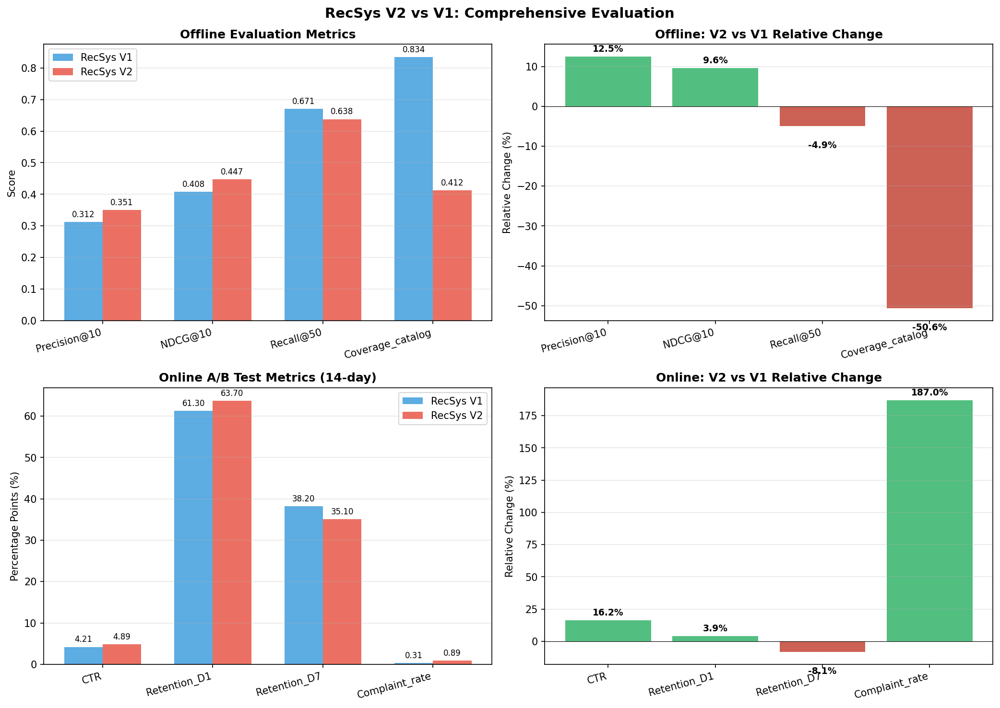
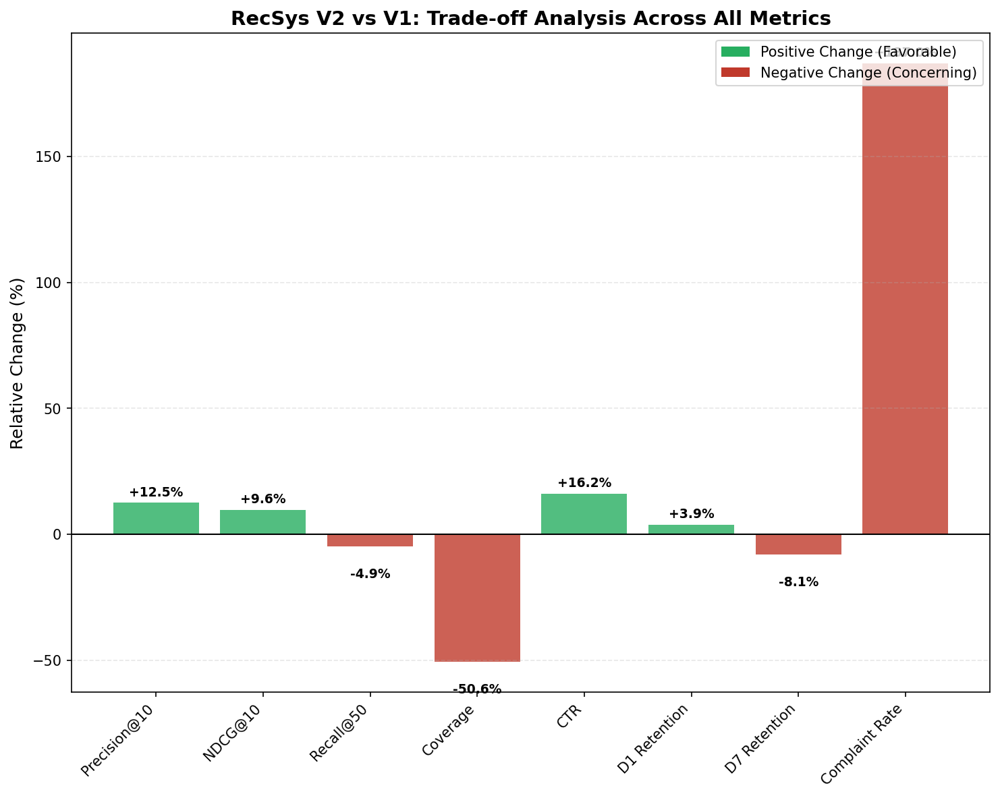

# RecSys V2 Launch Evaluation Report

## Executive Summary

This report evaluates the launch decision for **RecSys-v2** versus the production **RecSys-v1** recommender system. The evaluation combines offline ranking quality metrics (n=200,000 held-out test set) with online A/B test results (14-day experiment, 10% traffic per arm). 

**Recommendation: DO NOT LAUNCH RecSys-v2 in its current form.**

While RecSys-v2 demonstrates improvements in short-term engagement metrics (CTR +16.2%, D1 Retention +3.9%), it exhibits critical concerning signals: a dramatic 187% increase in complaint rate, an 8.1% decline in D7 retention, and a 50.6% reduction in catalog coverage. These issues suggest the model may be optimizing for short-term engagement at the expense of user experience and long-term retention.

---

## 1. Introduction

Recommender system launches require careful evaluation balancing offline ranking quality against real-world user behavior. This evaluation assesses RecSys-v2 against the production RecSys-v1 using a comprehensive framework:

- **Offline Evaluation**: Held-out test set (n=200,000) measuring ranking quality metrics
- **Online A/B Test**: 14-day experiment with 10% traffic allocation per arm measuring user engagement and satisfaction

The decision framework considers both immediate performance gains and potential long-term risks to user experience and platform health.

---

## 2. Methodology

### 2.1 Offline Evaluation

The offline evaluation used a held-out test set of 200,000 user-item interactions. Metrics assessed include:

| Metric | Description | Interpretation |
|--------|-------------|----------------|
| Precision@10 | Proportion of top-10 recommendations that are relevant | Higher is better |
| NDCG@10 | Normalized Discounted Cumulative Gain at 10 | Accounts for ranking position; higher is better |
| Recall@50 | Proportion of relevant items found in top-50 | Higher is better |
| Coverage_catalog | Fraction of catalog items that can be recommended | Higher indicates better diversity |

### 2.2 Online A/B Test

A 14-day randomized controlled trial with 10% traffic allocation per arm measured:

| Metric | Description | Interpretation |
|--------|-------------|----------------|
| CTR | Click-through rate (percentage points) | Higher indicates better engagement |
| Retention_D1 | Day-1 user retention (percentage points) | Higher indicates better initial engagement |
| Retention_D7 | Day-7 user retention (percentage points) | Higher indicates better long-term engagement |
| Complaint_rate | User complaint rate (percentage points) | Lower is better (indicates user satisfaction) |

---

## 3. Results

### 3.1 Offline Evaluation Results

**Table 1: Offline Evaluation Metrics (n=200,000)**

| Metric | RecSys-v1 | RecSys-v2 | Relative Change |
|--------|-----------|-----------|-----------------|
| Precision@10 | 0.312 | 0.351 | **+12.5%** |
| NDCG@10 | 0.408 | 0.447 | **+9.6%** |
| Recall@50 | 0.671 | 0.638 | -4.9% |
| Coverage_catalog | 0.834 | 0.412 | **-50.6%** |

**Key Findings:**
- RecSys-v2 shows improved ranking quality for top recommendations (Precision@10, NDCG@10)
- However, Recall@50 decreased by 4.9%, suggesting fewer relevant items are being surfaced overall
- Most critically, catalog coverage dropped by 50.6%, indicating the model recommends from a much narrower item set

### 3.2 Online A/B Test Results

**Table 2: Online A/B Test Metrics (14-day, 10% traffic per arm)**

| Metric | RecSys-v1 | RecSys-v2 | Relative Change |
|--------|-----------|-----------|-----------------|
| CTR | 4.21% | 4.89% | **+16.2%** |
| Retention_D1 | 61.30% | 63.70% | **+3.9%** |
| Retention_D7 | 38.20% | 35.10% | **-8.1%** |
| Complaint_rate | 0.31% | 0.89% | **+187.0%** |

**Key Findings:**
- CTR improved substantially (+16.2%), indicating better immediate engagement
- D1 retention showed modest improvement (+3.9%)
- **Critical concern**: D7 retention declined by 8.1%, suggesting users disengage over time
- **Critical concern**: Complaint rate increased by 187% (from 0.31% to 0.89%), indicating significant user dissatisfaction

### 3.3 Trade-off Analysis

The trade-off analysis reveals a concerning pattern: RecSys-v2 optimizes for short-term engagement at the expense of long-term user satisfaction and system health.

---

## 4. Discussion

### 4.1 The Engagement-Satisfaction Paradox

RecSys-v2 exhibits a classic engagement-satisfaction paradox:

1. **Short-term gains**: Higher CTR and D1 retention suggest the model successfully captures immediate user attention
2. **Long-term costs**: Lower D7 retention and dramatically higher complaint rates indicate user frustration and churn

This pattern is consistent with models that optimize for "clickbait" behavior—recommending popular or sensational items that generate clicks but fail to provide lasting value.

### 4.2 Coverage Collapse

The 50.6% reduction in catalog coverage is particularly concerning:

- **Risk of filter bubbles**: Users see a narrower range of items, potentially reinforcing existing preferences without discovery
- **Vulnerability to popularity bias**: The model may over-recommend popular items, disadvantaging long-tail content
- **Reduced robustness**: Lower coverage makes the system more vulnerable to item cold-start and catalog changes

### 4.3 Complaint Rate as a Leading Indicator

The 187% increase in complaint rate is a critical red flag:

- Complaint rate increased from 0.31% to 0.89%—nearly tripling
- This metric often precedes churn and negative word-of-mouth
- Even with absolute values appearing small, the relative increase signals systematic user experience problems

### 4.4 Retention Trajectory Concerns

The divergence between D1 (+3.9%) and D7 (-8.1%) retention suggests:

- Users initially engage but become dissatisfied over time
- The model may fail to sustain user interest beyond the first few interactions
- Long-term platform health could be compromised despite short-term engagement gains

---

## 5. Recommendation

### 5.1 Primary Recommendation: DO NOT LAUNCH

**RecSys-v2 should not be launched in its current form.** The risks outweigh the benefits:

| Factor | Assessment |
|--------|------------|
| Short-term engagement | ✅ Improved (CTR +16.2%) |
| Initial retention | ✅ Slightly improved (D1 +3.9%) |
| Long-term retention | ❌ Degraded (D7 -8.1%) |
| User satisfaction | ❌ Severely degraded (Complaints +187%) |
| System diversity | ❌ Severely degraded (Coverage -50.6%) |

### 5.2 Suggested Actions

1. **Investigate complaint drivers**: Analyze complaint content to understand specific user frustrations
2. **Add diversity constraints**: Implement regularization or constraints to maintain catalog coverage
3. **Optimize for long-term metrics**: Incorporate D7 retention and complaint rate into the training objective
4. **Run extended A/B test**: If iterating, extend the experiment duration to better capture long-term effects
5. **Consider hybrid approach**: Explore blending v1 and v2 outputs to balance engagement with diversity

### 5.3 Conditions for Re-evaluation

RecSys-v2 could be reconsidered for launch if:

- Complaint rate is reduced to <0.50% (within 2x of v1 baseline)
- D7 retention is maintained at ≥v1 levels
- Catalog coverage is restored to ≥0.65 (≥78% of v1 baseline)

---

## 6. Conclusion

While RecSys-v2 demonstrates improved offline ranking quality and short-term online engagement, the substantial increases in complaint rate and decreases in long-term retention and catalog coverage present unacceptable risks. The model appears to optimize for immediate engagement at the expense of user satisfaction and platform health.

A measured approach is recommended: investigate the root causes of user complaints, implement diversity-preserving mechanisms, and re-evaluate after addressing these critical issues. The goal should be a recommender system that balances engagement with sustainable user satisfaction.

---

## Appendix: Data Summary

**Offline Evaluation**: n=200,000 held-out test interactions

**Online A/B Test**: 14-day duration, 10% traffic per arm

**Analysis Date**: Generated via automated evaluation pipeline

**Figures**:
- Figure 1: Comprehensive evaluation comparison (offline and online metrics)
- Figure 2: Trade-off analysis across all metrics
