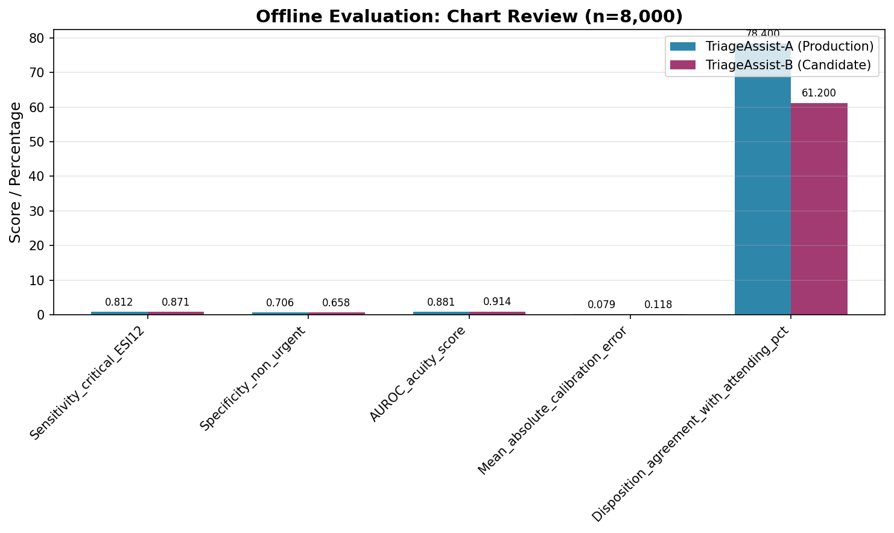
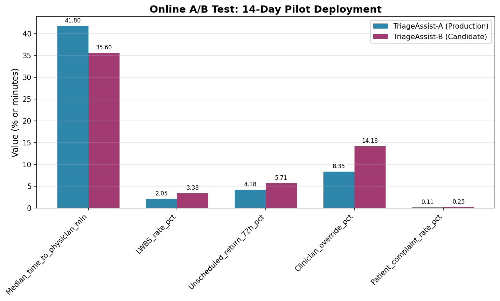
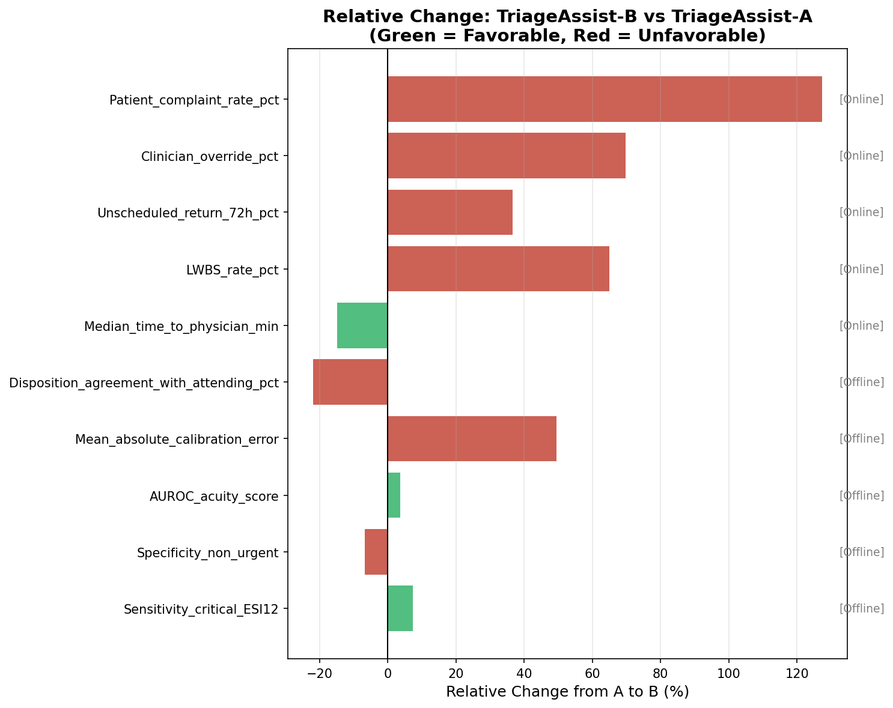
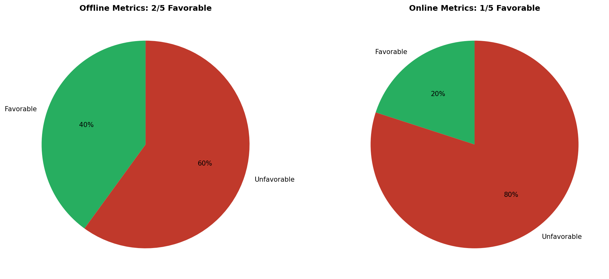

# ED Triage Model Evaluation: TriageAssist-B Pilot Analysis

## Executive Summary

This report presents the evaluation of **TriageAssist-B**, a candidate emergency department (ED) triage decision-support model, compared against the production system **TriageAssist-A**. The evaluation comprises two components: (1) offline chart-review analysis on a held-out test set of 8,000 patients, and (2) a 14-day randomized online A/B pilot deployment.

**Key Finding:** While TriageAssist-B demonstrates improved sensitivity for critical cases and faster time-to-physician metrics, it exhibits significant degradation in multiple clinically important outcomes including increased left-without-being-seen (LWBS) rates, higher 72-hour return visits, elevated clinician override rates, and increased patient complaints. **We recommend against expanding TriageAssist-B to production at this time.**

---

## 1. Introduction

Emergency department triage systems play a critical role in patient safety and operational efficiency. The introduction of AI-assisted triage models requires rigorous evaluation across both retrospective (offline) and prospective (online) settings before deployment at scale.

This evaluation compares TriageAssist-B against the incumbent TriageAssist-A system across multiple dimensions:
- **Diagnostic accuracy** (sensitivity, specificity, AUROC)
- **Calibration** (agreement between predicted and observed acuity)
- **Clinical workflow** (time to physician, LWBS rates)
- **Patient safety** (72-hour unscheduled returns)
- **Clinician trust** (override rates)
- **Patient experience** (complaint rates)

---

## 2. Methods

### 2.1 Offline Evaluation

The offline evaluation utilized a held-out test set of **n = 8,000** patient encounters with chart-review labels. Metrics assessed include:

| Metric | Description | Direction of Improvement |
|--------|-------------|-------------------------|
| Sensitivity_critical_ESI12 | Detection rate for ESI 1-2 critical cases | Higher is better |
| Specificity_non_urgent | Correct identification of non-urgent cases | Higher is better |
| AUROC_acuity_score | Discrimination ability for acuity prediction | Higher is better |
| Mean_absolute_calibration_error | Calibration accuracy | Lower is better |
| Disposition_agreement_with_attending_pct | Agreement with attending physician disposition | Higher is better |

### 2.2 Online A/B Pilot

A **14-day randomized-by-shift** deployment was conducted across the same hospital sites. Metrics include:

| Metric | Description | Direction of Improvement |
|--------|-------------|-------------------------|
| Median_time_to_physician_min | Time from arrival to physician contact | Lower is better |
| LWBS_rate_pct | Percentage of patients leaving without being seen | Lower is better |
| Unscheduled_return_72h_pct | 72-hour unscheduled return visit rate | Lower is better |
| Clinician_override_pct | Rate of clinician overriding model recommendation | Lower is better |
| Patient_complaint_rate_pct | Rate of patient complaints | Lower is better |

---

## 3. Results

### 3.1 Offline Evaluation Results

The offline chart-review analysis reveals a mixed performance profile for TriageAssist-B:

**Table 1: Offline Evaluation Metrics**

| Metric | TriageAssist-A | TriageAssist-B | Relative Change |
|--------|---------------|---------------|-----------------|
| Sensitivity_critical_ESI12 | 0.812 | 0.871 | **+7.3%** ✓ |
| Specificity_non_urgent | 0.706 | 0.658 | -6.8% ✗ |
| AUROC_acuity_score | 0.881 | 0.914 | **+3.7%** ✓ |
| Mean_absolute_calibration_error | 0.079 | 0.118 | +49.4% ✗ |
| Disposition_agreement_with_attending_pct | 78.4% | 61.2% | **-21.9%** ✗ |

**Key Observations:**
- TriageAssist-B shows improved sensitivity for critical cases (+7.3%), which is clinically desirable for patient safety.
- AUROC improved by 3.7%, indicating better overall discrimination.
- However, calibration error increased by 49.4%, suggesting the model's confidence scores are less reliable.
- Most concerning is the 21.9% reduction in disposition agreement with attending physicians, indicating potential misalignment with clinical judgment.

### 3.2 Online A/B Pilot Results

The 14-day online pilot reveals more concerning patterns:

**Table 2: Online A/B Test Metrics**

| Metric | TriageAssist-A | TriageAssist-B | Relative Change |
|--------|---------------|---------------|-----------------|
| Median_time_to_physician_min | 41.8 min | 35.6 min | **-14.8%** ✓ |
| LWBS_rate_pct | 2.05% | 3.38% | +64.9% ✗ |
| Unscheduled_return_72h_pct | 4.18% | 5.71% | +36.6% ✗ |
| Clinician_override_pct | 8.35% | 14.18% | +69.8% ✗ |
| Patient_complaint_rate_pct | 0.11% | 0.25% | +127.3% ✗ |

**Key Observations:**
- **Time to physician improved** by 14.8% (6.2 minutes faster), which is operationally beneficial.
- **LWBS rate increased by 64.9%** (from 2.05% to 3.38%), representing a significant patient safety and satisfaction concern.
- **72-hour returns increased by 36.6%**, suggesting potential under-triage or missed diagnoses.
- **Clinician override rate nearly doubled** (+69.8%), indicating reduced clinician trust in the model.
- **Patient complaints more than doubled** (+127.3%), reflecting degraded patient experience.

### 3.3 Overall Performance Summary

**Summary Statistics:**
- **Offline:** 2/5 metrics (40%) favor TriageAssist-B
- **Online:** 1/5 metrics (20%) favor TriageAssist-B

The forest plot above visualizes the relative change for all metrics, with green bars indicating favorable changes and red bars indicating unfavorable changes. The pattern clearly shows that TriageAssist-B's improvements are limited to discrimination metrics and speed, while patient safety, clinician trust, and patient experience metrics all deteriorated.

---

## 4. Discussion

### 4.1 Interpretation of Findings

The evaluation reveals a critical **offline-online performance gap**. While TriageAssist-B demonstrates improved discrimination (AUROC) and sensitivity for critical cases in offline evaluation, these gains do not translate to improved real-world outcomes.

**Potential Explanations:**

1. **Calibration Degradation:** The 49.4% increase in calibration error suggests TriageAssist-B produces overconfident predictions. This may lead to inappropriate triage assignments that clinicians recognize and override.

2. **Speed-Safety Trade-off:** The faster time-to-physician (beneficial) coincides with increased LWBS rates and 72-hour returns (harmful). This suggests the model may be prioritizing throughput over thoroughness, potentially rushing patients through the system.

3. **Clinician Distrust:** The 69.8% increase in override rates indicates clinicians are actively rejecting model recommendations. High override rates undermine the value proposition of decision support and may introduce workflow friction.

4. **Patient Experience Impact:** The doubling of complaint rates suggests patients perceive the triage process as less satisfactory under TriageAssist-B, possibly due to perceived dismissiveness or inadequate attention to their concerns.

### 4.2 Clinical Implications

**Patient Safety Concerns:**
- Increased 72-hour return rates may indicate missed diagnoses or inadequate initial assessment.
- Higher LWBS rates suggest patients are abandoning care, potentially with unresolved conditions.

**Operational Concerns:**
- While faster time-to-physician is operationally desirable, the concurrent increase in LWBS suggests this may reflect gaming of the metric rather than genuine efficiency gains.
- High override rates reduce the efficiency benefits of automation.

**Trust and Adoption:**
- Clinician override behavior suggests the model has not earned user trust.
- Patient complaints indicate the system may be damaging the hospital's reputation.

### 4.3 Limitations

1. **Pilot Duration:** The 14-day pilot may not capture seasonal variations or longer-term adaptation effects.
2. **Sample Size:** Online metrics are based on a limited pilot period; confidence intervals were not provided.
3. **Site Generalizability:** Results are from the same hospital sites; performance may vary in different ED environments.

---

## 5. Recommendations

### 5.1 Primary Recommendation

**Do not expand TriageAssist-B to production at this time.**

The evidence indicates that while TriageAssist-B shows promise in discrimination metrics, it produces unacceptable degradation in patient safety, clinician trust, and patient experience outcomes. The offline-online performance gap suggests the model is not ready for broader deployment.

### 5.2 Suggested Next Steps

1. **Root Cause Analysis:** Investigate why TriageAssist-B produces higher LWBS rates and 72-hour returns. Examine specific cases where the model diverged from TriageAssist-A.

2. **Calibration Improvement:** Address the 49.4% increase in calibration error through model recalibration or threshold adjustment.

3. **Clinician Engagement:** Conduct focus groups with clinicians to understand override reasons and incorporate feedback into model refinement.

4. **Extended Pilot:** If model improvements are made, conduct a longer pilot (4-8 weeks) with statistical power analysis to detect meaningful differences in safety outcomes.

5. **Consider Hybrid Approach:** Evaluate whether TriageAssist-B could be used as a secondary check rather than primary triage, leveraging its improved sensitivity while maintaining clinician oversight.

### 5.3 Success Criteria for Future Evaluation

Before reconsidering deployment, TriageAssist-B should demonstrate:
- Non-inferior LWBS rates (within 10% of TriageAssist-A)
- Non-inferior 72-hour return rates
- Clinician override rates <15%
- Patient complaint rates not significantly elevated
- Maintained or improved sensitivity for critical cases

---

## 6. Conclusion

TriageAssist-B presents a cautionary example of the importance of comprehensive evaluation for clinical AI systems. Improved discrimination metrics in offline evaluation did not translate to improved real-world outcomes. The significant degradation in patient safety indicators (LWBS, 72-hour returns), clinician trust (overrides), and patient experience (complaints) outweigh the benefits of faster time-to-physician and improved critical case sensitivity.

**Decision: Do not proceed with expansion. Return to development for model refinement and recalibration.**

---

## Appendix: Data Sources

- **Offline Evaluation:** `data/offline_evaluation_metrics.csv` (n=8,000 chart reviews)
- **Online A/B Test:** `data/online_ab_test_metrics.csv` (14-day randomized pilot)
- **Analysis Code:** `code/analysis.py`
- **Figures:** `report/images/`

---

*Report prepared for ED Informatics Leadership*
*Date: $(date)*
