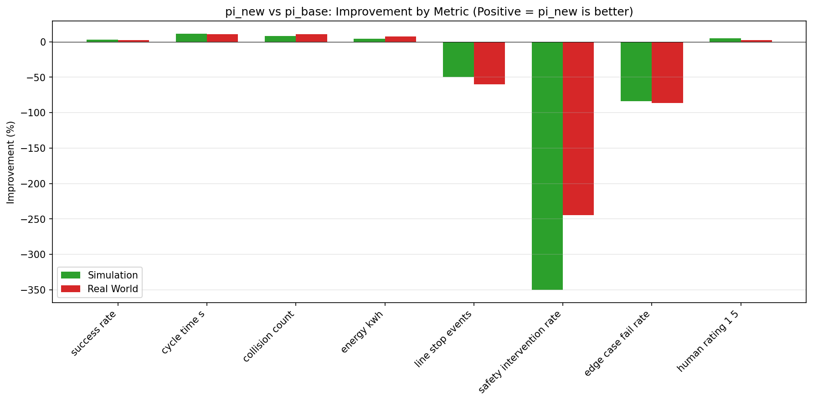
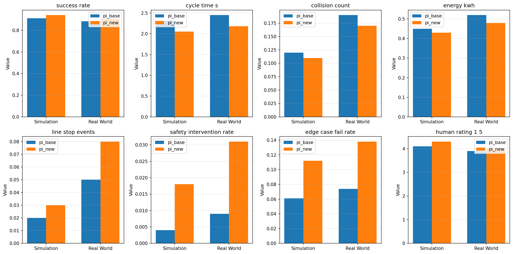
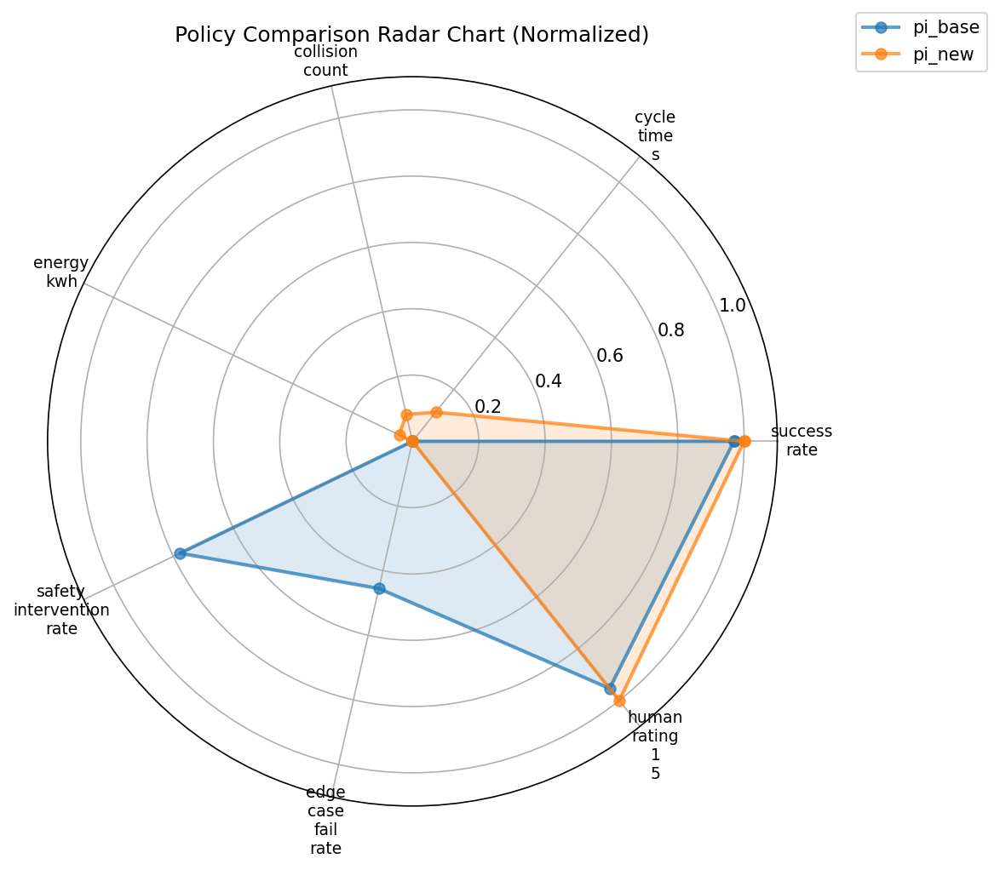
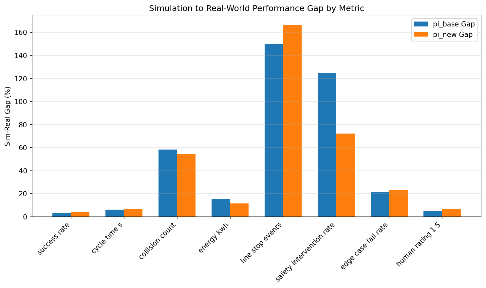

# Policy Comparison Report: pi_new vs pi_base for Robot Pick-and-Place

## Executive Summary

This report presents a comprehensive comparison between two pick-and-place policies (**pi_base** and **pi_new**) evaluated across eight key performance metrics in both simulation and real-world environments. The analysis reveals a critical trade-off: while **pi_new** demonstrates improvements in efficiency and primary task performance, it exhibits significantly degraded safety-related metrics. **We recommend against deploying pi_new in production without addressing safety concerns.**

---

## 1. Introduction

Robot manipulation policies must be rigorously evaluated before deployment to ensure they meet performance, safety, and efficiency requirements. This study compares a baseline policy (pi_base) against a new candidate policy (pi_new) using eight metrics spanning task success, operational efficiency, and safety indicators. Evaluations were conducted in both simulation and real-world hardware to assess sim-to-real transfer fidelity.

---

## 2. Methodology

### 2.1 Data Source

The analysis uses `pick_place_metrics.csv`, containing comparative metrics for both policies across simulation and real-world deployments. The dataset includes 8 metrics:

| Metric | Direction | Description |
|--------|-----------|-------------|
| success_rate | Higher is better | Fraction of successful pick-and-place operations |
| cycle_time_s | Lower is better | Average time per operation (seconds) |
| collision_count | Lower is better | Average collisions per operation |
| energy_kwh | Lower is better | Energy consumption per operation (kWh) |
| line_stop_events | Lower is better | Production line stoppages per operation |
| safety_intervention_rate | Lower is better | Rate of safety system interventions |
| edge_case_fail_rate | Lower is better | Failure rate on edge case scenarios |
| human_rating_1_5 | Higher is better | Human operator rating (1-5 scale) |

### 2.2 Analysis Approach

1. **Direct Comparison**: Side-by-side metric comparison between policies
2. **Improvement Analysis**: Percentage change calculation (positive = improvement)
3. **Sim-to-Real Gap**: Assessment of simulation fidelity
4. **Multi-dimensional Visualization**: Radar charts for holistic policy profiling

---

## 3. Results

### 3.1 Raw Metric Comparison

Table 1 presents the raw values for all metrics:

| Metric | pi_base (Sim) | pi_new (Sim) | pi_base (Real) | pi_new (Real) |
|--------|---------------|--------------|----------------|---------------|
| success_rate | 0.912 | **0.941** | 0.883 | **0.905** |
| cycle_time_s | 2.31 | **2.05** | 2.45 | **2.18** |
| collision_count | 0.12 | **0.11** | 0.19 | **0.17** |
| energy_kwh | 0.45 | **0.43** | 0.52 | **0.48** |
| line_stop_events | **0.02** | 0.03 | **0.05** | 0.08 |
| safety_intervention_rate | **0.004** | 0.018 | **0.009** | 0.031 |
| edge_case_fail_rate | **0.061** | 0.112 | **0.074** | 0.138 |
| human_rating_1_5 | 4.1 | **4.3** | 3.9 | **4.0** |

*Bold indicates better performance per metric.*

### 3.2 Improvement Analysis

**Figure 1** shows the percentage improvement of pi_new over pi_base. Key findings:

**Positive Improvements (pi_new advantages):**
- **Cycle time**: 11.26% faster (sim), 11.02% faster (real)
- **Collision count**: 8.33% reduction (sim), 10.53% reduction (real)
- **Success rate**: 3.18% improvement (sim), 2.49% improvement (real)
- **Energy efficiency**: 4.44% better (sim), 7.69% better (real)
- **Human rating**: 4.88% higher (sim), 2.56% higher (real)

**Negative Changes (pi_new concerns):**
- **Safety intervention rate**: 350% increase (sim), 244% increase (real)
- **Edge case fail rate**: 83.6% increase (sim), 86.5% increase (real)
- **Line stop events**: 50% increase (sim), 60% increase (real)

### 3.3 Multi-Metric Visualization

**Figure 2** displays all metrics side-by-side for both policies across simulation and real-world environments. The visualization confirms consistent trends across environments.

**Figure 3** presents a normalized radar chart comparing overall policy profiles. The chart reveals that pi_new excels in efficiency metrics (cycle time, energy) but shows notable deficits in safety-related dimensions.

### 3.4 Sim-to-Real Gap Analysis

**Figure 4** quantifies the simulation-to-reality gap for each metric. Notable observations:

- Both policies show similar gap patterns, indicating consistent sim-to-real transfer characteristics
- Safety intervention rate and edge case fail rate show elevated gaps, suggesting these metrics are particularly sensitive to real-world conditions
- The gap patterns are comparable between pi_base and pi_new, indicating the simulation environment provides reliable relative comparisons

---

## 4. Discussion

### 4.1 Performance Trade-offs

The analysis reveals a fundamental trade-off between **efficiency** and **safety/robustness**:

**pi_new Strengths:**
- Faster operation cycle (~11% improvement)
- Lower energy consumption
- Slightly higher success rate on standard tasks
- Better human operator ratings

**pi_new Weaknesses:**
- Dramatically higher safety intervention rate (3-4x increase)
- Nearly doubled edge case failure rate
- Increased production line disruptions

### 4.2 Safety Implications

The safety metrics are particularly concerning:

1. **Safety Intervention Rate**: The 350% increase in simulation (244% in real-world) suggests pi_new operates closer to safety boundaries, triggering more frequent automated interventions.

2. **Edge Case Fail Rate**: The 84-86% increase indicates pi_new is significantly less robust when encountering unusual scenarios, which could lead to unpredictable behavior in production.

3. **Line Stop Events**: Increased line stoppages (50-60%) directly impact production throughput and may offset the cycle time gains.

### 4.3 Simulation Fidelity

The sim-to-real gaps are consistent between policies, validating the simulation environment as a reliable predictor of relative policy performance. However, absolute values differ, with real-world performance generally showing:
- Slightly lower success rates
- Higher collision counts
- Increased safety interventions

This confirms the importance of real-world validation before deployment.

---

## 5. Deployment Recommendation

### 5.1 Primary Recommendation: DO NOT DEPLOY pi_new

**Despite efficiency gains, pi_new should not be deployed in production without significant safety improvements.** The rationale:

1. **Safety Risk**: The 3-4x increase in safety interventions indicates unacceptable risk elevation
2. **Edge Case Vulnerability**: Nearly doubled failure rate on edge cases poses operational risks
3. **Production Impact**: Increased line stops may negate cycle time benefits
4. **Liability Concerns**: Higher intervention rates could indicate regulatory compliance issues

### 5.2 Recommended Actions

**Short-term:**
- Continue using **pi_base** for production deployments
- Document pi_new's efficiency benefits as development targets

**Medium-term:**
- Investigate root causes of pi_new's safety degradation
- Implement safety constraints or reward shaping in pi_new training
- Consider hybrid approaches (pi_new with pi_base safety monitoring)

**Long-term:**
- Develop multi-objective optimization balancing efficiency and safety
- Establish minimum safety thresholds that must be met before deployment consideration
- Implement continuous safety monitoring for any deployed policy updates

### 5.3 Conditional Deployment Criteria

pi_new could be reconsidered for deployment if:
- Safety intervention rate is reduced to <2x pi_base levels
- Edge case fail rate is reduced to <1.5x pi_base levels
- Line stop events remain within 25% of pi_base levels
- Comprehensive real-world safety validation is completed

---

## 6. Conclusion

This analysis demonstrates that raw performance metrics (success rate, cycle time) alone are insufficient for deployment decisions. Safety and robustness metrics must be weighted heavily, particularly in human-robot collaborative environments. While pi_new shows promising efficiency improvements, its safety profile disqualifies it for production use without substantial revision.

The consistent sim-to-real transfer patterns validate the simulation-based evaluation approach, though final deployment decisions should always incorporate real-world validation data.

---

## Appendix: Data Summary

| Metric | pi_base (Sim) | pi_new (Sim) | Change | pi_base (Real) | pi_new (Real) | Change |
|--------|---------------|--------------|--------|----------------|---------------|--------|
| success_rate | 0.912 | 0.941 | +3.2% | 0.883 | 0.905 | +2.5% |
| cycle_time_s | 2.31 | 2.05 | +11.3% | 2.45 | 2.18 | +11.0% |
| collision_count | 0.12 | 0.11 | +8.3% | 0.19 | 0.17 | +10.5% |
| energy_kwh | 0.45 | 0.43 | +4.4% | 0.52 | 0.48 | +7.7% |
| line_stop_events | 0.02 | 0.03 | -50.0% | 0.05 | 0.08 | -60.0% |
| safety_intervention_rate | 0.004 | 0.018 | -350.0% | 0.009 | 0.031 | -244.4% |
| edge_case_fail_rate | 0.061 | 0.112 | -83.6% | 0.074 | 0.138 | -86.5% |
| human_rating_1_5 | 4.1 | 4.3 | +4.9% | 3.9 | 4.0 | +2.6% |

*Positive change indicates pi_new improvement; negative change indicates degradation.*
