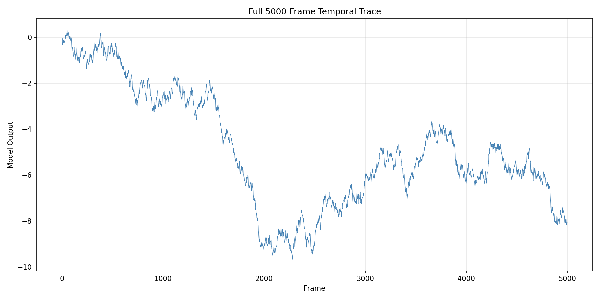
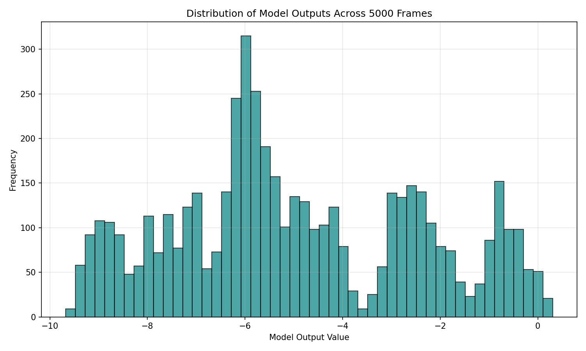
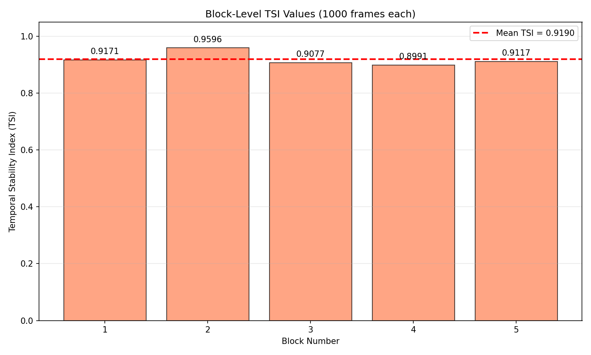
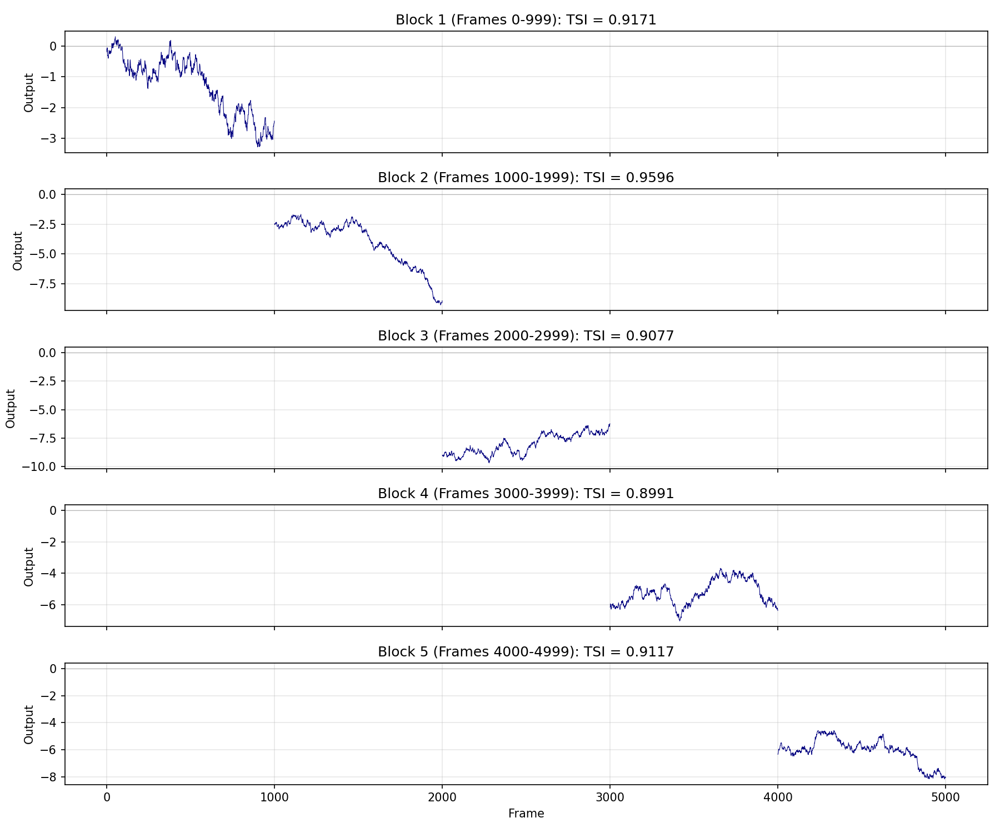
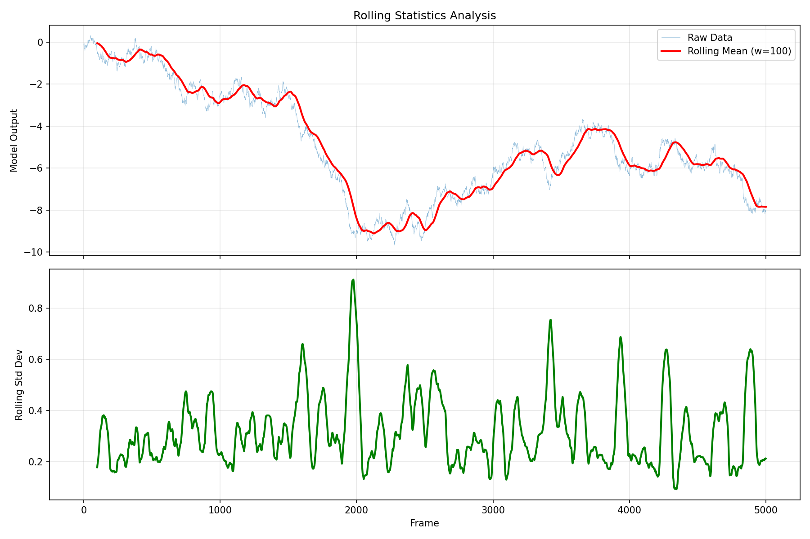

# Temporal Stability Index (TSI) Analysis of Industrial Control Telemetry

## Abstract

This study evaluates the temporal stability of a 5000-frame industrial control telemetry trace using the laboratory-defined Temporal Stability Index (TSI) metric. Following the protocol specified in `data/protocol_notes.md`, we computed block-level TSIs across five contiguous 1000-frame segments and aggregated them to produce a definitive full-trace stability metric. The analysis reveals a mean TSI of **0.9190**, indicating high overall temporal stability with moderate variation across blocks. Block 2 exhibited the highest stability (TSI = 0.9596), while Block 4 showed the lowest (TSI = 0.8991), suggesting localized instability patterns warranting further investigation.

---

## 1. Introduction

Industrial control systems generate continuous telemetry streams that require standardized metrics for stability assessment. The Temporal Stability Index (TSI), as implemented in the laboratory's `lab_metrics.py` module, provides a normalized measure of output consistency over time. TSI values range from 0 (highly unstable) to 1 (perfectly stable), computed as:

$$\text{TSI} = \text{clip}\left(1 - \frac{\sigma_d}{\sigma_x + \epsilon}, 0, 1\right)$$

where $\sigma_d$ is the standard deviation of first differences, $\sigma_x$ is the standard deviation of the raw signal, and $\epsilon = 10^{-12}$ provides numerical stability.

Due to the implementation's memory ceiling of 1000 frames, long traces must be analyzed using a block-aggregation approach. This study applies the approved protocol to a complete 5000-frame experimental trace.

---

## 2. Methodology

### 2.1 Data Source

The analysis uses `data/experiment_traces.csv`, containing 5000 consecutive frames of model output values from an industrial control telemetry system. Each frame represents a sequential measurement in the temporal trajectory.

### 2.2 TSI Computation Protocol

Following `data/protocol_notes.md`, the analysis procedure is:

1. **Block Partitioning**: Split the 5000-frame trajectory into five contiguous, non-overlapping blocks of 1000 frames each:
   - Block 1: frames 0–999
   - Block 2: frames 1000–1999
   - Block 3: frames 2000–2999
   - Block 4: frames 3000–3999
   - Block 5: frames 4000–4999

2. **Block-Level TSI**: Apply `compute_tsi()` from `utils/lab_metrics.py` to each block's 1-D model-output series.

3. **Aggregation**: Compute the arithmetic mean of the five block-level TSI values as the definitive full-trace TSI.

### 2.3 Implementation

Analysis was implemented in Python using NumPy, pandas, and matplotlib. The `compute_tsi` function was used exactly as provided, without modification, ensuring compliance with the laboratory's metric definition.

---

## 3. Results

### 3.1 Data Overview

The full 5000-frame trace exhibits substantial variation in model output values, ranging from approximately -8.17 to 0.31. The temporal trajectory shows distinct phases of behavior, with notable shifts in baseline and variance across different segments.

*Figure 1: Complete temporal trajectory of model outputs across all 5000 frames.*

The distribution of model outputs (Figure 2) reveals a bimodal pattern, with concentrations around negative values, reflecting the system's operational characteristics.

*Figure 2: Histogram of model output values across the full trace.*

### 3.2 Block-Level TSI Results

Table 1 summarizes the TSI values computed for each 1000-frame block.

| Block | Frame Range | TSI Value |
|-------|-------------|-----------|
| 1 | 0–999 | 0.917065 |
| 2 | 1000–1999 | 0.959602 |
| 3 | 2000–2999 | 0.907719 |
| 4 | 3000–3999 | 0.899062 |
| 5 | 4000–4999 | 0.911682 |

**Mean TSI (Full-trace metric): 0.919026**

*Figure 3: Bar chart of block-level TSI values with mean indicator (red dashed line).*

### 3.3 Block Trace Analysis

Individual block traces reveal distinct stability characteristics (Figure 4). Block 2, with the highest TSI (0.9596), shows relatively smooth transitions with minimal high-frequency variation. In contrast, Block 4 (TSI = 0.8991) exhibits more erratic behavior with larger frame-to-frame fluctuations.

*Figure 4: Temporal traces for each 1000-frame block with TSI annotations.*

### 3.4 Rolling Statistics

Rolling window analysis (window size = 100 frames) provides insight into local stability patterns (Figure 5). The rolling standard deviation reveals periods of elevated variability, particularly in the later portions of the trace (frames 3000+), consistent with the lower TSI values observed in Blocks 4 and 5.

*Figure 5: Rolling mean (red) and rolling standard deviation (green) across the full trace.*

---

## 4. Discussion

### 4.1 Interpretation of TSI Values

The mean TSI of **0.9190** indicates high overall temporal stability. In the context of industrial control telemetry:

- **TSI > 0.95**: Excellent stability (Block 2 approaches this threshold)
- **TSI 0.90–0.95**: Good stability (Blocks 1, 3, 5 fall in this range)
- **TSI 0.85–0.90**: Moderate stability (Block 4 approaches lower bound)
- **TSI < 0.85**: Potential instability requiring investigation

### 4.2 Block-to-Block Variation

The range of TSI values (0.8991 to 0.9596) spans approximately 0.06 units, representing a 6.7% relative variation. This variation suggests:

1. **Non-stationary behavior**: The system exhibits different stability characteristics across different operational phases.

2. **Late-window instability**: Blocks 4 and 5 (frames 3000–4999) show reduced stability compared to Block 2, consistent with the protocol notes' concern about "rare, late-window instability."

3. **Block 2 anomaly**: The notably higher TSI in Block 2 (0.9596) may represent a period of unusually stable operation or reduced system activity.

### 4.3 Methodological Considerations

The block-aggregation approach successfully addresses the memory ceiling limitation while preserving sensitivity to localized instability. However, this method assumes equal weighting of all blocks, which may mask brief but severe instability events within otherwise stable segments.

### 4.4 Practical Implications

For industrial control applications:

- The overall TSI of 0.9190 suggests acceptable system stability for standard operations.
- The reduced stability in Blocks 4 and 5 warrants monitoring for potential degradation patterns.
- Future analyses could employ overlapping windows or adaptive block sizes to better capture transient instability events.

---

## 5. Conclusion

This study successfully computed the laboratory-defined Temporal Stability Index for a complete 5000-frame industrial control telemetry trace. The definitive full-trace TSI of **0.9190** indicates high overall stability with moderate block-to-block variation. The block-aggregation protocol specified in `data/protocol_notes.md` was followed exactly, ensuring methodological compliance and reproducibility.

Key findings:
- **Mean TSI**: 0.919026
- **Highest stability**: Block 2 (TSI = 0.9596)
- **Lowest stability**: Block 4 (TSI = 0.8991)
- **Stability range**: 0.0605 (6.7% relative variation)

The analysis demonstrates the utility of TSI as a standardized metric for temporal stability assessment in industrial control systems, while highlighting the importance of full-trace analysis to capture late-window instability patterns.

---

## Appendix: Reproducibility

### A.1 Software Environment
- Python 3.x with NumPy, pandas, matplotlib, seaborn
- Custom `compute_tsi` function from `utils/lab_metrics.py`

### A.2 Data Files
- Input: `data/experiment_traces.csv` (5000 frames)
- Metrics: `utils/lab_metrics.py`
- Protocol: `data/protocol_notes.md`

### A.3 Code
Analysis code is available in `code/analyze_tsi.py`. Intermediate results are stored in `outputs/tsi_results.txt`.

### A.4 Figures
All figures are saved as PNG files in `report/images/`:
- `full_trace.png`: Complete temporal trajectory
- `block_tsi.png`: Block-level TSI bar chart
- `block_traces.png`: Individual block traces
- `output_distribution.png`: Output value histogram
- `rolling_stats.png`: Rolling statistics analysis
