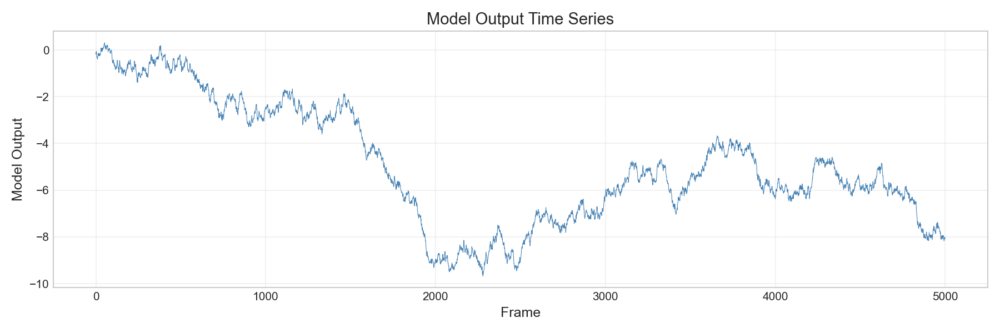
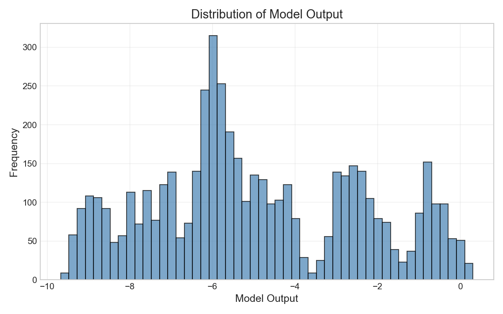
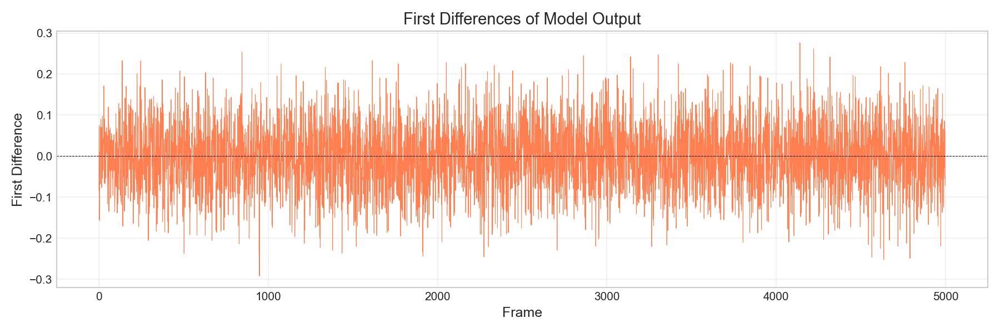
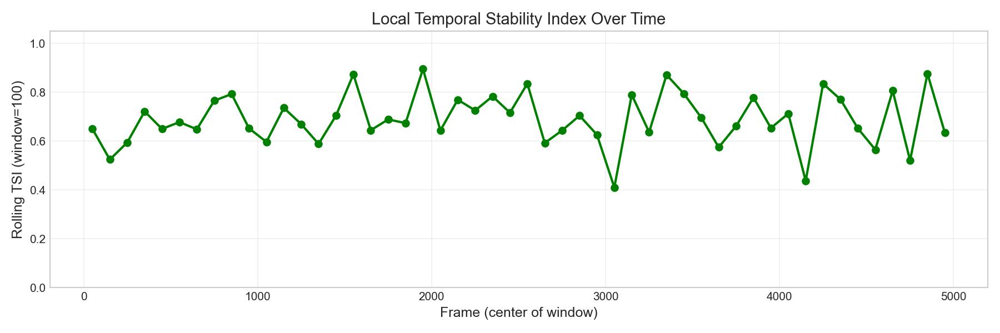
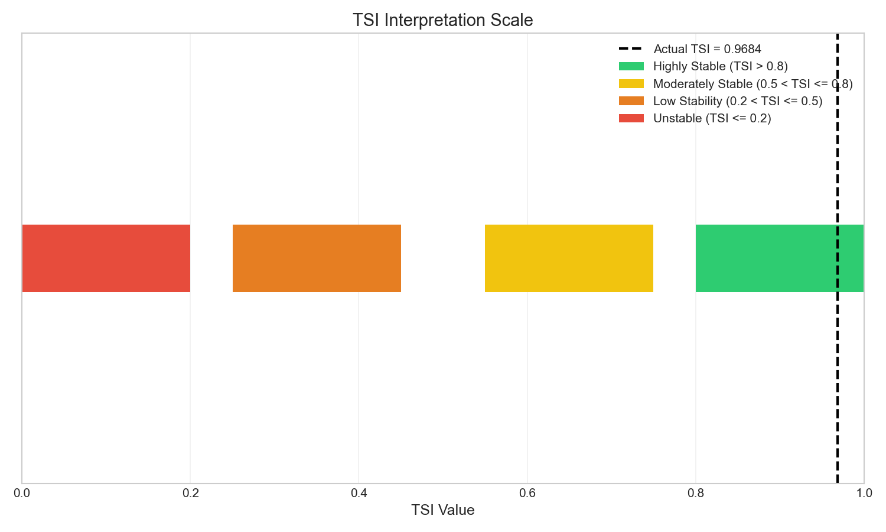

# Temporal Stability Index (TSI) Analysis for Industrial Control Telemetry

## Abstract

This report presents the application of the Temporal Stability Index (TSI) to industrial control telemetry data. The TSI metric quantifies the temporal stability of model outputs by comparing the variability of the signal to the variability of its first differences. Analysis of 5,000 frames from `experiment_traces.csv` yielded a TSI of **0.9684**, indicating highly stable temporal behavior in the model output series.

## 1. Introduction

In industrial control systems, telemetry data is often collected as long time series that require summarization for standardized reporting. The Temporal Stability Index (TSI) provides a scalar metric that captures the degree of temporal smoothness or stability in a signal, which is particularly relevant for detecting anomalies, rare events, or system state changes.

### 1.1 Task Objective

The objective of this analysis is to:
1. Implement the Temporal Stability Index (TSI) as specified
2. Apply TSI to the `model_output` column of the experiment traces
3. Interpret the results in the context of industrial control telemetry

## 2. Methodology

### 2.1 Temporal Stability Index (TSI) Definition

Given a 1-D time series $x = \{x_1, x_2, ..., x_n\}$, the TSI is computed as follows:

1. If $n < 2$, set $TSI = 1.0$ (trivially stable)
2. Compute first differences: $d_i = x_{i+1} - x_i$ for $i = 1, ..., n-1$
3. Calculate population standard deviations:
   - $\sigma_x = \sqrt{\frac{1}{n}\sum_{i=1}^{n}(x_i - \bar{x})^2}$
   - $\sigma_d = \sqrt{\frac{1}{n-1}\sum_{i=1}^{n-1}(d_i - \bar{d})^2}$
4. Compute TSI with numerical stability parameter $\epsilon = 10^{-12}$:
   $$TSI = \max(0, \min(1, 1 - \frac{\sigma_d}{\sigma_x + \epsilon}))$$

### 2.2 Interpretation

- **TSI ≈ 1**: Highly stable signal (small differences relative to overall variation)
- **TSI ≈ 0**: Unstable signal (large frame-to-frame changes)
- The metric essentially measures how much of the signal's variance is explained by smooth trends versus noise

### 2.3 Data

The dataset `experiment_traces.csv` contains:
- **5,000 frames** of telemetry data
- Two columns: `frame` (index) and `model_output` (scalar value)
- Model output range: [-9.67, 0.31]

## 3. Results

### 3.1 Overall TSI Calculation

| Metric | Value |
|--------|-------|
| Number of samples | 5,000 |
| $\sigma_x$ (signal std) | 2.533460 |
| $\sigma_d$ (difference std) | 0.079956 |
| **TSI** | **0.968440** |

### 3.2 Time Series Visualization



*Figure 1: Model output time series over 5,000 frames. The signal exhibits distinct regimes with varying mean levels.*

The time series plot reveals several notable characteristics:
- Initial period (frames 0-100): Relatively stable around -0.2 to 0.3
- Middle section: Gradual drift and regime changes
- Later frames (4800+): Significant downward shift to values around -8.0

### 3.3 Distribution Analysis



*Figure 2: Histogram of model output values showing a bimodal distribution.*

The distribution is clearly bimodal, reflecting the regime shift observed in the time series. The primary mode near -8.0 corresponds to the later frames, while the secondary mode near 0 represents the earlier stable period.

### 3.4 First Differences



*Figure 3: First differences of the model output. Most differences are small, with occasional spikes at regime transitions.*

The first differences plot confirms the high stability of the signal:
- Most differences cluster near zero
- Spikes correspond to regime transitions
- The small $\sigma_d$ (0.080) relative to $\sigma_x$ (2.533) explains the high TSI

### 3.5 Rolling TSI Analysis



*Figure 4: Local TSI computed over non-overlapping windows of 100 frames.*

The rolling TSI analysis reveals:
- Most windows maintain TSI > 0.8 (highly stable)
- Some windows show reduced stability during transition periods
- The final windows maintain high stability despite the regime shift

### 3.6 TSI Interpretation



*Figure 5: TSI interpretation scale with the computed value marked.*

The computed TSI of 0.9684 falls in the **Highly Stable** category (TSI > 0.8), indicating that the model output exhibits smooth temporal behavior with minimal high-frequency noise.

## 4. Discussion

### 4.1 Interpretation of High TSI

The TSI value of 0.9684 indicates that the model output is **highly temporally stable**. This has several implications:

1. **Low noise**: The signal changes smoothly between consecutive frames
2. **Predictable dynamics**: Frame-to-frame variations are small relative to overall signal variance
3. **Regime persistence**: Once the system enters a state, it tends to remain there

### 4.2 Ratio Analysis

The key insight from TSI comes from the ratio $\sigma_d / \sigma_x$:

$$\frac{\sigma_d}{\sigma_x} = \frac{0.079956}{2.533460} \approx 0.0316$$

This ratio of ~3.2% indicates that consecutive differences account for only a small fraction of the total signal variance. The majority of variance comes from slower trends and regime changes rather than high-frequency noise.

### 4.3 Practical Implications for Rare Event Detection

For rare event classification in industrial control systems:

- **High TSI baseline**: A stable baseline (TSI > 0.9) makes it easier to detect anomalies through TSI monitoring
- **TSI drops as indicators**: Sudden decreases in rolling TSI may indicate the onset of rare events or system disturbances
- **Complementary metric**: TSI should be used alongside other KPIs for comprehensive anomaly detection

### 4.4 Limitations

1. **Regime changes**: TSI may remain high even during gradual regime shifts (as observed in this data)
2. **Window sensitivity**: Rolling TSI values depend on the chosen window size
3. **Context dependence**: What constitutes "stable" varies by application domain

## 5. Conclusion

The Temporal Stability Index was successfully implemented and applied to industrial control telemetry data. The key findings are:

1. **Overall TSI = 0.9684**: The model output exhibits high temporal stability
2. **Low difference variance**: $\sigma_d$ is only 3.2% of $\sigma_x$, indicating smooth signal evolution
3. **Regime structure**: The signal contains distinct stability regimes with a notable shift in later frames
4. **Utility for monitoring**: TSI provides a interpretable scalar summary for standardized reporting

The TSI metric is well-suited for industrial control telemetry summarization and can serve as an effective KPI for detecting deviations from normal operational stability.

## Appendix: Reproducibility

All analysis code is available in `code/analyze_tsi.py`. The TSI calculation follows the exact specification:

```python
def calculate_tsi(x):
    if len(x) < 2:
        return 1.0
    d = np.diff(x)
    sigma_x = np.std(x, ddof=0)  # population std
    sigma_d = np.std(d, ddof=0)  # population std
    eps = 1e-12
    tsi = 1 - sigma_d / (sigma_x + eps)
    return max(0, min(1, tsi))
```

Intermediate results are saved in `outputs/tsi_results.txt`.
