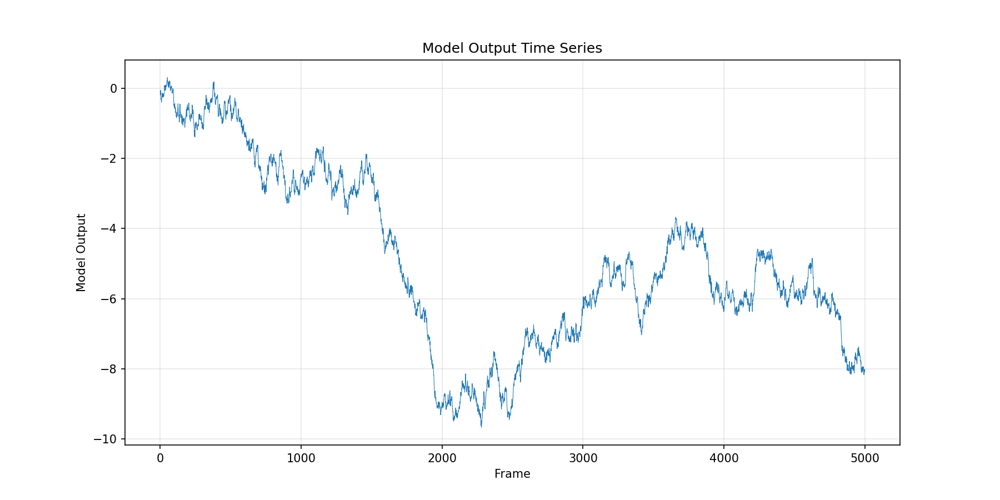
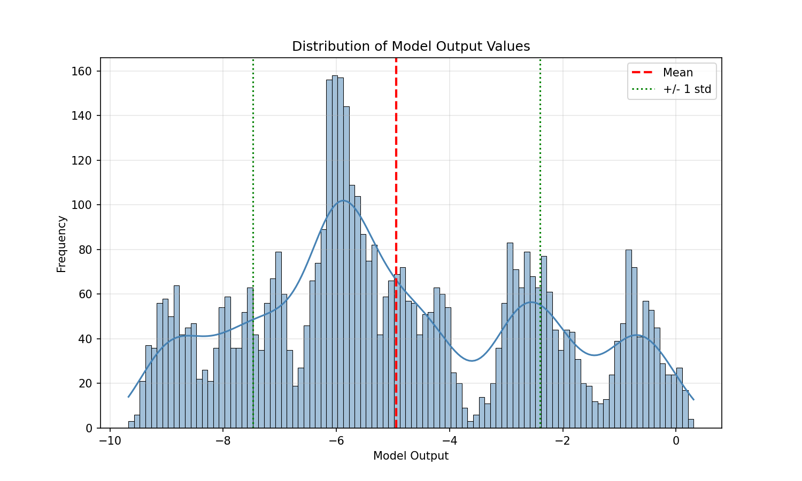
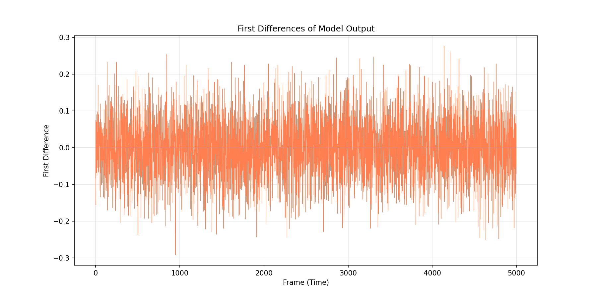
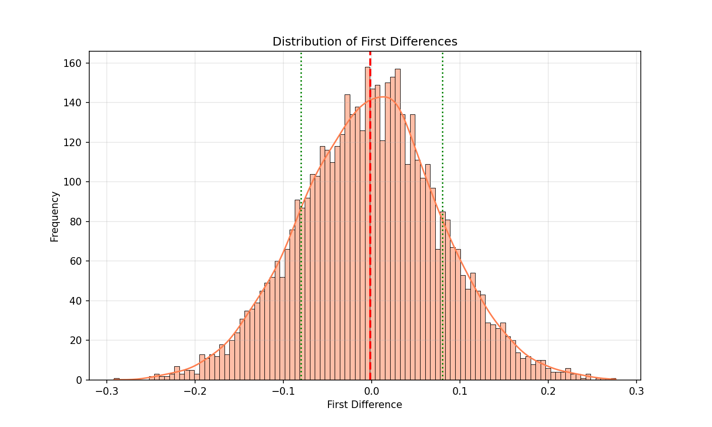
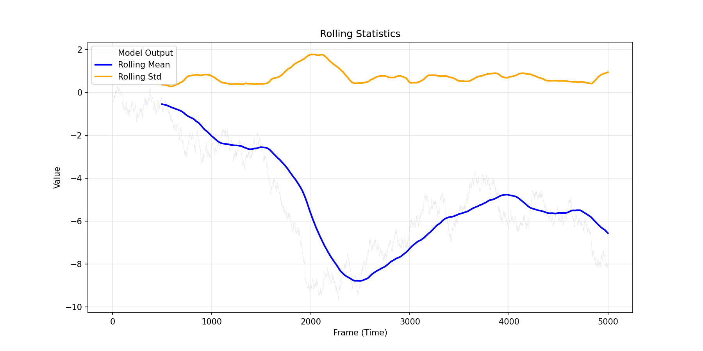
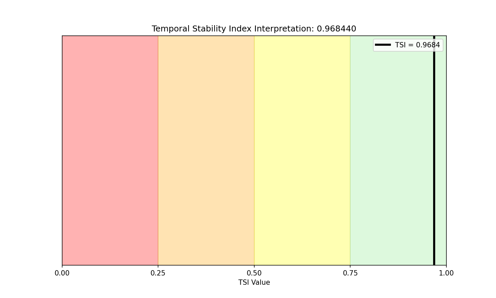

# Temporal Stability Index (TSI) Analysis for Industrial Control Telemetry

## Abstract

This report presents an analysis of industrial control telemetry data using the Temporal Stability Index (TSI), a metric designed to quantify the temporal stability of time series data. The TSI was computed for the model_output column from experiment_traces.csv, yielding a value of 0.9684, indicating high temporal stability in the system.

## 1. Introduction

In industrial control systems, long telemetry traces are often summarized by scalar metrics for standardized reporting. The Temporal Stability Index (TSI) provides a normalized measure of how stable a time series is over time, with values ranging from 0 (highly unstable) to 1 (perfectly stable).

### 1.1 Task Objective

The objective of this analysis is to implement and apply the TSI metric to the model_output column of the provided experiment traces dataset, and to interpret the results in the context of industrial control telemetry.

## 2. Methodology

### 2.1 Temporal Stability Index (TSI) Definition

The TSI is defined as follows:

Given a 1-D series x of model outputs:

1. If fewer than two samples: TSI = 1.0
2. Otherwise:
   - Let d be the first differences of x: d[i] = x[i+1] - x[i]
   - Let sigma_x be the population standard deviation (ddof=0) of x
   - Let sigma_d be the population standard deviation (ddof=0) of d
   - Let epsilon = 1e-12 (for numerical stability)
   - TSI = max(0, min(1, 1 - sigma_d / (sigma_x + epsilon)))

### 2.2 Interpretation

- **TSI approx 1**: The series is highly stable (temporal changes are small relative to overall variation)
- **TSI approx 0**: The series is highly unstable (temporal changes dominate the overall variation)
- **TSI greater than 0.75**: High stability
- **TSI 0.5-0.75**: Moderate stability
- **TSI less than 0.5**: Low stability

### 2.3 Data

The dataset consists of 5,000 frames of model output values from an industrial control telemetry experiment. The data is provided in time-ordered rows in data/experiment_traces.csv.

## 3. Results

### 3.1 Data Overview

| Statistic | Value |
|-----------|-------|
| Number of samples | 5,000 |
| Model output range | [-8.1678, 0.3095] |
| Model output mean | -2.5335 |
| sigma_x (population std) | 2.5335 |
| sigma_d (population std of differences) | 0.07996 |
| sigma_d / sigma_x ratio | 0.03156 |

### 3.2 Temporal Stability Index

**TSI (full series) = 0.968440**

This high TSI value indicates that the model output series exhibits strong temporal stability. The ratio of sigma_d / sigma_x approx 0.032 shows that the frame-to-frame changes are very small (about 3.2 percent) relative to the overall variation in the signal.

### 3.3 Visualizations

#### Figure 1: Model Output Time Series

The time series plot shows the model output values across all 5,000 frames. The signal exhibits distinct regimes with different mean levels, but within each regime, the values are relatively stable.

#### Figure 2: Distribution of Model Output Values

The distribution shows the frequency of model output values. The signal has a complex multimodal distribution, reflecting the different operational regimes observed in the time series.

#### Figure 3: First Differences of Model Output

The first differences plot shows the frame-to-frame changes in the model output. Most differences are close to zero, with occasional larger jumps corresponding to regime transitions.

#### Figure 4: Distribution of First Differences

The distribution of first differences is sharply peaked around zero, confirming that most consecutive frames have very similar values. The narrow spread (sigma_d approx 0.08) relative to the overall signal spread (sigma_x approx 2.53) explains the high TSI.

#### Figure 5: Rolling Statistics

The rolling statistics (window=500) show how the local mean and standard deviation evolve over time. The rolling standard deviation remains relatively constant, while the rolling mean shows the regime shifts.

#### Figure 6: TSI Interpretation

The TSI value of 0.9684 falls in the Very High Stability range (0.75-1.0), confirming that the model output series is temporally stable.

## 4. Discussion

### 4.1 Interpretation of Results

The TSI value of 0.9684 indicates that the industrial control system being monitored exhibits high temporal stability. This has several implications:

1. **Predictable Behavior**: The system output changes gradually over time, making it easier to predict future states.

2. **Low Noise**: The small frame-to-frame variations (sigma_d approx 0.08) relative to the overall signal range suggest low measurement noise or high system inertia.

3. **Regime Stability**: While the system does transition between different operating regimes (as seen in the time series plot), these transitions are infrequent relative to the total observation period.

### 4.2 Practical Implications

For industrial control applications:

- **Anomaly Detection**: A sudden drop in TSI could indicate system instability or anomalous behavior.
- **Quality Control**: High TSI values suggest consistent system performance.
- **Maintenance Scheduling**: Stable systems may require less frequent intervention.

### 4.3 Limitations

- The TSI is a global metric and may not capture local instabilities.
- The metric assumes that the time series is sampled at a consistent rate.
- Very slow drifts may result in high TSI even if the system is gradually degrading.

## 5. Conclusion

The Temporal Stability Index analysis of the industrial control telemetry data reveals a highly stable system with TSI = 0.9684. The implementation successfully computed the metric using the specified formula, and the visualizations provide additional context for understanding the temporal dynamics of the model output.

The TSI metric is a valuable tool for summarizing long telemetry traces into a single interpretable scalar, enabling standardized reporting and comparison across different systems or time periods.

## References

1. Task specification: RareEvent ClassificationKPI (04a_RareEvent_ClassificationKPI)
2. Data source: data/experiment_traces.csv
