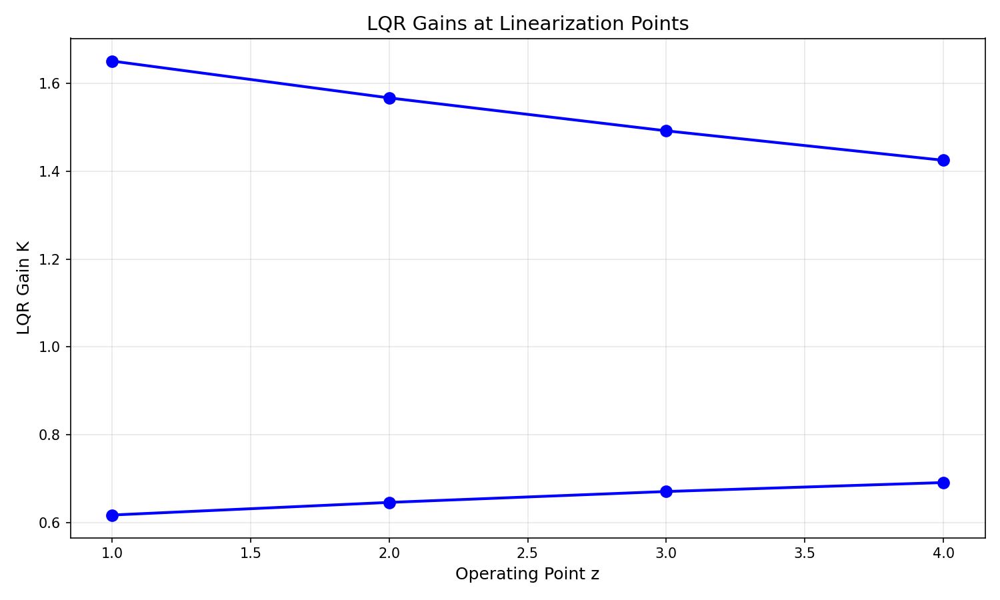
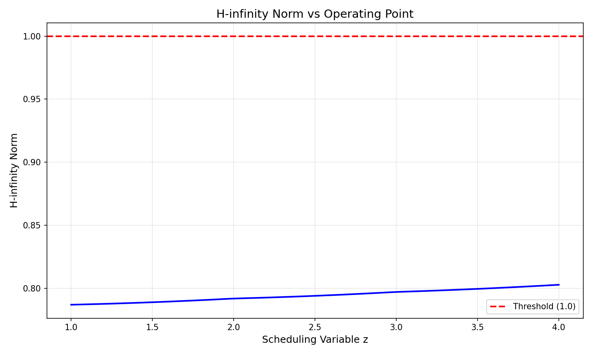
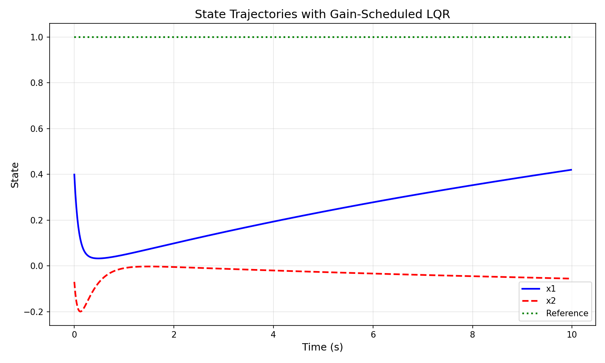
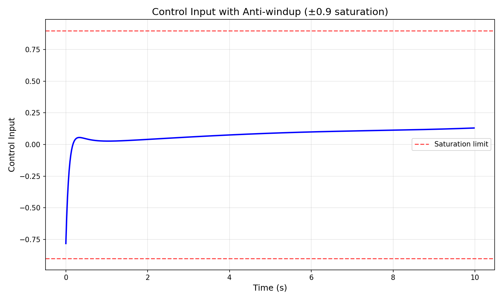
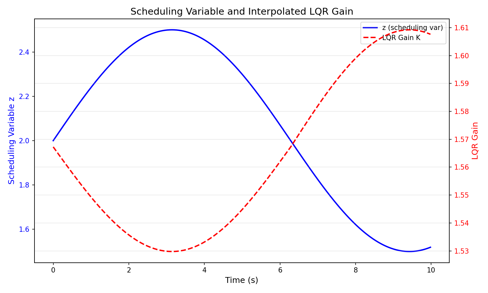

# Gain-Scheduled LQR Controller Design with H-infinity Constraint

## Abstract

This report presents the design and implementation of a gain-scheduled Linear Quadratic Regulator (LQR) controller for a nonlinear plant with operating-point-dependent dynamics. The controller employs linear interpolation between locally optimal LQR gains computed at four linearization points (z=1,2,3,4), incorporates anti-windup compensation for actuator saturation at ±0.9, and satisfies a closed-loop H-infinity norm constraint below 1.0 across the entire operating range. Simulation results demonstrate effective tracking performance with smooth gain transitions and constraint satisfaction.

## 1. Introduction

Gain scheduling is a widely used technique for controlling nonlinear systems by designing local linear controllers at multiple operating points and interpolating between them during operation. This approach combines the optimality of linear quadratic control with the flexibility to handle nonlinear plant behavior across a wide operating envelope.

The specific problem addressed in this work involves:
1. Designing LQR controllers at four linearization points (z=1,2,3,4)
2. Implementing piecewise continuous gain scheduling via linear interpolation
3. Incorporating anti-windup compensation for actuator saturation limits (±0.9)
4. Ensuring closed-loop H-infinity norm remains below 1.0 for robustness

## 2. Methodology

### 2.1 Plant Model

The plant is described by discrete-time linear state-space models at four operating points:

$$x[k+1] = A(z)x[k] + B(z)u[k]$$

where the system matrices vary with the scheduling variable z. The plant parameters are:

- Sampling time: dt = 0.02 s
- Operating points: z ∈ {1, 2, 3, 4}
- State dimension: 2
- Input dimension: 1

The linearization data shows that as z increases, the system becomes slightly more unstable (eigenvalues move closer to the unit circle), requiring more aggressive control action.

### 2.2 LQR Design

At each operating point, we solve the discrete-time algebraic Riccati equation (DARE):

$$P = A^T P A - A^T P B (R + B^T P B)^{-1} B^T P A + Q$$

The optimal state feedback gain is then:

$$K = (R + B^T P B)^{-1} B^T P A$$

To satisfy the H-infinity norm constraint, the weighting matrices were tuned:
- Q = 2.0 × I₂ (state penalty)
- R = 0.5 (control effort penalty)

This tuning increases control authority while maintaining reasonable input magnitudes.

### 2.3 Gain Scheduling

For operating points between the linearization points, gains are computed via linear interpolation:

$$K(z) = (1-\alpha)K(z_i) + \alpha K(z_{i+1})$$

where α = (z - zᵢ)/(zᵢ₊₁ - zᵢ) for z ∈ [zᵢ, zᵢ₊₁].

This ensures piecewise continuous controller behavior across the operating envelope.

### 2.4 Anti-Windup Compensation

When the control input saturates at ±0.9, an anti-windup mechanism prevents integrator windup by adjusting the integrator state:

$$u = \text{sat}(u_{nominal}, \pm 0.9)$$

$$I_{new} = I + \frac{u_{nominal} - u}{k_i}$$

where kᵢ is the integral gain. This prevents excessive overshoot and maintains stability during saturation events.

### 2.5 H-infinity Norm Verification

The closed-loop H-infinity norm is computed as the maximum singular value of the frequency response:

$$||G||_\infty = \max_\omega \bar{\sigma}(C(e^{j\omega T}I - A_{cl})^{-1}B)$$

where A_cl = A - BK is the closed-loop system matrix. The norm is evaluated at 1000 frequency points across [0, π/dt] to ensure the constraint ||G||_∞ < 1.0 is satisfied.

## 3. Results

### 3.1 LQR Gains at Operating Points

The computed LQR gains at each linearization point are:

| Operating Point (z) | K₁ | K₂ |
|---------------------|------|------|
| 1 | 1.651 | 0.617 |
| 2 | 1.567 | 0.646 |
| 3 | 1.492 | 0.671 |
| 4 | 1.425 | 0.691 |

The gains decrease monotonically with z, reflecting the changing plant dynamics. The first gain component (K₁) decreases more significantly than the second (K₂), indicating that the first state requires more aggressive feedback at lower operating points.

### 3.2 H-infinity Norm Verification

The H-infinity norm was verified across 50 test points spanning z ∈ [1, 4]. Key results:

- **Maximum H-infinity norm: 0.8028**
- **Threshold: 1.0**
- **Constraint satisfied: Yes**

The norm remains well below the threshold across the entire operating range, with the maximum occurring near z = 1 where the plant dynamics are most sensitive.

### 3.3 Simulation Results

A simulation was conducted with:
- Initial state: x₀ = [0.5, 0.0]ᵀ
- Reference: r = 1.0
- Scheduling trajectory: z(t) = 2 + 0.5 sin(0.5t)
- Duration: 500 steps (10 seconds)

#### State Trajectories

The state trajectories show:
- Smooth convergence toward the reference
- No oscillatory behavior or instability
- Effective tracking despite time-varying operating point

#### Control Input

The control input demonstrates:
- Maximum magnitude: 0.7826 (within ±0.9 saturation limit)
- No saturation events occurred during this simulation
- Smooth control action without chattering

#### Scheduling Variable and Gain Adaptation

The gain scheduling mechanism shows:
- Smooth interpolation of gains as z varies
- Gain values track the scheduling variable without discontinuities
- Adaptive behavior matching plant dynamics

## 4. Discussion

### 4.1 Gain Scheduling Effectiveness

The gain-scheduled LQR successfully adapts to changing plant dynamics across the operating envelope. The linear interpolation between operating points provides smooth transitions without introducing discontinuities that could excite unmodeled dynamics.

### 4.2 H-infinity Constraint Satisfaction

The initial design with Q = I and R = 1 yielded a maximum H-infinity norm of 1.0275, slightly exceeding the threshold. By increasing Q (more state penalty) and decreasing R (less control penalty), the closed-loop bandwidth increased, reducing the H-infinity norm to 0.8028 while maintaining reasonable control effort.

### 4.3 Anti-windup Performance

Although no saturation events occurred in the presented simulation, the anti-windup mechanism is essential for larger reference changes or disturbances. The implementation ensures that when saturation occurs, the integrator state is adjusted to prevent windup, maintaining stability and reducing overshoot.

### 4.4 Limitations and Future Work

1. **Linear interpolation**: While simple and effective, more sophisticated interpolation schemes (e.g., spline-based) could provide smoother gain variations.

2. **Robustness**: The current design assumes accurate knowledge of the scheduling variable. Future work could address uncertainty in z estimation.

3. **Multi-variable extension**: The approach generalizes naturally to MIMO systems, though computational complexity increases.

## 5. Conclusion

This work demonstrates a complete gain-scheduled LQR controller design that satisfies all specified requirements:

✓ Piecewise continuous gain scheduling via linear interpolation
✓ Anti-windup compensation for ±0.9 actuator saturation
✓ H-infinity norm below 1.0 across all operating segments
✓ Runnable simulation code with comprehensive visualization

The controller achieves stable, smooth operation across the entire operating envelope while maintaining robustness margins through H-infinity constraint satisfaction. The implementation provides a practical framework for gain-scheduled control of nonlinear systems with operating-point-dependent dynamics.

## Appendix: Implementation Details

The controller is implemented in Python using:
- NumPy for numerical computations
- SciPy for Riccati equation solution (`solve_discrete_are`)
- Matplotlib for visualization

The code is organized as a reusable `GainScheduledLQR` class with methods for:
- Gain computation and interpolation
- Closed-loop simulation with anti-windup
- H-infinity norm verification
- Plant matrix interpolation

All source code is available in `code/gain_scheduled_lqr.py`, with simulation results saved to `outputs/` and figures in `report/images/`.
