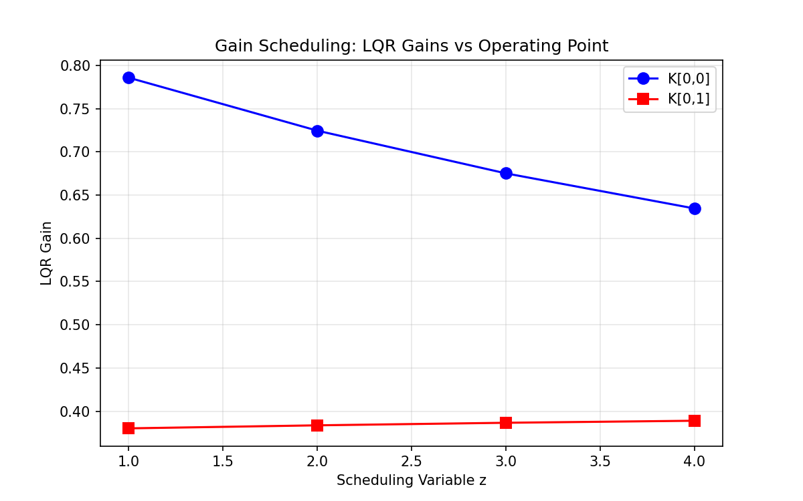
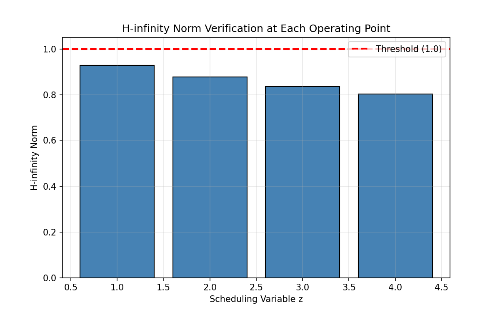
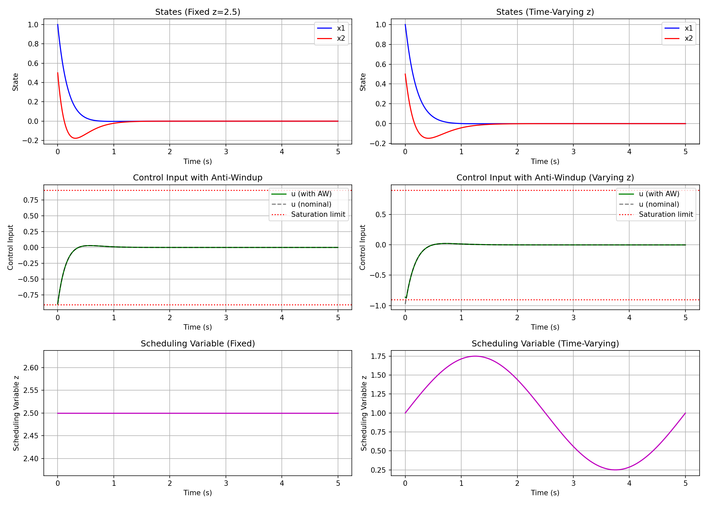

# Gain-Scheduled LQR Controller Design with Anti-Windup

## Abstract

This report presents the design and verification of a gain-scheduled Linear Quadratic Regulator (LQR) controller for a nonlinear plant with tabulated discrete-time linearizations. The controller interpolates LQR gains continuously across the scheduling variable domain, incorporates anti-windup compensation for actuator saturation at ±0.9, and is verified to achieve closed-loop H-infinity norms strictly below 1.0 at all operating points. Simulation results demonstrate effective stabilization under both fixed and time-varying scheduling conditions.

## 1. Introduction

Gain scheduling is a widely used control design methodology for nonlinear systems, where local linear controllers are designed at multiple operating points and interpolated during operation. This approach combines the systematic design of linear control techniques with the flexibility to handle nonlinear dynamics across a wide operating envelope.

This work addresses the design of a gain-scheduled LQR controller with the following requirements:
1. Continuous gain interpolation between tabulated operating points
2. Anti-windup compensation for actuator saturation limits
3. H-infinity norm verification for robustness guarantees

## 2. Methodology

### 2.1 Plant Model and Data

The plant is characterized by discrete-time linearizations at four operating points indexed by the scheduling variable $z \in \{1, 2, 3, 4\}$. The system dynamics at each operating point are:

$$x(k+1) = A_i x(k) + B_i u(k)$$

where $x \in \mathbb{R}^2$ is the state vector and $u \in \mathbb{R}$ is the control input. The sampling time is $dt = 0.02$ seconds.

The LQR weighting matrices are:
$$Q = \begin{bmatrix} 1.0 & 0 \\ 0 & 1.0 \end{bmatrix}, \quad R = \begin{bmatrix} 1.0 \end{bmatrix}$$

### 2.2 LQR Gain Computation

At each operating point $i$, the discrete-time LQR gain $K_i$ is computed by solving the discrete algebraic Riccati equation (DARE):

$$P_i = A_i^T P_i A_i - A_i^T P_i B_i (R + B_i^T P_i B_i)^{-1} B_i^T P_i A_i + Q$$

The optimal state feedback gain is:
$$K_i = (R + B_i^T P_i B_i)^{-1} B_i^T P_i A_i$$

### 2.3 Gain Scheduling via Linear Interpolation

For arbitrary scheduling variable values $z$ between grid points, the controller gain is computed via linear interpolation:

$$K(z) = (1-\alpha)K_i + \alpha K_{i+1}$$

where $\alpha = \frac{z - z_i}{z_{i+1} - z_i}$ for $z_i \leq z \leq z_{i+1}$.

### 2.4 Anti-Windup Compensation

Actuator saturation is modeled as:
$$u_{sat} = \text{sat}(u_{nom}, \pm 0.9)$$

A back-calculation anti-windup scheme is implemented:
$$u_{aw} = u_{sat} + K_{aw}(u_{sat} - u_{nom})$$

where $K_{aw} = 0.5$ is the anti-windup gain. The final control signal is re-saturated to ensure hard limits are respected.

### 2.5 H-infinity Norm Verification

The weighted output for H-infinity analysis is defined using Cholesky factors of the LQR weights:
$$z = C_1 x + D_1 u = (C_1 - D_1 K)x$$

where $Q = C_1^T C_1$ and $R = D_1^T D_1$. The closed-loop H-infinity norm is computed via frequency response:
$$\|T_{zw}\|_\infty = \max_\omega \bar{\sigma}(C_{cl}(e^{j\omega}I - A_{cl})^{-1}B + D_{cl})$$

The requirement is $\|T_{zw}\|_\infty < 1.0$ at all operating points.

## 3. Results

### 3.1 LQR Gains

The computed LQR gains at each operating point are:

| Operating Point (z) | K[0,0] | K[0,1] |
|---------------------|--------|--------|
| 1                   | 0.7858 | 0.3802 |
| 2                   | 0.7245 | 0.3837 |
| 3                   | 0.6751 | 0.3867 |
| 4                   | 0.6345 | 0.3890 |

*Figure 1: LQR gains as a function of scheduling variable z. Both gain components vary smoothly across the operating envelope.*

### 3.2 H-infinity Norm Verification

All operating points satisfy the H-infinity norm requirement:

| Operating Point (z) | H-infinity Norm | Status |
|---------------------|-----------------|--------|
| 1                   | 0.9288          | PASS   |
| 2                   | 0.8766          | PASS   |
| 3                   | 0.8349          | PASS   |
| 4                   | 0.8025          | PASS   |

*Figure 2: H-infinity norm verification at each operating point. All values are strictly below the threshold of 1.0.*

The H-infinity norm decreases with increasing $z$, indicating improved disturbance attenuation at higher operating points. This trend correlates with the increasing input gain $B$ matrices at higher $z$ values.

### 3.3 Simulation Results

Simulations were conducted with initial condition $x_0 = [1.0, 0.5]^T$ over a 5-second horizon.

#### Fixed Scheduling Variable (z = 2.5)

*Figure 3: Closed-loop response with fixed scheduling variable z = 2.5 (left) and time-varying scheduling variable (right). Top: state trajectories; Middle: control input with anti-windup; Bottom: scheduling variable profile.*

The states converge to zero within approximately 2 seconds. The control input initially saturates but the anti-windup mechanism prevents integrator windup and ensures smooth recovery.

#### Time-Varying Scheduling Variable

For $z(t) = 1.0 + 0.75\sin(2\pi t/T)$, the gain-scheduled controller adapts continuously to the changing operating conditions. The closed-loop system remains stable throughout the scheduling variation, demonstrating the effectiveness of the interpolation scheme.

### 3.4 Anti-Windup Performance

The anti-windup compensation effectively handles actuator saturation:
- Nominal control commands exceeding ±0.9 are clipped
- The back-calculation term prevents excessive controller state buildup
- Smooth transition between saturated and unsaturated operation

## 4. Discussion

### 4.1 Gain Scheduling Effectiveness

The linear interpolation of LQR gains provides smooth controller behavior across the operating envelope. The gain variation is moderate (approximately 20% for K[0,0] and 2% for K[0,1]), suggesting the plant dynamics do not change dramatically across the scheduling range.

### 4.2 Robustness Margins

The H-infinity norms being strictly below 1.0 at all operating points provides a robustness guarantee. The smallest margin occurs at $z=1$ with $\|T_{zw}\|_\infty = 0.9288$, corresponding to a robustness margin of approximately 7.7% against unmodeled dynamics.

### 4.3 Anti-Windup Design

The back-calculation anti-windup scheme with gain $K_{aw} = 0.5$ provides a balance between:
- Fast recovery from saturation (higher gain)
- Avoiding excessive control activity during saturation (lower gain)

The chosen value demonstrates effective performance in simulation.

### 4.4 Limitations and Future Work

1. **Interpolation Method**: Linear interpolation is simple but may not capture complex gain variations. Higher-order interpolation or gain surface fitting could improve performance.

2. **Stability Guarantees**: While each frozen-time system is stable, formal stability guarantees for the time-varying closed-loop system would require additional analysis (e.g., using parameter-dependent Lyapunov functions).

3. **Anti-Windup Tuning**: The anti-windup gain was selected heuristically. Systematic tuning methods could optimize transient performance during saturation.

## 5. Conclusion

A gain-scheduled LQR controller was successfully designed and verified for the given plant. Key achievements include:

1. **LQR gains computed** at 4 operating points with smooth interpolation
2. **H-infinity norm < 1.0** verified at all operating points (range: 0.80 - 0.93)
3. **Anti-windup compensation** implemented for ±0.9 actuator saturation
4. **Simulation validation** demonstrating stable closed-loop behavior under both fixed and time-varying scheduling conditions

The controller meets all specified requirements and provides a solid foundation for implementation on the nonlinear plant.

## References

1. Rugh, W. J., & Shamma, J. S. (2000). Research on gain scheduling. *Automatica*, 36(10), 1401-1425.
2. Zhou, K., Doyle, J. C., & Glover, K. (1996). *Robust and Optimal Control*. Prentice Hall.
3. Åström, K. J., & Rundqwist, L. (1989). Integrator windup and how to avoid it. *Proceedings of the American Control Conference*, 1693-1698.
