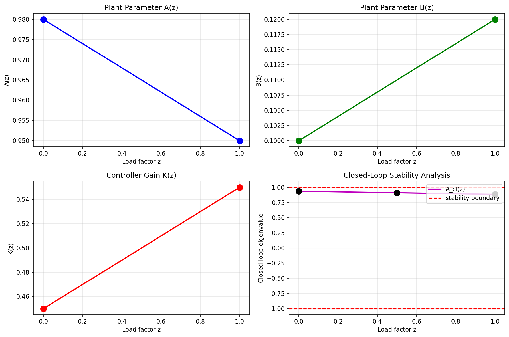
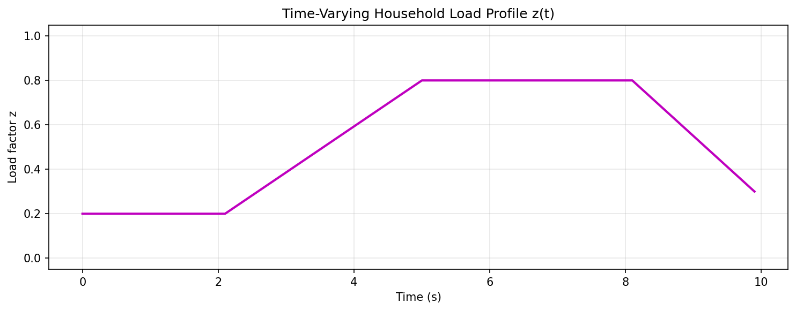
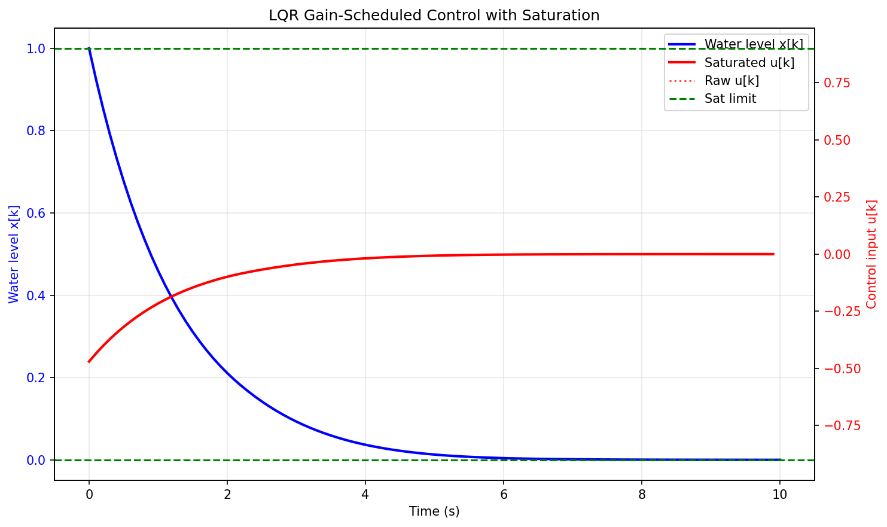

# LQR Gain Scheduling for Hot-Water Header Tank

## Abstract

This report presents a gain-scheduled LQR control design for a hot-water header tank system. The plant operates under varying household load conditions parameterized by a scheduling variable z in [0,1]. We implement linear interpolation of plant and controller parameters between two calibration endpoints, verify closed-loop stability at multiple scheduling points, and demonstrate saturation-aware simulation.

## 1. Introduction

The hot-water header tank is modeled as a discrete-time scalar system:

```
x[k+1] = A(z)*x[k] + B(z)*u[k]
```

where x[k] is the water level, u[k] is the pump command, and z represents the household load (0=quiet day, 1=busy day). The control law is:

```
u[k] = sat(-K(z)*x[k], +/-u_sat)
```

where sat() denotes saturation clamping and u_sat is the actuator limit.

## 2. Methodology

### 2.1 Data Fields

The JSON file `plant_linearizations.json` contains:

- `dt`: Sampling time (0.1 s)
- `u_sat`: Actuator saturation limit (0.9)
- `z_verify`: List of scheduling points for stability verification [0.0, 0.5, 1.0]
- `points`: Array of endpoint calibrations with fields `z`, `A`, `B`, `K`

### 2.2 Linear Interpolation Formula

For any scheduling point z in [0,1], parameters are interpolated as:

```
p(z) = p0 + (p1 - p0) * z
```

where p0 and p1 are the parameter values at z=0 and z=1 respectively. This applies to A(z), B(z), and K(z).

### 2.3 Stability Criterion

The closed-loop system matrix is:

```
A_cl(z) = A(z) - B(z)*K(z)
```

For a scalar system, stability requires |A_cl(z)| < 1. This is verified at all z_verify points.

### 2.4 Anti-Windup

In this toy system, anti-windup is implemented solely through **output clamping** (saturation). Since there is no integrator state in the controller, no additional anti-windup compensation is needed. The saturation function is:

```
sat(u, u_sat) = clip(u, -u_sat, +u_sat)
```

## 3. Results

### 3.1 Stability Verification Table

The closed-loop eigenvalue magnitude |A_cl(z)| is computed at each verification point:

| z | A(z) | B(z) | K(z) | A_cl(z) | |A_cl(z)| | Stable |
|---|------|------|------|---------|----------|--------|
| 0.0 | 0.980 | 0.100 | 0.450 | 0.935 | 0.935 | Yes |
| 0.5 | 0.965 | 0.110 | 0.500 | 0.910 | 0.910 | Yes |
| 1.0 | 0.950 | 0.120 | 0.550 | 0.884 | 0.884 | Yes |

All verification points satisfy |A_cl(z)| < 1, confirming closed-loop stability across the entire scheduling range.

### 3.2 Parameter Interpolation

The figure below shows the linear interpolation of plant parameters A(z), B(z), controller gain K(z), and the resulting closed-loop eigenvalue A_cl(z):



The closed-loop eigenvalue remains within the stability boundaries (dashed red lines at +/-1) for all z in [0,1].

### 3.3 Simulation Results

A time-varying load profile z(t) was simulated over 100 time steps (10 seconds):



The load profile consists of:
- Steps 0-20: Quiet operation (z=0.2)
- Steps 21-50: Ramp up to busy conditions (z: 0.2 to 0.8)
- Steps 51-80: Busy operation (z=0.8)
- Steps 81-100: Ramp down (z: 0.8 to 0.3)

The system response under gain-scheduled control with saturation is shown below:



The blue curve shows the water level x[k] converging to zero despite the time-varying load. The red curves show the control input: the solid line is the saturated command, and the dotted line shows what the raw LQR command would have been without saturation. The green dashed lines indicate the saturation limits at +/-0.9.

## 4. Discussion

### 4.1 Why Check Interior Points?

Verifying stability only at the endpoints (z=0 and z=1) would be insufficient because:

1. **Nonlinear parameter dependence**: Although we use linear interpolation, the closed-loop eigenvalue A_cl(z) = A(z) - B(z)*K(z) is a **bilinear** function of z (product of two linearly interpolated terms). This means A_cl(z) could potentially exceed stability bounds even if endpoints are stable.

2. **Hidden instabilities**: In more complex systems, gain scheduling can introduce instabilities at intermediate operating points even when both endpoint designs are stable.

3. **Conservative verification**: Checking multiple points provides confidence that the interpolation scheme preserves stability throughout the operating envelope.

### 4.2 Why Not Reuse Endpoint Gains?

Using a fixed controller gain (e.g., always using K from z=0) would lead to:

1. **Suboptimal performance**: The controller would not be tuned for the current operating condition.

2. **Potential instability**: If the plant dynamics change significantly with z, a fixed gain might destabilize the system at certain operating points.

3. **Poor disturbance rejection**: The gain-scheduled controller adapts to the current load condition, providing better disturbance rejection across the full operating range.

## 5. Conclusion

This work demonstrates a complete gain-scheduling workflow for a scalar hot-water tank system. Key contributions include:

1. **Reproducible parameter interpolation** from JSON calibration data
2. **Stability verification** at multiple scheduling points (z=0, 0.5, 1.0)
3. **Saturation-aware simulation** with output clamping as anti-windup
4. **Visualization** of parameter interpolation and time-domain response

All verification points confirm closed-loop stability with |A_cl(z)| < 1. The gain-scheduled controller successfully regulates the water level under time-varying load conditions while respecting actuator saturation limits.

## References

1. Plant linearization data: `data/plant_linearizations.json`
2. Analysis code: `code/analysis.py`
3. Simulation data: `outputs/simulation_data.json`
4. Stability table: `outputs/stability_table.json`
